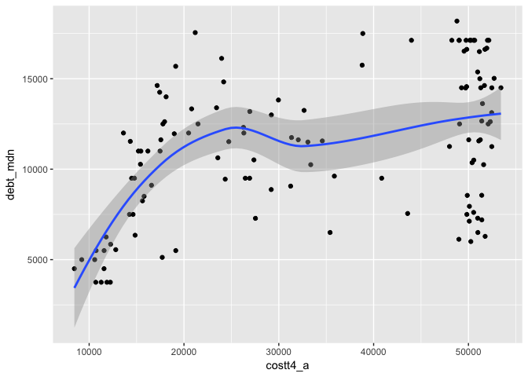
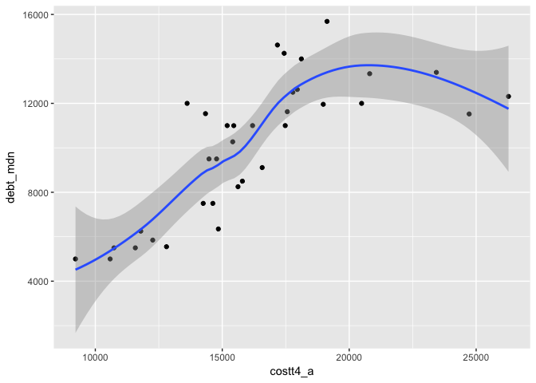

Assignment 1 Key
================
Will Doyle
September 4, 2017

*1. A sentence that says "Hello, World"*

Hello, world!

*2. R output that summarizes one of the variables in the `colllege.Rdata` dataset*

``` r
library(tidyverse)
```

    ## Loading tidyverse: ggplot2
    ## Loading tidyverse: tibble
    ## Loading tidyverse: tidyr
    ## Loading tidyverse: readr
    ## Loading tidyverse: purrr
    ## Loading tidyverse: dplyr

    ## Conflicts with tidy packages ----------------------------------------------

    ## filter(): dplyr, stats
    ## lag():    dplyr, stats

``` r
# I left the college.Rdata in the lessons folder, so I will find it there
load("../lessons/college.Rdata")

sc%>%summarize(mean_cost=mean(costt4_a,na.rm=TRUE))
```

    ## # A tibble: 1 × 1
    ##   mean_cost
    ##       <dbl>
    ## 1  33890.31

*3. R output that shows a scatterplot for two of the variables in the `college.Rdata` dataset.*

``` r
gg<-ggplot(data=sc,aes(x=costt4_a,y=debt_mdn))
gg<-gg+geom_point()
gg<-gg+geom_smooth()
gg
```

    ## `geom_smooth()` using method = 'loess'

    ## Warning: Removed 1 rows containing non-finite values (stat_smooth).

    ## Warning: Removed 1 rows containing missing values (geom_point).



Submit it under assignment 1, using the format `01-assignment_<lastname>.Rmd`. All assignments should be turned in using this format. Since my last name is Doyle, I would use `01-assignment_doyle.Rmd` as my file name. Unless your name is also Doyle, you should use a different name.

Stretch items
-------------

*1. Calculate the average earnings for individuals at the most selective colleges, then compare that with individuals at the least selective colleges in the dataset. *

``` r
sc%>%filter(adm_rate<.1)%>%summarize(mean_earnings=mean(md_earn_wne_p6,na.rm=TRUE))
```

    ## # A tibble: 1 × 1
    ##   mean_earnings
    ##           <dbl>
    ## 1         53500

``` r
sc%>%filter(adm_rate>.3)%>%summarize(mean_earnings=mean(md_earn_wne_p6,na.rm=TRUE))
```

    ## # A tibble: 1 × 1
    ##   mean_earnings
    ##           <dbl>
    ## 1      34747.14

*2. Find a way to determine whether colleges with very high SAT scores tend to be larger or smaller than colleges with low SAT scores. *

``` r
sc%>%filter(sat_avg>1400)%>%summarize(mean_enroll=mean(ugds, na.rm=TRUE))
```

    ## # A tibble: 1 × 1
    ##   mean_enroll
    ##         <dbl>
    ## 1      5860.2

``` r
sc%>%filter(sat_avg<1000)%>%summarize(mean_enroll=mean(ugds, na.rm=TRUE))
```

    ## # A tibble: 1 × 1
    ##   mean_enroll
    ##         <dbl>
    ## 1    3185.952

*3. Plot the relationship between cost and debt. What do you see? Does this surprise you?*

``` r
gg<-ggplot(data=sc,aes(x=costt4_a,y=debt_mdn))
gg<-gg+geom_point()
gg<-gg+geom_smooth()
gg
```

    ## `geom_smooth()` using method = 'loess'

    ## Warning: Removed 1 rows containing non-finite values (stat_smooth).

    ## Warning: Removed 1 rows containing missing values (geom_point).

 *4. Now, provide separate plots for cost and debt by control of the institution. *

``` r
gg<-ggplot(data=(sc%>%filter(control==1)),aes(x=costt4_a,y=debt_mdn))
gg<-gg+geom_point()
gg<-gg+geom_smooth()
gg
```

    ## `geom_smooth()` using method = 'loess'



``` r
gg<-ggplot(data=(sc%>%filter(control==2)),aes(x=costt4_a,y=debt_mdn))
gg<-gg+geom_point()
gg<-gg+geom_smooth()
gg
```

    ## `geom_smooth()` using method = 'loess'

    ## Warning: Removed 1 rows containing non-finite values (stat_smooth).

    ## Warning: Removed 1 rows containing missing values (geom_point).


