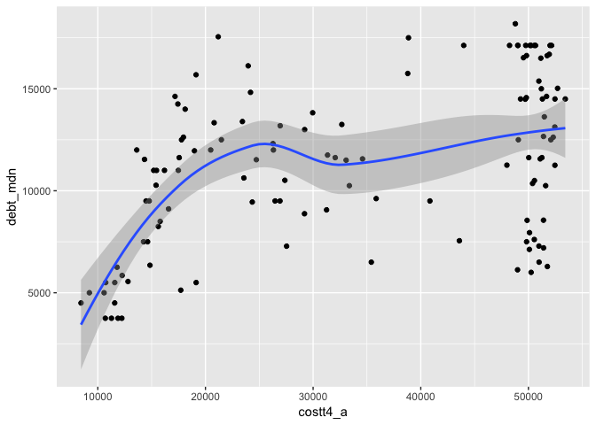
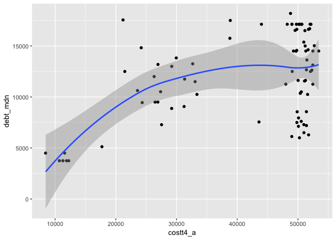

Assignment 1 Key
================
Will Doyle
September 3, 2019

*1. A sentence that says “Hello, World”*

Hello, world\!

<OR>

``` r
print("Hello, World!")
```

    ## [1] "Hello, World!"

*2. R output that summarizes one of the variables in the
`colllege.Rdata` dataset*

``` r
library(tidyverse)
```

    ## Registered S3 methods overwritten by 'ggplot2':
    ##   method         from 
    ##   [.quosures     rlang
    ##   c.quosures     rlang
    ##   print.quosures rlang

    ## ── Attaching packages ───────────── tidyverse 1.2.1 ──

    ## ✔ ggplot2 3.1.1     ✔ purrr   0.3.2
    ## ✔ tibble  2.1.3     ✔ dplyr   0.8.3
    ## ✔ tidyr   0.8.3     ✔ stringr 1.4.0
    ## ✔ readr   1.3.1     ✔ forcats 0.4.0

    ## ── Conflicts ──────────────── tidyverse_conflicts() ──
    ## ✖ dplyr::filter() masks stats::filter()
    ## ✖ dplyr::lag()    masks stats::lag()

``` r
# I left the college.Rdata in the lessons folder, so I will find it there
load("../lessons/college.Rdata")

sc%>%summarize(mean_cost=mean(costt4_a,na.rm=TRUE))
```

    ## # A tibble: 1 x 1
    ##   mean_cost
    ##       <dbl>
    ## 1    33890.

*3. R output that shows a scatterplot for two of the variables in the
`college.Rdata` dataset.*

``` r
gg<-ggplot(data=sc,aes(x=costt4_a,y=debt_mdn))
gg<-gg+geom_point()
gg<-gg+geom_smooth()
gg
```

    ## `geom_smooth()` using method = 'loess' and formula 'y ~ x'

    ## Warning: Removed 1 rows containing non-finite values (stat_smooth).

    ## Warning: Removed 1 rows containing missing values (geom_point).

<!-- -->

## Stretch items

*1. Calculate the average earnings for individuals at the most selective
colleges, then compare that with individuals at the least selective
colleges in the dataset.
*

``` r
sc%>%filter(adm_rate<.1)%>%summarize(mean_earnings=mean(md_earn_wne_p6,na.rm=TRUE))
```

    ## # A tibble: 1 x 1
    ##   mean_earnings
    ##           <dbl>
    ## 1         53500

``` r
sc%>%filter(adm_rate>.3)%>%summarize(mean_earnings=mean(md_earn_wne_p6,na.rm=TRUE))
```

    ## # A tibble: 1 x 1
    ##   mean_earnings
    ##           <dbl>
    ## 1        34747.

*2. Find a way to determine whether colleges with very high SAT scores
tend to be larger or smaller than colleges with low SAT scores.
*

``` r
sc%>%filter(sat_avg>1400)%>%summarize(mean_enroll=mean(ugds, na.rm=TRUE))
```

    ## # A tibble: 1 x 1
    ##   mean_enroll
    ##         <dbl>
    ## 1       5860.

``` r
sc%>%filter(sat_avg<1000)%>%summarize(mean_enroll=mean(ugds, na.rm=TRUE))
```

    ## # A tibble: 1 x 1
    ##   mean_enroll
    ##         <dbl>
    ## 1       3186.

*3. Plot the relationship between cost and debt. What do you see? Does
this surprise you?*

``` r
gg<-ggplot(data=sc,aes(x=costt4_a,y=debt_mdn))
gg<-gg+geom_point()
gg<-gg+geom_smooth()
gg
```

    ## `geom_smooth()` using method = 'loess' and formula 'y ~ x'

    ## Warning: Removed 1 rows containing non-finite values (stat_smooth).

    ## Warning: Removed 1 rows containing missing values (geom_point).

<!-- -->
*4. Now, provide separate plots for cost and debt by control of the
institution. *

``` r
gg<-ggplot(data=(sc%>%filter(control==1)),aes(x=costt4_a,y=debt_mdn))
gg<-gg+geom_point()
gg<-gg+geom_smooth()
gg
```

    ## `geom_smooth()` using method = 'loess' and formula 'y ~ x'

<!-- -->

``` r
gg<-ggplot(data=(sc%>%filter(control==2)),aes(x=costt4_a,y=debt_mdn))
gg<-gg+geom_point()
gg<-gg+geom_smooth()
gg
```

    ## `geom_smooth()` using method = 'loess' and formula 'y ~ x'

    ## Warning: Removed 1 rows containing non-finite values (stat_smooth).

    ## Warning: Removed 1 rows containing missing values (geom_point).

<!-- -->
