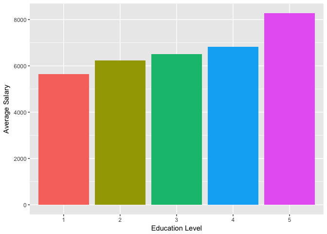
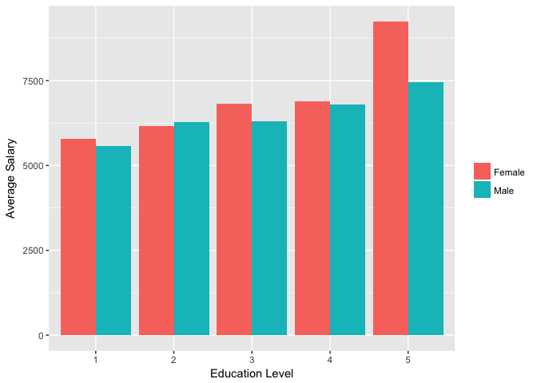
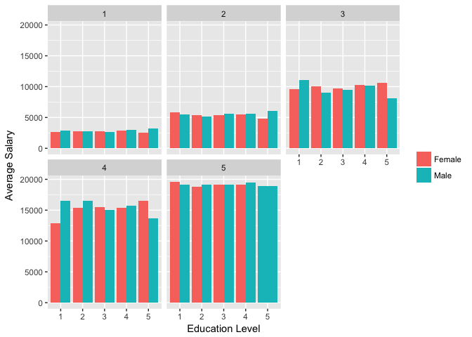
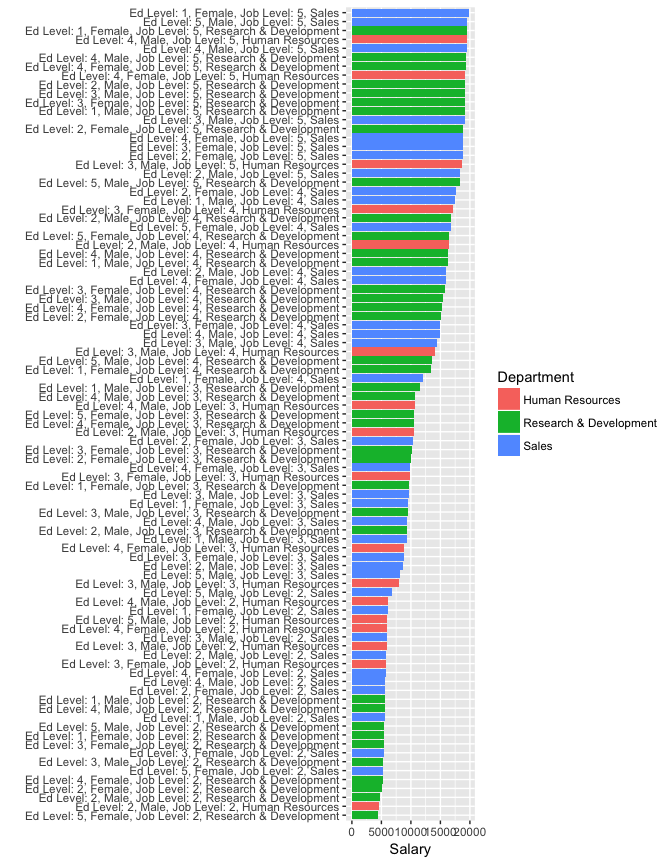
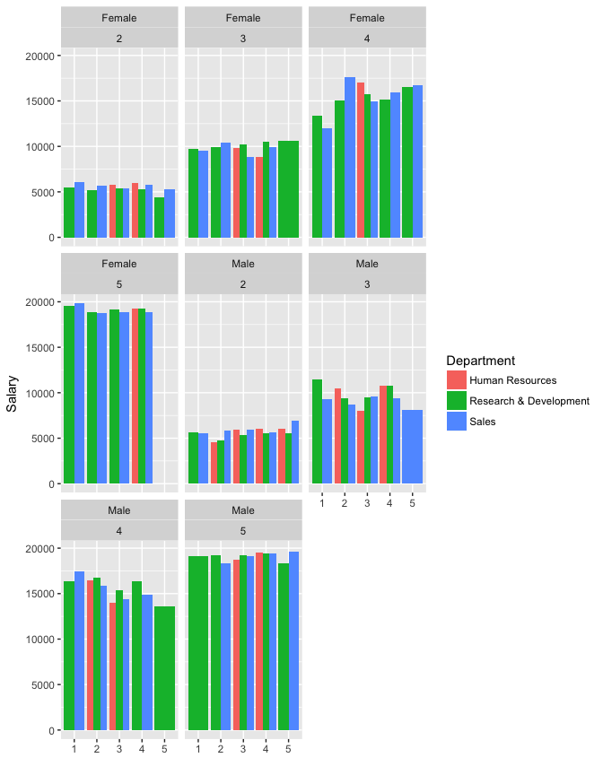

Assignment 3
================

Use the attrition dataset to answer the following questions. As always, your assignment must be turned in as a .Rmd file.

``` r
knitr::opts_chunk$set(echo = FALSE)
library(tidyverse)
```

    ## Loading tidyverse: ggplot2
    ## Loading tidyverse: tibble
    ## Loading tidyverse: tidyr
    ## Loading tidyverse: readr
    ## Loading tidyverse: purrr
    ## Loading tidyverse: dplyr

    ## Conflicts with tidy packages ----------------------------------------------

    ## filter(): dplyr, stats
    ## lag():    dplyr, stats

``` r
library(forcats)
library(RColorBrewer)

load("../lessons/at.Rdata")
```

1.  Create a graph that shows the distribution of monthly income. 

2.  Create a graph that shows the average level of monthly income by field of education.

 3. Create another graph that shows average level of monthly income by field of education and gender.



1.  Create a graph that shows average levels of monthly income by field of education, gender and job level (scale of 1-5, highest ranked employees are 5)



1.  Create a graph that shows average levels of monthly income by field of education, gender, job level and department.

<!-- -->

    ## # A tibble: 119 × 5
    ##    Education Gender JobLevel             Department salary_avg
    ##        <int>  <chr>    <int>                  <chr>      <dbl>
    ## 1          3   Male        1                  Sales   2265.000
    ## 2          1   Male        1                  Sales   2338.538
    ## 3          4 Female        1                  Sales   2351.000
    ## 4          1   Male        1        Human Resources   2351.667
    ## 5          3 Female        1                  Sales   2497.588
    ## 6          5 Female        1 Research & Development   2546.000
    ## 7          2 Female        1        Human Resources   2560.000
    ## 8          1 Female        1                  Sales   2574.000
    ## 9          3 Female        1        Human Resources   2606.250
    ## 10         3   Male        1        Human Resources   2622.667
    ## # ... with 109 more rows

    ## # A tibble: 91 × 2
    ##                                                     grouping salary_avg
    ##                                                       <fctr>      <dbl>
    ## 1  Ed Level: 5, Female, Job Level: 2, Research & Development   4412.400
    ## 2           Ed Level: 2, Male, Job Level: 2, Human Resources   4546.000
    ## 3    Ed Level: 2, Male, Job Level: 2, Research & Development   4800.105
    ## 4  Ed Level: 2, Female, Job Level: 2, Research & Development   5163.667
    ## 5  Ed Level: 4, Female, Job Level: 2, Research & Development   5260.514
    ## 6                   Ed Level: 5, Female, Job Level: 2, Sales   5261.200
    ## 7    Ed Level: 3, Male, Job Level: 2, Research & Development   5321.157
    ## 8                   Ed Level: 3, Female, Job Level: 2, Sales   5372.000
    ## 9  Ed Level: 3, Female, Job Level: 2, Research & Development   5392.432
    ## 10 Ed Level: 1, Female, Job Level: 2, Research & Development   5434.286
    ## # ... with 81 more rows


