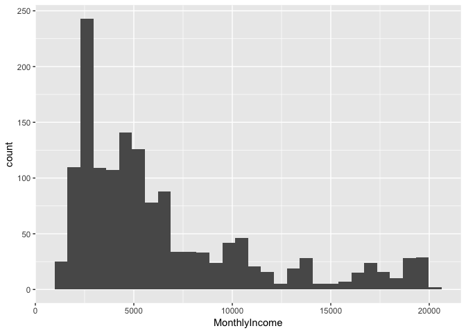
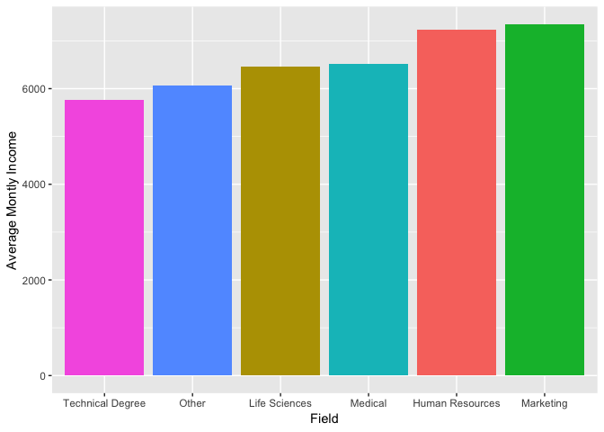
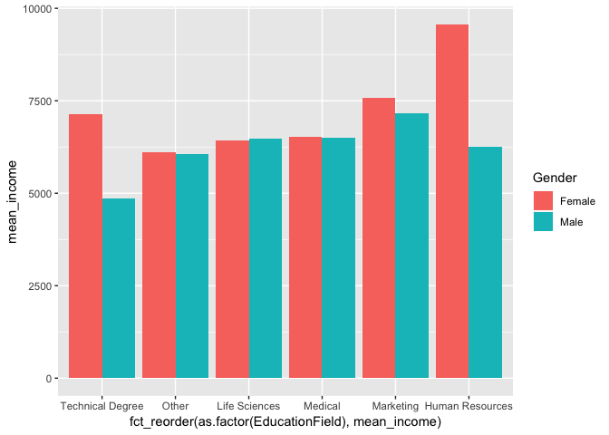
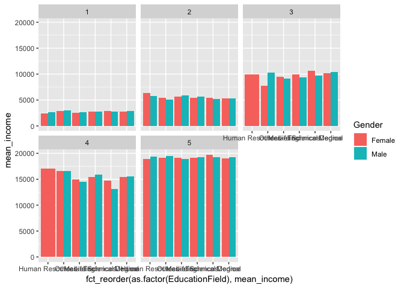
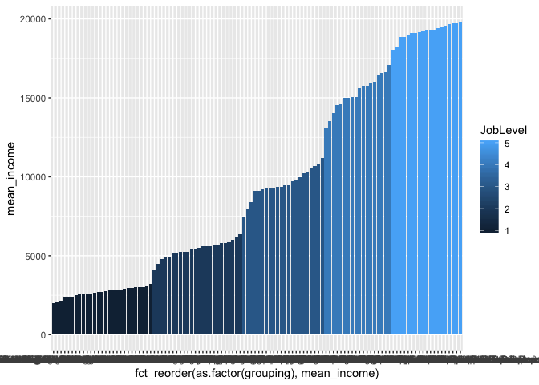
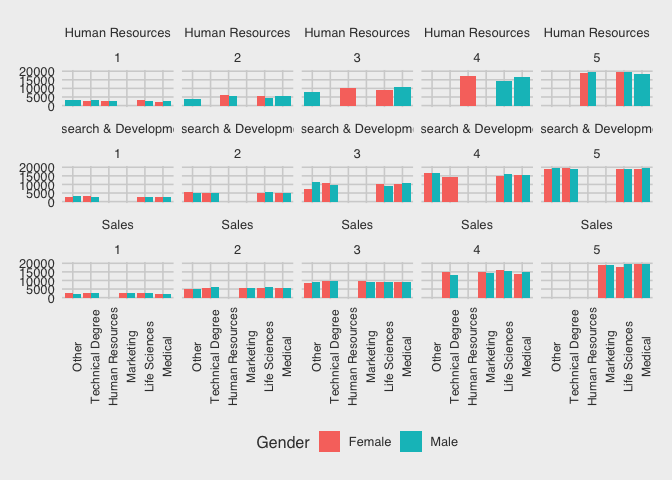

Assignment 3
================

Use the attrition dataset to answer the following questions. As always,
your assignment must be turned in as a .Rmd file.

``` r
library(tidyverse)
```

    ## Registered S3 methods overwritten by 'ggplot2':
    ##   method         from 
    ##   [.quosures     rlang
    ##   c.quosures     rlang
    ##   print.quosures rlang

    ## ── Attaching packages ───────────────────────────────────────── tidyverse 1.2.1 ──

    ## ✔ ggplot2 3.1.1     ✔ purrr   0.3.2
    ## ✔ tibble  2.1.3     ✔ dplyr   0.8.3
    ## ✔ tidyr   0.8.3     ✔ stringr 1.4.0
    ## ✔ readr   1.3.1     ✔ forcats 0.4.0

    ## ── Conflicts ──────────────────────────────────────────── tidyverse_conflicts() ──
    ## ✖ dplyr::filter() masks stats::filter()
    ## ✖ dplyr::lag()    masks stats::lag()

``` r
library(ggthemes)

load("../lessons/at.Rdata")
```

1.  Create a graph that shows the distribution of monthly income.

<!-- end list -->

``` r
gg<-ggplot(data=at, aes(x=MonthlyIncome))
gg<-gg+geom_histogram()
gg
```

    ## `stat_bin()` using `bins = 30`. Pick better value with `binwidth`.

<!-- -->

2.  Create a graph that shows the average level of monthly income by
    field of education.

<!-- end list -->

``` r
at_sum<-at%>%
  group_by(EducationField)%>%
  summarize(mean_income=mean(MonthlyIncome))

gg<-ggplot(data=at_sum,aes(x=fct_reorder(as.factor(EducationField),mean_income),
                                        y=mean_income,
                           fill=EducationField))
gg<-gg+geom_bar(stat="identity")
gg<-gg+xlab("Field")+ylab("Average Montly Income")+theme(legend.position = "none")
gg
```

<!-- -->

3.  Create another graph that shows average level of monthly income by
    field of education and gender.

<!-- end list -->

``` r
at_sum<-at%>%
  group_by(EducationField,Gender)%>%
  summarize(mean_income=mean(MonthlyIncome))

gg<-ggplot(data=at_sum,aes(x=fct_reorder(as.factor(EducationField),mean_income),
                                        y=mean_income,fill=Gender))
gg<-gg+geom_bar(stat="identity",position = "dodge")
gg
```

<!-- -->

4.  Create a graph that shows average levels of monthly income by field
    of education, gender and job level (scale of 1-5, highest ranked
    employees are 5)

<!-- end list -->

``` r
at_sum<-at%>%
  group_by(EducationField,Gender,JobLevel)%>%
  summarize(mean_income=mean(MonthlyIncome))


gg<-ggplot(data=at_sum,aes(x=fct_reorder(as.factor(EducationField),mean_income),
                                        y=mean_income,fill=Gender))
gg<-gg+geom_bar(stat="identity",position = "dodge")
gg<-gg+facet_wrap(~JobLevel)
gg
```

<!-- -->

5.  Create a graph that shows average levels of montly income by field
    of education, gender, job level and department.

<!-- end list -->

``` r
at_sum<-at%>%
  group_by(EducationField,Gender,JobLevel,Department)%>%
  summarize(mean_income=mean(MonthlyIncome))%>%
  ungroup()


at_sum<-at_sum%>%mutate(grouping=paste(EducationField,":",
                                        Gender,":",
                                        "Job level:", JobLevel,
                                        Department))

gg<-ggplot(data=at_sum,aes(x=fct_reorder(as.factor(grouping), mean_income),
                                        y=mean_income,fill=JobLevel))
gg<-gg+geom_bar(stat="identity")
gg
```

<!-- -->

``` r
gg<-ggplot(data=at_sum,aes(x=fct_reorder(as.factor(EducationField),mean_income),
                                        y=mean_income,fill=Gender))
gg<-gg+geom_bar(stat="identity",position = "dodge")
gg<-gg+facet_wrap(~Department+JobLevel,nrow=3)
gg<-gg+ylab("Average Montly Income")
gg<-gg+theme_fivethirtyeight()
gg<-gg+theme(axis.text.x = element_text(angle=90,size=9,))
gg
```

<!-- -->
