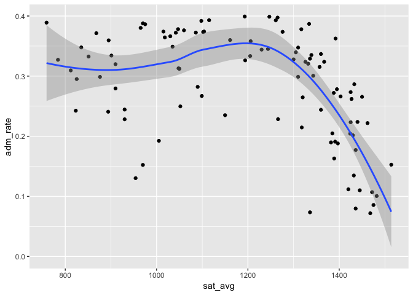

# Welcome to Data Science!

Today, we’ll be working on getting you set up with the tools you will
need for this class. Once you are set up, we’ll do what we’re here to
do: analyze data!

Here’s what we need to get done today:

1.  Introductions  
2.  Installing R
3.  Installing RStudio
4.  Installing git
5.  Getting set up on GitHub
6.  Initializing everyone’s GitHub repos
7.  Starting assignment 1, “hello, world!”

## Introductions

We need three basic sets of tools for this class. We will need `R` to
analyze data. We will need `RStudio` to help us interface with R and to
produce documentation of our results. Last, we will need `git` and
GitHub to communicate our results to the wider world.

## Installing R

R is going to be the only programming language we will use. R is an
extensible statistical programming environment that can handle all of
the main tasks that we’ll need to cover this semester: getting data,
analyzing data and communicating data analysis.

If you haven’t already, you need to download R here:
<https://cran.r-project.org/>.

## Installing RStudio

When we work with R, we communicate via the command line. To help
automate this process, we can write scripts, which contain all of the
commands to be executed. These scripts generate various kinds of output,
like numbers on the screen, graphics or reports in common formats (pdf,
word). Most programming languages have several **I** ntegrated **D**
evelopment **E** nvironments (IDEs) that encompass all of these elements
(scripts, command line interface, output). The primary IDE for R is
RStudio.

If you haven’t already, you need to download RStudio here:
<https://rstudio.com/products/rstudio/download/>. You need the free
RStudio desktop version.

## Installing git

`git` is a version control program. A standard problem in programming is
how to track the changes that have been made to a project. These
challenges are well-known to anyone who has had to work on a complex
document, particularly with collaborators. Because these problems are
particularly severe in programming, they developed a set of tools called
version control. These will keep track of every change you make to a
file, and record why you made the change. Download git here and accept
all of the defaults on installation: (<https://git-scm.com/downloads>)

## Getting set up on GitHub

GitHub is online hosting service that is widely used by programmers. It
allows you to easily share your work with the world. It is integrated
with git, so version control is easy to do. If you haven’t already, go
to (<https://GitHub.com>) and sign up for free to get a username. Share
the username with me as soon as you have one.

## Initializing repos

Everyone in the class will need a repository (repo from now on) on our
GitHub organization. All I need from you is your username on GitHub,
then I can add your repo to our organization.

## Installing GitHub Desktop

GitHub desktop is a **G** raphical **U** ser **I** nterface for git. We
won’t use it much, but you will need it to “clone” your git repository.

Download GitHub desktop (<https://desktop.GitHub.com/>). Choose the beta
version, which appears to be working nicely. Accept all of the defaults
on installation.

Unzip and open up the GitHub app. Then using the app, sign into GitHub
using your username and ID.

## Integrating RStudio with GitHub

To integrate RStudio with GitHub, you need to enable git as your version
control within RStudio. Go to Preferences–&gt;Git/SVN and make sure the
“enable version control” box is checked. Make sure that you can see a
path to git.

Further instructions (if needed) are
[here](https://support.rstudio.com/hc/en-us/articles/200532077-Version-Control-with-Git-and-SVN).

## Cloning down your repo

First in RStudio, you’ll need to generate an SSH key. This will let
GitHub know it’s safe to talk to your computer. In RStudio, go to
Preferences–&gt; Git/SVN, then click on “Create RSA Key”. Once that’s
done, you can click on the blue text that says “View public key.” Copy
all of the text in the public key.

Now go to [GitHub](https://github.com) and in the upper right hand
corner by your avatar, click on Settings. Go to SSH and GPG keys. Click
“New SSH Key” and paste in the text you copied from RStudio. Name the
key, and you should be all set.

Now, go to your repo for this class. Everyone’s repo is in the
`hoddatasci` organization, and uses the naming convention
`student_<yourlastname>`. Click the green button that says “clone or
download,” then copy the link provided by clicking on the clipboard next
to the link.

*N.B. in this class, and generally in programming, when you see*
`<text>` *that means that you need to substitute something in.*

Now go to GitHub desktop, and click the “clone a repository.” Paste in
the link you just copied, choose a location on your computer, and
proceed. Choose a good spot on your computer for the project files–
wherever you usually keep class directories. DO NOT PUT YOUR DIRECTORY
ON YOUR DESKTOP OR IN DOWNLOADS. This project will be the only place you
need to work for this class the entire semester.

## Linking GitHub and RStudio

From RStudio, you’ll need to click New Project–Existing Directory– then
choose the directory where you just downloaded the GitHub repository.

Name the project “central”.

Once you click “create project,” you should see a “git” tab in your
environment. Open up the file named `01-intro.Rmd` and take a look.

## Yes We Code! Running R Code

The following code chunks will be our first use of R in this class.
We’re going to grab some data that’s part of the [college
scorecard](https://collegescorecard.ed.gov/data/documentation/) and do a
bit of analysis on it.

## .Rmd files

Open the `01-intro.Rmd` file. In RStudio, go to File–&gt;Open, then find
the `01-intro.Rmd` file in the directory.

.Rmd files will be the only file format we work in this class. .Rmd
files contain three basic elements:

1.  Script that can be interpreted by R.
2.  Output generated by R, including tables and figures.  
3.  Text that can be read by humans.

From a .Rmd file you can generate html documents, pdf documents, word
documents, slides . . . lots of stuff. All class notes will be in .Rmd.
All assignments will be turned in as .Rmd files, and your final project?
You guessed it, .Rmd.

In the `01-Intro.Rmd` file you’ll notice that there are three open
single quotes in a row, like so: ```` ``` ```` This indicates the start
of a “code chunk” in our file. The first code chunk that we load will
include a set of programs that we will need all semester long.

## Using R Libraries

When we say that R is extensible, we mean that people in the community
can write programs that everyone else can use. These are called
“packages.” In these first few lines of code, I load a set of packages
using the library command in R. The set of packages, called `tidyverse`
were written by Hadley Wickham and others and play a key role in his
book. To install this set of packages, simply type in
`install.packages("tidyverse")` at the R command prompt.

To run the code below in R, you can:

-   Press the “play” button next to the code chunk
-   In OS X, place the cursor in the code chunk and hit `CMD+RETURN`
-   In Windows, place the cursor in the code chunk and hit
    `CTRIL+RETURN`

``` r
## Get necessary libraries-- won't work the first time, because you need to install them!
library(tidyverse)
```

    ## ── Attaching packages ─────────────────────────────────────── tidyverse 1.3.0 ──

    ## ✓ ggplot2 3.3.3     ✓ purrr   0.3.4
    ## ✓ tibble  3.0.4     ✓ dplyr   1.0.2
    ## ✓ tidyr   1.1.2     ✓ stringr 1.4.0
    ## ✓ readr   1.4.0     ✓ forcats 0.5.0

    ## ── Conflicts ────────────────────────────────────────── tidyverse_conflicts() ──
    ## x dplyr::filter() masks stats::filter()
    ## x dplyr::lag()    masks stats::lag()

## Loading Datasets

Now we’re ready to load in data. The data frame will be our basic way of
interacting with everything in this class. The `sc_debt.Rds` data frame
contains information from the college scorecard on different colleges
and universities.

However, we first need to make sure that R is looking in the right
place. When you opened up your project, RStudio automagically took you
to the directory for that project. But because we keep lessons in a
separate directory, we need to point R to the right place. This is
called setting the working directory, and can be done either by using
the command `setwd` or in RStudio by going to “Session–&gt;Set Working
Directory–&gt;Choose Directory.” Choose the directory where the file
currently resides on your computer. Make sure to always set the working
directory at the beginning of each session—not doing so causes a lot of
headaches for new users.

``` r
df<-readRDS("sc_debt.Rds") 
names(df)
```

    ##  [1] "unitid"         "instnm"         "stabbr"         "grad_debt_mdn" 
    ##  [5] "control"        "region"         "preddeg"        "openadmp"      
    ##  [9] "adm_rate"       "ccbasic"        "sat_avg"        "md_earn_wne_p6"
    ## [13] "year"

| Name            | Definition                                                                                                                                                                                            |
|-----------------|-------------------------------------------------------------------------------------------------------------------------------------------------------------------------------------------------------|
| unitid          | Unit ID                                                                                                                                                                                               |
| instnm          | Institution Name                                                                                                                                                                                      |
| stabbr          | State Abbreviation                                                                                                                                                                                    |
| grad\_debt\_mdn | Median Debt of Graduates                                                                                                                                                                              |
| control         | Control Public or Private                                                                                                                                                                             |
| region          | Census Region                                                                                                                                                                                         |
| preddeg         | Predominant Degree Offered: Associates or Bachelors                                                                                                                                                   |
| openadmp        | Open Admissions Policy: 1= Yes, 2=No,3=No 1st time students                                                                                                                                           |
| adm\_rate       | Admissions Rate: proportion of applications accepted                                                                                                                                                  |
| ccbasic         | Type of institution– see [here](https://data.ed.gov/dataset/9dc70e6b-8426-4d71-b9d5-70ce6094a3f4/resource/658b5b83-ac9f-4e41-913e-9ba9411d7967/download/collegescorecarddatadictionary_01192021.xlsx) |
| selective       | Institution admits fewer than 10 % of applicants, 1=Yes, 0=No                                                                                                                                         |
| research\_u     | Institiution is a research university 1=Yes, 0=No                                                                                                                                                     |

## Looking at datasets

We can look at the first few rows and columns of `df` by typing in the
data name.

``` r
df
```

    ## # A tibble: 2,555 x 13
    ##    unitid instnm stabbr grad_debt_mdn control region preddeg openadmp adm_rate
    ##     <int> <chr>  <chr>          <dbl>   <int>  <int>   <int>    <int>    <dbl>
    ##  1 132657 Lynn … FL             17556       2      5       3        2    0.704
    ##  2 130217 Quine… CT                NA       1      1       2        1   NA    
    ##  3 132851 Colle… FL             13140       1      5       2        1   NA    
    ##  4 135364 Luthe… GA             29875       2      5       3        2    0.591
    ##  5 135391 State… FL             10413       1      5       2        1   NA    
    ##  6 134097 Flori… FL             19002       1      5       3        2    0.368
    ##  7 135717 Miami… FL              9500       1      5       2        1   NA    
    ##  8 138947 Clark… GA             27000       2      5       3        2    0.518
    ##  9 138187 Valen… FL              9208       1      5       2        1   NA    
    ## 10 138354 The U… FL             17250       1      5       3        2    0.424
    ## # … with 2,545 more rows, and 4 more variables: ccbasic <int>, sat_avg <dbl>,
    ## #   md_earn_wne_p6 <int>, year <chr>

We can look at the whole dataset using View. Just delete the `#` sign
below to make the code work. That `#` sign is a comment in R code, which
indicates to the computer that everything on that line should be
ignored.

``` r
#View(df)
```

You’ll notice that this data is arranged in a rectangular format, with
each row showing a different college, and each column representing a
different characteristic of that college. Datasets are always structured
this way— cases (or units) will form the rows, and the characteristics
of those cases– or variables— will form the columns. Unlike working with
spreadsheets, this structure is always assumed for datasets.

## Filter, Select, Arrange

In exploring data, many times we want to look at smaller parts of the
dataset. There are three commands we’ll use today that help with this.

\-`filter` selects only those cases or rows that meet some logical
criteria.

\-`select` selects only those variables or columns that meet some
criteria

\-`arrange` arranges the rows of a dataset in the way we want.

For more on these, please see this
[vignette](https://cran.rstudio.com/web/packages/dplyr/vignettes/introduction.html).

Let’s grab just the data for Vanderbilt, then look only at the average
test scores and admit rate. We can use filter to look at all of the
variables for Vanderbilt:

``` r
df%>%
  filter(instnm=="Vanderbilt University")
```

    ## # A tibble: 1 x 13
    ##   unitid instnm stabbr grad_debt_mdn control region preddeg openadmp adm_rate
    ##    <int> <chr>  <chr>          <dbl>   <int>  <int>   <int>    <int>    <dbl>
    ## 1 221999 Vande… TN             14962       2      5       3        2   0.0961
    ## # … with 4 more variables: ccbasic <int>, sat_avg <dbl>, md_earn_wne_p6 <int>,
    ## #   year <chr>

What’s that weird looking `%>%` thing? That’s called a pipe. This is how
we chain commands together in R. Think of it as saying “and then” to R.
In the above case, we said, take the data *and then* filter it to be
just the data where the institution name is Vanderbilt University.

Many times, though we don’t want to see everything, we just want to
choose a few variables. `select` allows us to select only the variables
we want. In this case, the institution name, its admit rate, and the
average SAT scores of entering students.

``` r
df%>%
  filter(instnm=="Vanderbilt University")%>%
  select(instnm,adm_rate,sat_avg )
```

    ## # A tibble: 1 x 3
    ##   instnm                adm_rate sat_avg
    ##   <chr>                    <dbl>   <dbl>
    ## 1 Vanderbilt University   0.0961    1514

`filter` takes logical tests as its argument. The code
`insntnm=="Vanderbilt University"` is a logical statement that will be
true of just one case in the dataset– when institution name is
Vanderbilt University. The `==` is a logical test, asking if this is
equal to that. Other common logical and relational operators for R
include

-   `>`, `<`: greater than, less than
-   `>=`, `<=`: greater than or equal to, less than or equal to
-   `!` :not, as in `!=` not equal to
-   `&` AND
-   `|` OR

Next, we can use `filter` to look at colleges with low admissions rates,
say less than 10% ( or .1 in the proportion scale used in the dataset).

``` r
df%>%
  filter(adm_rate<.1)%>%
  select(instnm,adm_rate,sat_avg)%>%
  arrange(sat_avg,adm_rate)
```

    ## # A tibble: 23 x 3
    ##    instnm                                      adm_rate sat_avg
    ##    <chr>                                          <dbl>   <dbl>
    ##  1 Claremont McKenna College                     0.0931    1446
    ##  2 Swarthmore College                            0.0949    1465
    ##  3 Pomona College                                0.0761    1468
    ##  4 Dartmouth College                             0.0874    1488
    ##  5 Brown University                              0.0767    1492
    ##  6 University of Pennsylvania                    0.0841    1492
    ##  7 Stanford University                           0.0436    1497
    ##  8 Princeton University                          0.0548    1503
    ##  9 Northwestern University                       0.0847    1508
    ## 10 Columbia University in the City of New York   0.0591    1512
    ## # … with 13 more rows

Now let’s look at colleges with low admit rates, and order them by SAT
scores (`-sat_avg` gives descending order).

``` r
df%>%
  filter(adm_rate<.1)%>%
  select(instnm,adm_rate,sat_avg)%>%
  arrange(-sat_avg)
```

    ## # A tibble: 23 x 3
    ##    instnm                                      adm_rate sat_avg
    ##    <chr>                                          <dbl>   <dbl>
    ##  1 California Institute of Technology            0.0662    1566
    ##  2 Massachusetts Institute of Technology         0.0674    1545
    ##  3 Harvard University                            0.0473    1520
    ##  4 University of Chicago                         0.0726    1520
    ##  5 Yale University                               0.0635    1517
    ##  6 Duke University                               0.0891    1516
    ##  7 Vanderbilt University                         0.0961    1514
    ##  8 Columbia University in the City of New York   0.0591    1512
    ##  9 Northwestern University                       0.0847    1508
    ## 10 Princeton University                          0.0548    1503
    ## # … with 13 more rows

And one last operation: all colleges that admit between 20 and 30
percent of students, looking at their SAT scores, earnings of attendees
six years letter, and what state they are in, then arranging by state,
and then SAT score.

``` r
df%>%
  filter(adm_rate>.2&adm_rate<.3)%>%
  select(instnm,sat_avg,grad_debt_mdn,stabbr)%>%
  arrange(stabbr,-sat_avg)%>%
  print(n=20)
```

    ## # A tibble: 40 x 4
    ##    instnm                                        sat_avg grad_debt_mdn stabbr
    ##    <chr>                                           <dbl>         <dbl> <chr> 
    ##  1 Scripps College                                  1409         14000 CA    
    ##  2 University of California-Irvine                  1316         15488 CA    
    ##  3 Hope International University                    1022         24422 CA    
    ##  4 California Institute of the Arts                   NA         27000 CA    
    ##  5 California State University-Bakersfield            NA         16003 CA    
    ##  6 Georgia Institute of Technology-Main Campus      1465         23000 GA    
    ##  7 Savannah State University                        1251         31000 GA    
    ##  8 Grinnell College                                 1450         17500 IA    
    ##  9 Alice Lloyd College                              1054         15838 KY    
    ## 10 Boston College                                   1429         17500 MA    
    ## 11 Boston University                                1420         25000 MA    
    ## 12 Babson College                                   1367         22985 MA    
    ## 13 University of Michigan-Ann Arbor                 1434         17500 MI    
    ## 14 Grace Christian University                         NA         23080 MI    
    ## 15 University of North Carolina at Chapel Hill      1398         15400 NC    
    ## 16 Carolinas College of Health Sciences             1012         12525 NC    
    ## 17 Wake Forest University                             NA         19500 NC    
    ## 18 Yeshiva Gedolah Shaarei Shmuel                     NA            NA NJ    
    ## 19 New Mexico Institute of Mining and Technology    1264         19211 NM    
    ## 20 Hamilton College                                 1446         16500 NY    
    ## # … with 20 more rows

*Quick Exercise* Choose a different college and two different things
about that college. Have R print the output.

## Summarizing Data

To summarize data, we use the summarize command. Inside that command, we
tell R two things: what to call the new object (a data frame, really)
that we’re creating, and what numerical summary we would like. The code
below summarizes median debt for the colleges in the dataset by
calculating the average of median debt for all institutions.

``` r
df%>%
  summarize(mean_debt=mean(grad_debt_mdn,na.rm=TRUE))
```

    ## # A tibble: 1 x 1
    ##   mean_debt
    ##       <dbl>
    ## 1    19662.

*Quick Exercise* Summarize the average entering SAT scores in this
dataset.

## Combining Commands

We can also combine commands, so that summaries are done on only a part
of the dataset. Below, we summarize median debt for selective schools,
and not very selective schools.

``` r
df%>%
  filter(adm_rate<.1)%>%
  summarize(mean_debt=mean(grad_debt_mdn,na.rm=TRUE))
```

    ## # A tibble: 1 x 1
    ##   mean_debt
    ##       <dbl>
    ## 1    15680.

What about for not very selective schools?

``` r
df%>%
  filter(adm_rate>.3)%>%
  summarize(mean_debt=mean(grad_debt_mdn,na.rm=TRUE))
```

    ## # A tibble: 1 x 1
    ##   mean_debt
    ##       <dbl>
    ## 1    23261.

*Quick Exercise* Calculate average earnings for schools where
SAT&gt;1200

## Grouping Data

Another powerful tool is being able to calculate characteristics for
various groups. For example, what are the average earnings for the three
different types of colleges (public, private non-profit, private
for-profit) in the dataset?

``` r
df%>%
  group_by(control)%>%
  summarize(mean_earnings=mean(md_earn_wne_p6,na.rm=TRUE))
```

    ## `summarise()` ungrouping output (override with `.groups` argument)

    ## # A tibble: 2 x 2
    ##   control mean_earnings
    ##     <int>         <dbl>
    ## 1       1        30135.
    ## 2       2        35996.

*Quick exercise* Calculate average admission rate by type of college.

## Plotting Data

The last basic tool for looking at a dataset is plotting the data. The
code below creates a scatterplot of admission rates by average SAT
scores

``` r
## Plotting: bivariate
gg<-ggplot(data=df,aes(x=sat_avg,y=adm_rate))
gg<-gg+geom_point()
gg<-gg+geom_smooth()
gg
```

    ## `geom_smooth()` using method = 'gam' and formula 'y ~ s(x, bs = "cs")'

    ## Warning: Removed 1325 rows containing non-finite values (stat_smooth).

    ## Warning: Removed 1325 rows containing missing values (geom_point).

<!-- -->

*Quick exercise* Replicate the above plots, but debt level on the y
axis.

## GitHub: save, stage, commit, push

When working with files in your directory, there are several basic steps
you will take when using Git as your version control.

-   You should pull at the beginning of every session. You can do this
    by clicking pull–the down arrow– in the upper right hand corner of
    the git tab in RStudio.

-   Saving the file means it is only available to you, on your computer.
    You should save files as you are working on them.

-   Staging the file means that you would like git (and GitHub) to keep
    track of the changes you’re making to the file. Stage the file by
    clicking the “staged” box next to it in the Git tab in RStudio.

-   Committing means that you would like to keep the version of the file
    you generated. Think of this like emailing it to group members. It
    doesn’t mean that it’s done, but it does mean it’s in a state that
    you would like to have a record of as you move forward. To commit a
    file in RStudio, click the “commit” button. You will be prompted to
    add a commit message. There’s actually quite a lot of thought about
    what goes into a commit message. The best idea for now is simply to
    state why you did what you did, and avoid profanity or any demeaning
    language.

-   Pushing means that you will send the file and the record of all of
    the changes made to the file to GitHub. To push, click the “push”
    button in the Git tab in RStudio. You should do this every time you
    finish a working session, at an absolute minimum.

So every session should go like this:

pull–&gt;do work–&gt;save–&gt;stage(if new file)–&gt;commit

By far the most useful guide to working with R and git/GitHub is [Jenny
Bryan’s guide](https://happygitwithr.com/).

## Your first commit: Hello, World!

For today, I want you to create a file called
`01-assignment_<lastname>.Rmd` in your GitHub repo for assignments. It
should contain the following elements:

1.  A sentence that says “Hello, World”
2.  R output that summarizes one of the variables in the `sc_debt.Rds`
    dataset
3.  R output that shows a scatterplot for two of the variables in the
    `sc_debt.Rds` dataset.

Lucky for you this is is also your first assignment! Submit it under
assignments, using the format `01-assignment_<lastname>.Rmd`. All
assignments should be turned in using this format. Since my last name is
Doyle, I would use `01-assignment_doyle.Rmd` as my file name. Unless
your name is also Doyle, you should use a different name.

*Stretch Items*

If you have extra time, you can do the following:

1.  Calculate the average earnings for individuals at the most selective
    colleges, then compare that with individuals at the least selective
    colleges in the dataset.

2.  Find a way to determine whether colleges with very high SAT scores
    tend to have higher or lower debt than colleges with low SAT scores.

3.  Plot the relationship between SAT and debt. What do you see? Does
    this surprise you?

4.  Now, provide separate plots for SAT and debt by control of the
    institution.

Save, commit and push the assignment file to the assignments directory.
