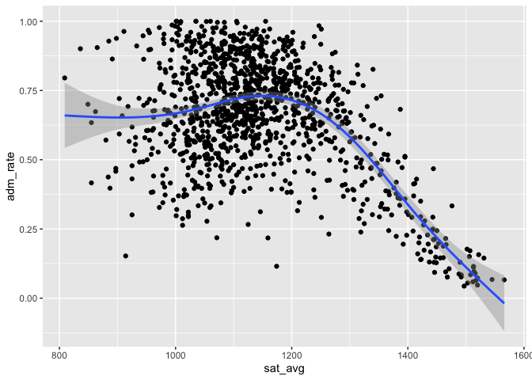

# Welcome to Data Science\!

Today, we’ll be working on getting you set up with the tools you will
need for this class. Once you are set up, we’ll do what we’re here to
do: analyze data\!

Here’s what we need to get done today:

1.  Introductions  
2.  Installing R
3.  Installing Rstudio
4.  Installing git
5.  Getting set up on GitHub
6.  Initializing everyone’s github repos
7.  hello\_world.Rmd

## Introductions

We need three basic sets of tools for this class. We will need `R` to
analyze data. We will need `RStudio` to help us interface with R and to
produce documentation of our results. Last, we will need `git` and
GitHub to communicate our results to the wider world.

## Installing R

R is going to be the only programming language we will use. R is an
extensible statistical programming environment that can handle all of
the main tasks that we’ll need to cover this semester: getting data,
analyzing data and communicating data analysis.

If you haven’t already, you need to download R here:
<https://cran.r-project.org/>.

## Installing Rstudio

When we work with R, we communicate via the command line. To help
automate this process, we can write scripts, which contain all of the
commands to be executed. These scripts generate various kinds of output,
like numbers on the screen, graphics or reports in common formats (pdf,
word). Most programming languages have several **I** ntegrated **D**
evelopment **E** nvironments (IDEs) that encompass all of these elements
(scripts, command line interface, output). The primary IDE for R is
Rstudio.

If you haven’t already, you need to download Rstudio here:
<https://www.rstudio.com/products/rstudio/download2/>. You need the free
Rstudio desktop version.

## Installing git

`git` is a version control program. A standard problem in programming is
how to track the changes that have been made to a project. These
challenges are well-known to anyone who has had to work on a complex
document, particularly with collaborators. Because these problems are
particularly severe in programming, they developed a set of tools called
version control. These will keep track of every change you make to a
file, and record why you made the change. Download git here and accept
all of the defaults on installation: (<https://git-scm.com/downloads>)

## Getting set up on GitHub

GitHub is online hosting service that is widely used by programmers. It
allows you to easily share your work with the world. It is integrated
with git, so version control is easy to do. If you haven’t already, go
to (<https://github.com>) and sign up for free to get a username. Share
the username with me as soon as you have one.

## Initializing repos

Everyone in the class will need a repository (repo from now on) on our
GitHub organization. All I need from you is your username on GitHub,
then I can add your repo to our organization.

## Installing Github Desktop

Github desktop is a **G** raphical **U** ser **I** nterface for git. We
won’t use it much, but you will need it to “clone” your git repository.

Download github desktop (<https://desktop.github.com/>). Choose the beta
version, which appears to be working nicely. Accept all of the defaults
on installation.

Unzip and open up the github app. Then using the app, sign into github
using your username and ID.

## Integrating Rstudio with GitHub

To integrate Rstudio with GitHub, you need to enable git as your version
control within Rstudio. Go to Preferences–\>Git/SVN and make sure the
“enable version control” box is checked. Make sure that you can see a
path to git.

Further instructions (if needed) are
[here](https://support.rstudio.com/hc/en-us/articles/200532077-Version-Control-with-Git-and-SVN).

## Cloning down your repo

First in RStudio, you’ll need to generate an SSH key. This will let
GitHub know it’s safe to talk to your computer. In RStudio, go to
Preferences–\> Git/SVN, then click on “Create RSA Key”. Once that’s
done, you can click on the blue text that says “View public key.” Copy
all of the text in the public key.

Now go to [GitHub](https://github.com) and in the upper right hand
corner by your avatar, click on Settings. Go to SSH and GPG keys. Click
“New SSH Key” and paste in the text you copied from Rstudio. Name the
key, and you should be all set.

Now, go to your repo for this class. Everyone’s repo is in the
`hoddatasci` organization, and usese the naming convention
`student_<yourlastname>`. Click the green button that says “clone or
download,” then copy the link provided by clicking on the clipboard next
to the link.

*N.B. in this class, and generally in programming, when you see*
`<text>` *that means that you need to substitute something in.*

Now go to Github desktop, and click the “clone a repository.” Paste in
the link you just copied, choose a location on your computer, and
proceed. Choose a good spot on your computer for the project files–
wherever you usually keep class directories. DO NOT PUT YOUR DIRECTORY
ON YOUR DESKTOP OR IN DOWNLOADS. This project will be the only place you
need to work for this class the entire semester.

## Linking Github and Rstudo

From RStudio, you’ll need to click New Project–Existing Directory– then
choose the directory where you just downloaded the gihub repository.

Name the project “central”.

Once you click “create project,” you should see a “git” tab in your
environment. Open up the file named `01-intro.Rmd` and take a look.

## Yes We Code\! Running R Code

The following code chunks will be our first use of R in this class.
We’re going to grab some data that’s part of the [college
scorecard](https://collegescorecard.ed.gov/data/documentation/) and do a
bit of analysis on it.

## .Rmd files

Open the `01-intro.Rmd` file. In Rstudio, go to File–\>Open, then find
the `01-intro.Rmd` file in the directory.

.Rmd files will be the only file format we work in this class. .Rmd
files contain three basic elements:

1.  Script that can be interpreted by R.
2.  Output generated by R, including tables and figures.  
3.  Text that can be read by humans.

From a .Rmd file you can generate html documents, pdf documents, word
documents, slides . . . lots of stuff. All class notes will be in .Rmd.
All assignments will be turned in as .Rmd files, and your final project?
You guessed it, .Rmd.

In the `01-Intro.Rmd` file you’ll notice that there are three open
single quotes in a row, like so: ` ``` ` This indicates the start of a
“code chunk” in our file. The first code chunk that we load will
include a set of programs that we will need all semester long.

When we say that R is extensible, we mean that people in the community
can write programs that everyone else can use. These are called
“packages.” In these first few lines of code, I load a set of packages
using the library command in R. The set of packages, called `tidyverse`
were written by Hadley Wickham and play a key role in his book. To
install this set of packages, simply type in
`install.packages("tidyverse")` at the R command prompt.

To run the code below in R, you can:

  - Press the “play” button next to the code chunk
  - In OS X, place the cursor in the code chunk and hit `CMD+RETURN`
  - In Windows, place the cursor in the code chunk and hit
    `CTRIL+RETURN`

<!-- end list -->

``` r
## Get necessary libraries-- won't work the first time, because you need to install them!
library(tidyverse)
```

    ## Registered S3 methods overwritten by 'ggplot2':
    ##   method         from 
    ##   [.quosures     rlang
    ##   c.quosures     rlang
    ##   print.quosures rlang

    ## ── Attaching packages ───────────────────────────────────────────────── tidyverse 1.2.1 ──

    ## ✔ ggplot2 3.1.1     ✔ purrr   0.3.2
    ## ✔ tibble  2.1.3     ✔ dplyr   0.8.3
    ## ✔ tidyr   0.8.3     ✔ stringr 1.4.0
    ## ✔ readr   1.3.1     ✔ forcats 0.4.0

    ## ── Conflicts ──────────────────────────────────────────────────── tidyverse_conflicts() ──
    ## ✖ dplyr::filter() masks stats::filter()
    ## ✖ dplyr::lag()    masks stats::lag()

Now we’re ready to load in data. The data frame will be our basic way of
interacting with everything in this class. The `sc` data frame contains
information from the college scorecard on 127 different colleges and
univeristies.

However, we first need to make sure that R is looking in the right
place. When you opened up your project, Rstudio automagically took you
to the directory for that project. But because we keep lessons in a
separate directory, we need to

``` r
## Load in the data
load("college.Rdata")
```

Here are the variables in the `college.Rdata` dataset:

*Variable Name* :*Definition* unitid: Unit ID

instnm: Institution Name

stabbr: State Abbreviation

year: Year

control: control of institution, 1=public, 2= private non-profit,
3=private for-profit

preddeg: predominant degree, 1= certificate, 2= associates, 3=
bachelor’s, 4=graduate

adm\_rate: Proportion of Applicants Admitted

sat\_avg: Midpoint of entrance exam scores, on SAT scale, math and
verbal only

costt\_4a: Average cost of attendance (tuition and room and board less
all grant aid)

debt\_mdn: Median debt of graduates

md\_earn\_ne\_pg: Earnings of graduates who are not enrolled in higher
education, six years after graduation

*Looking at datasets*

We can look at the first few rows and columns of `sc` by typing in the
data name.

We can look at the whole dataset using
View.

``` r
## What does this data look like? Look at the first few rows, first few variables
sc
```

    ## # A tibble: 125 x 12
    ##    unitid instnm stabbr  year control preddeg adm_rate sat_avg costt4_a
    ##     <int> <chr>  <chr>  <dbl>   <int>   <int>    <dbl>   <dbl>    <int>
    ##  1 446048 Ave M… FL      2009       2       3    0.374    1104    29200
    ##  2 443410 DigiP… WA      2009       3       3    0.326    1194    23969
    ##  3 111081 Calif… CA      2009       2       3    0.283      NA    48784
    ##  4 112260 Clare… CA      2009       2       3    0.163    1389    50990
    ##  5 113537 Dell'… CA      2009       2       1    0          NA       NA
    ##  6 404338 Schil… FL      2009       3       2    0.158      NA    35408
    ##  7 117928 Argos… CA      2009       3       3    0.323      NA    35858
    ##  8 120537 Hope … CA      2009       2       3    0.386     975    33366
    ##  9 119544 The N… CA      2009       3       3    0.261      NA    19135
    ## 10 107071 Hende… AR      2009       1       3    0.313    1048    14629
    ## # … with 115 more rows, and 3 more variables: debt_mdn <dbl>,
    ## #   md_earn_wne_p6 <int>, ugds <int>

``` r
#View(sc)
```

*Filter, Select, Arrange*

In exploring data, many times we want to look at smaller parts of the
dataset. There are three commands we’ll use today that help with this.

\-`filter` selects only those cases or rows that meet some logical
criteria.

\-`select` selects only those variables or coloumns that meet some
criteria

\-`arrange` arranges the rows of a dataset in the way we want.

For more on these, please see this
[vignette](https://cran.rstudio.com/web/packages/dplyr/vignettes/introduction.html).

Let’s grab just the data for Vanderbilt, then look only at the average
test scores and admit rate.

``` r
## Where are we?
sc%>%filter(instnm=="Vanderbilt University")
```

    ## # A tibble: 1 x 12
    ##   unitid instnm stabbr  year control preddeg adm_rate sat_avg costt4_a
    ##    <int> <chr>  <chr>  <dbl>   <int>   <int>    <dbl>   <dbl>    <int>
    ## 1 221999 Vande… TN      2009       2       3    0.202    1430    52303
    ## # … with 3 more variables: debt_mdn <dbl>, md_earn_wne_p6 <int>,
    ## #   ugds <int>

``` r
sc%>%filter(instnm=="Vanderbilt University")%>%select(instnm,adm_rate,sat_avg )
```

    ## # A tibble: 1 x 3
    ##   instnm                adm_rate sat_avg
    ##   <chr>                    <dbl>   <dbl>
    ## 1 Vanderbilt University    0.202    1430

``` r
## Just colleges with low admit rates: show admit rate and sat scores, arrange in a pleasing way
sc%>%filter(adm_rate<.1)%>%select(instnm,adm_rate,sat_avg)%>%arrange(sat_avg,adm_rate)
```

    ## # A tibble: 6 x 3
    ##   instnm                                              adm_rate sat_avg
    ##   <chr>                                                  <dbl>   <dbl>
    ## 1 Cooper Union for the Advancement of Science and Art   0.0735    1336
    ## 2 Stanford University                                   0.0797    1436
    ## 3 Harvard University                                    0.0719    1468
    ## 4 Yale University                                       0.0856    1475
    ## 5 Dell'Arte International School of Physical Theatre    0           NA
    ## 6 The Juilliard School                                  0.0711      NA

``` r
## Just colleges with low admit rates: order by sat scores (- sat_avg gives descending)
sc%>%filter(adm_rate<.1)%>%select(instnm,adm_rate,sat_avg)%>%arrange(-sat_avg)
```

    ## # A tibble: 6 x 3
    ##   instnm                                              adm_rate sat_avg
    ##   <chr>                                                  <dbl>   <dbl>
    ## 1 Yale University                                       0.0856    1475
    ## 2 Harvard University                                    0.0719    1468
    ## 3 Stanford University                                   0.0797    1436
    ## 4 Cooper Union for the Advancement of Science and Art   0.0735    1336
    ## 5 Dell'Arte International School of Physical Theatre    0           NA
    ## 6 The Juilliard School                                  0.0711      NA

``` r
## New cut
sc_sub <- sc%>%filter(adm_rate>.3)%>%
  select(instnm,sat_avg,md_earn_wne_p6,stabbr)%>%
  arrange(stabbr,-sat_avg)%>%print(n=100)
```

    ## # A tibble: 71 x 4
    ##    instnm                                     sat_avg md_earn_wne_p6 stabbr
    ##    <chr>                                        <dbl>          <int> <chr> 
    ##  1 Henderson State University                    1048          29200 AR    
    ##  2 University of Arkansas at Pine Bluff           784          22300 AR    
    ##  3 University of Advancing Technology              NA          34800 AZ    
    ##  4 Scripps College                               1336          34800 CA    
    ##  5 University of California-San Diego            1247          42500 CA    
    ##  6 Pepperdine University                         1230          48100 CA    
    ##  7 California Polytechnic State University-S…    1205          49200 CA    
    ##  8 San Diego State University                    1050          39300 CA    
    ##  9 Hope International University                  975          33200 CA    
    ## 10 Argosy University-The Art Institute of Ca…      NA          30800 CA    
    ## 11 Colorado College                              1326          28500 CO    
    ## 12 Connecticut College                             NA          39900 CT    
    ## 13 George Washington University                  1276          51700 DC    
    ## 14 Delaware State University                      868          28300 DE    
    ## 15 Ave Maria University                          1104             NA FL    
    ## 16 Florida International University              1102          37100 FL    
    ## 17 Brenau University                              965          37900 GA    
    ## 18 National Louis University                       NA          39600 IL    
    ## 19 Grambling State University                     851          21200 LA    
    ## 20 Brandeis University                           1367          40100 MA    
    ## 21 Boston College                                1343          54700 MA    
    ## 22 The New England Conservatory of Music           NA          20300 MA    
    ## 23 The Boston Conservatory                         NA          22100 MA    
    ## 24 College for Creative Studies                   970          27400 MI    
    ## 25 Rocky Mountain College                        1042          29700 MT    
    ## 26 University of North Carolina at Chapel Hi…    1305          42900 NC    
    ## 27 Campbell University                           1018          36900 NC    
    ## 28 Wake Forest University                          NA          43100 NC    
    ## 29 Shaw University                                 NA          23500 NC    
    ## 30 Nebraska Methodist College of Nursing & A…    1030          47400 NE    
    ## 31 New Jersey City University                     835          37500 NJ    
    ## 32 Colgate University                            1357          44500 NY    
    ## 33 University of Rochester                       1334          45300 NY    
    ## 34 New York University                           1317          46000 NY    
    ## 35 SUNY College at Geneseo                       1310          37400 NY    
    ## 36 SUNY at Binghamton                            1265          45300 NY    
    ## 37 Stony Brook University                        1193          42800 NY    
    ## 38 Marist College                                1161          41200 NY    
    ## 39 State University of New York at New Paltz     1115          35100 NY    
    ## 40 SUNY Oneonta                                  1098          33000 NY    
    ## 41 SUNY Polytechnic Institute                    1086          42500 NY    
    ## 42 CUNY Queens College                           1060          37300 NY    
    ## 43 CUNY Brooklyn College                         1035          34700 NY    
    ## 44 CUNY City College                             1015          35000 NY    
    ## 45 CUNY Lehman College                            910          35500 NY    
    ## 46 Bard College                                    NA          23500 NY    
    ## 47 Manhattan School of Music                       NA          16300 NY    
    ## 48 St Lawrence University                          NA          35900 NY    
    ## 49 Oberlin College                               1360          24400 OH    
    ## 50 Ohio Christian University                      901          25400 OH    
    ## 51 Central State University                       759          19400 OH    
    ## 52 Wilberforce University                          NA          29500 OH    
    ## 53 Carnegie Mellon University                    1392          63600 PA    
    ## 54 Lehigh University                             1300          63100 PA    
    ## 55 Lincoln University                             812          29400 PA    
    ## 56 University of Puerto Rico-Rio Piedras         1206          16400 PR    
    ## 57 Universidad Central de Bayamon                  NA          16500 PR    
    ## 58 Universidad del Sagrado Corazon                 NA          16100 PR    
    ## 59 Universidad Central Del Caribe                  NA          28500 PR    
    ## 60 Inter American University of Puerto Rico-…      NA          16700 PR    
    ## 61 Inter American University of Puerto Rico-…      NA          16700 PR    
    ## 62 Inter American University of Puerto Rico-…      NA          16700 PR    
    ## 63 Rhode Island School of Design                 1244          31800 RI    
    ## 64 Claflin University                             895          21500 SC    
    ## 65 Hardin-Simmons University                     1047          35300 TX    
    ## 66 Southwestern Assemblies of God University       NA          27200 TX    
    ## 67 South University-The Art Institute of Dal…      NA          27500 TX    
    ## 68 College of William and Mary                   1339          41500 VA    
    ## 69 University of Virginia-Main Campus            1332          49000 VA    
    ## 70 University of Richmond                        1261          47700 VA    
    ## 71 DigiPen Institute of Technology               1194          63100 WA

*Quick Exercise* Choose a different college and two different things
about that college.

*Summarizing Data*

``` r
## What's the average median debt?
sc%>%summarize(mean_debt=mean(debt_mdn,na.rm=TRUE))
```

    ## # A tibble: 1 x 1
    ##   mean_debt
    ##       <dbl>
    ## 1    11277.

*Quick Exercise* Summarize the average entering SAT scores in this
dataset.

*Combining Commands* We can also combine commands, so that summaries are
done on only a part of the dataset. Below, I summarize median debt for
selective schools, and not very selective schools.

``` r
## What's the average median debt for very selective schools?
sc%>%filter(adm_rate<.1)%>%summarize(mean_debt=mean(debt_mdn,na.rm=TRUE))
```

    ## # A tibble: 1 x 1
    ##   mean_debt
    ##       <dbl>
    ## 1     9336.

``` r
## And for not very selective schools?
sc%>%filter(adm_rate>.3)%>%summarize(mean_debt=mean(debt_mdn,na.rm=TRUE))
```

    ## # A tibble: 1 x 1
    ##   mean_debt
    ##       <dbl>
    ## 1    11684.

*Quick Exercise* Calculate average earnings for schools where SAT\>1200

*Grouping Data* Another powerful tool is being able to calculate
characteristics for various groups. For example, what are the average
earnings for the three different types of colleges (public, private
non-profit, private for-profit) in the
dataset?

``` r
sc%>%group_by(control)%>%summarize(mean_earnings=mean(md_earn_wne_p6,na.rm=TRUE))
```

    ## # A tibble: 3 x 2
    ##   control mean_earnings
    ##     <int>         <dbl>
    ## 1       1        34840 
    ## 2       2        41642.
    ## 3       3        35583.

``` r
sc%>%group_by(control)%>%summarize(mean_debt=mean(debt_mdn,na.rm=TRUE))
```

    ## # A tibble: 3 x 2
    ##   control mean_debt
    ##     <int>     <dbl>
    ## 1       1    10072.
    ## 2       2    11887.
    ## 3       3    10061.

``` r
sc%>%group_by(control)%>%summarize(mean(debt_mdn,na.rm=TRUE))
```

    ## # A tibble: 3 x 2
    ##   control `mean(debt_mdn, na.rm = TRUE)`
    ##     <int>                          <dbl>
    ## 1       1                         10072.
    ## 2       2                         11887.
    ## 3       3                         10061.

*Plotting Data* The last basic tool for looking at a dataset is plotting
the data.

``` r
## Plotting: bivariate
gg<-ggplot(data=sc,aes(x=sat_avg,y=adm_rate))
gg<-gg+geom_point()
gg<-gg+geom_smooth()
gg
```

    ## `geom_smooth()` using method = 'loess' and formula 'y ~ x'

    ## Warning: Removed 27 rows containing non-finite values (stat_smooth).

    ## Warning: Removed 27 rows containing missing values (geom_point).

<!-- -->

``` r
## Univariate descriptives

gg<-ggplot(data=sc,aes(adm_rate))
gg<-gg+geom_density()
gg
```

<!-- -->

*Quick exercise* Replicate the above plots, but put cost of attendance
on the y axis.

## Github: save, stage, commit, push

When working with files in your directory, there are three basic steps
you can take when using Git as your version control.

  - Saving the file means it is only available to you, on your computer.
    You should save files as you are working on them.

  - Staging the file means that you would like git (and github) to keep
    track of the changes you’re making to the file. Stage the file by
    clicking the “staged” box next to it in the Git tab in Rstudio.

  - Committing means that you would like to keep the version of the file
    you generated. Think of this like emailing it to group members. It
    doesn’t mean that it’s done, but it does mean it’s in a state that
    you would like to have a record of as you move forward. To commit a
    file in Rstudio, click the “commit” button. You will be prompted to
    add a commit message. There’s actually quite a lot of thought about
    what goes into a commit message. The best idea for now is simply to
    state why you did what you did, and avoid profanity or any demeaning
    language.

  - Pushing means that you will send the file and the record of all of
    the changes made to the file to GitHub. To push, click the “push”
    button in the Git tab in Rstudio. You should do this everytime you
    finish a working session, at an absolute minimum.

## Your first commit: `hello_world.Rmd`

For today, I want you to create a file called
`01-assignment_<lastname>.Rmd` in your github repo for assignments. It
should contain the following elements:

1.  A sentence that says “Hello, World”
2.  R output that summarizes one of the variables in the
    `colllege.Rdata` dataset
3.  R output that shows a scatterplot for two of the variables in the
    `college.Rdata` dataset.

Lucky for you this is is also your first assignment\! Submit it under
assignments, using the format `01-assignment_<lastname>.Rmd`. All
assignments should be turned in using this format. Since my last name is
Doyle, I would use `01-assignment_doyle.Rmd` as my file name. Unless
your name is also Doyle, you should use a different name.

*Stretch Items*

If you have extra time, you can do the following:

1.  Calculate the average earnings for individuals at the most selective
    colleges, then compare that with individuals at the least selective
    colleges in the dataset.

2.  Find a way to determine whether colleges with very high SAT scores
    tend to be larger or smaller than colleges with low SAT scores.

3.  Plot the relationship between cost and debt. What do you see? Does
    this surprise you?

4.  Now, provide separate plots for cost and debt by control of the
    institution.

Save, commit and push the assignment file to the assignments directory.
