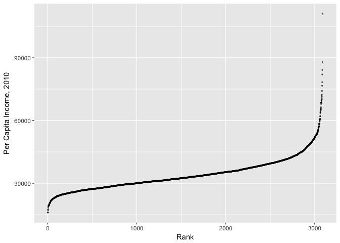
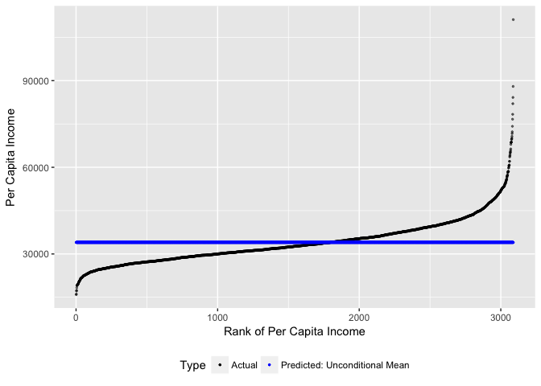
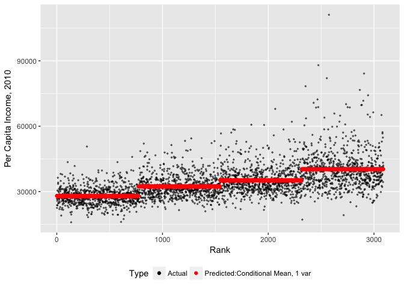
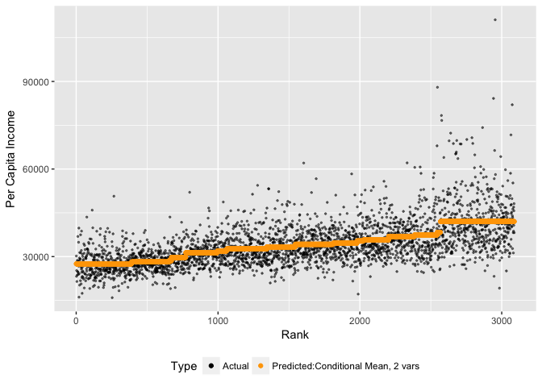
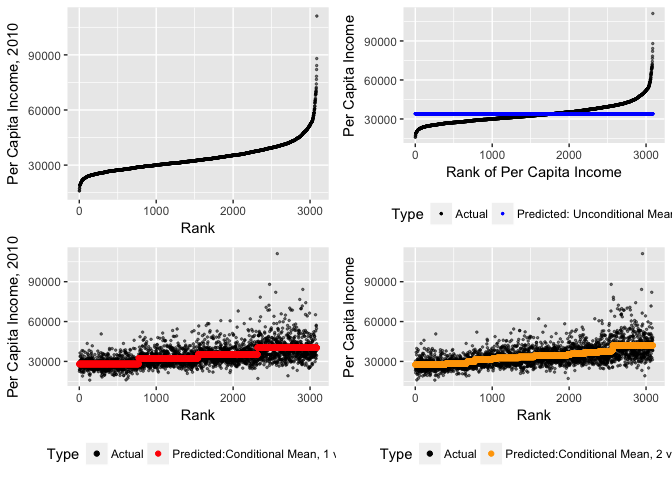

Conditional Means
================

Analyzing Data, Part 1: Conditional Means
=========================================

The conditional mean will be our first predictive algorithm. Conditional means answer the question: "Given what we know about a certain case, what can expect to see, on average?" The conditional mean is a powerful tool that is typically quite easy to explain to decision-makers.

We'll go through the following steps:

1.  Computing and plotting unconditional means
2.  Computing and plotting conditional means using a single predictor.
3.  Computing and plotting conditional means using multiple predictors.

Dataset for this week
---------------------

We will be working with a dataset put together by the census bureau that summarizes the characteristics of the 3,088 counties in the United States.

``` r
load("pd.Rdata")

pd
```

    ## # A tibble: 3,088 × 55
    ##     fips pop2013 pop2010_base popchange_pc pop2010 popu5 popu18 pop65p
    ## *  <chr>   <int>        <int>        <dbl>   <int> <dbl>  <dbl>  <dbl>
    ## 1  01001   55246        54571          1.2   54571   6.1   25.4   13.5
    ## 2  01003  195540       182265          7.3  182265   5.7   22.4   18.1
    ## 3  01005   27076        27457         -1.4   27457   5.8   21.1   15.9
    ## 4  01007   22512        22919         -1.8   22915   5.3   21.3   14.3
    ## 5  01009   57872        57322          1.0   57322   6.1   23.8   16.4
    ## 6  01011   10639        10915         -2.5   10914   6.3   21.0   14.6
    ## 7  01013   20265        20946         -3.3   20947   6.1   23.3   17.7
    ## 8  01015  116736       118572         -1.5  118572   5.8   22.2   15.5
    ## 9  01017   34162        34170          0.0   34215   5.9   21.4   17.8
    ## 10 01019   26203        25986          0.8   25989   4.8   20.7   20.1
    ## # ... with 3,078 more rows, and 47 more variables: female_pc <dbl>,
    ## #   white_pc <dbl>, black_pc <dbl>, am_ind_pc <dbl>, asian_pc <dbl>,
    ## #   hawaii_pi_pc <dbl>, twomore_race_pc <dbl>, hispanic_pc <dbl>,
    ## #   white_non_hispanic_pc <dbl>, same_house_pc <dbl>,
    ## #   foreign_born_pc <dbl>, other_eng_home_pc <dbl>, hs_grad_pc <dbl>,
    ## #   coll_grad_pc <dbl>, veterans <int>, travel_time <dbl>,
    ## #   housing_units <int>, homeown_rate <dbl>, house_unit_multi <dbl>,
    ## #   median_home_val <int>, households <int>, person_per_hh <dbl>,
    ## #   per_capita_inc <int>, median_hh_inc <int>,
    ## #   persons_below_poverty <dbl>, pv_nonfarm <int>,
    ## #   pv_nonfarm_employ <int>, pv_nonfarm_employ_ch <dbl>,
    ## #   nonemployer_est <int>, firms <int>, firms_black_own_pc <dbl>,
    ## #   firms_amind_own_pc <dbl>, firms_asian_own_pc <dbl>,
    ## #   firms_hawaii_pi_own_pc <dbl>, firms_hispanic_own_pc <dbl>,
    ## #   firms_female_own_pc <dbl>, manufacture_ship <dbl>, wholesale <dbl>,
    ## #   retail <dbl>, retail_percap <int>, hospitality <int>,
    ## #   bldg_permits <int>, land_area <dbl>, pop_per_square <dbl>,
    ## #   county <chr>, percapinc.2010 <dbl>, percapinc.2012 <dbl>

The codebook for this dataset is stored as another dataset, `labels_explain`. The first column in this dataset is variable names, the second column is a full explanation of that variable.

``` r
## Full explanation of data
load("pd_lab_explain.Rdata")

lab_explain
```

    ## # A tibble: 51 × 2
    ##         varname                                                      label
    ##          <fctr>                                                     <fctr>
    ## 1       pop2013                                  Population, 2013 estimate
    ## 2  pop2010_base                  Population, 2010 (April 1) estimates base
    ## 3  popchange_pc Population, percent change - April 1, 2010 to July 1, 2013
    ## 4       pop2010                                           Population, 2010
    ## 5         popu5                       Persons under 5 years, percent, 2013
    ## 6        popu18                      Persons under 18 years, percent, 2013
    ## 7        pop65p                   Persons 65 years and over, percent, 2013
    ## 8     female_pc                              Female persons, percent, 2013
    ## 9      white_pc                                 White alone, percent, 2013
    ## 10     black_pc             Black or African American alone, percent, 2013
    ## # ... with 41 more rows

``` r
#or use View
#View(lab_explain)
```

*Quick Exercise: Find the per capita income and the percent of the population with a bachelor's degree for the county you're from.*

Dependent Variable
------------------

Our working example will be based on predicting income in a given county. Suppose we want to know what income level we can expect for a geographic area based on observed characteristics, such as the proportion of the population with a bachelor's degree. How would we predict the income based on what we know about the geographic area?

Let's begin by plotting the data to see what it looks like. To do this I need to first rank the counties by income. To create a rank variable that will be stored in the `pd` dataset, I use the `mutate` command. This creates a variable based on some calculation then stores it in the same dataset. I'm then going to plot incomes for each county in descending rank order. Using the `plotly` library I can make this interactive so we know which counties we're talking about.

``` r
## Create a rank variable for income 
pd<-pd%>%mutate(percapinc_rank=rank(percapinc.2010))

## Plot by rank

gg<-ggplot(data=pd , aes(x=percapinc_rank,
                         y=percapinc.2010,
                         text=county))
##Add Axis Labels
gg<-gg+xlab("Rank")+ylab("Per Capita Income, 2010")

## Add Points
gg<-gg+geom_point(alpha=.5,size=.5)

gg
```



``` r
## Save for later
gg1<-gg

# Make Interactive plot
#gg_p<-ggplotly(gg)

#gg_p
```

Unconditional Means
-------------------

If you were asked to predict the income for a given area without any additional information, the likely best guess is the overall average. We're going to begin with the unconditional mean, or simple average, as our first prediction. We'll again use the `mutate` command to plug in a variable that will be the average for every county, and we'll plot this as a predictor.

Our notation for the unconditional mean as a predictor is:

$$\\hat{Y}=\\bar{Y} $$

``` r
##Unconditional Average
pd%>%summarize(mean_percapinc.2010=mean(percapinc.2010,na.rm=TRUE))
```

    ## # A tibble: 1 × 1
    ##   mean_percapinc.2010
    ##                 <dbl>
    ## 1            34002.98

``` r
##Unconditional Average as a Predictor
pd<-pd%>%mutate(mean_percapinc.2010=mean(percapinc.2010,na.rm=TRUE))

##Plotting
gg<-ggplot(data=pd,aes(y=percapinc.2010,x=percapinc_rank,color="Actual"))
gg<-gg+geom_point(alpha=.5,size=.5)
gg<-gg+geom_point(aes(y=mean_percapinc.2010,x=percapinc_rank,
                  color="Predicted: Unconditional Mean"),
                  size=.5)
gg<-gg+xlab("Rank of Per Capita Income")+ylab("Per Capita Income")
gg<-gg+scale_color_manual(name="Type",
                          values=c("Actual"="black",
                          "Predicted: Unconditional Mean"="blue")
                          )
gg<-gg+theme(legend.position="bottom")

gg
```



``` r
##Save for later

gg2<-gg
```

This is of course a terrible prediction. In the absence of any other information, it's many times the best we can do, but we really ought to be able to do better.

To understand how far off we are, we need to summarize our errors. We will use different ways of doing this this semester, but let's start with a very standard one, Root Mean Squared Error, or RMSE. An error term is the vertical distance between each point and its prediction. The RMSE is the square root of the sum of squared errors. (Q:why do we square them?).

$$RMSE(\\hat{Y})=\\sqrt{ 1/n \\sum\_{i=1}^n(Y\_i-\\hat{Y\_i})^2} $$

``` r
pd<-pd%>%mutate(e1=percapinc.2010-mean_percapinc.2010)

## RMSE

rmse_uncond_mean<-rmse(pd$percapinc.2010,pd$mean_percapinc.2010)

rmse_uncond_mean
```

    ## [1] 7817.037

Conditional Means With One Predictor Variable
---------------------------------------------

To incorporate additional information into the mean, we need to calculate averages at levels of other predictors. Let's calculate the average per capita income at different levels of college education. The code below will calculate average income across counties at four different levels of college education-- the four quantiles of college education in the dataset.

``` r
##Condtional Average across a single variable

## Create a variable for quartiles of college education
pd<-pd%>%mutate(coll_grad_level=ntile(coll_grad_pc,4))

table(pd$coll_grad_level)
```

    ## 
    ##   1   2   3   4 
    ## 772 772 772 772

``` r
pd<-pd%>%group_by(coll_grad_level)%>% ## Group by predictor
  ##Calculate mean at each level of predictor
  mutate(pred_income_college=mean(percapinc.2010))%>% 
  ## Ungroup
  ungroup()%>% 
  #Rank by prediction, with ties sorted randomly
  mutate(pred_income_college_rank=rank(pred_income_college,ties.method="random"))


gg<-ggplot(data=pd,aes(x=pred_income_college_rank,y=percapinc.2010,color="Actual"))
gg<-gg+geom_point(alpha=.5,size=.5)
gg<-gg+geom_point(aes(x=pred_income_college_rank,y=pred_income_college,color="Predicted:Conditional Mean, 1 var"))
gg<-gg+ scale_color_manual("Type",values=c("Predicted:Conditional Mean, 1 var"="red","Actual"="black"))
gg<-gg+theme(legend.position="bottom")
gg<-gg+xlab("Rank")+ylab("Per Capita Income, 2010")
gg
```



``` r
##Save for later
gg3<-gg
```

Our notation for this predictor will be:

$$\\hat{Y}=(\\bar{Y}|X=x) $$

That is, the predicted value of y, $\\bar{Y}$ is equal to the mean value of *Y* given our predictor *X* (college graduate levels in this case) is equal to a given value of *X*, denoted by *x*.

*Quick Exercise: Calculate per capita income as a function of the proportion of the county with a high school education*

Let's see what happened to our RMSE when we did a conditional as opposed to an unconditional mean.

``` r
rmse_cond_mean_one<-rmse(pd$percapinc.2010,pd$pred_income_college)
rmse_cond_mean_one
```

    ## [1] 6425.743

Conditional Means with Multiple Predictors
------------------------------------------

The next step is to then incorporate more information from additional variables. Let's calculate the average income by both quartiles of both the population with a bachelor's degree and median home values.

``` r
##Condtional average across multiple variables

## Calculate quartiles of home value
pd<-pd%>%mutate(median_home_level=ntile(median_home_val,4))

table(pd$median_home_level)
```

    ## 
    ##   1   2   3   4 
    ## 772 772 772 772

``` r
##Make prediction: income by quartiles of education and home values

pd<-pd%>%group_by(coll_grad_level,median_home_level)%>% ## Grouping at multiple levels
  mutate(pred_income_college_home=mean(percapinc.2010))%>%
  ungroup()%>%
  mutate(pred_income_college_home_rank=rank(pred_income_college_home,ties.method="random"))

## Showing the various levels
gg<-ggplot(data=pd,aes(x=pred_income_college_home_rank,y=percapinc.2010,color="Actual"))
gg<-gg+geom_point(alpha=.5,size=.5)
gg<-gg+geom_point(aes(x=pred_income_college_home_rank,
                      y=pred_income_college_home,
                      color="Predicted:Conditional Mean, 2 vars")
)

gg<-gg+scale_color_manual("Type",values=c("Actual"="black",
                                  "Predicted:Conditional Mean, 2 vars"="orange"
))

gg<-gg+theme(legend.position="bottom")
gg<-gg+xlab("Rank")+ylab("Per Capita Income")

gg
```



``` r
## Save for later

gg4<-gg
```

This is clearly much better: our predictions appear to be much closer to the actual data points more of the time.

And what happened to RMSE?

``` r
rmse_cond_mean_two<-rmse(pd$percapinc.2010,pd$pred_income_college_home)
rmse_cond_mean_two
```

    ## [1] 6250.65

Final Comparison
----------------

Let's put all of the plots together to compare.

``` r
gg5<-grid.arrange(gg1,gg2,gg3,gg4,nrow=2)
```



``` r
gg5
```

    ## TableGrob (2 x 2) "arrange": 4 grobs
    ##   z     cells    name           grob
    ## 1 1 (1-1,1-1) arrange gtable[layout]
    ## 2 2 (1-1,2-2) arrange gtable[layout]
    ## 3 3 (2-2,1-1) arrange gtable[layout]
    ## 4 4 (2-2,2-2) arrange gtable[layout]

*Quick Exercise: Predict income using two other variables*

Applications of the Conditional Mean
------------------------------------

When might we use the conditional mean?

-   Caluclating average sales for a retail location by day of the week and month
-   Calculating yield rate (proportion of admitted students who attend) by geographic region and income level for a college.
-   Calculating average employee turnover by level of education and gender
