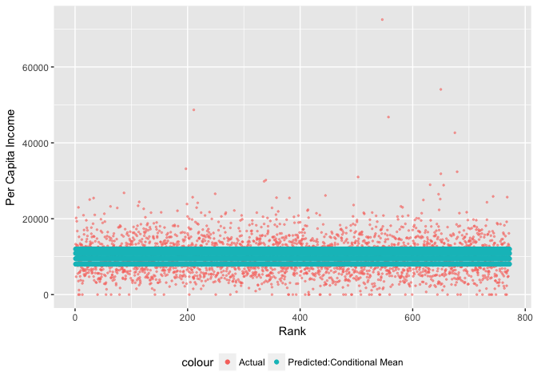

In Class Work: Conditional Means
--------------------------------

For today's class, I'd like for you to continue using the county-level dataset. Today, instead of predicting per capita income, use the variables in the dataset to predict retail sales. Here are some (but not all!) of the things that you'll need to do along the way:

-   Open up the dataset, `load("pd.RData"")`

Although I didn't state it in the instructions, you always need tidyverse, and for `rmse` you also need ModelMetrics.

``` r
library(tidyverse)
```

    ## Loading tidyverse: ggplot2
    ## Loading tidyverse: tibble
    ## Loading tidyverse: tidyr
    ## Loading tidyverse: readr
    ## Loading tidyverse: purrr
    ## Loading tidyverse: dplyr

    ## Conflicts with tidy packages ----------------------------------------------

    ## filter(): dplyr, stats
    ## lag():    dplyr, stats

``` r
library(ModelMetrics)
load("pd.Rdata")
```

-   Calculate the mean of the outcome variable of retail sales:

``` r
pd%>%summarize(mean_retail=mean(retail_percap,na.rm=TRUE))
```

    ## # A tibble: 1 × 1
    ##   mean_retail
    ##         <dbl>
    ## 1    10096.25

-   Create new variables that indicate the quantiles of another variable, using `ntile`.

I'm going to use home ownership rate `homeown_rate` to predict retail sales per capita.

The first step is to "bin" the data into four groups based on home ownership rate.

``` r
pd<-pd%>%mutate(homeown_level=ntile(homeown_rate,4))
# This just shows that I have four groups with the same number of counties.
table(pd$homeown_level)
```

    ## 
    ##   1   2   3   4 
    ## 772 772 772 772

-   Generate some tables of the conditional mean of the outcome variable by levels of the predictor variable. (hint: `group_by`, then `summarize`).

``` r
# Step by step, here's how this works:

pd%>% #1. start with the pd dataset:
  group_by(homeown_level)%>% #2. group it by levels of home ownership:
  summarize(mean_retail=mean(retail_percap)) #now use summarize to get average retail by home ownership
```

    ## # A tibble: 4 × 2
    ##   homeown_level mean_retail
    ##           <int>       <dbl>
    ## 1             1   11988.957
    ## 2             2   10867.514
    ## 3             3    9481.496
    ## 4             4    8047.043

In areas with higher levels of home ownership, retail per capita is actually lower. Does that make sense?

-   Create predictions for each county based on conditional means within each grouping of the predictor variable.

The key difference here is now we use `mutate` instead of `summarize`. This will add a new variable to our dataset, which is the predicted level of retail sales for each level of homeownership, using the conditional mean.

``` r
pd<-pd%>% #1. overwrite the pd dataset, but start with the pd dataset:
  group_by(homeown_level)%>% #2. group it by levels of home ownership:
  mutate(mean_retail=mean(retail_percap)) #now use summarize to get average retail by home ownership
```

Look at the output below. What it says is in the first county,(Autauga County, AL) the home ownership rate is 77.7. This puts this county into the third quartile for home ownership levels. The average retail sales for counties in the third quartile is $9,481--- that's our predicted sales for this county. The actual retail sales in Autagua County are $12,003.

``` r
pd%>%select(county,homeown_rate,homeown_level,mean_retail,retail_percap)
```

    ## Source: local data frame [3,088 x 5]
    ## Groups: homeown_level [4]
    ## 
    ##                 county homeown_rate homeown_level mean_retail
    ##                  <chr>        <dbl>         <int>       <dbl>
    ## 1   Autauga County, AL         77.7             3    9481.496
    ## 2   Baldwin County, AL         74.1             3    9481.496
    ## 3   Barbour County, AL         66.7             1   11988.957
    ## 4      Bibb County, AL         81.0             4    8047.043
    ## 5    Blount County, AL         81.1             4    8047.043
    ## 6   Bullock County, AL         77.3             3    9481.496
    ## 7    Butler County, AL         70.4             2   10867.514
    ## 8   Calhoun County, AL         69.8             2   10867.514
    ## 9  Chambers County, AL         69.2             2   10867.514
    ## 10 Cherokee County, AL         74.4             3    9481.496
    ## # ... with 3,078 more rows, and 1 more variables: retail_percap <int>

-   Generate summary measures of the error terms: the difference between actual retail sales and your predicted retail sales, using `rmse`.

``` r
rmse(pd$retail_percap,pd$mean_retail)
```

    ## [1] 4748.255

This means that we our predictions are off, on average, by about $4,748.

-   You should also create some graphics.

This graphic shows our prediction relative to actual levels, copying (AHEM) the code from Monday's class.

``` r
pd<-pd%>%group_by(homeown_level)%>%
  mutate(pred_retail_rank=rank(mean_retail,ties.method="random"))

## Showing the various levels
gg<-ggplot(data=pd,aes(x=pred_retail_rank,y=retail_percap,color="Actual"))
gg<-gg+geom_point(alpha=.5,size=.5)
gg<-gg+geom_point(aes(x=pred_retail_rank,
                      y=mean_retail,
                      color="Predicted:Conditional Mean")
)

gg<-gg+theme(legend.position="bottom")
gg<-gg+xlab("Rank")+ylab("Per Capita Income")

gg
```


