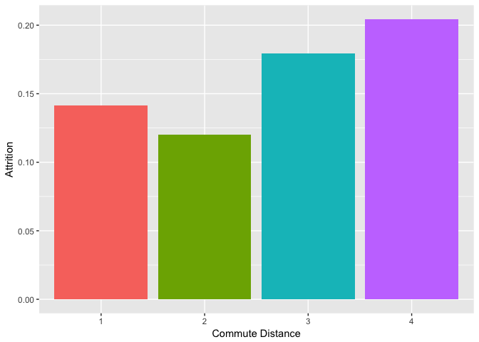
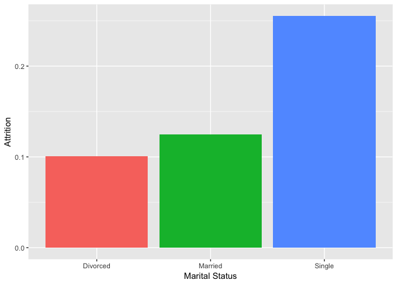
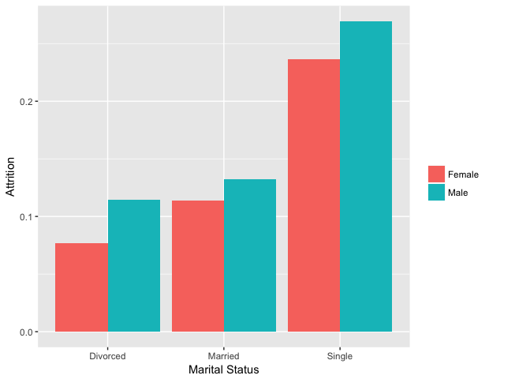
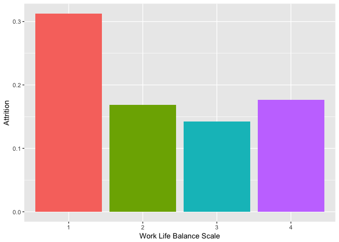
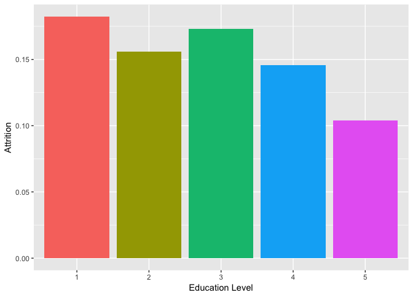
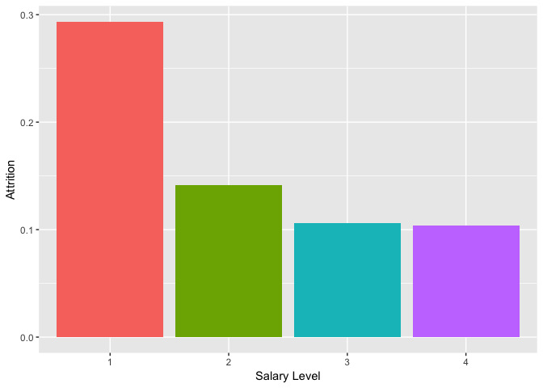
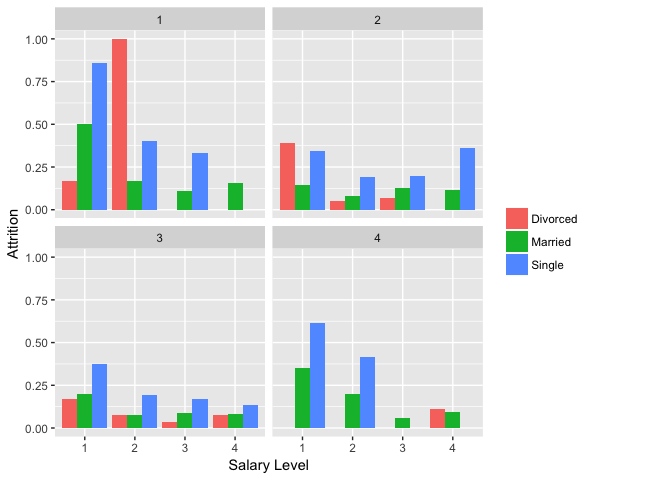

Plotting Conditional Means
================

In Class Work: Plotting Conditional Means
-----------------------------------------

Today we're going to work again with attrition as our outcome. Your company would like to know which groups are most likely to leave this year. Your supervisor has asked you to wtrie a one-page memo, detailing how attrition varies as a function of different employee characteristics. Since your supervisor is a visual learner, the memo should include two graphics, with accompanying brief text. No R code should be visible in the memo, just graphics and normal text. Your supervisor has said that the following areas are of key interest as possible predictors of attrition.

1.  Commute distance
2.  Marital Status
3.  Gender
4.  Work/Life Balance
5.  Education level
6.  Salary

To: My Boss
===========

From: Will Doyle
================

RE: Attrition Rates Among Employees
===================================

2017-09-16
==========

You recently asked for an analysis regarding predictors of employee attrition. Below, please find some preliminary results.

Commute distance
----------------

Employees with the longest commute distance have the highest levels of attrition.

Marital Status
--------------

Our single employees are most likely to leave the company.

Gender
------

 Males are slightly more likely to leave the company than women, regardless of marital status.

Work/Life Balance
-----------------

 Employees who score a "1" on the work/life balance score are much less likely to stay at the company.

Education level
---------------

Salary
------

Our lowest-paid employees are most likely to leave.

Combined factors
----------------

Based on the above, it appears that salary, marital status and work/life balance are key factors in predicting attrtion. Below I plot all three factors combined.

As the figure shows, our low-paid employees who also have low work/life satisfaction are quite likely to leave the company.
