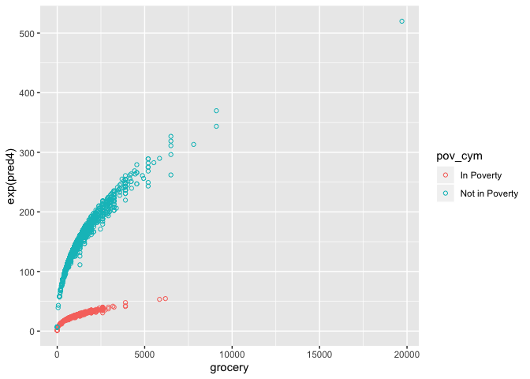
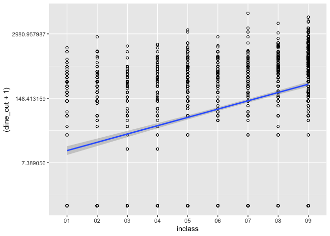
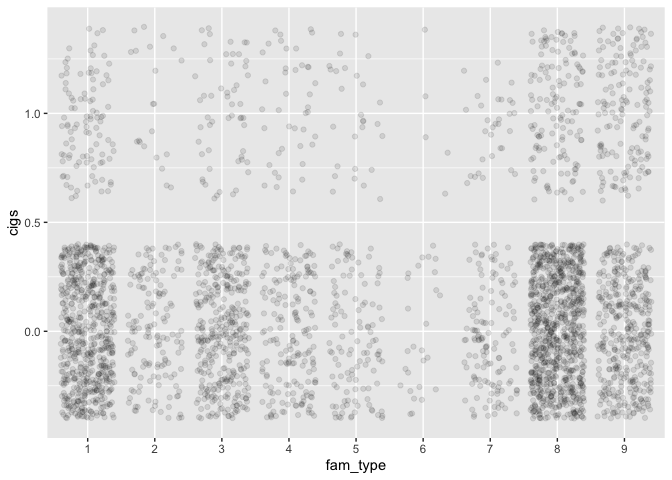

Using Regression for Prediction
================

## Overview

So far, we’ve been using just the simple mean to make predictions.
Today, we’ll continue using the simple mean to make predictions, but now
in a complicated way. Before, when we calculated conditional means, we
did so in certain “groupings” of variables. When we run linear
regression, we no longer need to do so. Instead, linear regression
allows us to calculate the conditional mean of the outcome at *every*
value of the predictor. If the predictor takes on just a few values,
then that’s the number of conditional means that will be calculated. If
the predictor is continuous and takes on a large number of values, we’ll
still be able to calculate the conditional mean at every one of those
values.

The model we posit for regression is as follows:

\[Y=\beta_0+\beta_1 x_1 +\beta_2 x_2+ ... \beta_k x_k + \epsilon\]

It’s just a linear, additive model. Y increases or decreases as a
function of x, with multiple x’s included. \(\epsilon\) is the extent to
which an individual value is above or below the line created.

Let’s say that you’ve got some consumer data and you want to target
those families that are likely to spend between $100 and $500 a month on
dining out. We would need to be able to predict which families would
spend in that range based on observable characteristics like family
size, income and family type.

We’re going to be working with expenditure data from the 2012
administration of the consumer expenditure survey. The first bit of code
gets the libraries we need, the data we need, and opens up a codebook
for the
    data.

    ## ── Attaching packages ─────────────────────────────────────── tidyverse 1.2.1 ──

    ## ✔ ggplot2 3.2.1     ✔ purrr   0.3.2
    ## ✔ tibble  2.1.3     ✔ dplyr   0.8.3
    ## ✔ tidyr   1.0.0     ✔ stringr 1.4.0
    ## ✔ readr   1.3.1     ✔ forcats 0.4.0

    ## ── Conflicts ────────────────────────────────────────── tidyverse_conflicts() ──
    ## ✖ dplyr::filter() masks stats::filter()
    ## ✖ dplyr::lag()    masks stats::lag()

## Bivariate regression

Our first dependent variable will be dining out. Let’s take a look at
that variable:

``` r
summary(cex$dine_out)
```

    ##    Min. 1st Qu.  Median    Mean 3rd Qu.    Max. 
    ##     0.0    65.0   325.0   471.1   650.0  7800.0

``` r
gg<-ggplot(cex,aes(x=dine_out))
gg<-gg+geom_histogram()
gg
```

    ## `stat_bin()` using `bins = 30`. Pick better value with `binwidth`.

<!-- -->

``` r
gg<-ggplot(cex,aes(x=dine_out))
gg<-gg+geom_density()
gg
```

<!-- -->

Because this variable is pretty non-normally distributed, we may want to
think about transforming it. For now, let’s just work with it as-is.
Let’s see if people with bigger families spend more on dining out more
than those with smaller families. Before, we would have calculated the
conditional mean at every level of family size, or in certain groupings
of family size. With regression, we simply specify the relationship.

``` r
#Model 1: simple bivariate regression

mod1<-lm(dine_out~fam_size,data=cex) #outcome on left, predictor on right 

summary(mod1)
```

    ## 
    ## Call:
    ## lm(formula = dine_out ~ fam_size, data = cex)
    ## 
    ## Residuals:
    ##    Min     1Q Median     3Q    Max 
    ## -871.1 -386.7 -161.0  164.0 7314.0 
    ## 
    ## Coefficients:
    ##             Estimate Std. Error t value Pr(>|t|)    
    ## (Intercept)  397.093     19.723  20.133  < 2e-16 ***
    ## fam_size      29.627      6.761   4.382 1.21e-05 ***
    ## ---
    ## Signif. codes:  0 '***' 0.001 '**' 0.01 '*' 0.05 '.' 0.1 ' ' 1
    ## 
    ## Residual standard error: 595.8 on 3409 degrees of freedom
    ## Multiple R-squared:  0.005601,   Adjusted R-squared:  0.005309 
    ## F-statistic:  19.2 on 1 and 3409 DF,  p-value: 1.212e-05

``` r
g1<-ggplot(cex, aes(x=fam_size,y=dine_out))+ #specify data and x and y
           geom_point(shape=1)+ #specify points
           geom_smooth(method=lm) #ask for lm line
g1
```

<!-- -->

``` r
## Add predictions
cex%>%add_predictions(mod1,var="pred1")->cex

## Calculate RMSE
rmse_1<-rmse(mod1,cex)

rmse_1
```

    ## [1] 595.6053

What this shows is that as family size increases, the amount spent on
dining out increases. For every additional family member, an additional
$30 is predicted to be spent on dining out. The rmse of 596 gives us a
sense of how wrong the model tends to be when using just this one
predictor.

*Quick Exercise* Run a regression using a different predictor. Calculate
rmse and see if you can beat my score.

## Multiple Regression

Okay, so we can see that this is somewhat predictive, but we can do
better. Let’s add in a second variable: whether or not the family is
below the poverty line.

``` r
#Part 2: Multiple regression

mod2<-lm(dine_out~fam_size+
           pov_cym, #can only take on two values
          data=cex)

summary(mod2) 
```

    ## 
    ## Call:
    ## lm(formula = dine_out ~ fam_size + pov_cym, data = cex)
    ## 
    ## Residuals:
    ##    Min     1Q Median     3Q    Max 
    ## -895.3 -350.0 -150.3  142.3 7264.6 
    ## 
    ## Coefficients:
    ##                       Estimate Std. Error t value Pr(>|t|)    
    ## (Intercept)            122.612     30.157   4.066 4.90e-05 ***
    ## fam_size                27.685      6.629   4.176 3.04e-05 ***
    ## pov_cymNot in Poverty  329.687     27.802  11.858  < 2e-16 ***
    ## ---
    ## Signif. codes:  0 '***' 0.001 '**' 0.01 '*' 0.05 '.' 0.1 ' ' 1
    ## 
    ## Residual standard error: 583.9 on 3408 degrees of freedom
    ## Multiple R-squared:  0.04501,    Adjusted R-squared:  0.04445 
    ## F-statistic:  80.3 on 2 and 3408 DF,  p-value: < 2.2e-16

``` r
rmse_2<-rmse(mod2,cex)

rmse_2
```

    ## [1] 583.6849

So, those who are in poverty spend less on dining out. Alert the media\!

*Quick Exercise* Add another variable to your model from above and see
what difference it makes. How is your RMSE?

Maybe it’s the case that those who spend more on groceries dine out
less. Let’s find
out:

``` r
#Model 3: predicting dining out using other variables and grocery spending

mod3<-lm(dine_out~
           fam_size+
           pov_cym+
           grocery,
           data=cex)

summary(mod3)
```

    ## 
    ## Call:
    ## lm(formula = dine_out ~ fam_size + pov_cym + grocery, data = cex)
    ## 
    ## Residuals:
    ##     Min      1Q  Median      3Q     Max 
    ## -2771.3  -330.5  -127.0   136.6  7328.4 
    ## 
    ## Coefficients:
    ##                        Estimate Std. Error t value Pr(>|t|)    
    ## (Intercept)            67.57871   29.94984   2.256   0.0241 *  
    ## fam_size              -12.03786    7.33827  -1.640   0.1010    
    ## pov_cymNot in Poverty 279.34638   27.60544  10.119   <2e-16 ***
    ## grocery                 0.13743    0.01178  11.670   <2e-16 ***
    ## ---
    ## Signif. codes:  0 '***' 0.001 '**' 0.01 '*' 0.05 '.' 0.1 ' ' 1
    ## 
    ## Residual standard error: 572.7 on 3407 degrees of freedom
    ## Multiple R-squared:  0.08172,    Adjusted R-squared:  0.08091 
    ## F-statistic: 101.1 on 3 and 3407 DF,  p-value: < 2.2e-16

``` r
g2<-ggplot(cex, aes(x=grocery,y=dine_out))+
           geom_point(shape=1)+ 
           geom_smooth(method=lm)
g2
```

<!-- -->

``` r
rmse_3<-rmse(mod3,cex)

rmse_3
```

    ## [1] 572.3566

Hmm, what happened here?

*Quick Exercise* Use a subset of the cex data with reasonable bounds on
both dining out and grocery expenditures. See if the results hold.

## Transformations

The big issue as you can see with this data is that the outcome variable
isn’t normally distributed: most people spend very little on dining out,
while some people spend quite a lot. In situations like this, which are
VERY common when dealing with monetary values, we want to take the
natural log of the outcome variable. A natural log is the power by which
we would have to raise \(e\), Euler’s constant, to be that value:
\(e^{ln(x)}=x\), or \(ln(e^x)=x\).

Economists just basically take the natural log of everything that’s
denominated in dollar terms, which you probably should do as well.
You’ll notice in the equations below that I specify the `log()` of
both dining out and grocery spending. The log transform won’t work with
values of 0, so the transformation also includes a `+1` to add a dollar
to each 0.

``` r
#Part 4: Working with transformations
mod4<-lm(log(dine_out+1)~ #log of dining out, plus one for zeros
           +log(grocery+1)+ #log of groceries, plus one again
           pov_cym+ #poverty
           fam_size #family size
         ,data=cex, na.action = "na.exclude")


summary(mod4)
```

    ## 
    ## Call:
    ## lm(formula = log(dine_out + 1) ~ +log(grocery + 1) + pov_cym + 
    ##     fam_size, data = cex, na.action = "na.exclude")
    ## 
    ## Residuals:
    ##     Min      1Q  Median      3Q     Max 
    ## -5.5830 -0.4068  0.8879  1.5666  6.4368 
    ## 
    ## Coefficients:
    ##                       Estimate Std. Error t value Pr(>|t|)    
    ## (Intercept)            0.24831    0.32269   0.769    0.442    
    ## log(grocery + 1)       0.44086    0.04948   8.910   <2e-16 ***
    ## pov_cymNot in Poverty  1.69492    0.12069  14.044   <2e-16 ***
    ## fam_size              -0.02455    0.03075  -0.798    0.425    
    ## ---
    ## Signif. codes:  0 '***' 0.001 '**' 0.01 '*' 0.05 '.' 0.1 ' ' 1
    ## 
    ## Residual standard error: 2.484 on 3407 degrees of freedom
    ## Multiple R-squared:  0.09365,    Adjusted R-squared:  0.09285 
    ## F-statistic: 117.3 on 3 and 3407 DF,  p-value: < 2.2e-16

``` r
## Use modelr:: rmse to get rmse (or rmsle in this case)
rmsle_4<-rmse(mod4,cex)

## Use modelr:: add_predictions for predictions
cex%>%add_predictions(mod4,var="pred4")->cex

## Use modelr:: add_residuals for residuals
cex%>%add_residuals(mod4,var="resid4")->cex

# Duan's smearing estimator
dse<-mean(exp(cex$resid4))
  
## get just the data needed to calculate rmse
rmse_4_data<-cex%>%
  select(dine_out,pred4)%>%
  filter(!is.na(pred4))%>%
  mutate(pred4=exp(pred4)*dse)

rmse_4<-ModelMetrics::rmse(rmse_4_data$dine_out,rmse_4_data$pred4); rmse_4
```

    ## [1] 600.0492

``` r
g4<-ggplot(cex, aes(x=grocery,y=exp(pred4),color=pov_cym))
g4<-g4+geom_point(shape=1)
g4
```

<!-- -->

``` r
# Function defined by coefficients

fun_mod4<-function(x) exp(mod4$coefficients[1]+ 
                            ## This coeff will be allowed to vary
                          (mod4$coefficients[2]*log(x+1))+
                          (mod4$coefficients[3]*1)+
                      (mod4$coefficients[4]*mean(cex$fam_size,na.rm=TRUE))                            ) 

g4a<-ggplot(cex,aes(x=grocery,y=dine_out))
g4a<-g4a+geom_point(alpha=.1,size=.1)
g4a<-g4a+stat_function(fun = fun_mod4,color="blue")+xlim(0,2000)+ylim(0,1000)
g4a
```

    ## Warning: Removed 880 rows containing missing values (geom_point).

<!-- -->

``` r
#Part 5: Adding income 
mod5<-lm(log(dine_out+1)~
           +log(grocery+1)+
           pov_cym+
           fam_size+
           inclass+
           log(booze_out+1)
         ,data=cex,na.action="na.exclude");summary(mod5)
```

    ## 
    ## Call:
    ## lm(formula = log(dine_out + 1) ~ +log(grocery + 1) + pov_cym + 
    ##     fam_size + inclass + log(booze_out + 1), data = cex, na.action = "na.exclude")
    ## 
    ## Residuals:
    ##     Min      1Q  Median      3Q     Max 
    ## -6.8211 -0.3138  0.4516  1.1483  4.7365 
    ## 
    ## Coefficients:
    ##                       Estimate Std. Error t value Pr(>|t|)    
    ## (Intercept)            1.48179    0.63963   2.317  0.02069 *  
    ## log(grocery + 1)       0.30258    0.08024   3.771  0.00017 ***
    ## pov_cymNot in Poverty  0.05132    0.39946   0.128  0.89780    
    ## fam_size              -0.07806    0.04639  -1.683  0.09270 .  
    ## inclass02              0.52036    0.52535   0.991  0.32213    
    ## inclass03             -0.17130    0.52561  -0.326  0.74455    
    ## inclass04              0.24693    0.57298   0.431  0.66658    
    ## inclass05              1.10797    0.59185   1.872  0.06144 .  
    ## inclass06              1.17888    0.60310   1.955  0.05085 .  
    ## inclass07              1.09183    0.61067   1.788  0.07404 .  
    ## inclass08              1.26447    0.59647   2.120  0.03422 *  
    ## inclass09              1.69743    0.59276   2.864  0.00426 ** 
    ## log(booze_out + 1)     0.26188    0.02510  10.433  < 2e-16 ***
    ## ---
    ## Signif. codes:  0 '***' 0.001 '**' 0.01 '*' 0.05 '.' 0.1 ' ' 1
    ## 
    ## Residual standard error: 2.004 on 1204 degrees of freedom
    ##   (2194 observations deleted due to missingness)
    ## Multiple R-squared:  0.1827, Adjusted R-squared:  0.1746 
    ## F-statistic: 22.43 on 12 and 1204 DF,  p-value: < 2.2e-16

``` r
## Use modelr:: add_predictions for predictions
cex%>%add_predictions(mod5,var="pred5")->cex

## Use modelr:: add_residuals for residuals
cex%>%add_residuals(mod5,var="resid5")->cex

# Duan's smearing estimator
dse<-mean(exp(cex$resid5),na.rm=TRUE)

## Standard RMSE on log scale
rmsle_5<-modelr::rmse(mod5,cex)

## get just the data needed to calculate rmse
rmse_5_data<-cex%>%
  select(dine_out,pred5)%>%
  filter(!is.na(pred5))%>%
  mutate(pred5=exp(pred5)*dse)

rmse_5<-ModelMetrics::rmse(rmse_5_data$dine_out,rmse_5_data$pred5); rmse_5
```

    ## [1] 827.9586

``` r
## Use log transform to plot
g5<-ggplot(cex, aes(x=inclass,y=(dine_out+1),group=1))+
           geom_point(shape=1)+
           geom_smooth(method=lm)+
          scale_y_continuous(trans="log")
g5
```

<!-- -->

## Testing and Training

The essence of prediction is discovering the extent to which our models
can predict outcomes for data that *does not come from our sample*. Many
times this process is temporal. We fit a model to data from one time
period, then take predictors from a subsequent time period to come up
with a prediction in the future. For instance, we might use data on team
performance to predict the likely winners and losers for upcoming soccer
games.

This process does not have to be temporal. We can also have data that is
out of sample because it hadn’t yet been collected when our first data
was collected, or we can also have data that is out of sample because we
designated it as out of sample.

The data that is used to generate our predictions is known as *training*
data. The idea is that this is the data used to train our model, to let
it know what the relationship is between our predictors and our outcome.
So far, we have only worked with training data.

That data that is used to validate our predictions is known as *testing*
data. With testing data, we take our trained model and see how good it
is at predicting outcomes using out of sample data.

One very simple approach to this would be to cut our data in half. We
could then train our model on half the data, then test it on the other
half. This would tell us whether our measure of model fit (e.g. rmse,
auc) is similar or different when we apply our model to out of sample
data. That’s what we’ve done today: we have only been working with half
of our data.

Model 5 is looking pretty good, but let’s see how it does using our
testing data– the half that wasn’t used to train our model.

``` r
load("cex_test.Rdata")

## Generate a prediction from the testing dataset
cex_test<-cex_test%>%mutate(pred5=predict(mod5,newdata=cex_test))

## Comparing test and training rmse

rmsle_5_test<-modelr::rmse(mod5,cex_test)

rmsle_5;rmsle_5_test
```

    ## [1] 1.993103

    ## [1] 1.963142

Why is the value from the testing dataset different?

*Quick exercise*

What’s the rmse for your model when comparing it with the testing data?

## Regression using a binary outcome

You can also run a regression using a binary variable. Let’s recode and
then use our cigarettes variable to look at predictors of buying any
cigarretes at all.

``` r
cex$cigs<-0
cex$cigs[cex$cigarettes>0]<-1

mod6<-lm(cigs~educ_ref+
           as.factor(ref_race)+
           inc_rank+
           as.factor(sex_ref),
         data=cex)

summary(mod6)
```

    ## 
    ## Call:
    ## lm(formula = cigs ~ educ_ref + as.factor(ref_race) + inc_rank + 
    ##     as.factor(sex_ref), data = cex)
    ## 
    ## Residuals:
    ##     Min      1Q  Median      3Q     Max 
    ## -0.4636 -0.2307 -0.1397 -0.0593  0.9555 
    ## 
    ## Coefficients:
    ##                       Estimate Std. Error t value Pr(>|t|)  
    ## (Intercept)           0.212182   0.167340   1.268   0.2049  
    ## educ_ref10           -0.070800   0.169790  -0.417   0.6767  
    ## educ_ref11            0.047102   0.168676   0.279   0.7801  
    ## educ_ref12            0.036232   0.167607   0.216   0.8289  
    ## educ_ref13           -0.002575   0.167784  -0.015   0.9878  
    ## educ_ref14            0.041669   0.168560   0.247   0.8048  
    ## educ_ref15           -0.115015   0.167967  -0.685   0.4936  
    ## educ_ref16           -0.146736   0.169001  -0.868   0.3853  
    ## educ_ref17           -0.125419   0.173375  -0.723   0.4695  
    ## as.factor(ref_race)2 -0.021274   0.021865  -0.973   0.3306  
    ## as.factor(ref_race)3  0.216188   0.103703   2.085   0.0372 *
    ## as.factor(ref_race)4 -0.005414   0.033133  -0.163   0.8702  
    ## as.factor(ref_race)5  0.058780   0.107966   0.544   0.5862  
    ## as.factor(ref_race)6  0.021194   0.059431   0.357   0.7214  
    ## inc_rank             -0.007729   0.027142  -0.285   0.7758  
    ## as.factor(sex_ref)2  -0.014303   0.014091  -1.015   0.3102  
    ## ---
    ## Signif. codes:  0 '***' 0.001 '**' 0.01 '*' 0.05 '.' 0.1 ' ' 1
    ## 
    ## Residual standard error: 0.3722 on 2856 degrees of freedom
    ##   (539 observations deleted due to missingness)
    ## Multiple R-squared:  0.03882,    Adjusted R-squared:  0.03377 
    ## F-statistic:  7.69 on 15 and 2856 DF,  p-value: < 2.2e-16

``` r
g4<-ggplot(cex,aes(x=fam_type,y=cigs,group=1))+
  geom_jitter(alpha=.1)

g4
```

<!-- -->

## Thinking about regression for prediction

You MUST remember: correlation is not causation. All you can pick up on
using this tool is associations, or common patterns. You can’t know
whether one thing causes another. Remember that the left hand side
variable could just as easily be on the right hand side.
