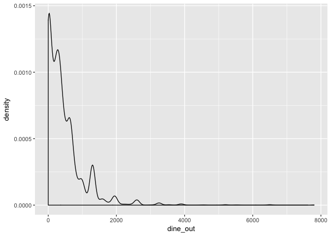
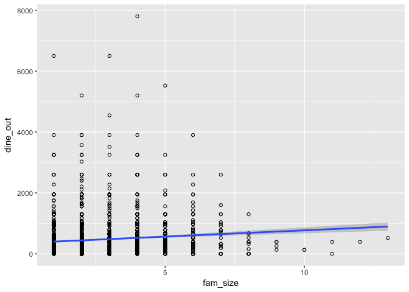
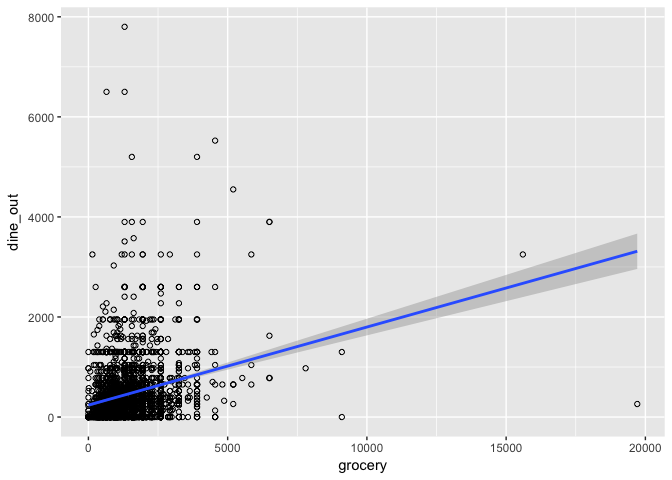
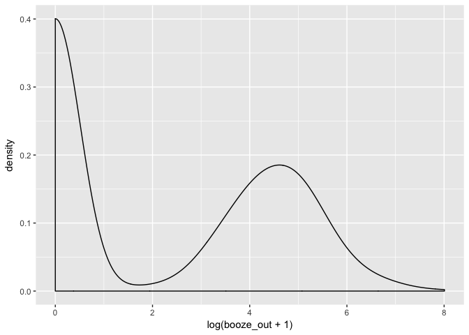
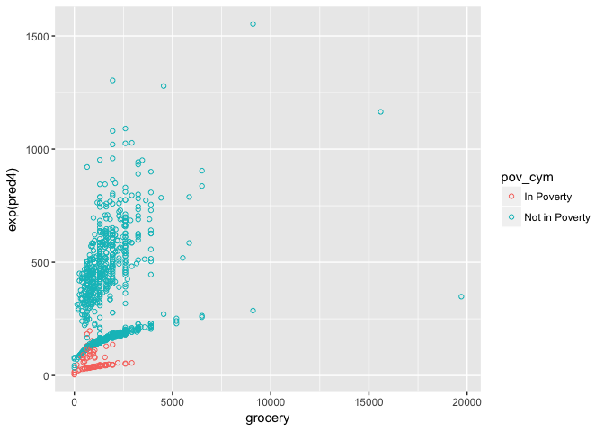
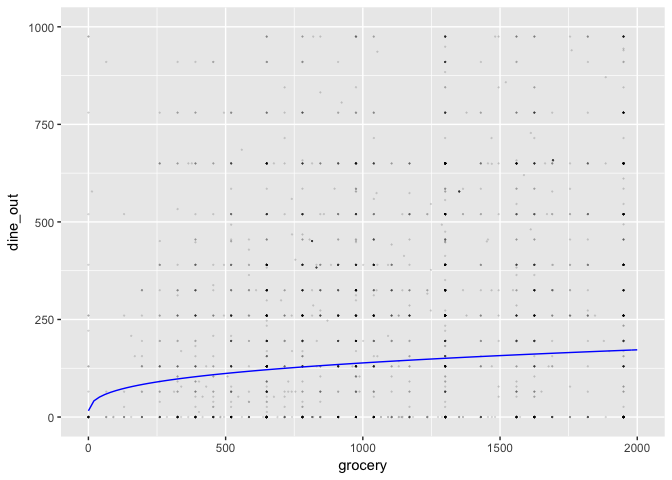
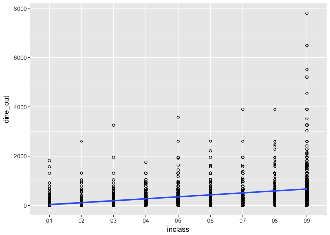
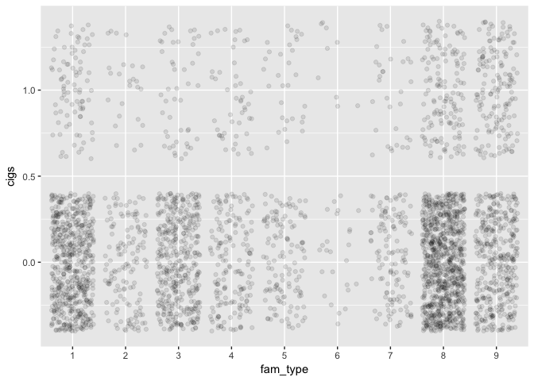

Using Regression for Prediction
================

Overview
--------

So far, we've been using just the simple mean to make predictions. Today, we'll continue using the simple mean to make predictions, but now in a complicated way. Before, when we calculated conditional means, we did so in certain "groupings" of variables. When we run linear regression, we no longer need to do so. Instead, linear regression allows us to calculate the conditional mean of the outcome at *every* value of the predictor. If the predictor takes on just a few values, then that's the number of conditional means that will be calculated. If the predictor is continuous and takes on a large number of values, we'll still be able to calculate the conditional mean at every one of those values.

The model we posit for regression is as follows:

*Y* = *β*<sub>0</sub> + *β*<sub>1</sub>*x*<sub>1</sub> + *β*<sub>2</sub>*x*<sub>2</sub> + ...*β*<sub>*k*</sub>*x*<sub>*k*</sub> + *ϵ*

It's just a linear, additive model. Y increases or decreases as a function of x, with multiple x's included. *ϵ* is the extent to which an individual value is above or below the line created.

Let's say that you've got some consumer data and you want to target those families that are likely to spend between $100and $500 a month on dining out. We would need to be able to predict which families would spend in that range based on observable characteristics like family size, income and family type.

We're going to be working with expenditure data from the 2012 administration of the consumer expenditure survey. The first bit of code gets the libraries we need, the data we need, and opens up a codebook for the data.

    ## Loading tidyverse: ggplot2
    ## Loading tidyverse: tibble
    ## Loading tidyverse: tidyr
    ## Loading tidyverse: readr
    ## Loading tidyverse: purrr
    ## Loading tidyverse: dplyr

    ## Conflicts with tidy packages ----------------------------------------------

    ## filter(): dplyr, stats
    ## lag():    dplyr, stats

Bivariate regression
--------------------

Our first dependent variable will be dining out. Let's take a look at that variable:

``` r
summary(cex$dine_out)
```

    ##    Min. 1st Qu.  Median    Mean 3rd Qu.    Max. 
    ##     0.0    65.0   325.0   462.6   650.0  7800.0

``` r
gg<-ggplot(cex,aes(x=dine_out))
gg<-gg+geom_histogram()
gg
```

    ## `stat_bin()` using `bins = 30`. Pick better value with `binwidth`.


``` r
gg<-ggplot(cex,aes(x=dine_out))
gg<-gg+geom_density()
gg
```



Because this variable is pretty non-normally distributed, we may want to think about transforming it. For now, let's just work with it as-is. Let's see if people with bigger families spend more on dining out more than those with smaller families. Before, we would have calculated the conditional mean at every level of family size, or in certain groupings of family size. With regression, we simply specify the relationship.

``` r
#Model 1: simple bivariate regression

mod1<-lm(dine_out~fam_size,data=cex) #outcome on left, predictor on right 

summary(mod1)
```

    ## 
    ## Call:
    ## lm(formula = dine_out ~ fam_size, data = cex)
    ## 
    ## Residuals:
    ##    Min     1Q Median     3Q    Max 
    ## -812.3 -376.6 -140.4  167.2 7276.0 
    ## 
    ## Coefficients:
    ##             Estimate Std. Error t value Pr(>|t|)    
    ## (Intercept)  359.228     19.166  18.743  < 2e-16 ***
    ## fam_size      41.192      6.531   6.307 3.21e-10 ***
    ## ---
    ## Signif. codes:  0 '***' 0.001 '**' 0.01 '*' 0.05 '.' 0.1 ' ' 1
    ## 
    ## Residual standard error: 580.1 on 3412 degrees of freedom
    ## Multiple R-squared:  0.01152,    Adjusted R-squared:  0.01124 
    ## F-statistic: 39.78 on 1 and 3412 DF,  p-value: 3.205e-10

``` r
confint(mod1)
```

    ##                 2.5 %    97.5 %
    ## (Intercept) 321.64952 396.80727
    ## fam_size     28.38684  53.99642

``` r
g1<-ggplot(cex, aes(x=fam_size,y=dine_out))+ #specify data and x and y
           geom_point(shape=1)+ #specify points
           geom_smooth(method=lm) #ask for lm line
g1
```



``` r
cex<-cex%>%mutate(pred1=predict(mod1)) #predict using data in memory
 
rmse_1<-with(cex, rmse(dine_out,pred1)) ; rmse_1
```

    ## [1] 579.9798

``` r
mod1a<-lm(dine_out~inclass,data=cex); summary(mod1a)
```

    ## 
    ## Call:
    ## lm(formula = dine_out ~ inclass, data = cex)
    ## 
    ## Residuals:
    ##    Min     1Q Median     3Q    Max 
    ## -751.4 -299.2 -103.4  155.6 7048.6 
    ## 
    ## Coefficients:
    ##             Estimate Std. Error t value Pr(>|t|)    
    ## (Intercept)  207.278     47.208   4.391 1.16e-05 ***
    ## inclass02     24.095     66.637   0.362   0.7177    
    ## inclass03     -9.634     59.030  -0.163   0.8704    
    ## inclass04     27.098     58.765   0.461   0.6447    
    ## inclass05     95.998     54.926   1.748   0.0806 .  
    ## inclass06    139.306     55.328   2.518   0.0119 *  
    ## inclass07    169.940     55.704   3.051   0.0023 ** 
    ## inclass08    252.920     53.007   4.771 1.91e-06 ***
    ## inclass09    544.090     50.010  10.880  < 2e-16 ***
    ## ---
    ## Signif. codes:  0 '***' 0.001 '**' 0.01 '*' 0.05 '.' 0.1 ' ' 1
    ## 
    ## Residual standard error: 544.4 on 3405 degrees of freedom
    ## Multiple R-squared:  0.1313, Adjusted R-squared:  0.1293 
    ## F-statistic: 64.33 on 8 and 3405 DF,  p-value: < 2.2e-16

What this shows is that as family size increases, the amount spent on dining out increases. For every additional family member, an additional $41 is predicted to be spent on dining out. The rmse of 580 gives us a sense of how wrong the model tends to be when using just this one predictor.

*Quick Exercise* Run a regression using a different predictor. Calculate rmse and see if you can beat my score.

Multiple Regression.
--------------------

Okay, so we can see that this is somewhat predictive, but we can do better. Let's add in a second variable: whether or not the family is below the poverty line.

``` r
#Part 2: Multiple regression

mod2<-lm(dine_out~fam_size+
           pov_cym, #can only take on two values
          data=cex)

summary(mod2) 
```

    ## 
    ## Call:
    ## lm(formula = dine_out ~ fam_size + pov_cym, data = cex)
    ## 
    ## Residuals:
    ##    Min     1Q Median     3Q    Max 
    ## -846.3 -333.2 -138.2  136.3 7232.0 
    ## 
    ## Coefficients:
    ##                       Estimate Std. Error t value Pr(>|t|)    
    ## (Intercept)            110.098     29.354   3.751 0.000179 ***
    ## fam_size                39.756      6.419   6.194 6.58e-10 ***
    ## pov_cymNot in Poverty  298.869     27.011  11.065  < 2e-16 ***
    ## ---
    ## Signif. codes:  0 '***' 0.001 '**' 0.01 '*' 0.05 '.' 0.1 ' ' 1
    ## 
    ## Residual standard error: 570.1 on 3411 degrees of freedom
    ## Multiple R-squared:  0.04577,    Adjusted R-squared:  0.04521 
    ## F-statistic: 81.81 on 2 and 3411 DF,  p-value: < 2.2e-16

``` r
cex<-cex%>%mutate(pred2=predict(mod2))

rmse_2<-with(cex,rmse(dine_out,pred2));rmse_2
```

    ## [1] 569.8434

So, those who are in poverty spend less on dining out. Alert the media!

*Quick Exercise* Add another variable to your model from above and see what difference it makes. How is your RMSE?

Maybe it's the case that those who spend more on groceries dine out less. Let's find out:

``` r
#Model 3: predicting dining out using other variables and grocery spending

mod3<-lm(dine_out~
           fam_size+
           pov_cym+
           grocery,
           data=cex)

summary(mod3)
```

    ## 
    ## Call:
    ## lm(formula = dine_out ~ fam_size + pov_cym + grocery, data = cex)
    ## 
    ## Residuals:
    ##     Min      1Q  Median      3Q     Max 
    ## -2877.8  -324.2  -125.3   138.4  7322.3 
    ## 
    ## Coefficients:
    ##                        Estimate Std. Error t value Pr(>|t|)    
    ## (Intercept)            52.22319   28.99130   1.801   0.0717 .  
    ## fam_size               -1.98415    7.03297  -0.282   0.7779    
    ## pov_cymNot in Poverty 245.87877   26.67362   9.218   <2e-16 ***
    ## grocery                 0.14429    0.01105  13.062   <2e-16 ***
    ## ---
    ## Signif. codes:  0 '***' 0.001 '**' 0.01 '*' 0.05 '.' 0.1 ' ' 1
    ## 
    ## Residual standard error: 556.4 on 3410 degrees of freedom
    ## Multiple R-squared:  0.09124,    Adjusted R-squared:  0.09044 
    ## F-statistic: 114.1 on 3 and 3410 DF,  p-value: < 2.2e-16

``` r
g2<-ggplot(cex, aes(x=grocery,y=dine_out))+
           geom_point(shape=1)+ 
           geom_smooth(method=lm)
g2
```



``` r
cex<-cex%>%mutate(pred3=predict(mod3))

rmse_3<-with(cex,rmse(dine_out,pred3));rmse_3
```

    ## [1] 556.101

Hmm, what happened here?

*Quick Exercise* Use a subset of the cex data with reasonable bounds on both dining out and grocery expenditures. See if the results hold.

Transformations
---------------

The big issue as you can see with this data is that the outcome variable isn't normally distributed: most people spend very little on dining out, while some people spend quite a lot. In situations like this, which are VERY common when dealing with monetary values, we want to take the natural log of the outcome variable. A natural log is the power by which we would have to raise *e*, Euler's constant, to be that value: *e*<sup>*l**n*(*x*)</sup> = *x*, or *l**n*(*e*<sup>*x*</sup>)=*x*.

Economists just basically take the natural log of everything that's denominated in dollar terms, which you probably should do as well. You'll notice in the equations below that I specify the `log()` of both dining out and grocery spending.

``` r
#Part 4: Working with transformations
mod4<-lm(log(dine_out+1)~ #log of dining out, plus one for zeros
           +log(grocery+1)+ #log of groceries, plus one again
           pov_cym+ #poverty
           fam_size+#family size
           log(booze_out+1) 
         ,data=cex, na.action = "na.exclude")

gg<-ggplot(cex,aes(x=log(booze_out+1)))
gg<-gg+geom_density()
gg
```

    ## Warning: Removed 2196 rows containing non-finite values (stat_density).



``` r
summary(mod4)
```

    ## 
    ## Call:
    ## lm(formula = log(dine_out + 1) ~ +log(grocery + 1) + pov_cym + 
    ##     fam_size + log(booze_out + 1), data = cex, na.action = "na.exclude")
    ## 
    ## Residuals:
    ##     Min      1Q  Median      3Q     Max 
    ## -7.1537 -0.2717  0.4846  1.1087  5.2133 
    ## 
    ## Coefficients:
    ##                       Estimate Std. Error t value Pr(>|t|)    
    ## (Intercept)            1.42436    0.50332   2.830  0.00473 ** 
    ## log(grocery + 1)       0.31284    0.07515   4.163 3.37e-05 ***
    ## pov_cymNot in Poverty  1.28893    0.20427   6.310 3.91e-10 ***
    ## fam_size               0.02294    0.04431   0.518  0.60474    
    ## log(booze_out + 1)     0.25523    0.02414  10.573  < 2e-16 ***
    ## ---
    ## Signif. codes:  0 '***' 0.001 '**' 0.01 '*' 0.05 '.' 0.1 ' ' 1
    ## 
    ## Residual standard error: 1.971 on 1213 degrees of freedom
    ##   (2196 observations deleted due to missingness)
    ## Multiple R-squared:  0.142,  Adjusted R-squared:  0.1391 
    ## F-statistic: 50.17 on 4 and 1213 DF,  p-value: < 2.2e-16

``` r
cex<-cex%>%mutate(pred4=predict(mod4))

## Getting set up for rmse function
compare_data<-data.frame(cex$dine_out,cex$pred4)%>%filter(is.na(cex.pred4)==FALSE)
names(compare_data)<-c("dine_out","pred4")

rmse_4<-with(compare_data,exp(rmse(log(dine_out+1),pred4)));rmse_4
```

    ## [1] 7.149152

``` r
g4<-ggplot(cex, aes(x=grocery,y=exp(pred4),color=pov_cym))
g4<-g4+geom_point(shape=1)

g4
```

    ## Warning: Removed 2196 rows containing missing values (geom_point).



``` r
# Function defined by coefficients

fun_mod4<-function(x) exp(mod4$coefficients[1]+ 
                          (mod4$coefficients[2]*log(x+1))+
                          (mod4$coefficients[3]*1)+
                          (mod4$coefficients[4]*mean(cex$fam_size,na.rm=TRUE))  
                          ) 

g4a<-ggplot(cex,aes(x=grocery,y=dine_out))
g4a<-g4a+geom_point(alpha=.1,size=.1)
g4a<-g4a+stat_function(fun = fun_mod4,color="blue")+xlim(0,2000)+ylim(0,1000)
g4a
```

    ## Warning: Removed 875 rows containing missing values (geom_point).



When calculating RMSE, I need to work with it in log format. The `prediction` command will give me back a prediction in log format as well. I take the difference between the two in log format, then exponentiate using the `exp` command, which means raising *e* to the power of *x*, *e*<sup>*x*</sup>.

``` r
#Part 5: Adding income 
mod5<-lm(log(dine_out+1)~
           +log(grocery+1)+
           pov_cym+
           fam_size+
           inclass
         ,data=cex)

summary(mod5)
```

    ## 
    ## Call:
    ## lm(formula = log(dine_out + 1) ~ +log(grocery + 1) + pov_cym + 
    ##     fam_size + inclass, data = cex)
    ## 
    ## Residuals:
    ##     Min      1Q  Median      3Q     Max 
    ## -6.1337 -0.5263  0.7961  1.5812  5.6117 
    ## 
    ## Coefficients:
    ##                       Estimate Std. Error t value Pr(>|t|)    
    ## (Intercept)            1.61025    0.35973   4.476 7.84e-06 ***
    ## log(grocery + 1)       0.30301    0.05044   6.007 2.09e-09 ***
    ## pov_cymNot in Poverty  0.37139    0.20602   1.803 0.071519 .  
    ## fam_size              -0.11940    0.03235  -3.691 0.000227 ***
    ## inclass02              0.06830    0.29660   0.230 0.817881    
    ## inclass03             -0.39539    0.27884  -1.418 0.156293    
    ## inclass04             -0.18622    0.30359  -0.613 0.539646    
    ## inclass05              0.34456    0.31007   1.111 0.266541    
    ## inclass06              0.79384    0.32667   2.430 0.015145 *  
    ## inclass07              0.85767    0.33175   2.585 0.009772 ** 
    ## inclass08              1.09071    0.32586   3.347 0.000825 ***
    ## inclass09              1.94051    0.32208   6.025 1.87e-09 ***
    ## ---
    ## Signif. codes:  0 '***' 0.001 '**' 0.01 '*' 0.05 '.' 0.1 ' ' 1
    ## 
    ## Residual standard error: 2.421 on 3402 degrees of freedom
    ## Multiple R-squared:  0.1378, Adjusted R-squared:  0.135 
    ## F-statistic: 49.42 on 11 and 3402 DF,  p-value: < 2.2e-16

``` r
cex<-cex%>%mutate(pred5=predict(mod5))

rmse_5<-with(cex,exp(rmse(log(dine_out+1),pred5)));rmse_5
```

    ## [1] 11.20439

``` r
g5<-ggplot(cex, aes(x=inclass,y=dine_out,group=1))+
           geom_point(shape=1)+
           geom_smooth(method=lm)
g5
```



Testing and Training
--------------------

The essence of prediction is discovering the extent to which our models can predict outcomes for data that *does not come from our sample*. Many times this process is temporal. We fit a model to data from one time period, then take predictors from a subsequent time period to come up with a prediction in the future. For instance, we might use data on team performance to predict the likely winners and losers for upcoming soccer games.

This process does not have to be temporal. We can also have data that is out of sample because it hadn't yet been collected when our first data was collected, or we can also have data that is out of sample because we designated it as out of sample.

The data that is used to generate our predictions is known as *training* data. The idea is that this is the data used to train our model, to let it know what the relationship is between our predictors and our outcome. So far, we have only worked with training data.

That data that is used to validate our predictions is known as *testing* data. With testing data, we take our trained model and see how good it is at predicting outcomes using out of sample data.

One very simple approach to this would be to cut our data in half. We could then train our model on half the data, then test it on the other half. This would tell us whether our measure of model fit (e.g. rmse, auc) is similar or different when we apply our model to out of sample data. That's what we've done today: we have only been working with half of our data.

Model 5 is looking pretty good, but let's see how it does using our testing data-- the half that wasn't used to train our model.

``` r
load("cex_test.Rdata")

rmse_5_test<-exp(rmse(log(cex_test$dine_out+1),cex$pred5))

rmse_5;rmse_5_test
```

    ## [1] 11.20439

    ## [1] 16.47113

Why is the value from the testing dataset so much larger?

*Quick exercise*

What's the rmse for your model when comparing it with the testing data?

Regression using a binary outcome
---------------------------------

You can also run a regression using a binary variable. Let's recode and then use our cigarettes variable to look at predictors of buying any cigarretes at all.

``` r
cex$cigs<-0
cex$cigs[cex$cigarettes>0]<-1

mod6<-lm(cigs~educ_ref+
           as.factor(ref_race)+
           inc_rank+
           as.factor(sex_ref),
         data=cex)

summary(mod6)
```

    ## 
    ## Call:
    ## lm(formula = cigs ~ educ_ref + as.factor(ref_race) + inc_rank + 
    ##     as.factor(sex_ref), data = cex)
    ## 
    ## Residuals:
    ##      Min       1Q   Median       3Q      Max 
    ## -0.67089 -0.22338 -0.14380 -0.05856  0.97050 
    ## 
    ## Coefficients:
    ##                      Estimate Std. Error t value Pr(>|t|)   
    ## (Intercept)           0.68501    0.21719   3.154  0.00163 **
    ## educ_ref10           -0.51028    0.21925  -2.327  0.02001 * 
    ## educ_ref11           -0.39660    0.21854  -1.815  0.06966 . 
    ## educ_ref12           -0.37101    0.21772  -1.704  0.08847 . 
    ## educ_ref13           -0.46594    0.21787  -2.139  0.03255 * 
    ## educ_ref14           -0.43834    0.21855  -2.006  0.04499 * 
    ## educ_ref15           -0.53254    0.21805  -2.442  0.01466 * 
    ## educ_ref16           -0.58866    0.21896  -2.688  0.00722 **
    ## educ_ref17           -0.55558    0.22170  -2.506  0.01227 * 
    ## as.factor(ref_race)2 -0.03201    0.02167  -1.477  0.13978   
    ## as.factor(ref_race)3  0.21296    0.10106   2.107  0.03517 * 
    ## as.factor(ref_race)4 -0.01412    0.03473  -0.407  0.68435   
    ## as.factor(ref_race)5  0.10270    0.10092   1.018  0.30895   
    ## as.factor(ref_race)6  0.04663    0.05795   0.805  0.42108   
    ## inc_rank             -0.05430    0.02683  -2.024  0.04307 * 
    ## as.factor(sex_ref)2  -0.02732    0.01422  -1.921  0.05487 . 
    ## ---
    ## Signif. codes:  0 '***' 0.001 '**' 0.01 '*' 0.05 '.' 0.1 ' ' 1
    ## 
    ## Residual standard error: 0.376 on 2844 degrees of freedom
    ##   (554 observations deleted due to missingness)
    ## Multiple R-squared:  0.04637,    Adjusted R-squared:  0.04134 
    ## F-statistic: 9.219 on 15 and 2844 DF,  p-value: < 2.2e-16

``` r
g4<-ggplot(cex,aes(x=fam_type,y=cigs,group=1))+
  geom_jitter(alpha=.1)

g4
```



Thinking about regression for prediction
----------------------------------------

You MUST remember: correlation is not causation. All you can pick up on using this tool is associations, or common patterns. You can't know whether one thing causes another. Remember that the left hand side variable could just as easily be on the right hand side.
