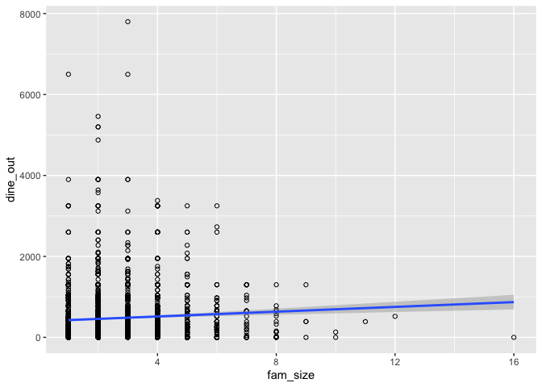
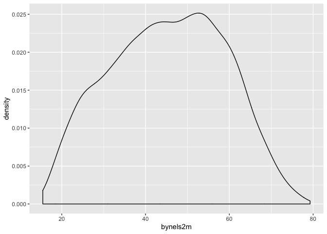
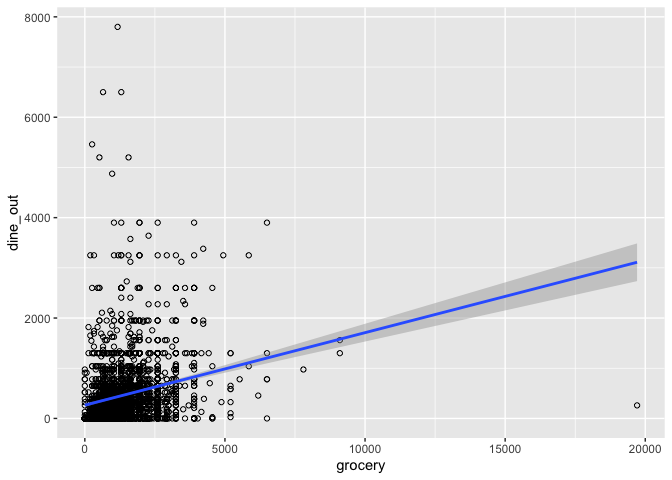

Using Regression for Prediction
================

## Overview

So far, we’ve been using just the simple mean to make predictions.
Today, we’ll continue using the simple mean to make predictions, but now
in a complicated way. Before, when we calculated conditional means, we
did so in certain “groupings” of variables. When we run linear
regression, we no longer need to do so. Instead, linear regression
allows us to calculate the conditional mean of the outcome at *every*
value of the predictor. If the predictor takes on just a few values,
then that’s the number of conditional means that will be calculated. If
the predictor is continuous and takes on a large number of values,
we’statll still be able to calculate the conditional mean at every one
of those values.

The model we posit for regression is as follows:

\[Y=\beta_0+\beta_1 x_1 +\beta_2 x_2+ ... \beta_k x_k + \epsilon\]

It’s just a linear, additive model. Y increases or decreases as a
function of x, with multiple x’s included. \(\epsilon\) is the extent to
which an individual value is above or below the line created.

Let’s say that you’ve got some student data and you want to target those
students that may struggle in math. The intervention could be targeted
based on what we know about students, much of which reflects broader
inequalities in our education system, such as the relationship between
SES and parental education and test scores. By intervening early we may
help to reduce those inequalities.

We’re going to be working with data on high school students from the
Educational Longitudinal Study. Our goal will be to predict their math
scores based on student
    characteristics.

    ## ── Attaching packages ───────────────────────────────────── tidyverse 1.2.1 ──

    ## ✔ ggplot2 3.2.1     ✔ purrr   0.3.2
    ## ✔ tibble  2.1.3     ✔ dplyr   0.8.3
    ## ✔ tidyr   1.0.0     ✔ stringr 1.4.0
    ## ✔ readr   1.3.1     ✔ forcats 0.4.0

    ## ── Conflicts ──────────────────────────────────────── tidyverse_conflicts() ──
    ## ✖ dplyr::filter() masks stats::filter()
    ## ✖ dplyr::lag()    masks stats::lag()

    ## 
    ## Attaching package: 'ModelMetrics'

    ## The following object is masked from 'package:base':
    ## 
    ##     kappa

    ## 
    ## Attaching package: 'modelr'

    ## The following objects are masked from 'package:ModelMetrics':
    ## 
    ##     mae, mse, rmse

The ELS dataset is called `els_train`. I’ll explain the “train” part in
a bit– it refers to a “training” dataset.

``` r
load("els_train.RData")
```

## Bivariate regression

Our dependent variable will be math scores, stored in this dataset as
`bynels2m`. Let’s take a look at this variable

``` r
els_train%>%summarize(mean(bynels2m,na.rm=TRUE))
```

    ## # A tibble: 1 x 1
    ##   `mean(bynels2m, na.rm = TRUE)`
    ##                            <dbl>
    ## 1                           45.3

``` r
gg<-ggplot(els_train,aes(x=bynels2m))
gg<-gg+geom_histogram()
gg
```

    ## `stat_bin()` using `bins = 30`. Pick better value with `binwidth`.

    ## Warning: Removed 164 rows containing non-finite values (stat_bin).

<!-- -->

``` r
gg<-ggplot(els_train,aes(x=bynels2m))
gg<-gg+geom_density()
gg
```

    ## Warning: Removed 164 rows containing non-finite values (stat_density).

<!-- -->

This variable has a nice symmetric distribution. It looks approximately
normal, which will help in interpreting the results.

``` r
#Model 1: simple bivariate regression

mod1<-lm(bynels2m~byses1,data=els_train) #outcome on left, predictor on right 

summary(mod1)
```

    ## 
    ## Call:
    ## lm(formula = bynels2m ~ byses1, data = els_train)
    ## 
    ## Residuals:
    ##     Min      1Q  Median      3Q     Max 
    ## -39.849  -8.930   0.375   9.052  39.206 
    ## 
    ## Coefficients:
    ##             Estimate Std. Error t value Pr(>|t|)    
    ## (Intercept)  44.9912     0.1409  319.20   <2e-16 ***
    ## byses1        8.1366     0.1893   42.97   <2e-16 ***
    ## ---
    ## Signif. codes:  0 '***' 0.001 '**' 0.01 '*' 0.05 '.' 0.1 ' ' 1
    ## 
    ## Residual standard error: 12.31 on 7640 degrees of freedom
    ##   (502 observations deleted due to missingness)
    ## Multiple R-squared:  0.1946, Adjusted R-squared:  0.1945 
    ## F-statistic:  1847 on 1 and 7640 DF,  p-value: < 2.2e-16

``` r
confint(mod1)
```

    ##                 2.5 %    97.5 %
    ## (Intercept) 44.714929 45.267526
    ## byses1       7.765411  8.507759

``` r
g1<-ggplot(els_train, aes(x=byses1,y=bynels2m))+ #specify data and x and y
           geom_point(shape=1)+ #specify points
           geom_smooth(method=lm) #ask for lm line
g1
```

    ## Warning: Removed 502 rows containing non-finite values (stat_smooth).

    ## Warning: Removed 502 rows containing missing values (geom_point).

<!-- -->

``` r
els_train<-els_train%>%add_predictions(mod1)%>%rename(pred1=pred) #predict using data in memory
 
## RMSE
rmse_1<-modelr::rmse(mod1,els_train);rmse_1
```

    ## [1] 12.30348

What this shows is that as socio-economic status increases, math scores
are predicted to increase. For every one unit increase in SES, math
scores are predicted to increase by $8. The rmse of 12 gives us a sense
of how wrong the model tends to be when using just this one predictor.

*Quick Exercise* Run a regression using a different predictor. Calculate
rmse and see if you can beat my score.

## Multiple Regression.

Okay, so we can see that this is somewhat predictive, but we can do
better. Let’s add in a second variable: the parent’s level of education.

``` r
#Part 2: Multiple regression

mod2<-lm(bynels2m~as.factor(bypared)+
           byses1,
          data=els_train)

summary(mod2) 
```

    ## 
    ## Call:
    ## lm(formula = bynels2m ~ as.factor(bypared) + byses1, data = els_train)
    ## 
    ## Residuals:
    ##     Min      1Q  Median      3Q     Max 
    ## -38.782  -9.033   0.339   9.010  38.715 
    ## 
    ## Coefficients:
    ##                     Estimate Std. Error t value Pr(>|t|)    
    ## (Intercept)          46.5216     0.6881  67.609  < 2e-16 ***
    ## as.factor(bypared)2  -0.5464     0.6733  -0.812 0.417093    
    ## as.factor(bypared)3  -2.5776     0.7780  -3.313 0.000927 ***
    ## as.factor(bypared)4  -0.8523     0.8024  -1.062 0.288181    
    ## as.factor(bypared)5  -1.6261     0.7996  -2.034 0.042018 *  
    ## as.factor(bypared)6  -2.0766     0.8301  -2.502 0.012383 *  
    ## as.factor(bypared)7  -1.5467     0.9682  -1.598 0.110172    
    ## as.factor(bypared)8  -3.5970     1.1014  -3.266 0.001096 ** 
    ## byses1                8.9059     0.3350  26.584  < 2e-16 ***
    ## ---
    ## Signif. codes:  0 '***' 0.001 '**' 0.01 '*' 0.05 '.' 0.1 ' ' 1
    ## 
    ## Residual standard error: 12.29 on 7633 degrees of freedom
    ##   (502 observations deleted due to missingness)
    ## Multiple R-squared:  0.1975, Adjusted R-squared:  0.1966 
    ## F-statistic: 234.8 on 8 and 7633 DF,  p-value: < 2.2e-16

``` r
els_train<-els_train%>%add_predictions(mod2)%>%rename(pred2=pred)

rmse_2<-modelr::rmse(mod2,els_train); rmse_2
```

    ## [1] 12.28195

This finding reflects the basic inequity in our education system: lower
income students score lower on math scores. This holds true even if we
control for parental education.

*Quick Exercise* Add another variable to your model from above and see
what difference it makes. How is your RMSE?

## Transformations

The `byses` variable is a little hard to interpret. It’s on a scale from
-2 to 2, which you should remember as the scale for a standardized
variable or Z score. Let’s transform it to be on a percentile scale from
0-100.

``` r
els_train<-els_train%>%mutate(byses_p=percent_rank(byses1)*100)
els_train%>%summarize(mean(byses_p,na.rm=TRUE))
```

    ## # A tibble: 1 x 1
    ##   `mean(byses_p, na.rm = TRUE)`
    ##                           <dbl>
    ## 1                          49.8

``` r
mod3<-lm(bynels2m~byses_p+
         as.factor(bypared),
         data=els_train
         );summary(mod3)
```

    ## 
    ## Call:
    ## lm(formula = bynels2m ~ byses_p + as.factor(bypared), data = els_train)
    ## 
    ## Residuals:
    ##     Min      1Q  Median      3Q     Max 
    ## -38.857  -9.055   0.281   9.180  39.208 
    ## 
    ## Coefficients:
    ##                      Estimate Std. Error t value Pr(>|t|)    
    ## (Intercept)         34.547239   0.573118  60.279   <2e-16 ***
    ## byses_p              0.222994   0.008538  26.117   <2e-16 ***
    ## as.factor(bypared)2  0.798336   0.663053   1.204    0.229    
    ## as.factor(bypared)3 -1.174077   0.760833  -1.543    0.123    
    ## as.factor(bypared)4  0.471181   0.784935   0.600    0.548    
    ## as.factor(bypared)5 -0.396732   0.782402  -0.507    0.612    
    ## as.factor(bypared)6 -1.134680   0.814131  -1.394    0.163    
    ## as.factor(bypared)7 -0.299730   0.944575  -0.317    0.751    
    ## as.factor(bypared)8 -1.330383   1.052509  -1.264    0.206    
    ## ---
    ## Signif. codes:  0 '***' 0.001 '**' 0.01 '*' 0.05 '.' 0.1 ' ' 1
    ## 
    ## Residual standard error: 12.31 on 7633 degrees of freedom
    ##   (502 observations deleted due to missingness)
    ## Multiple R-squared:  0.1951, Adjusted R-squared:  0.1942 
    ## F-statistic: 231.3 on 8 and 7633 DF,  p-value: < 2.2e-16

This changes the coefficient AND its interpretation. Now, for every one
percent increase in SES, math scores are predicted to increase by 0.22.
Linear transformations will not change the statistical significance (t
value), but non linear transformations like the one we just did will, as
you can see. Does this change the RMSE?

``` r
rmse_3<-modelr::rmse(mod3,els_train)
```

It looks like it actually increases it a bit.

## Testing and Training

The essence of prediction is discovering the extent to which our models
can predict outcomes for data that *does not come from our sample*. Many
times this process is temporal. We fit a model to data from one time
period, then take predictors from a subsequent time period to come up
with a prediction in the future. For instance, we might use data on team
performance to predict the likely winners and losers for upcoming soccer
games.

This process does not have to be temporal. We can also have data that is
out of sample because it hadn’t yet been collected when our first data
was collected, or we can also have data that is out of sample because we
designated it as out of sample.

The data that is used to generate our predictions is known as *training*
data. The idea is that this is the data used to train our model, to let
it know what the relationship is between our predictors and our outcome.
So far, we have only worked with training data.

That data that is used to validate our predictions is known as *testing*
data. With testing data, we take our trained model and see how good it
is at predicting outcomes using out of sample data.

One very simple approach to this would be to cut our data in half. We
could then train our model on half the data, then test it on the other
half. This would tell us whether our measure of model fit (e.g. rmse,
auc) is similar or different when we apply our model to out of sample
data. That’s what we’ve done today: we have only been working with half
of our data– the training half.

The testing data (which is a random half of the original dataset) is
stored as `els_test`. Since we transformed a variable in the training
dataset, we’ll need to do the same in the testing dataset.

``` r
load("els_test.Rdata")
els_test<-els_test%>%mutate(byses_p=percent_rank(byses1)*100)
```

Now we can use the model we trained (model 3) on the testing data.

``` r
## Generate a prediction from the testing dataset
rmse_test_1<-modelr::rmse(mod1,els_test);rmse_test_1
```

    ## [1] 12.24225

``` r
rmse_test_2<-modelr::rmse(mod2,els_test);rmse_test_2
```

    ## [1] 12.24041

``` r
rmse_test_3<-modelr::rmse(mod3,els_test);rmse_test_3
```

    ## [1] 12.26706

Notice that this is different than the value for our training dataset.

## Thinking about regression for prediction

You MUST remember: correlation is not causation. All you can pick up on
using this tool is associations, or common patterns. You can’t know
whether one thing causes another. Remember that the left hand side
variable could just as easily be on the right hand side.
