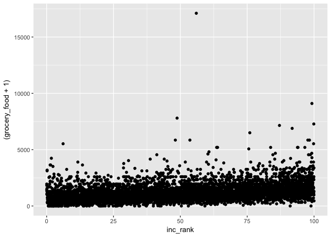
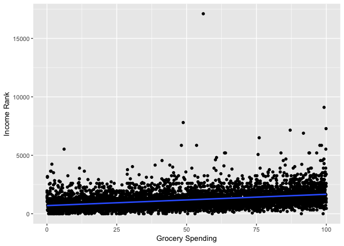
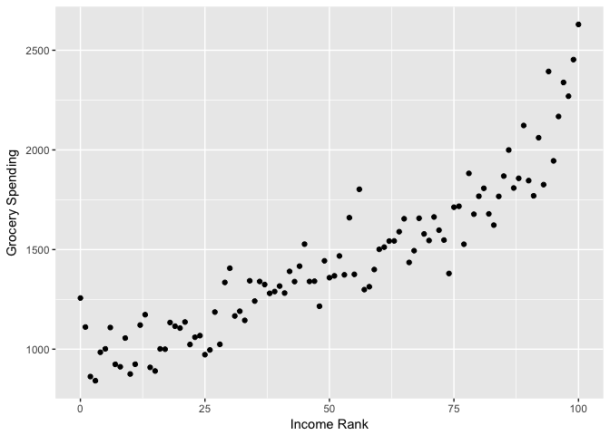
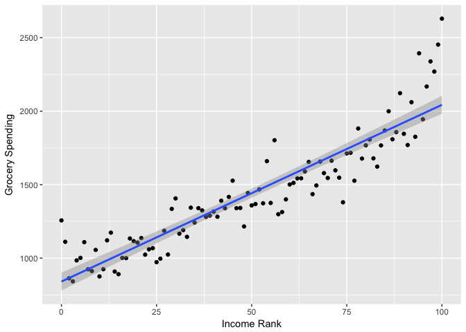
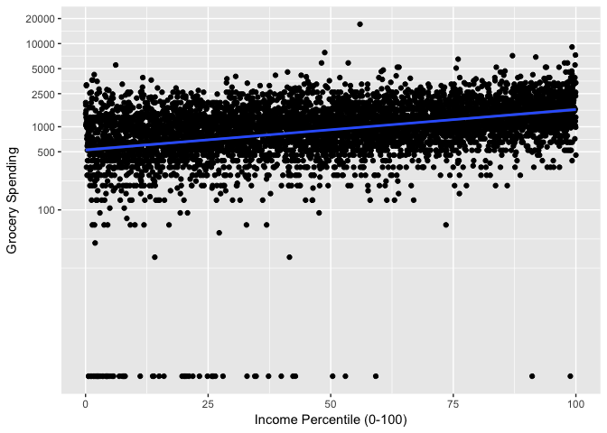
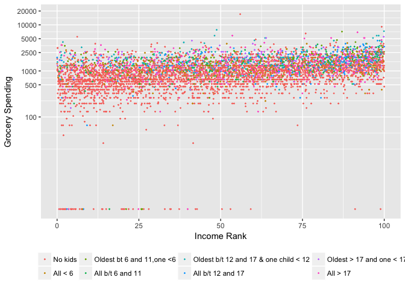
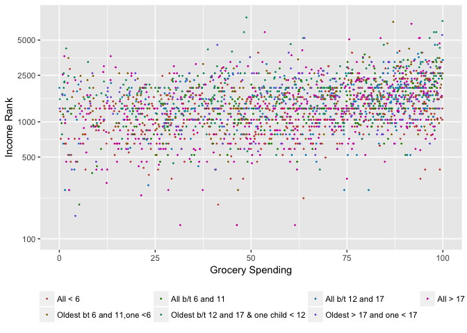
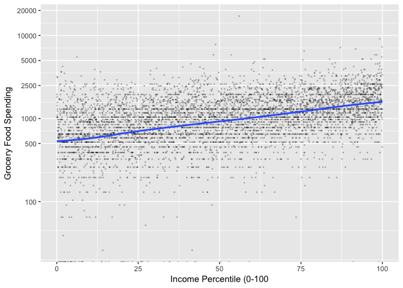
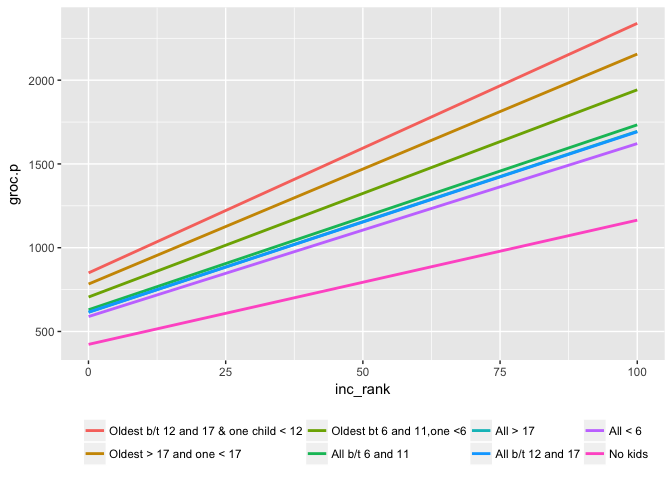
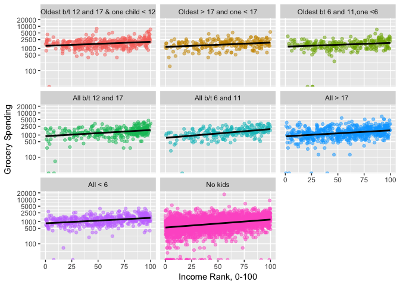

Scatterplots
================
Will Doyle

Scatterplots are the best way to present data that has a continuous response variable. When creating scatterplots, the idea is to show ALL of the data, and then show how your model is summarizing the relationships in that data.

Motivation
----------

Let's assume we have a grocery delivery service that we want to market to families that spend at least $1,000 per quarter on groceries. We have a consumer datset that includes information about family income, number of children in the family and some other characteristics. We want to use this to isolate families that are in the desired spending range.

Setup
-----

The code for today starts with the normal set of preliminaries, opening up the `cex.RData` dataset and creating a codebook.

    ## Loading tidyverse: ggplot2
    ## Loading tidyverse: tibble
    ## Loading tidyverse: tidyr
    ## Loading tidyverse: readr
    ## Loading tidyverse: purrr
    ## Loading tidyverse: dplyr

    ## Conflicts with tidy packages ----------------------------------------------

    ## filter(): dplyr, stats
    ## lag():    dplyr, stats

*Side Note: Factors*

Factors in R denote variables that encompass a set of mutually exclusive and exhaustive categories. When a factor is included in a regression, R will encode it as a series of dummy (binary) variables, one for each level of the factor. The coefficient for each level of the factor is relative to the reference (omitted) category. Let's run a regression of grocery food spending on age of children and see what we get.

``` r
## Get levels of childage right

cex<-cex%>%mutate(childage=fct_recode(f=childage,
                     "No kids"="0", 
"All < 6"="1",
"Oldest bt 6 and 11,one <6"="2",
"All b/t 6 and 11"="3",
 "Oldest b/t 12 and 17 & one child < 12"="4",
 "All b/t 12 and 17"="5",
 "Oldest > 17 and one < 17"="6",
 "All > 17 "="7"
))

with(cex, prop.table(table(childage)))
```

    ## childage
    ##                               No kids 
    ##                            0.59432583 
    ##                               All < 6 
    ##                            0.07429073 
    ##             Oldest bt 6 and 11,one <6 
    ##                            0.04270254 
    ##                      All b/t 6 and 11 
    ##                            0.03890026 
    ## Oldest b/t 12 and 17 & one child < 12 
    ##                            0.05849664 
    ##                     All b/t 12 and 17 
    ##                            0.05059959 
    ##              Oldest > 17 and one < 17 
    ##                            0.03816906 
    ##                             All > 17  
    ##                            0.10251536

``` r
#Conditional Means
cex%>%group_by(childage)%>%summarize(mean_groc=mean(grocery_food,na.tm=TRUE))
```

    ## # A tibble: 8 x 2
    ##                                childage mean_groc
    ##                                  <fctr>     <dbl>
    ## 1                               No kids  935.6083
    ## 2                               All < 6 1302.6535
    ## 3             Oldest bt 6 and 11,one <6 1640.4418
    ## 4                      All b/t 6 and 11 1441.6316
    ## 5 Oldest b/t 12 and 17 & one child < 12 1856.2825
    ## 6                     All b/t 12 and 17 1510.4711
    ## 7              Oldest > 17 and one < 17 1682.0000
    ## 8                             All > 17  1429.0756

``` r
#Regression
factor_mod<-lm(grocery_food~childage,data=cex);summary(factor_mod)
```

    ## 
    ## Call:
    ## lm(formula = grocery_food ~ childage, data = cex)
    ## 
    ## Residuals:
    ##     Min      1Q  Median      3Q     Max 
    ## -1856.3  -415.6  -131.9   272.6 16172.4 
    ## 
    ## Coefficients:
    ##                                               Estimate Std. Error t value
    ## (Intercept)                                     935.61      11.33   82.58
    ## childageAll < 6                                 367.05      33.99   10.80
    ## childageOldest bt 6 and 11,one <6               704.83      43.76   16.11
    ## childageAll b/t 6 and 11                        506.02      45.71   11.07
    ## childageOldest b/t 12 and 17 & one child < 12   920.67      37.85   24.32
    ## childageAll b/t 12 and 17                       574.86      40.45   14.21
    ## childageOldest > 17 and one < 17                746.39      46.12   16.18
    ## childageAll > 17                                493.47      29.54   16.70
    ##                                               Pr(>|t|)    
    ## (Intercept)                                     <2e-16 ***
    ## childageAll < 6                                 <2e-16 ***
    ## childageOldest bt 6 and 11,one <6               <2e-16 ***
    ## childageAll b/t 6 and 11                        <2e-16 ***
    ## childageOldest b/t 12 and 17 & one child < 12   <2e-16 ***
    ## childageAll b/t 12 and 17                       <2e-16 ***
    ## childageOldest > 17 and one < 17                <2e-16 ***
    ## childageAll > 17                                <2e-16 ***
    ## ---
    ## Signif. codes:  0 '***' 0.001 '**' 0.01 '*' 0.05 '.' 0.1 ' ' 1
    ## 
    ## Residual standard error: 722.3 on 6830 degrees of freedom
    ## Multiple R-squared:  0.1563, Adjusted R-squared:  0.1555 
    ## F-statistic: 180.8 on 7 and 6830 DF,  p-value: < 2.2e-16

``` r
#Predictions from model
print(factor_mod$coefficients[2:8]+factor_mod$coefficients[1])
```

    ##                               childageAll < 6 
    ##                                      1302.654 
    ##             childageOldest bt 6 and 11,one <6 
    ##                                      1640.442 
    ##                      childageAll b/t 6 and 11 
    ##                                      1441.632 
    ## childageOldest b/t 12 and 17 & one child < 12 
    ##                                      1856.283 
    ##                     childageAll b/t 12 and 17 
    ##                                      1510.471 
    ##              childageOldest > 17 and one < 17 
    ##                                      1682.000 
    ##                             childageAll > 17  
    ##                                      1429.076

The reference for the category (the excluded category) is families with no children. Each coefficient is in comparison to this category, indicating how much more or less families with children in each age group spend than families with no children on food groceries. Notice that in this case with no additional covariates, the intercept plus the coefficient for each group is exactly equal to the conditional mean for that group.

Bivariate Regression
--------------------

We begin with a simple model of grocery food spending as a function of income rank. As we found out last week, grocery food spending has a long right tail, and is a good candidate for a log transformation. We'll be using that log transformation throughout.

Our first step should be to plot the data. Today, we'll be using the `ggplot2` library, which is a highly functional implementation of what's known as the grammar of graphics. In a very small nutshell, the grammar of graphics refers to laying out a graphic in a series of layers. For our first scatterplot, we first specify the data that we'll be drawing on, then the "aesthetic" of the graphic, which will be based on our x and y variables from our regression. I then specify the first layer, which is a series of points defined by the intersection of the x and y variables.

``` r
#Plot Spending vs. Income
g1<-ggplot(data=cex,
           aes(x=inc_rank,y=(grocery_food+1))
           )

g1<-g1+geom_point() # Add points at x and y
g1
```

    ## Warning: Removed 1134 rows containing missing values (geom_point).



This first graphic shows the basic problem with the data, which is the highly non-normal shape of the outcome variable. No matter! We'll keep moving forward. The next line of code adds a layer with a regression line to the plot.

``` r
g1<-g1+geom_smooth(method="lm")
g1<-g1+xlab("Grocery Spending")+ylab("Income Rank")
g1
```

    ## Warning: Removed 1134 rows containing non-finite values (stat_smooth).

    ## Warning: Removed 1134 rows containing missing values (geom_point).



It's also really hard to see. We can use conditional means to help out with that problem. Let's get the average amount of grocery spending at every percentile level of `inc_rank`. Notice the use of `round` to get income percentiles that are at two digits only.

``` r
cex_sum<-cex%>%mutate(inc_rank_r=round(inc_rank))%>%group_by(inc_rank_r)%>%summarize(groc_mean=mean(grocery))

g1a<-ggplot(cex_sum,aes(x=inc_rank_r,y=groc_mean))

g1a<-g1a+geom_point()

g1a<-g1a+xlab("Grocery Spending")+ylab("Income Rank")

g1a
```

    ## Warning: Removed 1 rows containing missing values (geom_point).



Better! Simplifying data can help.

We can add a regression line to this simpler data

``` r
g1a<-g1a+geom_smooth(method=lm) # Add a line
g1a
```

    ## Warning: Removed 1 rows containing non-finite values (stat_smooth).

    ## Warning: Removed 1 rows containing missing values (geom_point).



As we figured out in class last week, a simple line plot doesn't really do it. We need to transform that dependent variable. Luckily, ggplot has this kind of transformation built in.

``` r
g1<-ggplot(data=cex,
           aes(x=inc_rank,y=(grocery_food+1))
           )
# Set nice looking breaks, the ones used by ggplot for log transform typically don't work
my.breaks=c(0,100,500,1000,2500,5000,10000,20000)
#Change the scale 
g1<-g1+scale_y_continuous(trans="log",breaks=my.breaks)
g1<-g1+geom_point() # Add points
g1<-g1+geom_smooth(method=lm)  #Add a Line
g1<-g1+ylab("Grocery Spending")+xlab("Income Percentile (0-100)") #Nice labels
g1
```

    ## Warning: Removed 1134 rows containing non-finite values (stat_smooth).

    ## Warning: Removed 1134 rows containing missing values (geom_point).



Notice how different the steps are on the y axis now. But this shows that our line actually fits the data much better once we work on the log scale. We're now ready to go ahead and run our first model based on what we've learned.

``` r
#First model

m1<-lm(log(grocery_food+1)~inc_rank,data=cex);summary(m1)
```

    ## 
    ## Call:
    ## lm(formula = log(grocery_food + 1) ~ inc_rank, data = cex)
    ## 
    ## Residuals:
    ##     Min      1Q  Median      3Q     Max 
    ## -7.3716 -0.3002  0.0714  0.4495  2.8556 
    ## 
    ## Coefficients:
    ##              Estimate Std. Error t value Pr(>|t|)    
    ## (Intercept) 6.2657005  0.0230229  272.15   <2e-16 ***
    ## inc_rank    0.0111849  0.0003982   28.09   <2e-16 ***
    ## ---
    ## Signif. codes:  0 '***' 0.001 '**' 0.01 '*' 0.05 '.' 0.1 ' ' 1
    ## 
    ## Residual standard error: 0.8775 on 5702 degrees of freedom
    ##   (1134 observations deleted due to missingness)
    ## Multiple R-squared:  0.1215, Adjusted R-squared:  0.1214 
    ## F-statistic: 788.9 on 1 and 5702 DF,  p-value: < 2.2e-16

*Quick Exercise* Create a similar graphic, but this time use other store expenditures as the dependent variable. Run a regression with store expenditures as the dv and income rank as the only independent variable.

Multiple Regression
-------------------

The next step is to add covariates. I'll be working with the variable `childage` which is a factor that summarizes the ages of kids in the family. I'm going to set the color of the markers by the `childage` factor.

``` r
g2<-ggplot(data=cex,
            aes(x=inc_rank,y=(grocery_food+1),
                color=childage #notice the color option
                ))

g2<-g2+scale_y_continuous(trans="log",breaks=my.breaks)
g2<-g2+geom_point(size=.25)
g2<-g2+theme(legend.position="bottom"  , legend.title = element_blank())
g2<-g2+xlab("Grocery Spending")+ylab("Income Rank")
g2
```

    ## Warning: Removed 1134 rows containing missing values (geom_point).



Our first graphic is a bit complex, but shows that those in the "0" category, with no kids, have consistently lower spending on groceries across income levels. So let's drop that group and see what the graphic looks like for those with at least one kid of any age.

``` r
g2a<-ggplot(data=filter(cex,as.character(cex$childage)!="No kids"),
            aes(x=inc_rank,y=(grocery_food+1),color=childage)
           )
g2a<-g2a+scale_y_continuous(trans="log",breaks=my.breaks,limits=c(100,8000)) #Changed overall scale
g2a<-g2a+geom_point(size=.25) 
g2a<-g2a+scale_colour_hue(l=50) #Darker palette
g2a<-g2a+theme(legend.position = "bottom" , legend.title = element_blank())
g2a<-g2a+xlab("Grocery Spending")+ylab("Income Rank")
g2a
```

    ## Warning: Removed 455 rows containing missing values (geom_point).



Notice the higher spending levels at every income level among those with children between 6 and 17.

``` r
#Model 2: with kids

mod2<-lm(log(grocery_food+1)~inc_rank+childage, data=cex,na.action=na.exclude);summary(mod2)
```

    ## 
    ## Call:
    ## lm(formula = log(grocery_food + 1) ~ inc_rank + childage, data = cex, 
    ##     na.action = na.exclude)
    ## 
    ## Residuals:
    ##     Min      1Q  Median      3Q     Max 
    ## -7.1023 -0.2740  0.0760  0.4065  3.0520 
    ## 
    ## Coefficients:
    ##                                                Estimate Std. Error t value
    ## (Intercept)                                   6.1644855  0.0228141 270.205
    ## inc_rank                                      0.0094850  0.0003958  23.967
    ## childageAll < 6                               0.3310502  0.0436714   7.580
    ## childageOldest bt 6 and 11,one <6             0.5116967  0.0565955   9.041
    ## childageAll b/t 6 and 11                      0.3977986  0.0580077   6.858
    ## childageOldest b/t 12 and 17 & one child < 12 0.6975020  0.0476091  14.651
    ## childageAll b/t 12 and 17                     0.3735577  0.0529915   7.049
    ## childageOldest > 17 and one < 17              0.6158860  0.0589702  10.444
    ## childageAll > 17                              0.3752501  0.0384561   9.758
    ##                                               Pr(>|t|)    
    ## (Intercept)                                    < 2e-16 ***
    ## inc_rank                                       < 2e-16 ***
    ## childageAll < 6                               4.00e-14 ***
    ## childageOldest bt 6 and 11,one <6              < 2e-16 ***
    ## childageAll b/t 6 and 11                      7.74e-12 ***
    ## childageOldest b/t 12 and 17 & one child < 12  < 2e-16 ***
    ## childageAll b/t 12 and 17                     2.01e-12 ***
    ## childageOldest > 17 and one < 17               < 2e-16 ***
    ## childageAll > 17                               < 2e-16 ***
    ## ---
    ## Signif. codes:  0 '***' 0.001 '**' 0.01 '*' 0.05 '.' 0.1 ' ' 1
    ## 
    ## Residual standard error: 0.8463 on 5695 degrees of freedom
    ##   (1134 observations deleted due to missingness)
    ## Multiple R-squared:  0.1838, Adjusted R-squared:  0.1826 
    ## F-statistic: 160.3 on 8 and 5695 DF,  p-value: < 2.2e-16

Now let's take a look at this model plotted against the actual data. I'm going to use the `alpha` setting to make the dots more transparent. I'm also going to make the dots smaller via the size specification.

``` r
cex<-cex%>%mutate(mod2_pred=exp(fitted(mod2)))

g3<-ggplot(cex,aes(x=inc_rank,y=grocery_food))
g3<-g3+geom_point(alpha=.2,size=.25)
g3<-g3+scale_y_continuous(trans="log",breaks=my.breaks)
g3<-g3+geom_smooth(data=cex,(aes(x=inc_rank,y=mod2_pred)))
g3<-g3+xlab("Income Percentile (0-100")+ylab("Grocery Food Spending")
g3
```

    ## Warning: Transformation introduced infinite values in continuous y-axis

    ## `geom_smooth()` using method = 'gam'

    ## Warning: Removed 1134 rows containing non-finite values (stat_smooth).

    ## Warning: Removed 1134 rows containing missing values (geom_point).



As we add more variables to the model, it can get more difficult to plot relationships. One very good option is to plot lines based on a hypothetical set of data. Below, I create a hypothetical set of data that include values of income across the range of income, and includes values for every level of `childage`.

``` r
#Prediction, then plotting

hypo.data<-data.frame(expand.grid(
          #range of income
          inc_rank=seq(min(cex$inc_rank,na.rm=TRUE),
                       max(cex$inc_rank,na.rm=TRUE),
                       length=100), 
          #All levels of childage
          childage=levels(cex$childage)                                     
                                      )
                          )
head(hypo.data)
```

    ##   inc_rank childage
    ## 1 0.020000  No kids
    ## 2 1.029899  No kids
    ## 3 2.039798  No kids
    ## 4 3.049697  No kids
    ## 5 4.059596  No kids
    ## 6 5.069495  No kids

Now, using my estimates from model 2, I predict what would happen to these hypothetical individuals. Once I've got my prediction, I transform it back out of the log scale into the "response" level of dollars.

``` r
#Predict using mod2 on hypothetical data
hypo.pred<-predict(mod2,
                   newdata=hypo.data,
                   interval="prediction",
                    se.fit=TRUE
                   )

hypo.data<-data.frame(hypo.data,hypo.pred$fit) #Add fit to the dataset
hypo.data$groc.p<-exp(hypo.data$fit) #exponentiate fit
hypo.data$groc.lwr<-exp(hypo.data$lwr) #exponentiate lower boundary
hypo.data$groc.upr<-exp(hypo.data$upr) #exponentiate upper boundary
head(hypo.data)
```

    ##   inc_rank childage      fit      lwr      upr   groc.p groc.lwr groc.upr
    ## 1 0.020000  No kids 6.164675 4.504910 7.824440 475.6467 90.46021 2500.986
    ## 2 1.029899  No kids 6.174254 4.514505 7.834003 480.2247 91.33234 2525.017
    ## 3 2.039798  No kids 6.183833 4.524099 7.843566 484.8468 92.21285 2549.280
    ## 4 3.049697  No kids 6.193412 4.533694 7.853130 489.5134 93.10181 2573.777
    ## 5 4.059596  No kids 6.202991 4.543287 7.862694 494.2249 93.99931 2598.511
    ## 6 5.069495  No kids 6.212569 4.552881 7.872258 498.9817 94.90542 2623.483

Now we can plot the result, using the `geom_smooth` layer to give us lines for every level of `childage`.

``` r
g4<-ggplot(data=hypo.data,aes(x=inc_rank,y=groc.p,color=fct_reorder(f=childage,-groc.p))) #notice color
g4<-g4+geom_smooth(method=lm,se=FALSE)
g4<-g4+theme(legend.position="bottom",legend.title = element_blank())
g4
```

 To show this in the data we can break it out for every type of child age grouping.

``` r
## Resort child age for graphic

cex<-cex%>%mutate(childage=fct_reorder(f=childage,-grocery_food))

g5<-ggplot(cex,aes(x=inc_rank,y=grocery_food,color=childage))
g5<-g5+geom_point(alpha=.5)
g5<-g5+geom_smooth(method="lm",color="black")
g5<-g5+facet_wrap(~childage,ncol=3)
g5<-g5+scale_y_continuous(trans="log",breaks=my.breaks)
g5<-g5+xlab("Income Rank, 0-100")+ylab("Grocery Spending")
g5<-g5+theme(legend.position="none") #Suppress legend, not needed

g5
```

    ## Warning: Transformation introduced infinite values in continuous y-axis

    ## Warning: Transformation introduced infinite values in continuous y-axis

    ## Warning: Removed 1190 rows containing non-finite values (stat_smooth).

    ## Warning: Removed 1134 rows containing missing values (geom_point).



*(Not so) Quick Exercise* Run a different model, this time using `fam_type` as a factor variable. Plot the estimated relationship between income rank and food spending for each family type.
