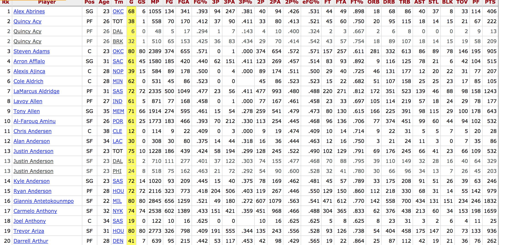

## Introduction

Many large web sites host a huge amount of information. This information is encoded and delivered on demand to the user within a web page, which is really just a markup language that a browser can understand. We can take this data and analyze it using R, via a variety of different means. Today we'll cover scraping web tables and interacting via Automated Programming Interfaces.

## Ethics and Responsiblity

Many of the tools we'll cover can be quite powerful ways to interact with data stored online and gather it for analysis. Because they're powerful, you need to be careful with them. In particular, try to request information in a way that will not burden the website owners. What constitutes a burden depends on the website. Google, Twitter, Facebook, all of the big websites have protections in place to guard against too many requests and have a huge amount of capacity for taking the requests they grant. Smaller websites may not have either. Always strive to be minimally intrusive: you're usually getting this data for free. 

## Ways of getting data from the web

We will cover several different ways you can get data from the web

1. Directly downloading web pages via the `url()` command. 
1. Scraping simple web tables via `read_html()` and `html_table()` command
1. Scraping complex web tables via `read_html()` and `html_nodes()`
1. Interacting with Application Programming Interfaces (APIs) via R libraries that have been designed as "wrappers" for these interfaces, like the awesome `acs` library and the `tigris` library for geographic shapes. 
1. Interacting with APIs directly, using the [Zillow API](https://www.zillow.com/howto/api/APIOverview.htm).

Just for fun, we'll output the results of this data to interactive graphics. 

## Libraries

We will use multiple new libraries today. Among the ones you'll need: 

* `rvest` for scraping websites

* `lubridate` for working with dates

* `plotly` for interactive plots

* `acs` for accessing American Community Survey data via the census API

* `tigris` for accessing TIGER shapefiles via the census API

* `noncensus` for various geographic information, particularly around zip codes. 


```{r}
library(rvest)
library(ggthemes)
library(lubridate)
library(acs)
library(noncensus)
library(leaflet)
library(tigris)
options(tigris_use_cache = TRUE) # save tigris shapefiles
library(plotly)
library(ggplot2)
library(forcats)
library(tidyverse)
```


## API keys

You will also need two API keys. 

* The Census API, available here: https://api.census.gov/data/key_signup.html 

* And Zillow's API key, available here: https://www.zillow.com/howto/api/APIOverview.htm

# Basics of interacting with information stored online

R can understand a web connection via the `url` command. Once that connection is established, we can download whatever we'd like. 

```{r}

#Web connections: url
# example
r_home = url("http://www.r-project.org/")
r_home

# Pulling text from a website using readlines
# url of Moby Dick (project Gutenberg)
moby_url = url("http://www.gutenberg.org/files/2701/2701-h/2701-h.htm")
# reading the content (first 500 lines)
moby_dick = readLines(moby_url, n = 1500)
moby_dick[1145:1148]
```


# Scraping web tables

When we talk about "scraping" a web table, we're talking about pulling a table that exists on a website and turning it into a usable data frame for analysis. Below, I take the table from  `http://en.wikipedia.org/wiki/Marathon_world_record_progression` for men's marathon times and plot the change in speed in m/s as a function of the date that the world record was set. 

```{r}
marathon_wiki = "https://en.wikipedia.org/wiki/Marathon_world_record_progression"

# Get the page, pull the tables via html_table
marathon <- read_html(marathon_wiki)%>%html_table()

#Men's is the first table
marathon<-tbl_df(data.frame(marathon[[1]]))

#Convert time to seconds
marathon<-marathon%>%mutate(Time2=hms(as.character(Time)))%>%mutate(Time2=period_to_seconds(Time2))

#Marathons are 42,200 meters long
marathon$speed<-(4.22e4)/marathon$Time2

#Get dates in a usable format usin lubridate::mdy
marathon$date<-mdy(marathon$Date)
```


```{r}
marathon_wiki = "https://en.wikipedia.org/wiki/Marathon_world_record_progression"

# Get the page, pull the tables via html_table
marathon <- read_html(marathon_wiki)%>%html_table()

#Men's is the first table
marathon<-tbl_df(data.frame(marathon[[2]]))

#Convert time to seconds
marathon<-marathon%>%mutate(Time2=hms(as.character(Time)))%>%mutate(Time2=period_to_seconds(Time2))

#Marathons are 42,200 meters long
marathon$speed<-(4.22e4)/marathon$Time2

#Get dates in a usable format usin lubridate::mdy
marathon$date<-mdy(marathon$Date)
```

## Progression of World Record Marathon Speed in Meters/Second
```{r}

marathon<-marathon%>%mutate(Nationality=fct_reorder(f=as.factor(Nationality),x=-speed,fun = max))

g1<-ggplot(data=marathon,
           aes(y=speed,x=marathon$date,
               #Reorder nationality by fastest times
               color=Nationality,
               text=paste(Name,Time))
           )  
g1<-g1+geom_point()+
           xlab("Date")+
           ylab("Meters/Second")+
           theme_igray()

ggplotly(g1)

```

_Quick Exercise_ Repeat the above analysis for women's world record progression.

# Interacting with more complex websites

To get data from a more complex site will take several steps. First, you need to figure out the strucutre for the url naming. Then you need to use something like [selector gadget](http://selectorgadget.com/) to access the data. We'll go over this in class. 

Below, I access some team data from the nba.com website. To get the table in shape, I needed to figure out the "node" associate with each column. This took some time. It turns out that each column in the table `.left` or `.right` is named `nth-child(#)` where `#` is a number from 1-30. 

## The first step: get the page

I first plug the web page I'm interested in to a variable called url. This makes it simpler to deal with in code. 

```{r}
## Web Page: could be lots of different things. 
url<-"http://www.basketball-reference.com/leagues/NBA_2017_totals.html"
```

The next step is to download that web page onto my computer. I call this `page` and I use the `read_html()` function to get it. 

```{r}
page<-read_html(url)
```


The web page has all of the data we need. The trick is to figure out how it's organized. To do this I need to use a tool called `selectorgadget`. What this will do is provide me with the name of the element I'm highlighting. I can also type in element names and see what's highlighted. After some trial and error, I figured out that there are two main elements to the table on this page `.left` and `.right`. `.left` contains player names and positions, while `.right` has all of the relevant data for that player. Using the `html_nodes()` command, I extract player names from `.left`. 



```{r}
## Get data frame started: fill in player names
my_nodes<-paste0(".left:nth-child(",2,")")

## This code gets the data !
player_name<-page%>%
  html_nodes(my_nodes)%>%
  html_text()
  
player_name[1:10]
```

Using the same logic, I grab their points from the table
```{r}
## Get data frame started: fill in player names
my_nodes<-paste0(".right:nth-child(",30,")")

## This code gets the data !
points<-page%>%
  html_nodes(my_nodes)%>%
  html_text()
  
points[1:10]

my_nodes<-paste0(".right:nth-child(",9,")")

## This code gets the data !
fg<-page%>%
  html_nodes(my_nodes)%>%
  html_text()
  
fg[1:10]

```


Now I can combine the two into a data frame. Note that I have to drop the last row of player names-- the web page had an ad there. 
```{r}
player_name<-player_name[-length(player_name)]

simple_data<-tibble(player_name,points,fg)
```

Next we can change the points variable to be numeric, and arrange in descending order. 

```{r}
simple_data<-simple_data%>%mutate_at("points",as.numeric)

simple_data<-simple_data%>%arrange(-points)

simple_data
```

*Quick Exercise: Add field goals to the above data frame*

## Putting it all together

The code below takes the exact same steps, but expands in two directions. First, it repeats over the years 1993-2017 to get a 25 year dataset. Next, it includes all of the columnins in the table from the NBA reference website. 

```{r}
## Pulling from a "stats" website

#Check: do you really want to get data?

get_nba_data<-FALSE

#initialize full dataset
nba_df_all<-NULL

#What years?
year_list<-1993:2017

if(get_nba_data==TRUE){

  ## Loop through years
for (year in year_list){

## Web Page: could be lots of different things. 
url<-paste0("http://www.basketball-reference.com/leagues/NBA_",year,"_totals.html")

## Get Page
page<-read_html(url)

#select nodes from the table
my_nodes<-paste0(".right:nth-child(",1,")")

## This code gets the data !
player_numbers<-page%>%
  html_nodes(my_nodes)%>%
  html_text()

#Name
## Get data frame started: fill in player names
my_nodes<-paste0(".left:nth-child(",2,")")

## This code gets the data !
player_name<-page%>%
  html_nodes(my_nodes)%>%
  html_text()
  
player_name<-player_name[-length(player_name)]

#Age
#select nodes from the table
my_nodes<-paste0(".right:nth-child(",4,")")

## This code gets the data !
player_age<-page%>%
  html_nodes(my_nodes)%>%
  html_text()

#Position
#select nodes from the table
my_nodes<-paste0(".center:nth-child(3)")

## This code gets the data !
player_position<-page%>%
  html_nodes(my_nodes)%>%
  html_text()

#Fingers crossed on this kludge
player_position<-player_position[!player_position=="Pos"]

#select nodes from the table
my_nodes<-paste0(".left:nth-child(5)")

## This code gets the data !
player_team<-page%>%
  html_nodes(my_nodes)%>%
  html_text()
#  stringr::str_extract("[\\w]+[\\s]+[\\w]+[^/t]") #You can use this too: gets text ONLY

## Create Data Frame
nba_df<-tibble(player_name,
                   player_position,
                   player_age,
                   player_team)

## Names from the web page
column_names<-c(1:5,
  "games",
  "games_started",
  "minutes_played",
  "fg",
  "fg_attempts",
  "fg_percent",
  "three_pointers",
  "three_point_attempts",
  "three_point_percent",
  "two_pointers",
  "two_point_attempts",
  "two_point_percent",
  "effective_fg_percent",
  "free_throws",
  "free_throw_attempts",
  "free_throw_percent",
  "off_rebound",
  "def_rebound",
  "total_rebound",
  "assists",
  "steals",
  "blocks",
  "turnovers",
  "fouls",
  "pts"
)

## We want columns 6:30 from this page
my_numbers<-6:30

#Repeat over every column in the table
for (i in my_numbers){

## This is the hardest part: figuring out the part of the page we're interested in    
my_nodes<-paste0(".right:nth-child(",i,")")

## Take that part, extract it from the page, change it to text
node_list<-page%>%
  html_nodes(my_nodes)%>%
  html_text()

## Add that column to the data frame
nba_df<-nba_df%>%add_column(node_list)
names(nba_df)[i-1]<-column_names[i]

}# End column loop

## Add year, since we'll be including multiple years
nba_df$year<-year

#Combine into full dataset
nba_df_all<-bind_rows(nba_df_all,nba_df)

# TOS ask for a 3s crawl delay: No Problem! https://www.sports-reference.com/robots.txt
## Wait between 3 and 5 seconds before going back for next season (being polite)
Sys.sleep(runif(1,3,4))
print(paste("Completed year", year))

}#end year loop

#Convert numbers back from text to numbers using mutate_at  
nba_df_all<-nba_df_all%>%mutate_at(vars(c(column_names[6:30])),as.numeric)

nba_df_all<-nba_df_all%>%group_by(player_name,year)%>%mutate_at(vars(c(column_names[6:30])),sum)  
save(nba_df_all,file = "nba.Rdata")

}else{
  load("nba.Rdata")
}    #End conditional

```

## Points per minute and three pointers

Points per minute is one of the key measures of an NBA player's output. Players with points per minute above .6 are considered in the league's elite. The way that players achieve this has changed over time. In particular, players have relied much more on three-point shooting to achieve this benchmark. The graphic below shows points per minute as a function of the number of three pointers scored in a season. In 2001, top producers like Shaquille O'Neal shot no three pointers. By 2015, almost all of the top producers like LeBron James, Steph Curry and Kevin Durant relied on three-point shots as a large part of their production. 
```{r}
nba_df_all<-nba_df_all%>%mutate(pts_minute=pts/minutes_played)

gg<-ggplot(filter(nba_df_all,pts>1000,year>1997),aes(y=pts_minute,x=three_pointers,
                          text=player_name,
                          color=as.factor(year)))
gg<-gg+geom_hline(yintercept=.6,linetype="dashed",alpha=.3)
gg<-gg+geom_point(size=.5,alpha=.75)
gg<-gg+facet_wrap(~year)
gg<-gg+theme(legend.position="none")+xlab("Three Pointers")+ylab("Pts/Minute")
ggplotly(gg)

#Predicting points per minute by three pointers, 1998
nba_mod_1998<-lm(pts_minute~I(three_pointers/100),data=filter(nba_df_all,year==1998));summary(nba_mod_1998)

#Predicting same in 2017
nba_mod_2017<-lm(pts_minute~I(three_pointers/100),data=filter(nba_df_all,year==2017));summary(nba_mod_2017)
```

# Interacting via APIs

Many websites have created Application Programming Interfaces, which allow the user to directly communicate with the website's underlying database without dealing with the intermediary web content. These have been expanding rapdily and are one of the most exciting areas of development in data access for data science. 

Today, we'll be working with two APIs:  Zillow and the American Community Survey from the census. Please go to: `http://www.census.gov/developers/` and click on "Get a Key" to get your census key. Similarly, go to: `http://www.zillow.com/howto/api/APIOverview.htm` to get your key from Zillow. 

*YOU NEED TO PAY ATTENTION TO TERMS OF USE WHEN USING APIS. DO NOT VIOLATE THESE.*

With these keys in hand, we can interact with these various databases. Today, we're going to take a look at home prices as a function of income and education level for all of the zip codes in Davidson County TN. This section was inspired by this post: https://notesofdabbler.wordpress.com/2013/12/25/exploring-census-and-demographic-data-with-r/. 

## Zip Code Level Data from the American Community Survey

The first step is to create a list of all zip codes in Davidson County. We can do this by using another dataset that includes a comprehensive listing of zip codes by county and city. 

```{r}
## Look up fips code for county
lookup_code("TN","Davidson") 

state_fips<-"47"
county_stub<-"037"

county_fips<-paste0(state_fips,county_stub)

# Get dataset that matches all zip codes to cities, counties and states. 
county_to_zip<-read_csv("http://www2.census.gov/geo/docs/maps-data/data/rel/zcta_county_rel_10.txt")

#easier names to work with
names(county_to_zip)<-tolower(names(county_to_zip))

#Just zip codes in selected county
county_to_zip<-county_to_zip%>%filter(state==state_fips,county==county_stub)%>%
  select(zcta5,state,county)

#list of zip codes
ziplist<-county_to_zip$zcta5

#City names
data(zip_codes)

city_zip<-zip_codes%>%filter(zip%in%ziplist)%>%select(zip,city)

#Arrange in order
city_zip<-city_zip%>%arrange(as.numeric(zip))
```

Next, we'll turn to the American Community Survey. This includes a large number of tables (available here in excel file form:  https://www.census.gov/programs-surveys/acs/technical-documentation/summary-file-documentation.html) that cover many demographic and other characteristics of the population, down to the level of zip codes. We'll use the `acs` package to get two tables for the zip codes we're interested in: levels of education and income. We'll turn these tables into two variables: the proportion of the population with incomes above $75,000, and the proportion of the population with at least a bachelor's degree. 

The first step is to get the table from ACS. Below, I submit a request using my key to get table B15002, which contains information on education levels. 

```{r}
# Get your own key and save as my_acs_key.txt
my_acs_key<-readLines("my_acs_key.txt",warn = FALSE)
acs_key<-my_acs_key

# Or just paste it here.
#acs_key<-"<your_acs_key_here>"

#List of tables: https://www.census.gov/programs-surveys/acs/technical-documentation/summary-file-documentation.html under, 1-year appendices
# b15002: education of pop over 25, by sex 
# b19001: household income over last 12 months

get_acs_data<-TRUE

if (get_acs_data==TRUE){
  
api.key.install(acs_key, file = "key.rda")

select_zip<-geo.make(zip.code=ziplist)

county_educ=acs.fetch(geography=select_zip,
                      endyear=2014,
                      table.number="B15002",
                      col.names="pretty",verbose=T)

acs.colnames(county_educ)

## Proprtion of individuals at college or above=
## number with college degree/
## total number
prop_coll_above<-divide.acs(numerator=(county_educ[,15]+
                                      county_educ[,16]+
                                      county_educ[,17]+
                                      county_educ[,18]+
                                      county_educ[,32]+
                                      county_educ[,33]+
                                      county_educ[,34]+
                                      county_educ[,35]),
                            denominator=county_educ[,1]
)


# 19001-- family income           
county_income<-acs.fetch(geography=select_zip, 
                        endyear = 2015,
                        table.number="B19001", 
                        col.names="pretty")

acs.colnames(county_income)

#Proportion above 75k-- 
prop_above_75<-divide.acs(numerator=(county_income[,13]+
                            county_income[,14]+
                            county_income[,15]+
                            county_income[,16]+
                            county_income[,17]),
                          denominator=county_income[,1]
                          )
                          
# Convert to tibble
county_df<-tibble(substr(geography(county_educ)[[1]],7,11),
                       as.numeric(estimate(prop_coll_above)),
                       as.numeric(estimate(prop_above_75))
)

# Give it easy to use names
names(county_df)<-c("zip","college_educ","income_75")
save(county_df,file="dav.RData")
}else{
  load("dav.RData")
}

head(county_df)
```

_Quick Exercise_ Pull table B23001 "Sex by Age by Employment Status for the Population 16 and over" from ACS. 

# Housing Data from Zillow

Now, we'll turn to the Zillow API. We'll interact with this API to get average levels of home prices and price per square foot in these zip codes. Notice that I don't download any  dataset if it already exists: this avoids getting too many calls to Zillow-- they won't take more than 1,000 a day (which actually isn't a lot).

We're going to interact directly with the Zillow api, as opposed to using an R "wrapper" like "acs.R". This means we have to have a properly formatted request AND be able to interpret the results when they come back. 

```{r}

# Get your own key and save it as zillow_key.txt
zwsid<-readLines("zillow_key.txt",warn=FALSE)

#Or just paste it here
#zwsid<-"<your_zillow_key_here"

# List of zips for which XML file with Zillow demographic data is to be extracted

get_zillow_data=TRUE

if (get_zillow_data==TRUE){

#Create a blank data frame
zdemodata<- list(zip = list(as.character()),
                medListPrice=list(as.numeric()),
                medValsqFt=list(as.numeric()),
                med4price=list(as.numeric())
              )

#repeat across all zip codes
for (i in 1:length(ziplist)) {

  # url needs zillow key and zip code
  url=paste0("http://www.zillow.com/webservice/GetDemographics.htm?zws-id=",zwsid,"&zip=",ziplist[i])
  
  #send request and parse result
  x=xmlInternalTreeParse(url)
  
  #Look for right element in xml file, pull it
  x2=xpathApply(x,"//table[name = 'Affordability Data']/data/attribute[name = 'Median List Price']/values/zip/value",xmlValue)
  
  # add that element to the dataset
  zdemodata$medListPrice[i]=x2[[1]][1]
  
  # And again, find element, pull it
  x3=xpathApply(x,"//table[name = 'Affordability Data']/data/attribute[name = 'Median Value Per Sq Ft']/values/zip/value",xmlValue)
  
  # add element to dataset
  zdemodata$medValSqFt[i]=x3[[1]][1]

# And again, find element, pull it
  x4=xpathApply(x,"//table[name = 'Affordability Data']/data/attribute[name = 'Median 4-Bedroom Home Value']/values/zip/value",xmlValue)
  
  # add element to dataset
  zdemodata$med4price[i]=x4[[1]][1]
    
    
  #Add zip code to null dataset
  zdemodata$zip[i]=ziplist[i]
  
}

#Convert to tiblle
zdemodata2<-data.frame(
                   as.character(unlist(zdemodata$zip)),
                   as.character(unlist(zdemodata$medListPrice)),
                   as.character(unlist(zdemodata$medValSqFt)),
                  as.character(unlist(zdemodata$med4price))
                   )
                   
names(zdemodata2)<-c("zip","medListPrice","medValSqFt","med4price")

zdemodata2<-as.tibble(zdemodata2)

zdemodata2<-zdemodata2%>%mutate_at(c("medListPrice","medValSqFt"),as.character)

#Change relevant variables to numeric
zdemodata2<-zdemodata2%>%mutate_at(c("medListPrice","medValSqFt"),as.numeric)

save(zdemodata2,file="zdemodata.RData")
}else{
  load("zdemodata.RData")
}

head(zdemodata2)
```

*Quick Exercise: Get median 4-bedroom home value and add it to the above data frame*

Now we merge these two datasets by zip code:
```{r}
#Merge two datasets
dav_house_df<-left_join(zdemodata2,county_df,by="zip")

# Add in city informtion from city_zip
dav_house_df<-left_join(dav_house_df,city_zip,by="zip")

#Only reliable data
dav_house_df<-dav_house_df%>%
  mutate(medListPrice=ifelse(medListPrice<100000,NA,medListPrice))%>%
  mutate(medValSqFt=ifelse(medValSqFt<100,NA,medValSqFt))

head(dav_house_df)
```

First, we can show values of homes (per square foot) by zip code. 

```{r}

#Need to order zip codes for barplot
dav_house_df<-dav_house_df%>%mutate(zipfactor=factor(as.character(zip)))
dav_house_df<-dav_house_df%>%mutate(zipfactor=fct_reorder(f = zipfactor,x=medValSqFt))

#Bar plot of value by zip code
g6<-ggplot(data=filter(dav_house_df,medValSqFt>55),
           aes(x=zipfactor,y=medValSqFt,fill=medValSqFt,text=city))

g6<-g6+scale_fill_gradient(low="blue",high="red")

g6<-g6+geom_bar(stat="identity")+coord_flip()

g6<-g6+xlab("")+ylab("Median Value per Square Foot, Nashville Neighborhoods")

g6<-g6+theme(legend.position="none")

ggplotly(g6)
```


We can run a regression predicting value per square foot by income and education:

```{r}

#Predict square footage by income and education
mod1<-lm(medValSqFt~college_educ+income_75,data=dav_house_df);summary(mod1)

```

_Quick Exercise_ Predict total home price by the same factors. 

We can also create a scatterplot that shows median value per square foot as a function of education. 

## Home Prices in Davidson County, TN by Education Level
```{r}
#Plot
g2<-ggplot(data=filter(dav_house_df,medListPrice>0,medValSqFt>55),
           aes(x=college_educ,y=medValSqFt))
g2<-g2+geom_point()
g2<-g2+xlab("Proportion of Population With a College Degree")+ylab("Median Value per Square Foot")
g2<-g2+geom_smooth(method=lm)
g2<-g2+theme_igray()
g2
```


*Quick Exercise: Create a scatterplot with income as the x variable.*

# Mapping

The last set of code maps these zip codes. We will use two tools: `tigris` will help us to interact with the Census Bureau's `tiger` shapefile data, and `leaflet` will help us draw interactive maps.


## Tigris library and shapefiles

To map something, you need to get the shapefile that's associate with the geogrpahic units we're interested in. We're going to grab the shapefile associated with zip codes in TN. (Zip codes are tehcnically routes and not geographic areas, but shut up, geography nerds.) The code below uses the `tigris` library, which uses yet another API to intereact with the US Census TIGER shapefiles, which contain shapes for a huge number of geographic divisions of the US, including states, counties, cities, census tracts and blocks, school districts and so on. The code below gets just ZCTAs (Zip code tabulation areas) for Tennessee (fips=37). It then subsets that down to just the zip codes associated with Davidson county. 
```{r}
get_zip_data=TRUE

if (get_zip_data==TRUE){

  # Get shapes of every zip code in TN
zip_shapes<-zctas(cb=TRUE,  #simpler and smaller
                 starts_with =37 #All zip codes in TN start with 37
                  )

# Limit to just the zip codes in Davidson County
zip_shapes<-zip_shapes[zip_shapes$ZCTA5CE10%in%dav_house_df$zip,]

#Add a variable called zip based on ZCTAs
zip_shapes$zip<-zip_shapes$ZCTA5CE10

#Save file/load file
save(zip_shapes, file="zip_shapes.Rdata")
}else{
  load("zip_shapes.Rdata")
}

```

The next step is to merge the geographic data with the Zillow and ACS data using `geo_join`. 

```{r}

davidson_map<-geo_join(zip_shapes,
                      dav_house_df,
                      "zip","zip")
```

For the map we're going to create, I want text to pop up that will show the characteristics of each Zip code in Davidson county. 

```{r}
popup <- paste0("Zip: ", davidson_map$zip,
                "<br>",
                 davidson_map$city,
                "<br>",
                "Median Value per Square Foot: ",
                round(davidson_map$medValSqFt,2),
                "<br>",
                "Median Home Price: ",
                prettyNum(davidson_map$medListPrice,big.mark = ","),
                "<br>",
                "Percent of Pop with A Bachelors: ",
                round((davidson_map$college_educ*100),1),
                "<br>",
                "Percent of Pop with income > 75: ",
                round(davidson_map$income_75*100,1)
          )
```

Next, we'll need a palette that will map to each of the scales. The `colorNumeric` palette function takes a "palette" from RColorBrewer and maps it to a domain defined by the varible. 

```{r}
#Palette for Square  feet
sqftpal <- colorNumeric(
  palette = "YlGnBu",
  domain = davidson_map$medValSqFt,
  na.color="gray"
)

#Palette for home prices
price_pal <- colorNumeric(
  palette = "YlGnBu",
  domain = davidson_map$medListPrice,
    na.color="gray"
)

#Palette for Education
educ_pal <- colorNumeric(
  palette = "YlGnBu",
  domain = davidson_map$college_educ,
    na.color="gray"
)

#Palette for Income
income_pal <- colorNumeric(
  palette = "YlGnBu",
  domain = davidson_map$income_75,
    na.color="gray"
)
```

## Mapping using leaflet

Leaflet is a powerful tool based on Javascript. It's implemented in R via the leaflet library. The way this works is in layers, much like ggplot. Each `addPolygons` command maps each zip code according to its own palette. The `addProviderTiles` adds in the underlying roadmap, while the `addLayerControl` provides access to the interface for showing different layers. 


```{r}
map<-leaflet() %>%
  # underlying map from Carto.DB
  addProviderTiles("CartoDB.Positron") %>%
  # Values for median price per square foot
  addPolygons(data = davidson_map, 
              fillColor = ~sqftpal(medValSqFt), 
              color = "#b2aeae", # you need to use hex colors
              fillOpacity = 0.7, 
              weight = 1, 
              smoothFactor = 0.2,
              popup = popup,
              group="Price/ Sq Ft"
              ) %>%
  # Values for median home price  
    addPolygons(data = davidson_map, 
              fillColor = ~price_pal(medListPrice), 
              color = "#b2aeae", # you need to use hex colors
              fillOpacity = 0.7, 
              weight = 1, 
              smoothFactor = 0.2,
              popup = popup,
              group="Home Price"
              ) %>%
  # Values for education  
    addPolygons(data = davidson_map, 
              fillColor = ~educ_pal(college_educ), 
              color = "#b2aeae", # you need to use hex colors
              fillOpacity = 0.7, 
              weight = 1, 
              smoothFactor = 0.2,
              popup = popup,
              group="Education"
              ) %>%
  # Values for income  
      addPolygons(data = davidson_map, 
              fillColor = ~income_pal(davidson_map$income_75), 
              color = "#b2aeae", # you need to use hex colors
              fillOpacity = 0.7, 
              weight = 1, 
              smoothFactor = 0.2,
              popup = popup,
              group="Income"
              ) %>%
  #Hide everying but price per square foot to start
    hideGroup(c("Home Price","Education","Income"))%>%
  # Add layers control, so user can select different layers
    addLayersControl(
    baseGroups = c("Price/ Sq Ft"),
    overlayGroups = c("Price/ Sq Ft","Home Price","Education","Income"),
    options = layersControlOptions(collapsed = FALSE)
  )
```
## Nashville Neighborhoods
```{r}
map
```
*Note: Use the box in the upper right corner to select different attributes of neighborhoods*

Nashville is a city with very sharply demarcated neighborhoods. High income, high SES neighborhoods feature very high home prcies and high prices per square foot, while areas with lower levels of education and income have much less robust housing markets. 

*Quick Exercise: Add the median 4 bedroom home value from above to this map*