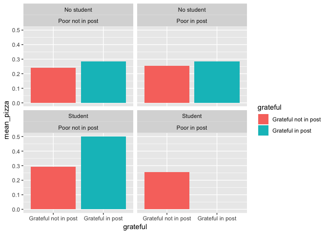
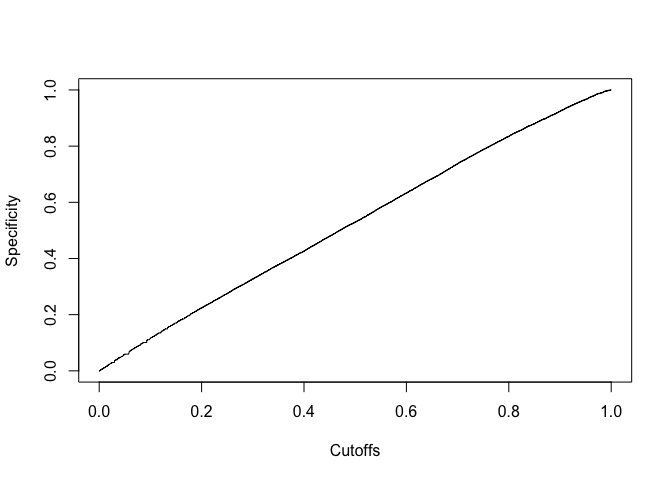
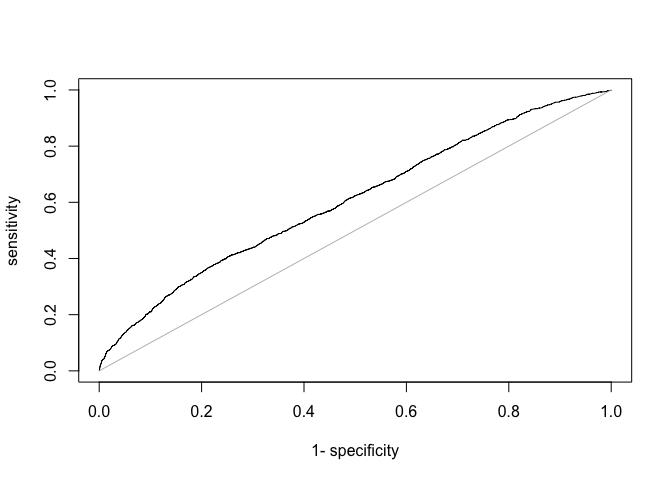
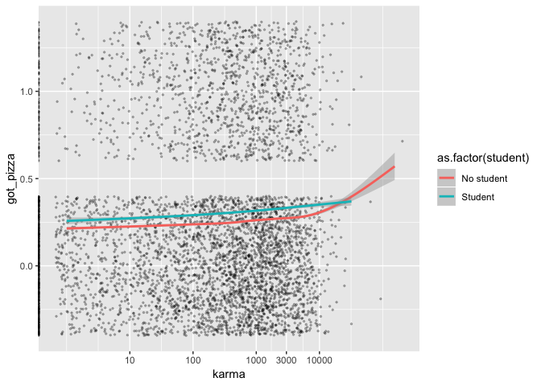

Classification
================
Will Doyle

Classification is the process of predicting group membership. Understanding which individuals are likely to be members of which groups is a key task for data scientists. For instance, most recommendation engines that are at the hear of consumer web sites are based on classification algorithms, predicting which consumers are likely to purchase which products.

Pizza
-----

Today we'll be working with the pizza dataset, which comes from the subreddit random acts of pizza. Each line represents a post to this subreddit. We have various characteristics of these posts, along with the request text from the post itself. We'll use these characteristics of the posts to predict whether or not the poster received pizza. This lesson is inspired by [this article](http://www.aaai.org/ocs/index.php/ICWSM/ICWSM14/paper/download/8106/8101)

``` r
library(arm)
```

    ## Loading required package: MASS

    ## Loading required package: Matrix

    ## Loading required package: lme4

    ## 
    ## arm (Version 1.10-1, built: 2018-4-12)

    ## Working directory is /Users/doylewr/hoddatasci_fall18/lessons

``` r
library(knitr)
library(caret)
```

    ## Loading required package: lattice

    ## Loading required package: ggplot2

``` r
library(forcats)
library(tidytext)
library(stringr)
library(AUC)
```

    ## AUC 0.3.0

    ## Type AUCNews() to see the change log and ?AUC to get an overview.

    ## 
    ## Attaching package: 'AUC'

    ## The following objects are masked from 'package:caret':
    ## 
    ##     sensitivity, specificity

``` r
library(tidyverse)
```

    ## ── Attaching packages ───────────────────────────────── tidyverse 1.2.1 ──

    ## ✔ tibble 1.4.2     ✔ readr  1.1.1
    ## ✔ tidyr  0.8.2     ✔ purrr  0.2.5
    ## ✔ tibble 1.4.2     ✔ dplyr  0.7.7

    ## ── Conflicts ──────────────────────────────────── tidyverse_conflicts() ──
    ## ✖ tidyr::expand() masks Matrix::expand()
    ## ✖ dplyr::filter() masks stats::filter()
    ## ✖ dplyr::lag()    masks stats::lag()
    ## ✖ purrr::lift()   masks caret::lift()
    ## ✖ dplyr::select() masks MASS::select()

``` r
za<-read_csv("pizza.csv")
```

    ## Warning: Missing column names filled in: 'X1' [1]

    ## Parsed with column specification:
    ## cols(
    ##   .default = col_integer(),
    ##   giver_username_if_known = col_character(),
    ##   in_test_set = col_character(),
    ##   post_was_edited = col_character(),
    ##   request_id = col_character(),
    ##   request_text = col_character(),
    ##   request_text_edit_aware = col_character(),
    ##   request_title = col_character(),
    ##   requester_account_age_in_days_at_request = col_double(),
    ##   requester_account_age_in_days_at_retrieval = col_double(),
    ##   requester_days_since_first_post_on_raop_at_request = col_double(),
    ##   requester_days_since_first_post_on_raop_at_retrieval = col_double(),
    ##   requester_received_pizza = col_character(),
    ##   requester_subreddits_at_request = col_character(),
    ##   requester_user_flair = col_character(),
    ##   requester_username = col_character(),
    ##   unix_timestamp_of_request = col_double(),
    ##   unix_timestamp_of_request_utc = col_double()
    ## )

    ## See spec(...) for full column specifications.

    ## Warning in rbind(names(probs), probs_f): number of columns of result is not
    ## a multiple of vector length (arg 1)

    ## Warning: 11 parsing failures.
    ## row # A tibble: 5 x 5 col     row col               expected      actual                      file   expected   <int> <chr>             <chr>         <chr>                       <chr>  actual 1  2124 <NA>              34 columns    9 columns                   'pizz… file 2  2125 X1                an integer    We where told the reason w… 'pizz… row 3  2125 <NA>              34 columns    2 columns                   'pizz… col 4  2126 X1                an integer    We where told the reason w… 'pizz… expected 5  2126 number_of_downvo… no trailing … .206770833                  'pizz…
    ## ... ................. ... .......................................................................... ........ .......................................................................... ...... .......................................................................... .... .......................................................................... ... .......................................................................... ... .......................................................................... ........ ..........................................................................
    ## See problems(...) for more details.

Below, I do some basic data wrangling, changing variable names and recoding a few variables to be in a more usable format. The outcome variable, whether the poster indicated they received a pizza, should be a binary variable: one if the person received a pizza, 0 otherwise. Our goal is to create a classifier that will accurately classify people in a testing dataset as to whether they will receive a pizza or not, based on the content of their post. This is a VERY common task in data science-- taking user supplied content and using it to accurately classify that user, typically as someone who will buy a product or service.

``` r
#Recoding
za$got_pizza<-rep(0,dim(za)[1])
za$got_pizza[za$requester_received_pizza=="True"]<-1
```

Next, I shorten a bunch of variable names I plan to use. Long variable and data frame names should always be avoided.

``` r
## Renaming looooong variable names
za$karma<-za$requester_upvotes_minus_downvotes_at_request

za$age<-za$requester_account_age_in_days_at_request

za$raop_age<-za$requester_days_since_first_post_on_raop_at_request

za$pop_request<-za$number_of_upvotes_of_request_at_retrieval

za$activity<-za$requester_number_of_subreddits_at_request

za$total_posts<-za$requester_number_of_posts_at_request

za$raop_posts<-za$requester_number_of_posts_on_raop_at_request
```

Then I have a series of variables that I want to to turn into binary variables, then into factors. The factor part will help me with labels and etc.

``` r
# Binary variable for any previous post on this subreddit
za<-za%>%mutate(prev_raop_post=ifelse(raop_posts>0,1,0))%>%
        mutate(
           prev_raop_post=
          fct_recode(as.factor(prev_raop_post),
                                     "First Post"="0",
                                     "Posted Before"="1"))

# Binary variable: word "student" in text
za<-za%>%mutate(student=ifelse(grepl(x=request_text,pattern="student",ignore.case=TRUE),1,0))%>%
        mutate(student=fct_recode(as.factor(student),
                            "Student"="1",
                            "No student"="0"))


## Raw count of words in post
za$words<-str_count(za$request_text,"\\S+")

# Binary variable: word "poor" or "money" in text

za<-za%>%mutate(poor=ifelse(grepl(x=request_text,pattern="poor"),1,0))%>%
  mutate(poor=fct_recode(as.factor(poor),
                "Poor in post"="1",
                "Poor not in post"="0"))

# Binary variable: word "grateful"" in text

za<-za%>%mutate(grateful=
                  ifelse(grepl(x = request_text,pattern="grateful"),1,0))%>%
                  mutate(grateful=fct_recode(as.factor(grateful),
                  "Grateful in post"="1",
                  "Grateful not in post"="0"))
```

Sentiment Analysis
------------------

Sentiment analysis involves coding the positive or negative sentiments provided in a given text. There are many ways to do this, but we're going to do a simple way. We will match the words in the post with a list of words known to contain positive or negative sentiments. We'll then sum up the total score of the post by the score of the sentiments expressed.

To get this done, we need to create a dataset that has one line per combination of post and word.

``` r
## Create a new dataset with one line per word per request: crazy, I know
za_expand<-za%>%
  select(request_id,request_text)%>%
  group_by(request_id)%>%
  unnest_tokens(input=request_text,output=word,token="words")

## What this looks like
#za_expand%>%select(word)
```

Next, we drop what are called ["stop words"](https://en.wikipedia.org/wiki/Stop_words): words unlikely to have content that we are interested in.

``` r
## Drop known stop words
za_expand<-za_expand%>%anti_join(stop_words,by="word")  

## What this looks like
#za_expand%>%select(word)
```

Notice how the content of the post has changed after dropping the stop words.

Now we'll combine this data frame with a dataframe of words with [sentiment scores](https://en.wikipedia.org/wiki/Sentiment_analysis). Each word gets its own score, if the word is associated with a positive or negative sentiment.In this analysis, non-sentiment words will be coded as 0.

``` r
## Merge with data frame of words and associated sentiment scores
za_expand<-za_expand%>%left_join(sentiments,by="word")

##Missing=0
za_expand<-za_expand%>%
  mutate(score=ifelse(is.na(score),0,score))

## Show words and scores
#za_expand%>%select(word,score)

## Just score words
#za_expand%>%select(word,score)%>%filter(score>0)%>%print()
```

Now we're ready to bring this back in. We'll sum up the scores for each post to get how positive or negative it is.

``` r
## Sum score per post
za_sum<-za_expand%>%group_by(request_id)%>%
  summarize(score=sum(score))

za_sum%>%select(request_id,score)%>%print()
```

    ## # A tibble: 5,661 x 2
    ##    request_id score
    ##    <chr>      <dbl>
    ##  1 318            0
    ##  2 t3_1005cj      5
    ##  3 t3_100mod      0
    ##  4 t3_100ws2     -9
    ##  5 t3_1017ti     -2
    ##  6 t3_101kt0     -5
    ##  7 t3_101n9x      5
    ##  8 t3_101uyy      0
    ##  9 t3_101vsv      0
    ## 10 t3_101z2h     -1
    ## # ... with 5,651 more rows

Now we can add this back in.

``` r
za<-za%>%left_join(za_sum,by="request_id")

head(za)
```

    ## # A tibble: 6 x 48
    ##      X1 giver_username_… in_test_set number_of_downv… number_of_upvot…
    ##   <int> <chr>            <chr>                  <int>            <int>
    ## 1     0 N/A              False                      2                6
    ## 2     1 N/A              False                      2                6
    ## 3     2 N/A              False                      1                4
    ## 4     3 N/A              False                      2               13
    ## 5     4 N/A              False                      1                4
    ## 6     5 N/A              False                      5               34
    ## # ... with 43 more variables: post_was_edited <chr>, request_id <chr>,
    ## #   request_number_of_comments_at_retrieval <int>, request_text <chr>,
    ## #   request_text_edit_aware <chr>, request_title <chr>,
    ## #   requester_account_age_in_days_at_request <dbl>,
    ## #   requester_account_age_in_days_at_retrieval <dbl>,
    ## #   requester_days_since_first_post_on_raop_at_request <dbl>,
    ## #   requester_days_since_first_post_on_raop_at_retrieval <dbl>,
    ## #   requester_number_of_comments_at_request <int>,
    ## #   requester_number_of_comments_at_retrieval <int>,
    ## #   requester_number_of_comments_in_raop_at_request <int>,
    ## #   requester_number_of_comments_in_raop_at_retrieval <int>,
    ## #   requester_number_of_posts_at_request <int>,
    ## #   requester_number_of_posts_at_retrieval <int>,
    ## #   requester_number_of_posts_on_raop_at_request <int>,
    ## #   requester_number_of_posts_on_raop_at_retrieval <int>,
    ## #   requester_number_of_subreddits_at_request <int>,
    ## #   requester_received_pizza <chr>, requester_subreddits_at_request <chr>,
    ## #   requester_upvotes_minus_downvotes_at_request <int>,
    ## #   requester_upvotes_minus_downvotes_at_retrieval <int>,
    ## #   requester_upvotes_plus_downvotes_at_request <int>,
    ## #   requester_upvotes_plus_downvotes_at_retrieval <int>,
    ## #   requester_user_flair <chr>, requester_username <chr>,
    ## #   unix_timestamp_of_request <dbl>, unix_timestamp_of_request_utc <dbl>,
    ## #   got_pizza <dbl>, karma <int>, age <dbl>, raop_age <dbl>,
    ## #   pop_request <int>, activity <int>, total_posts <int>,
    ## #   raop_posts <int>, prev_raop_post <fct>, student <fct>, words <int>,
    ## #   poor <fct>, grateful <fct>, score <dbl>

``` r
za<-za%>%select(got_pizza,
                karma,
                age,
                raop_age,
                pop_request,
                activity,
                total_posts,
                raop_posts,
                prev_raop_post,
                words,
                poor,
                student,
                grateful,
                score
                )

save(za,file="za.RData")
```

``` r
# Training and testing datasets

za_train<-za%>%sample_frac(.5)
za_test<-setdiff(za,za_train)
write_csv(za_train,path="za_train.csv")
save(za_train,file="za_train.RData")
write_csv(za_test,path="za_test.csv")
save(za_test,file="za_test.RData")
```

Conditional Means as a Classifier
---------------------------------

We'll start by generating some cross tabs and some quick plots, showing the probability of receiving pizza according to several characteristics of the post. We start with a basic crosstab of the dependent variable. We use `prop.table` to change this from raw counts to proportions. I also provide a brief exampl of how to do a table using the `kable` function.

``` r
#Cross Tabs

za%>%
  count(got_pizza)%>% # Count numbers getting pizza
  mutate(p=prop.table(n))%>% #mutate for proportions using prop.table
  kable(format="markdown") # output to table
```

|  got\_pizza|     n|          p|
|-----------:|-----:|----------:|
|           0|  4276|  0.7537458|
|           1|  1397|  0.2462542|

So, about 75% of the sample didn't get pizza, about 25% did.

Next, we cross-tabulate receiving pizza with certain terms. First, if the request mentioned the word "student."

``` r
za%>%
  count(got_pizza,student)%>%
  spread(got_pizza,n)
```

    ## # A tibble: 2 x 3
    ##   student      `0`   `1`
    ##   <fct>      <int> <int>
    ## 1 No student  3963  1264
    ## 2 Student      313   133

Next, if the request mentioned the word "grateful."

``` r
g_table<-table(za$grateful,za$got_pizza);g_table
```

    ##                       
    ##                           0    1
    ##   Grateful not in post 4145 1340
    ##   Grateful in post      131   57

``` r
prop.table(g_table,margin=1)
```

    ##                       
    ##                                0         1
    ##   Grateful not in post 0.7556974 0.2443026
    ##   Grateful in post     0.6968085 0.3031915

Crosstabs using binary data are equivalent to generating conditional means, as shown below.

``` r
#Predictions using conditional means

za%>%group_by(grateful)%>%summarize(mean(got_pizza))
```

    ## # A tibble: 2 x 2
    ##   grateful             `mean(got_pizza)`
    ##   <fct>                            <dbl>
    ## 1 Grateful not in post             0.244
    ## 2 Grateful in post                 0.303

But, we can also use conditional means to get proportions for very particular sets of characteristics. In this case, what about individuals who included some combination of the terms "grateful","student" and "poor" in their posts?

``` r
za%>%group_by(grateful,student)%>%summarize(mean(got_pizza))
```

    ## # A tibble: 4 x 3
    ## # Groups:   grateful [?]
    ##   grateful             student    `mean(got_pizza)`
    ##   <fct>                <fct>                  <dbl>
    ## 1 Grateful not in post No student             0.240
    ## 2 Grateful not in post Student                0.290
    ## 3 Grateful in post     No student             0.284
    ## 4 Grateful in post     Student                0.474

``` r
za_sum<-za%>%group_by(grateful,student,poor)%>%summarize(mean_pizza=mean(got_pizza))

za_sum
```

    ## # A tibble: 8 x 4
    ## # Groups:   grateful, student [?]
    ##   grateful             student    poor             mean_pizza
    ##   <fct>                <fct>      <fct>                 <dbl>
    ## 1 Grateful not in post No student Poor not in post      0.240
    ## 2 Grateful not in post No student Poor in post          0.255
    ## 3 Grateful not in post Student    Poor not in post      0.293
    ## 4 Grateful not in post Student    Poor in post          0.257
    ## 5 Grateful in post     No student Poor not in post      0.284
    ## 6 Grateful in post     No student Poor in post          0.286
    ## 7 Grateful in post     Student    Poor not in post      0.5  
    ## 8 Grateful in post     Student    Poor in post          0

Probability of Receiving Pizza, Using Various Terms in Post
-----------------------------------------------------------

``` r
gg<-ggplot(za_sum,aes(x=grateful,y=mean_pizza,fill=grateful))
gg<-gg+geom_bar(stat="identity")
gg<-gg+facet_wrap(~student+poor)
gg
```



Classifiation Using Linear Probability Model
--------------------------------------------

We can use standard OLS regression for classification. It's not ideal, but most of the time it's actually not too bad, either. Below we model the binary outcome of receiving pizza as a function of karma, total posts, posts on the pizza subreddit, wehterh or not the poster mentioned the words "student" or "grateful."

``` r
# Linear model

lm_mod<-lm(got_pizza~
             age+
             karma+
             log(total_posts+1)+
             raop_posts+
             student+
             grateful+
             pop_request+
             score,
           data=za,y=TRUE,na.exclude=TRUE);summary(lm_mod)
```

    ## Warning: In lm.fit(x, y, offset = offset, singular.ok = singular.ok, ...) :
    ##  extra argument 'na.exclude' will be disregarded

    ## 
    ## Call:
    ## lm(formula = got_pizza ~ age + karma + log(total_posts + 1) + 
    ##     raop_posts + student + grateful + pop_request + score, data = za, 
    ##     y = TRUE, na.exclude = TRUE)
    ## 
    ## Residuals:
    ##     Min      1Q  Median      3Q     Max 
    ## -1.3946 -0.2454 -0.2129 -0.1740  0.8525 
    ## 
    ## Coefficients:
    ##                           Estimate Std. Error t value Pr(>|t|)    
    ## (Intercept)              1.813e-01  9.390e-03  19.304  < 2e-16 ***
    ## age                      3.000e-05  2.312e-05   1.297  0.19457    
    ## karma                    2.368e-07  1.817e-06   0.130  0.89633    
    ## log(total_posts + 1)     1.006e-02  4.669e-03   2.156  0.03114 *  
    ## raop_posts               1.600e-01  1.835e-02   8.722  < 2e-16 ***
    ## studentStudent           6.219e-02  2.098e-02   2.965  0.00304 ** 
    ## gratefulGrateful in post 6.007e-02  3.167e-02   1.897  0.05793 .  
    ## pop_request              3.367e-03  4.458e-04   7.552 4.97e-14 ***
    ## score                    1.520e-03  1.152e-03   1.320  0.18700    
    ## ---
    ## Signif. codes:  0 '***' 0.001 '**' 0.01 '*' 0.05 '.' 0.1 ' ' 1
    ## 
    ## Residual standard error: 0.4248 on 5649 degrees of freedom
    ##   (15 observations deleted due to missingness)
    ## Multiple R-squared:  0.0302, Adjusted R-squared:  0.02883 
    ## F-statistic: 21.99 on 8 and 5649 DF,  p-value: < 2.2e-16

We're going to do something a bit different with the predictions from this model. After creating predictions, we're going to classify everyone with a predicted probablity above .5 as being predicted to get a pizza, while everyone with a predicted probability below .5 is predicted to not get one. We'll compare our classifications with the actual data.

``` r
#Predictions

## Linear model predictions
lm_predict<-predict(lm_mod)

## Convert to binary, 1= >.5
lm_predict_bin<-ifelse(lm_predict>.3,1,0)

lpm_roc<-roc(lm_predict_bin,as.factor(lm_mod$y))

auc(lpm_roc)
```

    ## [1] 0.5523802

``` r
## Table of actual vs. predicted, what's going on here?
lm_table<-table(lm_predict_bin,lm_mod$y)

## Percent correctly predicted
pcp<-(lm_table[1,1]+lm_table[2,2])/sum(lm_table)

pred_table<-prop.table(lm_table,margin=1)

rownames(pred_table)<-c("Predicted: Yes","Predicted: No")
colnames(pred_table)<-c("Actual: Yes","Actual: No")

## Generate confusion matrix
confusionMatrix(data=as.factor(lm_predict_bin),
                reference = as.factor(lm_mod$y),positive="1")
```

    ## Confusion Matrix and Statistics
    ## 
    ##           Reference
    ## Prediction    0    1
    ##          0 3912 1134
    ##          1  351  261
    ##                                          
    ##                Accuracy : 0.7375         
    ##                  95% CI : (0.7259, 0.749)
    ##     No Information Rate : 0.7534         
    ##     P-Value [Acc > NIR] : 0.9972         
    ##                                          
    ##                   Kappa : 0.1291         
    ##  Mcnemar's Test P-Value : <2e-16         
    ##                                          
    ##             Sensitivity : 0.18710        
    ##             Specificity : 0.91766        
    ##          Pos Pred Value : 0.42647        
    ##          Neg Pred Value : 0.77527        
    ##              Prevalence : 0.24655        
    ##          Detection Rate : 0.04613        
    ##    Detection Prevalence : 0.10817        
    ##       Balanced Accuracy : 0.55238        
    ##                                          
    ##        'Positive' Class : 1              
    ## 

The confusion matrix generated here is explained [here](https://topepo.github.io/caret/measuring-performance.html#class).

We're usually interested in three things: the overall accuracy of a classification is the proportion of cases accurately classified. The sensitivity is the proportion of "ones" that are accurately classified as ones-- it's the probability that a case classified as positive will indeed be positive. Specificity is the probability that a case classified as 0 will indeed be 0.

*Question: how do you get perfect specificity? How do you get perfect sensitivity?*

There are several well-known problems with linear regression as a classification algortihm. Two should give us pause: it can generate probabilites outside of 0,1 and it implies a linear change in probabilities as a function of the predictors which may not be justified given the underlying relationship between the predictors and the probability that the outcome is 1. Logistic regresssion should give a better predicted probability, one that's more sensitive to the actual relationship between the predictors and the outcome.

Logistic regression as a classifier
-----------------------------------

Logistic regression is set up to handle binary outcomes as the dependent variable. In particular, the predictions will always be a probability, which makes it better than the ironically named linear probability model. The downside to logistic regression is that it is modeling the log odds of the outcome, which means all of the coefficients are expressed as log odds, which no one understands intuitively. Below I run the same model using logistic regression. Note the use of `glm` and the `family` option, which specifies a functional form and a particular link function.

``` r
#Logisitic model

logit_mod<-glm(got_pizza~
              age+
             karma+
             log(total_posts+1)+
             raop_posts+
             karma+
             student+
             grateful+
             pop_request+
             score,
             data=za,
            family=binomial(link="logit"),
               y=TRUE)

summary(logit_mod)
```

    ## 
    ## Call:
    ## glm(formula = got_pizza ~ age + karma + log(total_posts + 1) + 
    ##     raop_posts + karma + student + grateful + pop_request + score, 
    ##     family = binomial(link = "logit"), data = za, y = TRUE)
    ## 
    ## Deviance Residuals: 
    ##     Min       1Q   Median       3Q      Max  
    ## -3.6976  -0.7447  -0.6874  -0.6209   1.9351  
    ## 
    ## Coefficients:
    ##                            Estimate Std. Error z value Pr(>|z|)    
    ## (Intercept)              -1.517e+00  5.670e-02 -26.749  < 2e-16 ***
    ## age                       1.497e-04  1.232e-04   1.215  0.22440    
    ## karma                     4.849e-07  1.050e-05   0.046  0.96317    
    ## log(total_posts + 1)      5.751e-02  2.578e-02   2.231  0.02569 *  
    ## raop_posts                7.583e-01  1.011e-01   7.503 6.25e-14 ***
    ## studentStudent            3.259e-01  1.096e-01   2.974  0.00294 ** 
    ## gratefulGrateful in post  3.097e-01  1.645e-01   1.883  0.05974 .  
    ## pop_request               2.338e-02  3.632e-03   6.437 1.22e-10 ***
    ## score                     8.549e-03  6.407e-03   1.334  0.18208    
    ## ---
    ## Signif. codes:  0 '***' 0.001 '**' 0.01 '*' 0.05 '.' 0.1 ' ' 1
    ## 
    ## (Dispersion parameter for binomial family taken to be 1)
    ## 
    ##     Null deviance: 6320.2  on 5657  degrees of freedom
    ## Residual deviance: 6158.3  on 5649  degrees of freedom
    ##   (15 observations deleted due to missingness)
    ## AIC: 6176.3
    ## 
    ## Number of Fisher Scoring iterations: 4

With these results in hand we can generate predicted probabilities and see if this model did any better. To get predicted probabilities we use type="response".

We can convert the predictions to a binary variable by setting a "threshold" of .5. Any prediction above .5 is considered to be a 1, anything below, a 0.

``` r
logit_predict<-predict(logit_mod,type="response")
logit_predict_bin<-rep(0,length(logit_predict))
logit_predict_bin[logit_predict>.5]<-1
```

``` r
confusionMatrix(data=as.factor(lm_predict_bin),
                reference = as.factor(logit_mod$y),positive="1")
```

    ## Confusion Matrix and Statistics
    ## 
    ##           Reference
    ## Prediction    0    1
    ##          0 3912 1134
    ##          1  351  261
    ##                                          
    ##                Accuracy : 0.7375         
    ##                  95% CI : (0.7259, 0.749)
    ##     No Information Rate : 0.7534         
    ##     P-Value [Acc > NIR] : 0.9972         
    ##                                          
    ##                   Kappa : 0.1291         
    ##  Mcnemar's Test P-Value : <2e-16         
    ##                                          
    ##             Sensitivity : 0.18710        
    ##             Specificity : 0.91766        
    ##          Pos Pred Value : 0.42647        
    ##          Neg Pred Value : 0.77527        
    ##              Prevalence : 0.24655        
    ##          Detection Rate : 0.04613        
    ##    Detection Prevalence : 0.10817        
    ##       Balanced Accuracy : 0.55238        
    ##                                          
    ##        'Positive' Class : 1              
    ## 

Area Under the Curve (AUC)
--------------------------

The area under the curve considers both the sensitivity (does the model accurately predict every positive outcome) with the specificity (does the model accurately predict every negative outcome) for a given model, and does so across every possible threshold value.

``` r
logit_sens_curve<-sensitivity(logit_predict,as.factor(logit_mod$y))
plot(logit_sens_curve)
```


``` r
logit_spec_curve<-specificity(logit_predict,as.factor(logit_mod$y))
plot(logit_spec_curve)
```



``` r
logit_roc<-roc(logit_predict,as.factor(logit_mod$y))
plot(logit_roc)
```



``` r
auc(logit_roc)
```

    ## [1] 0.6061617

Plotting Predicted Probability
------------------------------

Plots of binary models can be weird. To help with this, we can "jitter" the plot to add some random noise.

``` r
#Prediction
za<-za%>%modelr::add_predictions(logit_mod)%>%
  mutate(pred=arm::invlogit(pred)) ## This transforms to probs

gg<-ggplot(za,aes(x=karma,y=got_pizza))
gg<-gg+geom_jitter(alpha=.25,size=.5,position=position_jitter(height=.4,width=.4))
gg<-gg+scale_x_continuous(trans="log",breaks=c(0,10,100,1000,3000,10000))
gg<-gg+geom_smooth(data=za,aes(x=karma,y=pred,color=as.factor(student)))
gg
```

    ## Warning in self$trans$transform(x): NaNs produced

    ## Warning: Transformation introduced infinite values in continuous x-axis

    ## Warning in self$trans$transform(x): NaNs produced

    ## Warning: Transformation introduced infinite values in continuous x-axis

    ## `geom_smooth()` using method = 'gam' and formula 'y ~ s(x, bs = "cs")'

    ## Warning: Removed 1163 rows containing non-finite values (stat_smooth).

    ## Warning: Removed 72 rows containing missing values (geom_point).


