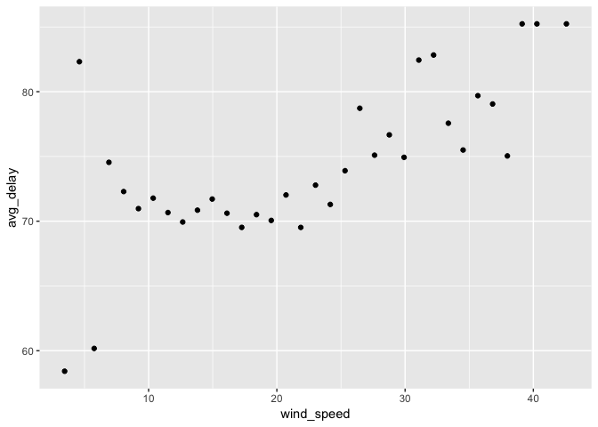

Using Databases
================
Will Doyle

Introduction: What's a Database?
================================

Databases are the primary way large organizations and governments organize and store data. What makes a database distinct from a dataset is that it stores data in multiple tables, which are called "flat files" in the parlance of databases. The relationships between each of the tables is recorded in a schema. Some terms from database land and their translation in R:

-   A table (sometimes called a file) in a database is like a data frame in R: a 2 dimensional array. The 2 dimensions are referred to as "records" and "fields". These are typically organized by their primary id, or unit of analysis.

-   A record is what we could call a case or a unit of observation. A record is composed of fields.

-   A field is what we would call a variable name. A field is composed of multiple records

-   A relational database is a set of tables that are linked by a set of common identifiers. Not every table can be linked to every other table, and tables do not need to have the same primary ids.

-   A database management system is software that provides a way to interact with a database.

The DBMS that is used most frequently is SQL and its variants, MYSQL and sqlite. Mariadb is a newer "sort of" variant of sql. Google BigQuery is one used by many companies, while Microsoft Access is a plague that has been set upon us for our transgressions. We hope someday the curse will be lifted.

An R analyst typically doesn't want to be a database person-- they just want to get the data out in a way that they can use for data analysis. It's not worth it to store data on your own computer in a database-- it will just slow you down. Instead, this lesson is intended for when you have a chance to interact with a truly large database.

NYC Flights
===========

Today we'll use the `nyclfights13` database, which contains information on every single flight departing New York City in 2013, including airline information, airport information, flight information, plane information and weather information.

Here is the schema for the nycflights13 database

We'll also use the Lahman database, which contains information on every single player to ever play any professional baseball since 1871, including batting, pitching, team information and so on.

``` r
# Mostly taken from : http://cran.r-project.org/web/packages/dplyr/vignettes/databases.html circa 2014

# Will need: nycflights13 RSQLite, Lahman

#Get libraries

library(tidyverse)
```

    ## ── Attaching packages ──────────────────────────────────────────────── tidyverse 1.2.1 ──

    ## ✔ ggplot2 3.1.0     ✔ purrr   0.2.5
    ## ✔ tibble  1.4.2     ✔ dplyr   0.7.7
    ## ✔ tidyr   0.8.2     ✔ stringr 1.3.1
    ## ✔ readr   1.1.1     ✔ forcats 0.3.0

    ## ── Conflicts ─────────────────────────────────────────────────── tidyverse_conflicts() ──
    ## ✖ dplyr::filter() masks stats::filter()
    ## ✖ dplyr::lag()    masks stats::lag()

``` r
library(DBI)
library(dbplyr)
```

    ## 
    ## Attaching package: 'dbplyr'

    ## The following objects are masked from 'package:dplyr':
    ## 
    ##     ident, sql

``` r
library(RSQLite)
library(nycflights13)
library(Lahman)
```

The first thing we'll do is get all of the various tables open. They're stored in `data()` from the `nycflights` library.

``` r
# Data sources from NYC flights
data(flights)
data(airlines)
data(airports)
data(weather)
data(planes)
```

Connecting to a database
========================

I'm going to do something kind of unusual for this class: I'm going to create a database from existing flat files. You should NEVER do this-- it's just for teaching. I'm using the RSQLite package to open a connection to a database. In your work, you would just open the connection, many times through a secure network. You'll need instructions from a database admin on how to do this.

`con` below refers to our connection to a database. It remains open until we close it. It will be based on the properties of the database we're trying to access.

``` r
con <- dbConnect(RSQLite::SQLite(), ":memory:")

#Write flights tables to database (you won't usually do this)
dbWriteTable(con,
             "flights", 
             as.data.frame(flights))

dbWriteTable(con,
             "planes", 
             as.data.frame(planes))

dbWriteTable(con,
             "airlines", 
             as.data.frame(airlines))

dbWriteTable(con,
             "weather", 
             as.data.frame(weather))

dbWriteTable(con,
             "airports", 
             as.data.frame(airports))
```

Now I have an open connection to a database that contains multiple tables. Let's ask which tables we have access to:

``` r
#List tables in database
dbListTables(con)
```

    ## [1] "airlines" "airports" "flights"  "planes"   "weather"

For some of these tables, what fields are included?

``` r
#List fields in various tables
dbListFields(con,"airlines")
```

    ## [1] "carrier" "name"

``` r
dbListFields(con,"flights")
```

    ##  [1] "year"           "month"          "day"            "dep_time"      
    ##  [5] "sched_dep_time" "dep_delay"      "arr_time"       "sched_arr_time"
    ##  [9] "arr_delay"      "carrier"        "flight"         "tailnum"       
    ## [13] "origin"         "dest"           "air_time"       "distance"      
    ## [17] "hour"           "minute"         "time_hour"

SQL is its own language. One of the main things people do with SQL is to generate requests. Below, we create request text which asks for every field from the flights table, then sends that query to the database. Once we get the return back, we turn it into a data frame. As a matter of good practice, we also clear that request. Click [here](http://cse.unl.edu/~sscott/ShowFiles/SQL/CheatSheet/SQLCheatSheet.html) for a cheat sheet on SQL queries.

``` r
#Generate a SQL request to a database
req_text<-"Select * from flights"

#Send query through connection
req<-dbSendQuery(con,req_text)

#Generate dataframe from results
req_df<-dbFetch(req,n=-1)

#Good practice: clear request
dbClearResult(req)
```

``` r
#Generate a SQL request to a database
req_text<-"Select * from weather"

#Send query through connection
req<-dbSendQuery(con,req_text)

#Generate dataframe from results
req_df<-dbFetch(req,n=-1)

#Good practice: clear request
dbClearResult(req)
```

Let's take a look at the generated data frame.

``` r
dim(req_df)
```

    ## [1] 26115    15

``` r
head(req_df,20)
```

    ##    origin year month day hour  temp  dewp humid wind_dir wind_speed
    ## 1     EWR 2013     1   1    1 39.02 26.06 59.37      270   10.35702
    ## 2     EWR 2013     1   1    2 39.02 26.96 61.63      250    8.05546
    ## 3     EWR 2013     1   1    3 39.02 28.04 64.43      240   11.50780
    ## 4     EWR 2013     1   1    4 39.92 28.04 62.21      250   12.65858
    ## 5     EWR 2013     1   1    5 39.02 28.04 64.43      260   12.65858
    ## 6     EWR 2013     1   1    6 37.94 28.04 67.21      240   11.50780
    ## 7     EWR 2013     1   1    7 39.02 28.04 64.43      240   14.96014
    ## 8     EWR 2013     1   1    8 39.92 28.04 62.21      250   10.35702
    ## 9     EWR 2013     1   1    9 39.92 28.04 62.21      260   14.96014
    ## 10    EWR 2013     1   1   10 41.00 28.04 59.65      260   13.80936
    ## 11    EWR 2013     1   1   11 41.00 26.96 57.06      260   14.96014
    ## 12    EWR 2013     1   1   13 39.20 28.40 69.67      330   16.11092
    ## 13    EWR 2013     1   1   14 39.02 24.08 54.68      280   13.80936
    ## 14    EWR 2013     1   1   15 37.94 24.08 57.04      290    9.20624
    ## 15    EWR 2013     1   1   16 37.04 19.94 49.62      300   13.80936
    ## 16    EWR 2013     1   1   17 35.96 19.04 49.83      330   11.50780
    ## 17    EWR 2013     1   1   18 33.98 15.08 45.43      310   12.65858
    ## 18    EWR 2013     1   1   19 33.08 12.92 42.84      320   10.35702
    ## 19    EWR 2013     1   1   20 32.00 15.08 49.19      310   14.96014
    ## 20    EWR 2013     1   1   21 30.02 12.92 48.48      320   18.41248
    ##    wind_gust precip pressure visib  time_hour
    ## 1         NA      0   1012.0    10 1357020000
    ## 2         NA      0   1012.3    10 1357023600
    ## 3         NA      0   1012.5    10 1357027200
    ## 4         NA      0   1012.2    10 1357030800
    ## 5         NA      0   1011.9    10 1357034400
    ## 6         NA      0   1012.4    10 1357038000
    ## 7         NA      0   1012.2    10 1357041600
    ## 8         NA      0   1012.2    10 1357045200
    ## 9         NA      0   1012.7    10 1357048800
    ## 10        NA      0   1012.4    10 1357052400
    ## 11        NA      0   1011.4    10 1357056000
    ## 12        NA      0       NA    10 1357063200
    ## 13        NA      0   1010.8    10 1357066800
    ## 14        NA      0   1011.9    10 1357070400
    ## 15  20.71404      0   1012.1    10 1357074000
    ## 16        NA      0   1013.2    10 1357077600
    ## 17  25.31716      0   1014.1    10 1357081200
    ## 18        NA      0   1014.4    10 1357084800
    ## 19        NA      0   1015.2    10 1357088400
    ## 20  26.46794      0   1016.0    10 1357092000

*Quick Exercise:* Get the weather table and put it in a data frame

Many times we want to generate a request that will only give us part of some tables. We'd also like to join tables together in many circumstances. Below is a SQL request that includes the key verbs SELECT, FROM, JOIN and WHERE.

``` r
#New request: which carriers have longer delays? 
req1_text<-"SELECT a.carrier, a.name, f.dep_delay 
            FROM flights f 
            JOIN airlines a ON a.carrier=f.carrier 
            WHERE f.dep_delay>60
            "
req1<-dbSendQuery(con,req1_text)

req1_df<-dbFetch(req1,n=-1)

dbClearResult(req1)

head(req1_df)
```

    ##   carrier                     name dep_delay
    ## 1      MQ                Envoy Air       101
    ## 2      AA   American Airlines Inc.        71
    ## 3      MQ                Envoy Air       853
    ## 4      UA    United Air Lines Inc.       144
    ## 5      UA    United Air Lines Inc.       134
    ## 6      EV ExpressJet Airlines Inc.        96

``` r
table(req1_df$name)
```

    ## 
    ## AirTran Airways Corporation        Alaska Airlines Inc. 
    ##                         314                          39 
    ##      American Airlines Inc.        Delta Air Lines Inc. 
    ##                        2003                        2651 
    ##           Endeavor Air Inc.                   Envoy Air 
    ##                        1966                        1996 
    ##    ExpressJet Airlines Inc.      Frontier Airlines Inc. 
    ##                        6861                          73 
    ##      Hawaiian Airlines Inc.             JetBlue Airways 
    ##                          10                        4571 
    ##          Mesa Airlines Inc.       SkyWest Airlines Inc. 
    ##                          79                           4 
    ##      Southwest Airlines Co.       United Air Lines Inc. 
    ##                        1061                        3824 
    ##             US Airways Inc.              Virgin America 
    ##                         766                         363

``` r
delay_summary<-req1_df%>%
  group_by(name)%>%
  summarize(avg_delay=mean(dep_delay,na.rm=TRUE))%>%
  arrange(-avg_delay)

delay_summary
```

    ## # A tibble: 16 x 2
    ##    name                        avg_delay
    ##    <chr>                           <dbl>
    ##  1 Hawaiian Airlines Inc.           243.
    ##  2 Virgin America                   146.
    ##  3 AirTran Airways Corporation      145.
    ##  4 Frontier Airlines Inc.           145.
    ##  5 Delta Air Lines Inc.             136.
    ##  6 Southwest Airlines Co.           132.
    ##  7 Endeavor Air Inc.                124.
    ##  8 American Airlines Inc.           123.
    ##  9 United Air Lines Inc.            121.
    ## 10 Alaska Airlines Inc.             118.
    ## 11 ExpressJet Airlines Inc.         118.
    ## 12 JetBlue Airways                  118.
    ## 13 Mesa Airlines Inc.               117.
    ## 14 US Airways Inc.                  116.
    ## 15 Envoy Air                        115.
    ## 16 SkyWest Airlines Inc.            109.

``` r
#New request: which carriers have longer delays? 
req1_text<-"SELECT a.carrier, a.name, f.distance 
            FROM flights f 
            JOIN airlines a ON a.carrier=f.carrier 
            WHERE f.distance>1000
            "
req1<-dbSendQuery(con,req1_text)

req1_df<-dbFetch(req1,n=-1)

dbClearResult(req1)

head(req1_df)
```

    ##   carrier                   name distance
    ## 1      UA  United Air Lines Inc.     1400
    ## 2      UA  United Air Lines Inc.     1416
    ## 3      AA American Airlines Inc.     1089
    ## 4      B6        JetBlue Airways     1576
    ## 5      B6        JetBlue Airways     1065
    ## 6      B6        JetBlue Airways     1028

``` r
table(req1_df$name)
```

    ## 
    ##     Alaska Airlines Inc.   American Airlines Inc.     Delta Air Lines Inc. 
    ##                      714                    23583                    28096 
    ##        Endeavor Air Inc.                Envoy Air ExpressJet Airlines Inc. 
    ##                     2720                     2291                     6248 
    ##   Frontier Airlines Inc.   Hawaiian Airlines Inc.          JetBlue Airways 
    ##                      685                      342                    30022 
    ##    SkyWest Airlines Inc.   Southwest Airlines Co.    United Air Lines Inc. 
    ##                        4                     3832                    41135 
    ##          US Airways Inc.           Virgin America 
    ##                     2271                     5162

``` r
dist_flights<-req1_df%>%
  group_by(name)%>%
  tally()%>%
  arrange(-n)

dist_flights
```

    ## # A tibble: 14 x 2
    ##    name                         n
    ##    <chr>                    <int>
    ##  1 United Air Lines Inc.    41135
    ##  2 JetBlue Airways          30022
    ##  3 Delta Air Lines Inc.     28096
    ##  4 American Airlines Inc.   23583
    ##  5 ExpressJet Airlines Inc.  6248
    ##  6 Virgin America            5162
    ##  7 Southwest Airlines Co.    3832
    ##  8 Endeavor Air Inc.         2720
    ##  9 Envoy Air                 2291
    ## 10 US Airways Inc.           2271
    ## 11 Alaska Airlines Inc.       714
    ## 12 Frontier Airlines Inc.     685
    ## 13 Hawaiian Airlines Inc.     342
    ## 14 SkyWest Airlines Inc.        4

*Quick Exercise: Get data on airlines who fly at least 1000km, and number of flights over that length*

We can combine multiple tables to answer questions about how multiple factors, like weather and carrier, might be related.

``` r
#SQL request, flight info combined with weather info
weather_text<-"SELECT f.year, f.month, f.day, f.distance, f.dep_delay, w.visib, w.wind_speed, w.wind_gust
              FROM weather w
              JOIN flights f
              ON f.year=w.year
              AND f.month=w.month
              AND f.day=w.day
              WHERE f.dep_delay>20 AND w.wind_gust<1000"

weather_req<-dbSendQuery(con,weather_text)

weather_df<-dbFetch(weather_req,n=-1)

dbClearResult(weather_req)

head(weather_df)
```

    ##   year month day distance dep_delay visib wind_speed wind_gust
    ## 1 2013     1   1      264        21    10   13.80936  20.71404
    ## 2 2013     1   1      266        21    10   13.80936  20.71404
    ## 3 2013     1   1      282        21    10   13.80936  20.71404
    ## 4 2013     1   1      301        21    10   13.80936  20.71404
    ## 5 2013     1   1     1372        21    10   13.80936  20.71404
    ## 6 2013     1   1     2475        21    10   13.80936  20.71404

``` r
weather_summary<-
  weather_df%>%
  group_by(wind_gust)%>%
  summarize(avg_delay=mean(dep_delay,na.rm=TRUE))


weather_summary_2<-
  weather_df%>%
  group_by(wind_speed)%>%
  summarize(avg_delay=mean(dep_delay,na.rm=TRUE))


weather_summary
```

    ## # A tibble: 37 x 2
    ##    wind_gust avg_delay
    ##        <dbl>     <dbl>
    ##  1      16.1      73.8
    ##  2      17.3      68.1
    ##  3      18.4      74.1
    ##  4      19.6      69.9
    ##  5      20.7      72.7
    ##  6      21.9      69.5
    ##  7      23.0      71.0
    ##  8      24.2      70.2
    ##  9      25.3      69.7
    ## 10      26.5      70.6
    ## # ... with 27 more rows

As always, this data can then be plotted to view trends.

``` r
#Plot average delay by visibility
g1<-ggplot(data=weather_summary_2,aes(x=wind_speed,y=avg_delay))
g1<-g1+geom_point()
g1
```



*Quick Exercise* Plot average delay by wind speed.

It's good practice to disconnect from a database when done.

``` r
## Disconnect when done
dbDisconnect(con)
```

`dplyr` also has a way to connect with a database. The advantage AND disadvantage of dplyr is that it's not trying to be like SQL, although it has a full suite of SQL commands plus sql translations built in.

``` r
# The dplyr way:

con <- DBI::dbConnect(RSQLite::SQLite())

copy_to(con, nycflights13::flights, "flights",
  indexes = list(
    c("year", "month", "day"), 
    "carrier", 
    "tailnum",
    "dest"
  ),
  temporary=FALSE
)

# Example only: what you might need for a real company database
# con <- DBI::dbConnect(RMySQL::MySQL(), 
#   host = "database.rstudio.com",
#   user = "hadley",
#   password = rstudioapi::askForPassword("Database password")
#)
```

With a table in memory, we can change it to a tibble and do all the fun `dplyr` stuff.

``` r
## Average flight delay for United
ua_flight_delay <- tbl(con, "flights")%>%tbl_df()%>%filter(carrier=="UA")%>%summarize(mean(arr_delay,na.rm=TRUE))
```

We can also ask for SQL translations of dplyr commands:

``` r
show_query(tally(tbl(con, "flights")))
```

    ## <SQL>
    ## SELECT COUNT() AS `n`
    ## FROM `flights`

A famous database in this area is the Lahman database. This contains data on every baseball player who's played Major League baseball since 1871 (more or less). Even though the wrong teams played in the World Series this year (ie not my beloved San Francisco Giants) I still wanted to show you how this might work.

``` r
## Because it's October

library(Lahman)

batting<-Batting%>%
  tbl_df%>%
  filter(yearID==2015,AB>100)%>%
  select(playerID,AB,H)

master<-Master%>%
  tbl_df()%>%
  select(playerID,nameFirst,nameLast,nameGiven)

bat_full<-left_join(batting,master,by="playerID")

bat_full<-bat_full%>%
  mutate(bat_avg=H/AB)%>%
  arrange(-bat_avg)
## Compare to: http://www.baseball-reference.com/leagues/MLB/2016-batting-leaders.shtml
## Why different?
```

*Quick Exercise* Generate a table with batting averages for every professional player who played college ball for Vanderbilt in the last 20 years.

MY ADVICE
---------

Unless you're going to be a database analyst, do a bare minimum in the DBMS. Instead, use the DBMS to generate tables of manageable size for your computer, then get to work with R. Also, buy low and sell high.
