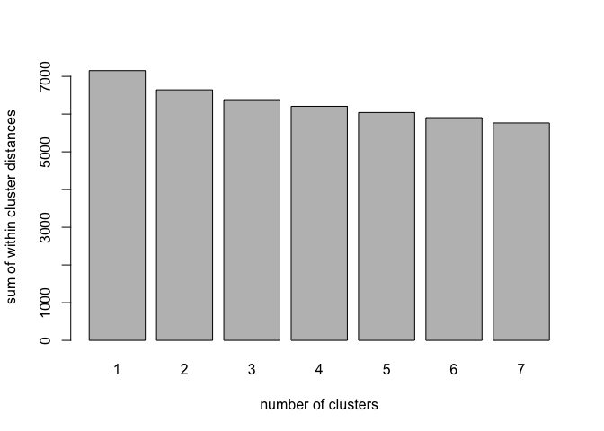
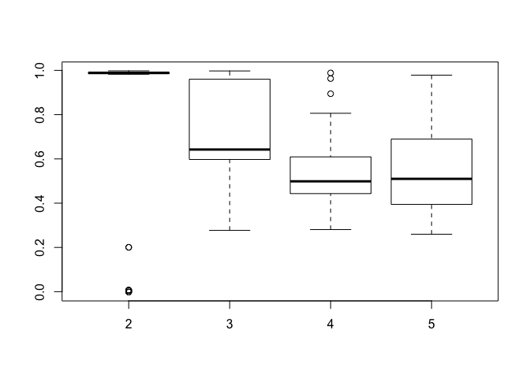
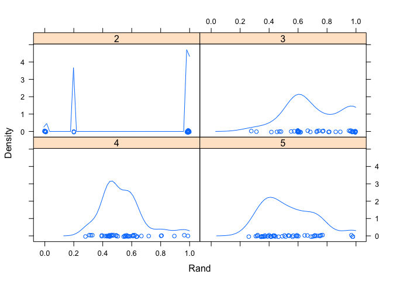
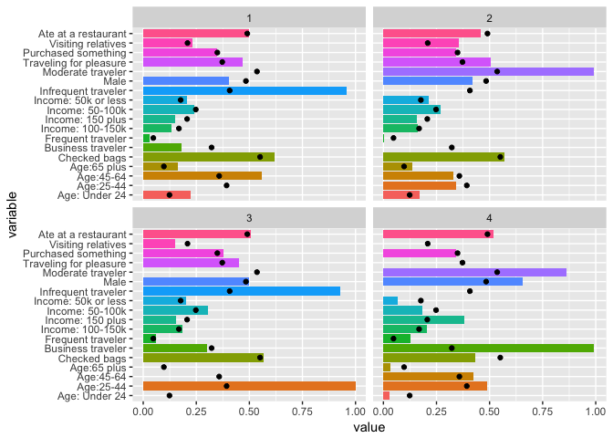
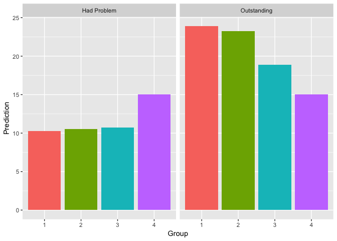

K Means Clustering
================
Will Doyle

Introduction
============

K means clustering is an example of *unsupervised learning*, a set of techniques used to identify patterns of association within a dataset that are not driven by the analyst. This technique is employed when it is strongly suspected that there are latent classifications of individuals in a dataset, but those classifications are unknown.

There are many types of unsupervised learning---this is a very active area of development in data science. K-means is among the simplest, and is relatively easy to explain. It's also pretty good--- it tends to get decent answers. K-means proceeds by finding some number (K) groups of observations that are quite similar to one another, but quite different from other groups of observations. Similarity in this case is defined as having minimum variation within the group. The way this is done in practice is to start by randomly assigning each observation to a cluster, then to calculate the cluster centroid, which is the means of the variables used for the algorithm. Next, assign each observation to the cluster centroid which is closest to its means. This continues until no more changes are possible.

If the data have clear underlying partitions, then the cluster assignment will be pretty stable. If not, then each time you run this algorithm, you could get different answers. There are solutions to this problem we'll go over, but please remember this basic fact about K-means clustering, which is different than any of the algorithms we cover in this class:

*K MEANS CLUSTERING IN ITS BASIC FORM CAN GIVE YOU DIFFERENT ANSWERS EACH TIME YOUR RUN IT*.

In our example today, we're going to take survey data from a group of passengers who were going through San Francisco international airport over the course of a week. The goal is to identify groups of passengers. Once we've identified these groups, we'll use group membership to predict a couple of outcomes: whether or not the passenger had a problem, and whether or not the passenger said they had an outstanding experience.

``` r
rm(list=ls())
library(tidyverse)
```

    ## Loading tidyverse: ggplot2
    ## Loading tidyverse: tibble
    ## Loading tidyverse: tidyr
    ## Loading tidyverse: readr
    ## Loading tidyverse: purrr
    ## Loading tidyverse: dplyr

    ## Conflicts with tidy packages ----------------------------------------------

    ## filter(): dplyr, stats
    ## lag():    dplyr, stats

``` r
library(stats)
library(flexclust)
```

    ## Loading required package: grid

    ## Loading required package: lattice

    ## Loading required package: modeltools

    ## Loading required package: stats4

``` r
library(ggplot2)
library(dummies)
```

    ## dummies-1.5.6 provided by Decision Patterns

``` r
library(LICORS)
library(knitr)
library(modelr)
```

The SFO survey data is pretty standard survey data, the kind you might get back from surveymonkey or qualtrics or other similar survey software. To work with this data, many of the categorical responses need to be changed to dummy variables. The `dummy` package can take a categorical response and turn it into a series of dummy variables. We can then grab those dummy variables and add them to the original dataset. I used the codebook to figure out what the various responses mean.

First, I load the dataset.

``` r
#customer survey from SFO
sf<-read_csv("sfo_survey.csv")
```

    ## Parsed with column specification:
    ## cols(
    ##   .default = col_integer(),
    ##   CCGID = col_character(),
    ##   DEST = col_character(),
    ##   Q1 = col_character(),
    ##   Q1MIL = col_character(),
    ##   DEPTIME = col_time(format = ""),
    ##   PASSTIME = col_character(),
    ##   PASSMIN = col_character(),
    ##   Q13A3 = col_character(),
    ##   Q18STATE = col_character(),
    ##   Q18COUNTRY = col_character()
    ## )

    ## See spec(...) for full column specifications.

    ## Warning in rbind(names(probs), probs_f): number of columns of result is not
    ## a multiple of vector length (arg 1)

    ## Warning: 33 parsing failures.
    ## row # A tibble: 5 x 5 col     row    col               expected actual             file expected   <int>  <chr>                  <chr>  <chr>            <chr> actual 1  1167 Q18ZIP no trailing characters Z94720 'sfo_survey.csv' file 2  1408 Q18ZIP no trailing characters Z94705 'sfo_survey.csv' row 3  1603 Q18ZIP no trailing characters  -3321 'sfo_survey.csv' col 4  1686 Q18ZIP no trailing characters Z94501 'sfo_survey.csv' expected 5  2558 Q18ZIP no trailing characters Z92129 'sfo_survey.csv'
    ## ... ................. ... ............................................................. ........ ............................................................. ...... ............................................................. .... ............................................................. ... ............................................................. ... ............................................................. ........ .............................................................
    ## See problems(...) for more details.

``` r
names(sf)<-tolower(names(sf))
```

Now, I'm going to use the `dummy` command from the `dummies` package to convert a factor variable (in this case, `purpose`, the purpose of the trip, to a series of dummy variables, which will be stored in a matrix called `purpose_mat`. Each column of `purpose_mat` has a binary variable, one for each level of the original factor variable.

``` r
#Why are you traveling? 
table(sf$purpose)
```

    ## Warning: Unknown or uninitialised column: 'purpose'.

    ## < table of extent 0 >

``` r
sf$purpose<-sf$q2_1
  purpose.mat<-dummy(sf$purpose)
  sf$business<-purpose.mat[,1]
  sf$pleasure<-purpose.mat[,2]
  sf$relatives<-purpose.mat[,3]
```

Next I repeat this process for the variable measuring how the person arrived at the airport.

``` r
#How did you get here?
sf$how_get<-sf$q3_1
  how_get.mat<-dummy(sf$how_get)
  sf$drove<-how_get.mat[,1]
  sf$dropped.off<-how_get.mat[,2]
  sf$connect<-how_get.mat[,3]
  sf$taxi<-how_get.mat[,4]
```

I'm going to convert a few variables to binary using a simpler logic approach, where true evaluates to 1 and everthing else is 0.

``` r
#Checked Bags?
sf$bags<-0
  sf$bags[sf$q4a==1]<-1

#Buy something in store?
sf$purchase<-0
  sf$purchase[sf$q4b==1]<-1

#Ate at a restaurant?
sf$resta<-0
  sf$resta[sf$q4c==1]<-1

#Frequent Flyer?
sf$freq_fly<-sf$q7

#Just today
sf$infreq<-0
  sf$infreq[sf$freq_fly==1]<-1

#Not very frequent
sf$mod_travel<-0
  sf$mod_travel[sf$freq_fly%in% c(2,3,4) ]<-1

#Very Fequent
sf$freq<-0
  sf$freq[sf$freq_fly>=5]<-1
```

Age has a series of categories, which I simplify below.

``` r
#Age
sf$age<-sf$q19

#24 or less
sf$age24less<-0
sf$age24less[sf$age%in%c(1,2)]<-1

#25-44
sf$age2544<-0
sf$age2544[sf$age%in%c(3,4)]<-1

#45-64
sf$age4564<-0
sf$age4564[sf$age%in%c(5,6)]<-1

#65+
sf$age65p<-0
sf$age65p[sf$age==7]<-1

#Male
sf$gender<-sf$q20
sf$male<-0
sf$male[sf$gender==1]<-1

#income
sf$income<-sf$q21
income.mat<-dummy(sf$income)
sf$inc50less<-income.mat[,2]
sf$inc50100<-income.mat[,3]
sf$inc100150<-income.mat[,4]
sf$inc150p<-income.mat[,5]

#Outcomes: problems
sf$problems<-sf$q16
sf$hadproblem<-0
sf$hadproblem[sf$problems==1]<-1

#Outcomes: outstanding aiprot
sf$outstanding<-0
sf$outstanding[sf$q8n==5]<-1
```

Now I'm ready to put together my analysis data set.

``` r
#Clustering data
clus.data<-data.frame(sf$business,
                      sf$pleasure,
                      sf$relatives,
                      sf$infreq,
                      sf$mod_travel,
                      sf$freq,
                      sf$bags,
                      sf$male,
                      sf$inc50less,
                      sf$inc50100,
                      sf$inc100150,
                      sf$inc150p,
                      sf$age24less,
                      sf$age2544,
                      sf$age4564,
                      sf$age65p,
                      sf$purchase,
                      sf$resta
                      )
```

Quick Exercise: Add in a dummy variable for international flights only
----------------------------------------------------------------------

Determining the Number of Clusters
==================================

The first step in running cluster analysis is to figure out how many clusters are needed. It's generally assumed that there are at least 3 clusters, but it's not easy to think about how many more might be needed.

The `stepFlexClust` command can be helpful here. What it will do is to run a cluster analysis a certain number of times for a certain number of clusters, choosing the best fit (minimum distance) from each set of runs for each number of clusters. We can then take a look at the distances generated and plot them.

``` r
#Test to see how many clusters are needed
c.test<-stepFlexclust(clus.data,k=2:7,nrep=20)
```

    ## 2 :
    ## 3 :
    ## 4 :
    ## 5 :
    ## 6 :
    ## 7 :

``` r
c.test
```

    ## stepFlexclust object of family 'kmeans' 
    ## 
    ## call:
    ## stepFlexclust(x = clus.data, k = 2:7, nrep = 20)
    ## 
    ##   iter converged  distsum
    ## 1   NA        NA 7152.029
    ## 2    9      TRUE 6642.461
    ## 3   13      TRUE 6381.596
    ## 4   16      TRUE 6205.498
    ## 5   17      TRUE 6040.884
    ## 6   24      TRUE 5906.052
    ## 7   18      TRUE 5765.537

``` r
plot(c.test)
```



It's not super clear where the cutoff should be for this data. The distances drop off by about 170 for a few steps, then decline to a drop of 150 or so. I'm going to choose 4 as the number of clusters, but it's fairly arbitrary. In general, a smaller number will result in a more tractable and stable solution.

Conducting K-Means Clustering
=============================

I'm going to run the `cclust` command twice, specifying that it should use 4 clusters, and the manhattan distance metric, which is scale-invariant.

``` r
# Cluster analysis
c1<-cclust(clus.data,k=4,dist="manhattan")
c1
```

    ## kcca object of family 'kmedians' 
    ## 
    ## call:
    ## cclust(x = clus.data, k = 4, dist = "manhattan")
    ## 
    ## cluster sizes:
    ## 
    ##    1    2    3    4 
    ##  983 1333  907  649

``` r
c1<-cclust(clus.data,k=4,dist="manhattan")
c1
```

    ## kcca object of family 'kmedians' 
    ## 
    ## call:
    ## cclust(x = clus.data, k = 4, dist = "manhattan")
    ## 
    ## cluster sizes:
    ## 
    ##    1    2    3    4 
    ## 1131 1385  890  466

Hmm, this gave us WAY different answers. Here's why-- the data aren't strongly separated by various groups, so it depends where the starting points were.

To visualize this, we'll use the `bootFlexclust` command, which will run the clustering algorithm on a subset of the data a certain number of times. This is called bootstrapping, and it shares many properties in common with cross-fold validation from last time. I'm going to do this for four different numbers of groups, from 2 through 5, then visualize the results.

``` r
c1a<-bootFlexclust(x=clus.data,k=c(2,3,4,5),nboot = 50,verbose = TRUE)
```

``` r
plot(c1a)
```



``` r
densityplot(c1a)
```



With two groups, the cluster locations are pretty stable. At 3 they spread out. With 4 and five there appear to be some relatively steady points, but still it's pretty spread out.

Okay, so that's no good. What to do? Well, one thing to do is to apply this to a dataset with clearer groups. But, we're going to plow on regardless. If we really want to find stable groupings, we need to find a way to converge on a stable classification into groups.

The `kmeanspp` (stands for k-means ++) command will repeat the kmeans clustering algorithm with different starting points until it converges on a stable solution. It basically repeats the process we saw above, but with the intention of getting to a stable solution.

``` r
c2<-kmeanspp(clus.data,k=4,start="random",iter.max=1000,nstart=50)
table(c2$cluster)
```

    ## 
    ##    1    2    3    4 
    ## 1025 1328  642  877

``` r
c3<-kmeanspp(clus.data,k=5,start="random",iter.max=1000,nstart=50)
table(c3$cluster)
```

    ## 
    ##   1   2   3   4   5 
    ## 806 744 812 930 580

Notice how the sample sizes in each group are identical, although the group numbers (which are arbitrary) are different after each run.

*Quick Exercise:* run again with 5 clusters

Understanding cluster assignments
=================================

So now what? We need to figure out what these clusters mean by inspecting them as a function of the constituent variables.

``` r
#Add predictions
clus.data$cluster<-c2$cluster

#Examine relationship of cluster assignment to chars.
mycols<-c("Group 1","Group 2", "Group 3","Group 4")

#Frequency of travel
pt<-prop.table(table(clus.data$cluster,clus.data$sf.freq),margin=1)
```

To create a nice table, we need to generate both row names and column names. We'll also convert to percentages.

``` r
rownames(pt)<-mycols
pt<-pt*100
pt<-round(pt,1)
```

The `kable` command will give us a nice looking table.

Group membership by frequent traveler status
--------------------------------------------

``` r
kable(pt,row.names = TRUE,col.names = c("Not a frequent traveler","Frequent traveler"))
```

|         |  Not a frequent traveler|  Frequent traveler|
|---------|------------------------:|------------------:|
| Group 1 |                     97.0|                3.0|
| Group 2 |                     99.8|                0.2|
| Group 3 |                     94.1|                5.9|
| Group 4 |                     87.2|               12.8|

It looks like one group has more frequent travelers than the others

``` r
pt<-prop.table(table(clus.data$cluster,clus.data$sf.mod_travel),margin=1)

rownames(pt)<-mycols
pt<-pt*100
pt<-round(pt,1)
```

Group membership by moderate traveler status
--------------------------------------------

``` r
kable(pt,row.names = TRUE,col.names = c("Not a moderate traveler","Moderate traveler"))
```

|         |  Not a moderate traveler|  Moderate traveler|
|---------|------------------------:|------------------:|
| Group 1 |                    100.0|                0.0|
| Group 2 |                      0.7|               99.3|
| Group 3 |                    100.0|                0.0|
| Group 4 |                     13.8|               86.2|

That samge group also has many more moderate travelers.

``` r
#Age
prop.table(table(clus.data$cluster,clus.data$sf.age2544),margin=1)
```

    ##    
    ##             0         1
    ##   1 1.0000000 0.0000000
    ##   2 0.6596386 0.3403614
    ##   3 0.0000000 1.0000000
    ##   4 0.5131129 0.4868871

``` r
prop.table(table(clus.data$cluster,clus.data$sf.age4564),margin=1)
```

    ##    
    ##             0         1
    ##   1 0.4419512 0.5580488
    ##   2 0.6686747 0.3313253
    ##   3 1.0000000 0.0000000
    ##   4 0.5746864 0.4253136

``` r
#Reason for travel
pt<-prop.table(table(clus.data$cluster,clus.data$sf.business),margin=1)

rownames(pt)<-mycols
pt<-pt*100
pt<-round(pt,1)
```

Group membership by reason for travel
-------------------------------------

``` r
kable(pt,row.names = TRUE,col.names = c("Not a business traveler","Business traveler"))
```

|         |  Not a business traveler|  Business traveler|
|---------|------------------------:|------------------:|
| Group 1 |                     82.0|               18.0|
| Group 2 |                    100.0|                0.0|
| Group 3 |                     69.9|               30.1|
| Group 4 |                      0.8|               99.2|

Now we're getting somehwere: One group is overwhelmingly composed of business travlers, and is much more likely to include frequent or moderate travelers.

``` r
#Income
prop.table(table(clus.data$cluster,clus.data$sf.inc150p),margin=1)
```

    ##    
    ##             0         1
    ##   1 0.8478049 0.1521951
    ##   2 0.8426205 0.1573795
    ##   3 0.8457944 0.1542056
    ##   4 0.6168757 0.3831243

``` r
#Checked bags?
prop.table(table(clus.data$cluster,clus.data$sf.bags),margin=1)
```

    ##    
    ##             0         1
    ##   1 0.3834146 0.6165854
    ##   2 0.4307229 0.5692771
    ##   3 0.4330218 0.5669782
    ##   4 0.5678449 0.4321551

The clearest separation by far is the business travel difference, with some differences by frequency of travel as well.

``` r
#summarize groups

var.means<-colMeans(clus.data)

## Drop the cluster means
var.means<-var.means[-(length(var.means))]
```

Summarizing group characteristics by cluster
============================================

It's really important to figure out what the clusters look like. The code below will summarize all of the contributing variables for each cluster, then create a plot that shows the mean of each variable within each cluster.

First, we do our normal `summarize` command, but this time over every variable in the analysis dataset, using `summarize_all` and `funs(mean)`.

``` r
#Summarize groups by cluster
sum1<-clus.data%>%group_by(cluster)%>%summarize_all(funs(mean),na.rm=TRUE)
sum1
```

    ## # A tibble: 4 x 19
    ##   cluster sf.business sf.pleasure sf.relatives sf.infreq sf.mod_travel
    ##     <int>       <dbl>       <dbl>        <dbl>     <dbl>         <dbl>
    ## 1       1   0.1795122   0.4673171    0.2321951 0.9580488     0.0000000
    ## 2       2   0.0000000   0.5075301    0.3561747 0.0000000     0.9932229
    ## 3       3   0.3006231   0.4501558    0.1510903 0.9267913     0.0000000
    ## 4       4   0.9920182   0.0000000    0.0000000 0.0000000     0.8620296
    ## # ... with 13 more variables: sf.freq <dbl>, sf.bags <dbl>, sf.male <dbl>,
    ## #   sf.inc50less <dbl>, sf.inc50100 <dbl>, sf.inc100150 <dbl>,
    ## #   sf.inc150p <dbl>, sf.age24less <dbl>, sf.age2544 <dbl>,
    ## #   sf.age4564 <dbl>, sf.age65p <dbl>, sf.purchase <dbl>, sf.resta <dbl>

Now we'll `gather` everything, so that we have just two variables: the proportion (as a number) and the variable (as a character).

``` r
sum2<-gather(sum1,-cluster,key=variable,value=value)
sum2
```

    ## # A tibble: 72 x 3
    ##    cluster     variable     value
    ##      <int>        <chr>     <dbl>
    ##  1       1  sf.business 0.1795122
    ##  2       2  sf.business 0.0000000
    ##  3       3  sf.business 0.3006231
    ##  4       4  sf.business 0.9920182
    ##  5       1  sf.pleasure 0.4673171
    ##  6       2  sf.pleasure 0.5075301
    ##  7       3  sf.pleasure 0.4501558
    ##  8       4  sf.pleasure 0.0000000
    ##  9       1 sf.relatives 0.2321951
    ## 10       2 sf.relatives 0.3561747
    ## # ... with 62 more rows

``` r
sum_total<-clus.data%>%summarize_all(funs(mean))
sum_total<-gather(sum_total,key=variable,value=overall_mean)
sum2<-left_join(sum2,sum_total,by="variable")
```

``` r
sum2<-sum2%>%group_by(variable)%>%mutate(varmeans=mean(value))
```

Survey Responses by Cluster
---------------------------

``` r
variable_labels<-rev(c("Ate at a restaurant",
                   "Visiting relatives",
                   "Purchased something",
                   "Traveling for pleasure",
                   "Moderate traveler",
                   "Male",
                   "Infrequent traveler",
                   "Income: 50k or less",
                   "Income: 50-100k",
                   "Income: 150 plus",
                   "Income: 100-150k",
                   "Frequent traveler",
                   "Business traveler",
                   "Checked bags",
                   "Age:65 plus",
                   "Age:45-64",
                   "Age:25-44",
                   "Age: Under 24"
))

#Plot characteristics by cluster
g1<-ggplot(data=sum2,aes(y=value,x=variable,fill=variable))
g1<-g1+geom_bar(stat="identity")+coord_flip()+theme(legend.position="none")
g1<-g1+scale_x_discrete(labels=variable_labels)
g1<-g1+geom_point(data=sum2,aes(y=overall_mean,x=variable))
g1<-g1+facet_wrap(~cluster)
```

Survey responses by classification
----------------------------------

``` r
g1
```



Quick Exercise: Name these clusters for me
------------------------------------------

Modeling Using Clusters
=======================

Once you have clusters, then you can use these as independent variables to predict various outcomes. For instance, in our data, which clusters are likely to have problems in the airport? We'll use a logistic regression to see which groups are more likely to report having a problem.

``` r
#Modeling: figure out which clusters are associated with different outcomes
#Did you have a problem? 
sf$cluster<-c2$cluster

mod1<-glm(hadproblem~as.factor(cluster),data=sf,family=binomial(link="logit"));summary(mod1)
```

    ## 
    ## Call:
    ## glm(formula = hadproblem ~ as.factor(cluster), family = binomial(link = "logit"), 
    ##     data = sf)
    ## 
    ## Deviance Residuals: 
    ##     Min       1Q   Median       3Q      Max  
    ## -0.5712  -0.4765  -0.4720  -0.4658   2.1330  
    ## 
    ## Coefficients:
    ##                     Estimate Std. Error z value Pr(>|z|)    
    ## (Intercept)         -2.11844    0.10091 -20.993  < 2e-16 ***
    ## as.factor(cluster)2 -0.01994    0.13478  -0.148  0.88239    
    ## as.factor(cluster)3 -0.04801    0.16453  -0.292  0.77044    
    ## as.factor(cluster)4  0.38786    0.13821   2.806  0.00501 ** 
    ## ---
    ## Signif. codes:  0 '***' 0.001 '**' 0.01 '*' 0.05 '.' 0.1 ' ' 1
    ## 
    ## (Dispersion parameter for binomial family taken to be 1)
    ## 
    ##     Null deviance: 2774.5  on 3871  degrees of freedom
    ## Residual deviance: 2761.7  on 3868  degrees of freedom
    ## AIC: 2769.7
    ## 
    ## Number of Fisher Scoring iterations: 4

``` r
#Create basic hypothetical dataset
hypo_data<-sf%>%data_grid(.model=mod1,cluster=1:4)

pred1<-predict(mod1,type="response",newdata=hypo_data)

pred1<-sort(pred1,decreasing = FALSE)

pred1<-pred1*100
```

What this shows is that 10 percent of this group is predicted to have a problem-- likely a group to focus on for improved customer service.

Or, on the other hand, which group might be more likely to rate the experience as outstanding?

``` r
#Overall rating=outstanding
mod2<-glm(outstanding~as.factor(cluster),data=sf,family=binomial(link="logit"));summary(mod2)
```

    ## 
    ## Call:
    ## glm(formula = outstanding ~ as.factor(cluster), family = binomial(link = "logit"), 
    ##     data = sf)
    ## 
    ## Deviance Residuals: 
    ##     Min       1Q   Median       3Q      Max  
    ## -0.7391  -0.7278  -0.6463  -0.5712   1.9461  
    ## 
    ## Coefficients:
    ##                     Estimate Std. Error z value Pr(>|z|)    
    ## (Intercept)         -1.15804    0.07324 -15.812  < 2e-16 ***
    ## as.factor(cluster)2 -0.03520    0.09788  -0.360   0.7191    
    ## as.factor(cluster)3 -0.30192    0.12469  -2.421   0.0155 *  
    ## as.factor(cluster)4 -0.57255    0.11951  -4.791 1.66e-06 ***
    ## ---
    ## Signif. codes:  0 '***' 0.001 '**' 0.01 '*' 0.05 '.' 0.1 ' ' 1
    ## 
    ## (Dispersion parameter for binomial family taken to be 1)
    ## 
    ##     Null deviance: 3963.8  on 3871  degrees of freedom
    ## Residual deviance: 3932.7  on 3868  degrees of freedom
    ## AIC: 3940.7
    ## 
    ## Number of Fisher Scoring iterations: 4

``` r
pred2<-(predict(mod2,type="response",newdata=hypo_data))*100

pred_data<-data.frame(c((1:4),(1:4)),c(rep("Had Problem",4),rep("Outstanding",4)),
                      c(pred1,pred2))

names(pred_data)<-c("Cluster","Outcome","Prediction")
```

``` r
#Plot predictions from two different outcome models
g1<-ggplot(pred_data,aes(x=as.factor(Cluster),y=Prediction,fill=as.factor(Cluster)))
g1<-g1+geom_bar(stat="identity")
g1<-g1+facet_wrap(~Outcome)
g1<-g1+theme(legend.position="none")+xlab("Group")
g1
```



The plot shows which groups are predicted to report a problem, and which ones are more likely to say they had an outstanding experiences. Does this make sense?

Quick Exercise: Create a model for found it easy to get around airport
----------------------------------------------------------------------
