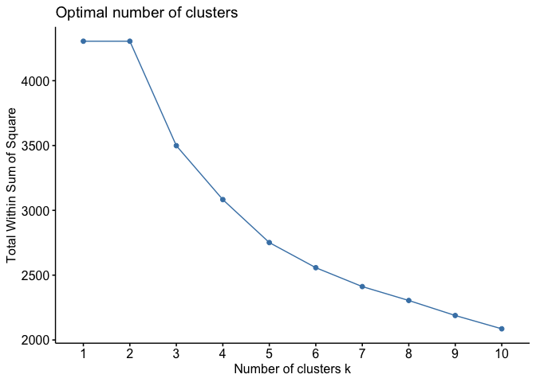
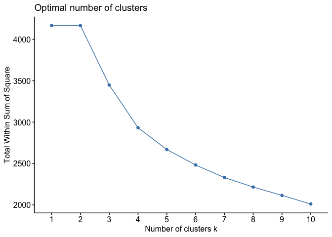
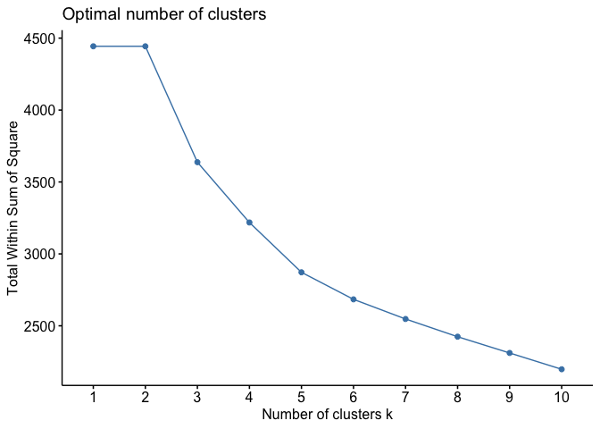
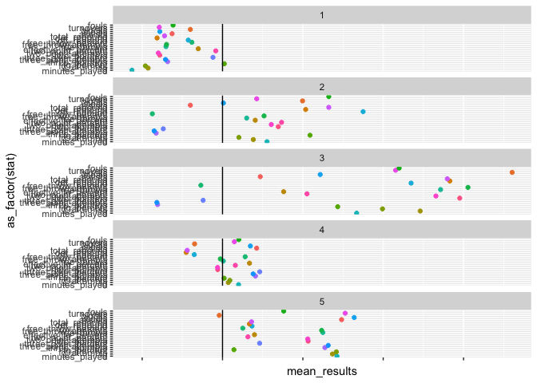
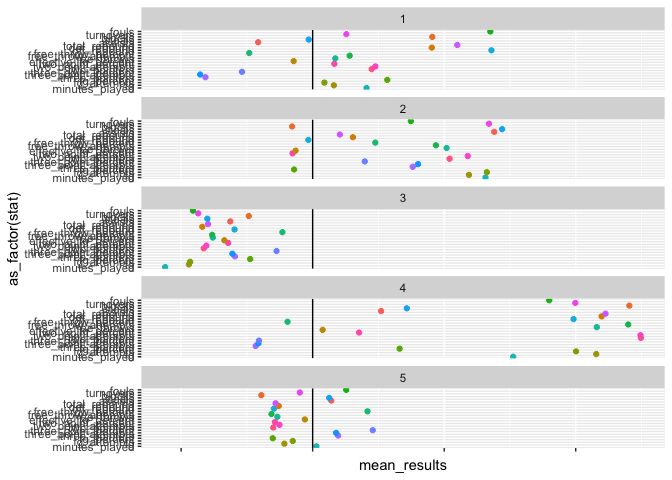
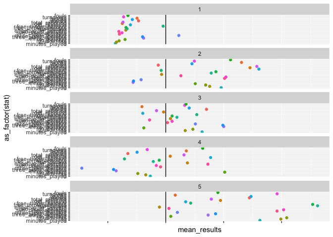
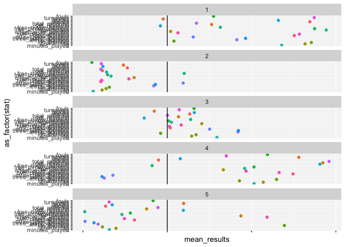
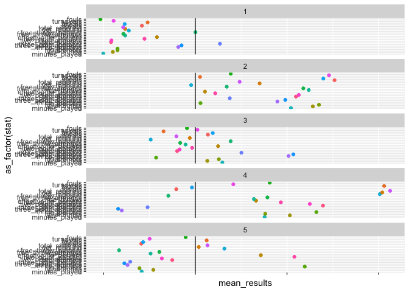

Clustering– in class
================
Doyle
11/21/2019

``` r
library(tidyverse)
```

    ## ── Attaching packages ──────────────────────────────────────────────────────────────────── tidyverse 1.2.1 ──

    ## ✔ ggplot2 3.2.1     ✔ purrr   0.3.3
    ## ✔ tibble  2.1.3     ✔ dplyr   0.8.3
    ## ✔ tidyr   1.0.0     ✔ stringr 1.4.0
    ## ✔ readr   1.3.1     ✔ forcats 0.4.0

    ## ── Conflicts ─────────────────────────────────────────────────────────────────────── tidyverse_conflicts() ──
    ## ✖ dplyr::filter() masks stats::filter()
    ## ✖ dplyr::lag()    masks stats::lag()

``` r
library(purrr)
library(LICORS)
library(factoextra)
```

    ## Welcome! Related Books: `Practical Guide To Cluster Analysis in R` at https://goo.gl/13EFCZ

For this in class work, complete the following steps:

1.  Subset the data for 1995,2000,2005,2010 and 2015

<!-- end list -->

``` r
load("nba.Rdata")
```

``` r
nba_df_all%>%
  filter(minutes_played>500)%>%
  group_by(player,year)%>%
  top_n(1,minutes_played)%>%
  ungroup()%>%
   select(player,
         pts,
         minutes_played,
         fg,
         fg_attempts,
         fg_percent,
         three_pointers,
         three_point_attempts,
         three_point_percent,
         two_pointers,
         two_point_attempts,
         two_point_percent,
         effective_fg_percent,
         free_throws,
         free_throw_attempts,
         free_throw_percent,
         off_rebound,
         def_rebound,
         total_rebound,
         assists,
         steals,
         blocks,
         turnovers,
         fouls,
         year)%>%
               drop_na()->nba_df_sub

player_id<-nba_df_sub$player
points<-nba_df_sub$pts
year<-nba_df_sub$year

# Scale the dataset
nba_df_sub%>%
  select(-player,-pts,-year)%>%
  mutate_all(scale)->nba_df_cluster_all

nba_df_cluster_all$year<-year
```

1.  Repeat the steps in K-means clustering from Tuesday for each year.

This generates the elbow plots. Notice that it begins by splitting the
overall dataset by year, then mapping that to the function using map(~).
The data frame is implied as ., and the `select` operator drops the
year, which we don’t want in the analysis. The output is saved as a data
frame using `as_tibble`. The elements of the data frame can then be
called.

``` r
nba_df_cluster_all%>%
split(.$year)%>%  
map(~fviz_nbclust(select(.,-year),
             FUNcluster=kmeanspp,
             method="wss"))->elbow_plots

elbow_plots$`1995`
```

<!-- -->

``` r
elbow_plots$`2000`
```

<!-- -->

``` r
elbow_plots$`2005`
```

<!-- -->

``` r
elbow_plots$`2010`
```

<!-- -->

``` r
elbow_plots$`2015`
```

<!-- -->

This runs the kmeans clustering. I’m using the same basic approach as
above. This time the output is a dataframe of all of the results of the
kmeans. The first row of that data frame is the cluster assignments.
When “unnested” these form a vector of cluster assignments that can be
added to the original dataset.

``` r
nba_df_cluster_all%>%
  mutate_all(.funs=as.numeric)%>% # Make sure everything is numeric
  split(.$year)%>% # Split by year
  map(~kmeanspp(data=select(.,-year),k=5,n=100,nstart=50))%>% # Apply kmeans clustering to each year
  as_tibble()->cluster_tbl ## output results as data frame

## Clusters are in row 1, unlist and add back to analysis dataset 

nba_df_cluster_all$cluster<-unlist(cluster_tbl[1,])
```

1.  Try to describe the groups you identify for each of the five years.

Again, same basic setup. This time though, I’m going to turn the
plotting code chunk into a function, then apply that function to each
element of the list created by splitting the data frame by year. Again
writing the results using `as_tibble` I get a data frame of plots, which
can then be called.

``` r
plot_cluster<-function(x){
  ## plot function: x is a data frame, that includes a cluster variable
  x%>%
  group_by(cluster)%>%
  summarize_all(.funs=mean)%>%
  pivot_longer(cols=(-cluster),
               names_to="stat",
               values_to = "mean_results")->clus_results

gg<-ggplot(clus_results,aes(x=as_factor(stat),
                            y=mean_results,
                            color=stat))
gg<-gg+geom_point()
gg<-gg+facet_wrap(~cluster,ncol=1)
gg<-gg+geom_hline(yintercept=0)
gg<-gg+coord_flip()
gg<-gg+theme(legend.position = "none")
gg<-gg+theme(axis.text.x=element_text(size=.75))
gg
}

nba_df_cluster_all%>%
  split(.$year)%>%
  map(~plot_cluster(select(.,-year)))%>%
  as_tibble()->plots


plots$`1995`
```

<!-- -->

``` r
plots$`2000`
```

<!-- -->

``` r
plots$`2005`
```

<!-- -->

``` r
plots$`2010`
```

<!-- -->

``` r
plots$`2015`
```

<!-- -->

1.  Generate a predictive analysis predicting points scored based only
    on the groups identified for each year.

And one more time, this time

``` r
nba_df_cluster_all$pts<-points

nba_df_cluster_all%>%
  split(.$year)%>%
  map(~lm(pts~as.factor(cluster),data=select(.,-year)))%>%
  as_tibble()->reg_results
  
summary(reg_results$`1995`)
```

    ## 
    ## Call:
    ## lm(formula = pts ~ as.factor(cluster), data = select(., -year))
    ## 
    ## Residuals:
    ##     Min      1Q  Median      3Q     Max 
    ## -508.40 -111.70  -12.58  122.30  563.42 
    ## 
    ## Coefficients:
    ##                     Estimate Std. Error t value Pr(>|t|)    
    ## (Intercept)           304.70      19.78   15.41   <2e-16 ***
    ## as.factor(cluster)2   532.88      34.48   15.45   <2e-16 ***
    ## as.factor(cluster)3  1480.70      66.19   22.37   <2e-16 ***
    ## as.factor(cluster)4   460.82      30.62   15.05   <2e-16 ***
    ## as.factor(cluster)5  1066.00      35.48   30.05   <2e-16 ***
    ## ---
    ## Signif. codes:  0 '***' 0.001 '**' 0.01 '*' 0.05 '.' 0.1 ' ' 1
    ## 
    ## Residual standard error: 199.7 on 276 degrees of freedom
    ## Multiple R-squared:  0.8167, Adjusted R-squared:  0.814 
    ## F-statistic: 307.4 on 4 and 276 DF,  p-value: < 2.2e-16

``` r
summary(reg_results$`2000`)
```

    ## 
    ## Call:
    ## lm(formula = pts ~ as.factor(cluster), data = select(., -year))
    ## 
    ## Residuals:
    ##     Min      1Q  Median      3Q     Max 
    ## -609.48 -124.01  -12.36  107.63  728.52 
    ## 
    ## Coefficients:
    ##                     Estimate Std. Error t value Pr(>|t|)    
    ## (Intercept)           751.24      29.25  25.682  < 2e-16 ***
    ## as.factor(cluster)2   509.24      40.24  12.654  < 2e-16 ***
    ## as.factor(cluster)3  -452.75      36.63 -12.360  < 2e-16 ***
    ## as.factor(cluster)4   892.26      54.72  16.304  < 2e-16 ***
    ## as.factor(cluster)5  -121.23      38.30  -3.165  0.00172 ** 
    ## ---
    ## Signif. codes:  0 '***' 0.001 '**' 0.01 '*' 0.05 '.' 0.1 ' ' 1
    ## 
    ## Residual standard error: 206.8 on 279 degrees of freedom
    ## Multiple R-squared:  0.8057, Adjusted R-squared:  0.8029 
    ## F-statistic: 289.2 on 4 and 279 DF,  p-value: < 2.2e-16

``` r
summary(reg_results$`2005`)
```

    ## 
    ## Call:
    ## lm(formula = pts ~ as.factor(cluster), data = select(., -year))
    ## 
    ## Residuals:
    ##    Min     1Q Median     3Q    Max 
    ## -584.3 -146.4  -16.4  119.2  604.7 
    ## 
    ## Coefficients:
    ##                     Estimate Std. Error t value Pr(>|t|)    
    ## (Intercept)           348.76      18.87   18.48  < 2e-16 ***
    ## as.factor(cluster)2   678.34      37.05   18.31  < 2e-16 ***
    ## as.factor(cluster)3   553.28      30.85   17.94  < 2e-16 ***
    ## as.factor(cluster)4   191.84      36.40    5.27 2.65e-07 ***
    ## as.factor(cluster)5  1348.57      43.58   30.94  < 2e-16 ***
    ## ---
    ## Signif. codes:  0 '***' 0.001 '**' 0.01 '*' 0.05 '.' 0.1 ' ' 1
    ## 
    ## Residual standard error: 204.1 on 293 degrees of freedom
    ## Multiple R-squared:  0.8021, Adjusted R-squared:  0.7994 
    ## F-statistic: 296.9 on 4 and 293 DF,  p-value: < 2.2e-16

``` r
summary(reg_results$`2010`)
```

    ## 
    ## Call:
    ## lm(formula = pts ~ as.factor(cluster), data = select(., -year))
    ## 
    ## Residuals:
    ##     Min      1Q  Median      3Q     Max 
    ## -601.30 -160.43  -22.71  116.85  966.36 
    ## 
    ## Coefficients:
    ##                     Estimate Std. Error t value Pr(>|t|)    
    ## (Intercept)          1505.64      38.87  38.730  < 2e-16 ***
    ## as.factor(cluster)2 -1119.81      44.89 -24.946  < 2e-16 ***
    ## as.factor(cluster)3  -642.51      45.58 -14.095  < 2e-16 ***
    ## as.factor(cluster)4  -348.34      52.52  -6.633  1.5e-10 ***
    ## as.factor(cluster)5 -1084.98      50.09 -21.662  < 2e-16 ***
    ## ---
    ## Signif. codes:  0 '***' 0.001 '**' 0.01 '*' 0.05 '.' 0.1 ' ' 1
    ## 
    ## Residual standard error: 223.3 on 305 degrees of freedom
    ## Multiple R-squared:  0.748,  Adjusted R-squared:  0.7447 
    ## F-statistic: 226.3 on 4 and 305 DF,  p-value: < 2.2e-16

``` r
summary(reg_results$`2015`)
```

    ## 
    ## Call:
    ## lm(formula = pts ~ as.factor(cluster), data = select(., -year))
    ## 
    ## Residuals:
    ##     Min      1Q  Median      3Q     Max 
    ## -603.62 -139.87  -13.53  115.47  895.13 
    ## 
    ## Coefficients:
    ##                     Estimate Std. Error t value Pr(>|t|)    
    ## (Intercept)           332.53      18.24  18.227  < 2e-16 ***
    ## as.factor(cluster)2   989.34      36.72  26.943  < 2e-16 ***
    ## as.factor(cluster)3   470.34      27.07  17.374  < 2e-16 ***
    ## as.factor(cluster)4   756.09      43.08  17.550  < 2e-16 ***
    ## as.factor(cluster)5   147.43      32.65   4.515  8.8e-06 ***
    ## ---
    ## Signif. codes:  0 '***' 0.001 '**' 0.01 '*' 0.05 '.' 0.1 ' ' 1
    ## 
    ## Residual standard error: 199 on 332 degrees of freedom
    ## Multiple R-squared:  0.7448, Adjusted R-squared:  0.7417 
    ## F-statistic: 242.2 on 4 and 332 DF,  p-value: < 2.2e-16
