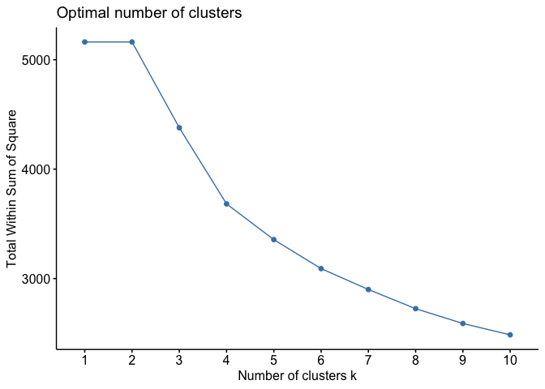
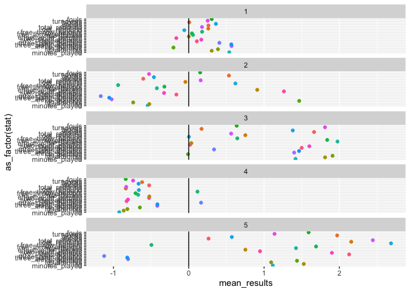

Unsupervised Learning
================
Doyle
11/13/2019

# Introduction

K means clustering is an example of *unsupervised learning*, a set of
techniques used to identify patterns of association within a dataset
that are not driven by the analyst. This technique is employed when it
is strongly suspected that there are latent classifications of
individuals in a dataset, but those classifications are unknown.

There are many types of unsupervised learning—this is a very active area
of development in data science. K-means is among the simplest, and is
relatively easy to explain. It’s also pretty good— it tends to get
decent answers. K-means proceeds by finding some number (K) groups of
observations that are quite similar to one another, but quite different
from other groups of observations. Similarity in this case is defined as
having minimum variation within the group. The way this is done in
practice is to start by randomly assigning each observation to a
cluster, then to calculate the cluster centroid, which is the means of
the variables used for the algorithm. Next, assign each observation to
the cluster centroid which is closest to its means. This continues until
no more changes are possible.

If the data have clear underlying partitions, then the cluster
assignment will be pretty stable. If not, then each time you run this
algorithm, you could get different answers. There are solutions to this
problem we’ll go over, but please remember this basic fact about K-means
clustering, which is different than any of the algorithms we cover in
this class:

*K MEANS CLUSTERING IN ITS BASIC FORM CAN GIVE YOU DIFFERENT ANSWERS
EACH TIME YOUR RUN IT*.

We’ll be working with the NBA data that we scraped earlier this semester
to define different classes of players based on their characteristics
across the season. Based on these results, we’ll see what we can figure
out about the likely points contribution of players from different
groups.

There are two new libraries today: LICORS and factoextra.

``` r
library(knitr)
library(tidyverse)
```

    ## ── Attaching packages ──────────────────────────────── tidyverse 1.2.1 ──

    ## ✔ ggplot2 3.2.1     ✔ purrr   0.3.2
    ## ✔ tibble  2.1.3     ✔ dplyr   0.8.3
    ## ✔ tidyr   1.0.0     ✔ stringr 1.4.0
    ## ✔ readr   1.3.1     ✔ forcats 0.4.0

    ## ── Conflicts ─────────────────────────────────── tidyverse_conflicts() ──
    ## ✖ dplyr::filter() masks stats::filter()
    ## ✖ dplyr::lag()    masks stats::lag()

``` r
library(LICORS)
library(factoextra)
```

    ## Welcome! Related Books: `Practical Guide To Cluster Analysis in R` at https://goo.gl/13EFCZ

``` r
library(cluster)
```

We’ll pull in the NBA dataset, which has data on all players from all
teams from 1993 to 2018

``` r
load("nba.Rdata")
```

We’re going to subset the data to players who put in at least 500
minutes, which is roughly averaging half a quarter per game (6\*82=492).

``` r
nba_df_all%>%
  filter(year==2018,minutes_played>500)%>%
  group_by(player)%>%
  top_n(1,minutes_played)%>%
  ungroup()%>%
   select(player,
         pts,
         minutes_played,
         fg,
         fg_attempts,
         fg_percent,
         three_pointers,
         three_point_attempts,
         three_point_percent,
         two_pointers,
         two_point_attempts,
         two_point_percent,
         effective_fg_percent,
         free_throws,
         free_throw_attempts,
         free_throw_percent,
         off_rebound,
         def_rebound,
         total_rebound,
         assists,
         steals,
         blocks,
         turnovers,
         fouls)%>%
               drop_na()->nba_df_sub


## Remove points scored and player name
player_id<-nba_df_sub$player
points<-nba_df_sub$pts

nba_df_sub%>%
  select(-player,-pts)%>%
  mutate_all(scale)->nba_df_cluster

# Set player name as row id
rownames(nba_df_cluster)<-player_id
```

    ## Warning: Setting row names on a tibble is deprecated.

The first step in running cluster analysis is to figure out how many
clusters are needed. It’s generally assumed that there are at least 3
clusters, but it’s not easy to think about how many more might be
needed.

The `stepFlexClust` command can be helpful here. What it will do is to
run a cluster analysis a certain number of times for a certain number of
clusters, choosing the best fit (minimum distance) from each set of runs
for each number of clusters. We can then take a look at the distances
generated and plot them.

``` r
fviz_nbclust(nba_df_cluster,
             FUNcluster=kmeanspp,
             method="wss")
```

<!-- -->

The silhouette method measures the fit of each observation within each
cluster. The resulting ploit generally provides a pretty clear
indication of the appropriate number of clusters.

``` r
fviz_nbclust(nba_df_cluster,
             FUNcluster=kmeanspp,
             method="silhouette")
```

<!-- -->

The `kmeanspp` (stands for k-means ++) command will repeat the kmeans
clustering algorithm with different starting points until it converges
on a stable solution. It basically repeats the process we saw above, but
with the intention of getting to a stable solution. This is generally a
preferred way of generating cluster assignments.

``` r
c1<-kmeanspp(nba_df_cluster,
             k=5,
             iter.max=1000,
             nstart=50)
```

Notice how the sample sizes in each group are identical, although the
group numbers (which are arbitrary) are different after each run.

We can visualize the groups by taking a look at a plot of the various
groupings, labeled by player name.

``` r
fviz_cluster(c1,
             data=nba_df_cluster,
             labelsize = 6)
```

<!-- -->

# Understanding cluster assignments

So now what? We need to figure out what these clusters mean by
inspecting them as a function of the constituent variables.

The code below summarizes the average of each variable in the analysis
within each cluster. We need to take a look at these and figure out what
they mean.

``` r
nba_df_cluster$cluster<-c1$cluster

nba_df_cluster%>%
  group_by(cluster)%>%
  summarize_all(.funs=mean)%>%
  pivot_longer(cols=(-cluster),
               names_to="stat",
               values_to = "mean_results")->clus_results
```

We can then plot the averages for each cluster. Remember that these are
standardized variables, so they will generally range from -3 to 3, with
0 being the average.

``` r
gg<-ggplot(clus_results,aes(x=as_factor(stat),
                            y=mean_results,
                            color=stat))
gg<-gg+geom_point()
gg<-gg+facet_wrap(~cluster,ncol=1)
gg<-gg+geom_hline(yintercept=0)
gg<-gg+coord_flip()
gg<-gg+theme(legend.position = "none")
gg
```

<!-- -->

We can also go back to the original dataset and see if we can make sense
of individaul assignments. The code below shows how each player has been
assigned, selecting the top ten field goal scorers from each cluster.

``` r
nba_df_sub$cluster<-c1$cluster
nba_df_sub$player<-player_id

nba_df_sub%>%
  group_by(cluster)%>%
  mutate(rank=rank(-fg,ties.method = "first"))%>%
  filter(rank<=10)%>%
  select(player,fg,total_rebound,rank)%>%
  arrange(cluster,-fg)%>%kable()
```

    ## Adding missing grouping variables: `cluster`

| cluster | player                 |  fg | total\_rebound | rank |
| ------: | :--------------------- | --: | -------------: | ---: |
|       1 | Klay Thompson          | 575 |            277 |    1 |
|       1 | Carmelo Anthony        | 472 |            453 |    2 |
|       1 | Kyle Kuzma             | 468 |            483 |    3 |
|       1 | Otto Porter            | 445 |            492 |    4 |
|       1 | Gary Harris            | 440 |            176 |    5 |
|       1 | Jordan Clarkson        | 430 |            217 |    6 |
|       1 | E’Twaun Moore          | 423 |            238 |    7 |
|       1 | Thaddeus Young         | 421 |            512 |    8 |
|       1 | Buddy Hield            | 416 |            307 |    9 |
|       1 | Eric Gordon            | 415 |            170 |   10 |
|       2 | Montrezl Harrell       | 348 |            306 |    1 |
|       2 | Robin Lopez            | 342 |            290 |    2 |
|       2 | John Collins           | 314 |            541 |    3 |
|       2 | John Henson            | 287 |            513 |    4 |
|       2 | Michael Kidd-Gilchrist | 282 |            302 |    5 |
|       2 | Mike Scott             | 276 |            247 |    6 |
|       2 | Dwight Powell          | 255 |            444 |    7 |
|       2 | Jakob Poeltl           | 253 |            393 |    8 |
|       2 | Pascal Siakam          | 253 |            364 |    9 |
|       2 | Dewayne Dedmon         | 250 |            489 |   10 |
|       3 | LeBron James           | 857 |            709 |    1 |
|       3 | Russell Westbrook      | 757 |            804 |    2 |
|       3 | Bradley Beal           | 683 |            363 |    3 |
|       3 | CJ McCollum            | 667 |            321 |    4 |
|       3 | James Harden           | 651 |            389 |    5 |
|       3 | DeMar DeRozan          | 645 |            315 |    6 |
|       3 | Victor Oladipo         | 640 |            390 |    7 |
|       3 | Kevin Durant           | 630 |            464 |    8 |
|       3 | Damian Lillard         | 621 |            325 |    9 |
|       3 | Jrue Holiday           | 615 |            365 |   10 |
|       4 | Avery Bradley          | 259 |            116 |    1 |
|       4 | Reggie Jackson         | 246 |            125 |    2 |
|       4 | Malcolm Brogdon        | 244 |            156 |    3 |
|       4 | Doug McDermott         | 237 |            200 |    4 |
|       4 | Troy Daniels           | 232 |            127 |    5 |
|       4 | C.J. Miles             | 227 |            152 |    6 |
|       4 | Raymond Felton         | 224 |            156 |    7 |
|       4 | Ian Clark              | 222 |            127 |    8 |
|       4 | Tyler Ulis             | 214 |            128 |    9 |
|       4 | Bryn Forbes            | 209 |            110 |   10 |
|       5 | Anthony Davis          | 780 |            832 |    1 |
|       5 | Giannis Antetokounmpo  | 742 |            753 |    2 |
|       5 | LaMarcus Aldridge      | 687 |            635 |    3 |
|       5 | Karl-Anthony Towns     | 639 |           1012 |    4 |
|       5 | Ben Simmons            | 544 |            659 |    5 |
|       5 | T.J. Warren            | 529 |            333 |    6 |
|       5 | Joel Embiid            | 510 |            690 |    7 |
|       5 | Dwight Howard          | 506 |           1012 |    8 |
|       5 | Nikola Jokic           | 504 |            803 |    9 |
|       5 | Julius Randle          | 504 |            654 |   10 |

# Modeling Using Clusters

Once you have clusters, then you can use these as independent variables
to predict various outcomes.

``` r
nba_df_sub$pts<-points

mod1<-lm(pts~as_factor(cluster),data=nba_df_sub)

summary(mod1)
```

    ## 
    ## Call:
    ## lm(formula = pts ~ as_factor(cluster), data = nba_df_sub)
    ## 
    ## Residuals:
    ##     Min      1Q  Median      3Q     Max 
    ## -549.78 -145.71  -10.52  130.08  822.35 
    ## 
    ## Coefficients:
    ##                     Estimate Std. Error t value Pr(>|t|)    
    ## (Intercept)           855.52      18.18  47.059   <2e-16 ***
    ## as_factor(cluster)2  -398.11      34.06 -11.688   <2e-16 ***
    ## as_factor(cluster)3   702.26      40.01  17.552   <2e-16 ***
    ## as_factor(cluster)4  -493.05      26.10 -18.894   <2e-16 ***
    ## as_factor(cluster)5   432.13      48.61   8.889   <2e-16 ***
    ## ---
    ## Signif. codes:  0 '***' 0.001 '**' 0.01 '*' 0.05 '.' 0.1 ' ' 1
    ## 
    ## Residual standard error: 201.6 on 335 degrees of freedom
    ## Multiple R-squared:  0.7838, Adjusted R-squared:  0.7812 
    ## F-statistic: 303.6 on 4 and 335 DF,  p-value: < 2.2e-16
