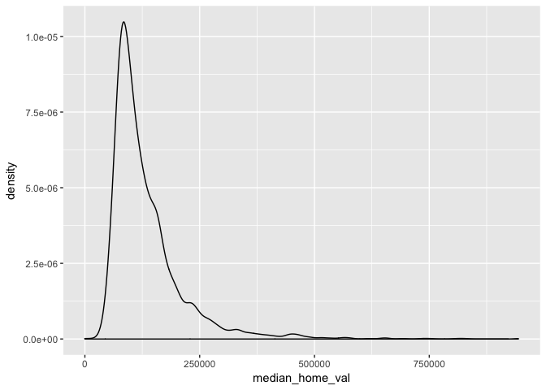
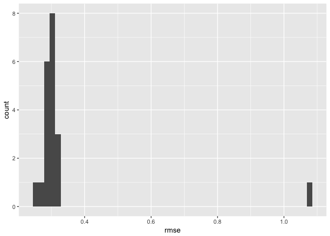
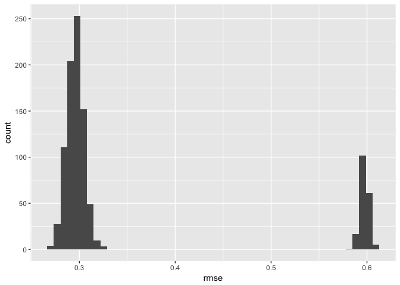
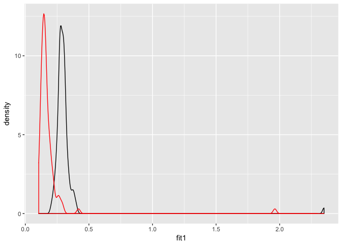

Multiple Models
================
Will Doyle

Introduction
------------

The essence of prediction is discovering the extent to which our models can predict outcomes for data that does not come from our sample. Many times this process is temporal. We fit a model to data from one time period, then take predictors from a subsequent time period to come up with a prediction in the future. For instance, we might use data on team performance to predict the likely winners and losers for upcoming soccer games.

This process does not have to be temporal. We can also have data that is out of sample because it hadn't yet been collected when our first data was collected, or we can also have data that is out of sample because we designated it as out of sample.

The data that is used to generate our predictions is known as *training* data. The idea is that this is the data used to train our model, to let it know what the relationship is between our predictors and our outcome. So far, we have worked mostly with training data.

That data that is used to validate our predictions is known as *testing* data. With testing data, we take our trained model and see how good it is at predicting outcomes using out of sample data.

One very simple approach to this would be to cut our data in half. This is what we've done so far. We could then train our model on half the data, then test it on the other half. This would tell us whether our measure of model fit (e.g. rmse, auc) is similar or different when we apply our model to out of sample data.

But this would only be a "one-shot" approach. It would be better to do this multiple times, cutting the data into two parts: training and testing, then fitting the model to the training data, and then checking its predictions against the testing data. That way, we could generate a large number of rmse's to see how well the model fits on lots of different possible out-of-sample predictions.

This process is called *cross-fold validation*, and it involves two important decisions: first, how will the data be cut, and how many times will the validation run.

We start by getting a new package `modelr` which has nice facilities for creating cross fold validation-ready datasets.

``` r
library(tidyverse)
```

    ## Loading tidyverse: ggplot2
    ## Loading tidyverse: tibble
    ## Loading tidyverse: tidyr
    ## Loading tidyverse: readr
    ## Loading tidyverse: purrr
    ## Loading tidyverse: dplyr

    ## Conflicts with tidy packages ----------------------------------------------

    ## filter(): dplyr, stats
    ## lag():    dplyr, stats

``` r
library(modelr)
library(caret)
```

    ## Loading required package: lattice

    ## 
    ## Attaching package: 'caret'

    ## The following object is masked from 'package:purrr':
    ## 
    ##     lift

Next we load the quickfacts data, which contains county-by-county information. We're going to create a simple model that predicts median home values in the county as a function of education, home ownership and income.

``` r
load("quickfacts.Rdata")
qf<-qf%>%
  select(median_home_val,median_hh_inc,coll_grad_pc,homeown_rate,per_capita_inc,white_pc)%>%
       mutate_all(funs(as.numeric))%>%tbl_df()
```

A quick look at this outcome lets us know it needs to be logged.

``` r
gg<-ggplot(data=qf,aes(median_home_val))
gg<-gg+geom_density()
gg
```



We can run this model on the full dataset, but we're not taking advantage of the idea of cross-validation.

``` r
## Define the model
mod1_formula<-formula("log(median_home_val+1)~
              log(median_hh_inc+1)+
              homeown_rate+
              coll_grad_pc")
           
## Run the model against all of the data
basic.mod<-lm(mod1_formula,
              data=qf); summary(basic.mod)
```

    ## 
    ## Call:
    ## lm(formula = mod1_formula, data = qf)
    ## 
    ## Residuals:
    ##      Min       1Q   Median       3Q      Max 
    ## -12.8120  -0.1734   0.0068   0.1814   1.3031 
    ## 
    ## Coefficients:
    ##                          Estimate Std. Error t value Pr(>|t|)    
    ## (Intercept)             2.1088598  0.3825071   5.513  3.8e-08 ***
    ## log(median_hh_inc + 1)  0.8735845  0.0388893  22.463  < 2e-16 ***
    ## homeown_rate           -0.0026253  0.0009254  -2.837  0.00458 ** 
    ## coll_grad_pc            0.0204320  0.0011213  18.221  < 2e-16 ***
    ## ---
    ## Signif. codes:  0 '***' 0.001 '**' 0.01 '*' 0.05 '.' 0.1 ' ' 1
    ## 
    ## Residual standard error: 0.3713 on 3191 degrees of freedom
    ## Multiple R-squared:  0.4864, Adjusted R-squared:  0.4859 
    ## F-statistic:  1007 on 3 and 3191 DF,  p-value: < 2.2e-16

The `crossv_kfold` command creates a list of datasets from our original dataset, each of which contains a testing and training dataset. The proportion of cases held out for testing is determined by the number of folds: 10 folds would indicate 1/10 of the data to be held out.

``` r
qf_cf<-qf%>%
  crossv_kfold(20)
qf_cf
```

    ## # A tibble: 20 x 3
    ##             train           test   .id
    ##            <list>         <list> <chr>
    ##  1 <S3: resample> <S3: resample>    01
    ##  2 <S3: resample> <S3: resample>    02
    ##  3 <S3: resample> <S3: resample>    03
    ##  4 <S3: resample> <S3: resample>    04
    ##  5 <S3: resample> <S3: resample>    05
    ##  6 <S3: resample> <S3: resample>    06
    ##  7 <S3: resample> <S3: resample>    07
    ##  8 <S3: resample> <S3: resample>    08
    ##  9 <S3: resample> <S3: resample>    09
    ## 10 <S3: resample> <S3: resample>    10
    ## 11 <S3: resample> <S3: resample>    11
    ## 12 <S3: resample> <S3: resample>    12
    ## 13 <S3: resample> <S3: resample>    13
    ## 14 <S3: resample> <S3: resample>    14
    ## 15 <S3: resample> <S3: resample>    15
    ## 16 <S3: resample> <S3: resample>    16
    ## 17 <S3: resample> <S3: resample>    17
    ## 18 <S3: resample> <S3: resample>    18
    ## 19 <S3: resample> <S3: resample>    19
    ## 20 <S3: resample> <S3: resample>    20

The `qf_cf` dataset is now a nested dataset, as described in (Chapter 25)\[<http://r4ds.had.co.nz/many-models.html>\] of the Wickham 4ds book.

The next bit of code is key. It starts by converting all of the individual training datasets to tibbles. Then the model is run on each training dataset. Then apply the predictions from the model to each testing dataset, and finally pull the rmse from each of the testing datasets.

``` r
rmse_mod1<-qf_cf %>% 
  mutate(train = map(train, as_tibble)) %>% ## Convert to tibbles
  mutate(model = map(train, ~ lm(mod1_formula,
                                 data = .))) %>%
  mutate(rmse = map2_dbl(model, test, rmse)) %>% ## apply model, get rmse
  select(.id, rmse) ## pull just id and rmse 
```

The resulting dataset includes the id for the cross validation and the rmse. We can summarize and plot this new data frame to see what our likely range of rmse happens to be.

``` r
summary(rmse_mod1$rmse)
```

    ##    Min. 1st Qu.  Median    Mean 3rd Qu.    Max. 
    ##  0.2567  0.2882  0.2977  0.3345  0.3080  1.0810

``` r
gg<-ggplot(rmse_mod1,aes(rmse))
gg<-gg+geom_histogram(bins=50)
gg
```



As this shows, the rmse for the crossfold validations goes from a minimum of 0.26 to a maximum of 1.08, with a median of 0.3.

*Quick Exercise* Run the crossfold command again, but this time only 5 times. Then run it again, but 20 times. What happens to the RMSE?

Full Cross Validation
---------------------

The `crossv_mc` command provides for a generalization of the crossfold command. For this command, we can specify the proportion to be randomly held out in each iteration, via `test=p` where `p` is the proportion to be held out.

``` r
qf_cv<-qf%>%
  crossv_mc(n=1000,test=.2)
qf_cv
```

    ## # A tibble: 1,000 x 3
    ##             train           test   .id
    ##            <list>         <list> <chr>
    ##  1 <S3: resample> <S3: resample>  0001
    ##  2 <S3: resample> <S3: resample>  0002
    ##  3 <S3: resample> <S3: resample>  0003
    ##  4 <S3: resample> <S3: resample>  0004
    ##  5 <S3: resample> <S3: resample>  0005
    ##  6 <S3: resample> <S3: resample>  0006
    ##  7 <S3: resample> <S3: resample>  0007
    ##  8 <S3: resample> <S3: resample>  0008
    ##  9 <S3: resample> <S3: resample>  0009
    ## 10 <S3: resample> <S3: resample>  0010
    ## # ... with 990 more rows

The `qf_cv` dataset is a dataset of 1000x2 datasets, with each row containing a training and testing dataset. The testing dataset is .2 of the sample, but it's different each time.

Now we use the same approach, but with the MUCH larger qf\_cv dataset.

``` r
mod1_rmse_cv<-qf_cv %>% 
  mutate(train = map(train, as_tibble)) %>% ## Convert to tibbles
  mutate(model = map(train, ~ lm(mod1_formula, data = .)))%>%
  mutate(rmse = map2_dbl(model, test, rmse))%>% 
  select(.id, rmse) ## pull just id and rmse 

mod1_rmse_cv
```

    ## # A tibble: 1,000 x 2
    ##      .id      rmse
    ##    <chr>     <dbl>
    ##  1  0001 0.5967243
    ##  2  0002 0.5977499
    ##  3  0003 0.2833174
    ##  4  0004 0.2765504
    ##  5  0005 0.5960774
    ##  6  0006 0.3056898
    ##  7  0007 0.6046630
    ##  8  0008 0.2861512
    ##  9  0009 0.2794121
    ## 10  0010 0.2971823
    ## # ... with 990 more rows

``` r
summary(mod1_rmse_cv$rmse)
```

    ##    Min. 1st Qu.  Median    Mean 3rd Qu.    Max. 
    ##  0.2695  0.2914  0.2981  0.3518  0.3079  0.6087

``` r
gg<-ggplot(mod1_rmse_cv,aes(rmse))
gg<-gg+geom_histogram(bins=50)
gg
```



Comparing Performance of Models
-------------------------------

It's the comparison between two different cross-validated models that we're really interested in. We want to know which model will perform best in predicting the future.

``` r
## Define the model
mod2_formula<-formula("log(median_home_val+1)~
              log(median_hh_inc+1)+
              homeown_rate+
              coll_grad_pc+
              log(per_capita_inc+1)")


## Define the model
mod3_formula<-formula("log(median_home_val+1)~
              log(median_hh_inc+1)+
              homeown_rate+
              coll_grad_pc+
              log(per_capita_inc+1)+
              white_pc")

mod2_rmse_cv<-qf_cv %>% 
  mutate(train = map(train, as_tibble)) %>% ## Convert to tibbles
  mutate(model = map(train, ~ lm(mod3_formula, data = .)))%>%
  mutate(rmse = map2_dbl(model, test, rmse))%>% 
  select(.id, rmse) ## pull just id and rmse 

mod2_rmse_cv      
```

    ## # A tibble: 1,000 x 2
    ##      .id      rmse
    ##    <chr>     <dbl>
    ##  1  0001 0.5977565
    ##  2  0002 0.5981225
    ##  3  0003 0.2869531
    ##  4  0004 0.2751201
    ##  5  0005 0.5969838
    ##  6  0006 0.3058068
    ##  7  0007 0.6047554
    ##  8  0008 0.2862293
    ##  9  0009 0.2801581
    ## 10  0010 0.2973356
    ## # ... with 990 more rows

``` r
summary(mod2_rmse_cv$rmse)
```

    ##    Min. 1st Qu.  Median    Mean 3rd Qu.    Max. 
    ##  0.2696  0.2921  0.2989  0.3526  0.3090  0.6098

``` r
summary(mod1_rmse_cv$rmse)
```

    ##    Min. 1st Qu.  Median    Mean 3rd Qu.    Max. 
    ##  0.2695  0.2914  0.2981  0.3518  0.3079  0.6087

``` r
gg<-ggplot(mod2_rmse_cv,aes(x=rmse))
gg<-gg+geom_density()
gg<-gg+geom_density(data=mod1_rmse_cv,aes(x=rmse),color="blue")
gg
```


*Not So quick exercise* From the qf dataset, choose new variables to add to your model to predict median home values. Compare the distribution of rmse from your model to the ones I obtained.

Model Tuning
------------

In model tuning, we try to find the best possible model among various candidates. There are two basic ways to acomplish this. One is using a model that the analyst has identified, either through theory or practice or both, as a good model to predict the outcome. This has been our basic perspective in this class. However, this model can still be refined by choosing the best candidate after having trained it on multiple training datasets, by choosing the model parameters that minimize RMSE. The code below, based on the `train` function from the `caret` library does just that.

``` r
load("quickfacts.Rdata")

qf<-qf%>%
  select(median_home_val,
         median_hh_inc,
         coll_grad_pc,
         homeown_rate,
         per_capita_inc,
         white_pc,
         persons_below_poverty,
         person_per_hh)%>%
       mutate_all(funs(as.numeric))%>%tbl_df()

fitControl <- trainControl(method = "cv",
                            n=100,
                            p=)

qf$log_median_home_val<-log(qf$median_home_val+1)


fit1<-train(mod1_formula,
            data=qf,
            method="lm",
            trControl=fitControl)
```

Machine Learning
----------------

Of course, we can also just let the computer choose a model from a set of candidate variables. Below, I use stepqise regression, which involves proposing candidate variables and evaluating their ability to lower RMSE, as the basis for choosing a "best" model.

``` r
#Tuning model parameters

fit2<-train(log_median_home_val~.,
            data=qf,
            method="glmStepAIC",
            trControl=fitControl,
            verbose=TRUE)
```

    ## Loading required package: MASS

    ## 
    ## Attaching package: 'MASS'

    ## The following object is masked from 'package:dplyr':
    ## 
    ##     select

    ## Start:  AIC=145.2
    ## .outcome ~ median_home_val + median_hh_inc + coll_grad_pc + homeown_rate + 
    ##     per_capita_inc + white_pc + persons_below_poverty + person_per_hh
    ## 
    ##                         Df Deviance     AIC
    ## - person_per_hh          1   192.74  143.46
    ## - white_pc               1   192.84  145.06
    ## <none>                       192.73  145.20
    ## - median_hh_inc          1   193.50  155.88
    ## - homeown_rate           1   194.82  177.30
    ## - persons_below_poverty  1   197.53  221.02
    ## - coll_grad_pc           1   199.65  254.87
    ## - per_capita_inc         1   204.76  334.87
    ## - median_home_val        1   432.09 2697.62
    ## 
    ## Step:  AIC=143.46
    ## .outcome ~ median_home_val + median_hh_inc + coll_grad_pc + homeown_rate + 
    ##     per_capita_inc + white_pc + persons_below_poverty
    ## 
    ##                         Df Deviance     AIC
    ## - white_pc               1   192.85  143.16
    ## <none>                       192.74  143.46
    ## - median_hh_inc          1   194.49  170.00
    ## - homeown_rate           1   194.83  175.49
    ## - persons_below_poverty  1   197.97  226.07
    ## - coll_grad_pc           1   199.68  253.37
    ## - per_capita_inc         1   210.23  416.19
    ## - median_home_val        1   434.93 2716.37
    ## 
    ## Step:  AIC=143.16
    ## .outcome ~ median_home_val + median_hh_inc + coll_grad_pc + homeown_rate + 
    ##     per_capita_inc + persons_below_poverty
    ## 
    ##                         Df Deviance     AIC
    ## <none>                       192.85  143.16
    ## - median_hh_inc          1   194.49  168.00
    ## - homeown_rate           1   195.36  182.13
    ## - coll_grad_pc           1   199.97  255.87
    ## - persons_below_poverty  1   200.07  257.48
    ## - per_capita_inc         1   210.34  415.88
    ## - median_home_val        1   435.07 2715.40
    ## Start:  AIC=137.7
    ## .outcome ~ median_home_val + median_hh_inc + coll_grad_pc + homeown_rate + 
    ##     per_capita_inc + white_pc + persons_below_poverty + person_per_hh
    ## 
    ##                         Df Deviance     AIC
    ## - person_per_hh          1   192.23  135.98
    ## <none>                       192.21  137.70
    ## - white_pc               1   192.37  138.30
    ## - median_hh_inc          1   193.02  148.87
    ## - homeown_rate           1   194.34  170.50
    ## - persons_below_poverty  1   196.95  212.72
    ## - coll_grad_pc           1   199.45  252.61
    ## - per_capita_inc         1   204.64  333.86
    ## - median_home_val        1   431.70 2694.98
    ## 
    ## Step:  AIC=135.98
    ## .outcome ~ median_home_val + median_hh_inc + coll_grad_pc + homeown_rate + 
    ##     per_capita_inc + white_pc + persons_below_poverty
    ## 
    ##                         Df Deviance     AIC
    ## <none>                       192.23  135.98
    ## - white_pc               1   192.38  136.39
    ## - median_hh_inc          1   194.03  163.46
    ## - homeown_rate           1   194.35  168.68
    ## - persons_below_poverty  1   197.37  217.43
    ## - coll_grad_pc           1   199.49  251.17
    ## - per_capita_inc         1   210.24  417.29
    ## - median_home_val        1   434.89 2716.21
    ## Start:  AIC=149.5
    ## .outcome ~ median_home_val + median_hh_inc + coll_grad_pc + homeown_rate + 
    ##     per_capita_inc + white_pc + persons_below_poverty + person_per_hh
    ## 
    ##                         Df Deviance     AIC
    ## - person_per_hh          1   192.94  147.67
    ## - white_pc               1   193.05  149.43
    ## <none>                       192.93  149.50
    ## - median_hh_inc          1   193.78  161.29
    ## - homeown_rate           1   195.02  181.60
    ## - persons_below_poverty  1   197.66  224.00
    ## - coll_grad_pc           1   199.81  258.23
    ## - per_capita_inc         1   205.11  341.17
    ## - median_home_val        1   432.79 2702.92
    ## 
    ## Step:  AIC=147.67
    ## .outcome ~ median_home_val + median_hh_inc + coll_grad_pc + homeown_rate + 
    ##     per_capita_inc + white_pc + persons_below_poverty
    ## 
    ##                         Df Deviance     AIC
    ## - white_pc               1   193.05  147.47
    ## <none>                       192.94  147.67
    ## - median_hh_inc          1   194.77  175.42
    ## - homeown_rate           1   195.03  179.70
    ## - persons_below_poverty  1   198.11  229.21
    ## - coll_grad_pc           1   199.85  256.87
    ## - per_capita_inc         1   210.50  421.15
    ## - median_home_val        1   435.82 2722.97
    ## 
    ## Step:  AIC=147.47
    ## .outcome ~ median_home_val + median_hh_inc + coll_grad_pc + homeown_rate + 
    ##     per_capita_inc + persons_below_poverty
    ## 
    ##                         Df Deviance     AIC
    ## <none>                       193.05  147.47
    ## - median_hh_inc          1   194.77  173.42
    ## - homeown_rate           1   195.57  186.43
    ## - coll_grad_pc           1   200.14  259.49
    ## - persons_below_poverty  1   200.21  260.60
    ## - per_capita_inc         1   210.62  420.97
    ## - median_home_val        1   435.99 2722.19
    ## Start:  AIC=143.57
    ## .outcome ~ median_home_val + median_hh_inc + coll_grad_pc + homeown_rate + 
    ##     per_capita_inc + white_pc + persons_below_poverty + person_per_hh
    ## 
    ##                         Df Deviance     AIC
    ## - person_per_hh          1   192.59  141.84
    ## <none>                       192.57  143.57
    ## - white_pc               1   192.70  143.63
    ## - median_hh_inc          1   193.36  154.50
    ## - homeown_rate           1   194.66  175.77
    ## - persons_below_poverty  1   197.39  219.74
    ## - coll_grad_pc           1   199.79  257.91
    ## - per_capita_inc         1   204.76  335.65
    ## - median_home_val        1   430.75 2687.95
    ## 
    ## Step:  AIC=141.84
    ## .outcome ~ median_home_val + median_hh_inc + coll_grad_pc + homeown_rate + 
    ##     per_capita_inc + white_pc + persons_below_poverty
    ## 
    ##                         Df Deviance     AIC
    ## - white_pc               1   192.70  141.73
    ## <none>                       192.59  141.84
    ## - median_hh_inc          1   194.37  169.02
    ## - homeown_rate           1   194.68  173.96
    ## - persons_below_poverty  1   197.83  224.76
    ## - coll_grad_pc           1   199.82  256.50
    ## - per_capita_inc         1   210.34  418.80
    ## - median_home_val        1   433.93 2709.26
    ## 
    ## Step:  AIC=141.73
    ## .outcome ~ median_home_val + median_hh_inc + coll_grad_pc + homeown_rate + 
    ##     per_capita_inc + persons_below_poverty
    ## 
    ##                         Df Deviance     AIC
    ## <none>                       192.70  141.73
    ## - median_hh_inc          1   194.37  167.02
    ## - homeown_rate           1   195.23  180.92
    ## - persons_below_poverty  1   199.97  256.88
    ## - coll_grad_pc           1   200.13  259.41
    ## - per_capita_inc         1   210.47  418.66
    ## - median_home_val        1   434.12 2708.64
    ## Start:  AIC=145.64
    ## .outcome ~ median_home_val + median_hh_inc + coll_grad_pc + homeown_rate + 
    ##     per_capita_inc + white_pc + persons_below_poverty + person_per_hh
    ## 
    ##                         Df Deviance     AIC
    ## - person_per_hh          1   192.71  143.86
    ## <none>                       192.70  145.64
    ## - white_pc               1   192.82  145.66
    ## - median_hh_inc          1   193.52  157.17
    ## - homeown_rate           1   194.72  176.64
    ## - persons_below_poverty  1   197.50  221.57
    ## - coll_grad_pc           1   199.68  256.19
    ## - per_capita_inc         1   204.85  337.14
    ## - median_home_val        1   431.74 2695.26
    ## 
    ## Step:  AIC=143.86
    ## .outcome ~ median_home_val + median_hh_inc + coll_grad_pc + homeown_rate + 
    ##     per_capita_inc + white_pc + persons_below_poverty
    ## 
    ##                         Df Deviance     AIC
    ## - white_pc               1   192.82  143.73
    ## <none>                       192.71  143.86
    ## - median_hh_inc          1   194.54  171.72
    ## - homeown_rate           1   194.73  174.80
    ## - persons_below_poverty  1   197.96  226.88
    ## - coll_grad_pc           1   199.72  254.79
    ## - per_capita_inc         1   210.36  418.97
    ## - median_home_val        1   434.93 2716.55
    ## 
    ## Step:  AIC=143.73
    ## .outcome ~ median_home_val + median_hh_inc + coll_grad_pc + homeown_rate + 
    ##     per_capita_inc + persons_below_poverty
    ## 
    ##                         Df Deviance     AIC
    ## <none>                       192.82  143.73
    ## - median_hh_inc          1   194.54  169.72
    ## - homeown_rate           1   195.27  181.62
    ## - coll_grad_pc           1   200.02  257.66
    ## - persons_below_poverty  1   200.11  258.97
    ## - per_capita_inc         1   210.48  418.83
    ## - median_home_val        1   435.10 2715.78
    ## Start:  AIC=146.27
    ## .outcome ~ median_home_val + median_hh_inc + coll_grad_pc + homeown_rate + 
    ##     per_capita_inc + white_pc + persons_below_poverty + person_per_hh
    ## 
    ##                         Df Deviance     AIC
    ## - person_per_hh          1   192.75  144.48
    ## - white_pc               1   192.86  146.26
    ## <none>                       192.74  146.27
    ## - median_hh_inc          1   193.57  158.00
    ## - homeown_rate           1   194.83  178.48
    ## - persons_below_poverty  1   197.22  216.96
    ## - coll_grad_pc           1   199.68  256.31
    ## - per_capita_inc         1   204.60  333.15
    ## - median_home_val        1   431.61 2694.28
    ## 
    ## Step:  AIC=144.48
    ## .outcome ~ median_home_val + median_hh_inc + coll_grad_pc + homeown_rate + 
    ##     per_capita_inc + white_pc + persons_below_poverty
    ## 
    ##                         Df Deviance     AIC
    ## - white_pc               1   192.86  144.32
    ## <none>                       192.75  144.48
    ## - median_hh_inc          1   194.59  172.57
    ## - homeown_rate           1   194.84  176.60
    ## - persons_below_poverty  1   197.63  221.55
    ## - coll_grad_pc           1   199.72  254.91
    ## - per_capita_inc         1   209.89  412.01
    ## - median_home_val        1   434.68 2714.68
    ## 
    ## Step:  AIC=144.32
    ## .outcome ~ median_home_val + median_hh_inc + coll_grad_pc + homeown_rate + 
    ##     per_capita_inc + persons_below_poverty
    ## 
    ##                         Df Deviance     AIC
    ## <none>                       192.86  144.32
    ## - median_hh_inc          1   194.59  170.57
    ## - homeown_rate           1   195.39  183.60
    ## - persons_below_poverty  1   199.66  251.95
    ## - coll_grad_pc           1   200.03  257.74
    ## - per_capita_inc         1   210.03  412.08
    ## - median_home_val        1   434.87 2714.06
    ## Start:  AIC=147.33
    ## .outcome ~ median_home_val + median_hh_inc + coll_grad_pc + homeown_rate + 
    ##     per_capita_inc + white_pc + persons_below_poverty + person_per_hh
    ## 
    ##                         Df Deviance     AIC
    ## - person_per_hh          1   192.81  145.47
    ## - white_pc               1   192.91  147.14
    ## <none>                       192.80  147.33
    ## - median_hh_inc          1   193.66  159.45
    ## - homeown_rate           1   194.86  179.01
    ## - persons_below_poverty  1   197.55  222.37
    ## - coll_grad_pc           1   199.79  257.94
    ## - per_capita_inc         1   205.19  342.28
    ## - median_home_val        1   432.25 2698.99
    ## 
    ## Step:  AIC=145.47
    ## .outcome ~ median_home_val + median_hh_inc + coll_grad_pc + homeown_rate + 
    ##     per_capita_inc + white_pc + persons_below_poverty
    ## 
    ##                         Df Deviance     AIC
    ## - white_pc               1   192.91  145.17
    ## <none>                       192.81  145.47
    ## - median_hh_inc          1   194.65  173.50
    ## - homeown_rate           1   194.87  177.09
    ## - persons_below_poverty  1   198.03  227.95
    ## - coll_grad_pc           1   199.84  256.69
    ## - per_capita_inc         1   210.63  423.16
    ## - median_home_val        1   435.32 2719.34
    ## 
    ## Step:  AIC=145.17
    ## .outcome ~ median_home_val + median_hh_inc + coll_grad_pc + homeown_rate + 
    ##     per_capita_inc + persons_below_poverty
    ## 
    ##                         Df Deviance     AIC
    ## <none>                       192.91  145.17
    ## - median_hh_inc          1   194.65  171.50
    ## - homeown_rate           1   195.40  183.67
    ## - persons_below_poverty  1   200.12  259.20
    ## - coll_grad_pc           1   200.13  259.27
    ## - per_capita_inc         1   210.75  422.85
    ## - median_home_val        1   435.47 2718.42
    ## Start:  AIC=141.45
    ## .outcome ~ median_home_val + median_hh_inc + coll_grad_pc + homeown_rate + 
    ##     per_capita_inc + white_pc + persons_below_poverty + person_per_hh
    ## 
    ##                         Df Deviance     AIC
    ## - person_per_hh          1   192.46  139.66
    ## <none>                       192.44  141.45
    ## - white_pc               1   192.58  141.65
    ## - median_hh_inc          1   193.26  152.86
    ## - homeown_rate           1   194.48  172.71
    ## - persons_below_poverty  1   197.17  216.28
    ## - coll_grad_pc           1   199.42  252.12
    ## - per_capita_inc         1   204.68  334.46
    ## - median_home_val        1   431.70 2694.98
    ## 
    ## Step:  AIC=139.66
    ## .outcome ~ median_home_val + median_hh_inc + coll_grad_pc + homeown_rate + 
    ##     per_capita_inc + white_pc + persons_below_poverty
    ## 
    ##                         Df Deviance     AIC
    ## <none>                       192.46  139.66
    ## - white_pc               1   192.58  139.71
    ## - median_hh_inc          1   194.25  167.07
    ## - homeown_rate           1   194.48  170.85
    ## - persons_below_poverty  1   197.63  221.51
    ## - coll_grad_pc           1   199.46  250.79
    ## - per_capita_inc         1   210.13  415.56
    ## - median_home_val        1   434.85 2715.92
    ## Start:  AIC=148.6
    ## .outcome ~ median_home_val + median_hh_inc + coll_grad_pc + homeown_rate + 
    ##     per_capita_inc + white_pc + persons_below_poverty + person_per_hh
    ## 
    ##                         Df Deviance     AIC
    ## - person_per_hh          1   192.89  146.75
    ## - white_pc               1   192.99  148.43
    ## <none>                       192.88  148.60
    ## - median_hh_inc          1   193.72  160.40
    ## - homeown_rate           1   194.93  180.14
    ## - persons_below_poverty  1   197.67  224.29
    ## - coll_grad_pc           1   199.87  259.31
    ## - per_capita_inc         1   205.18  342.10
    ## - median_home_val        1   432.66 2701.95
    ## 
    ## Step:  AIC=146.75
    ## .outcome ~ median_home_val + median_hh_inc + coll_grad_pc + homeown_rate + 
    ##     per_capita_inc + white_pc + persons_below_poverty
    ## 
    ##                         Df Deviance     AIC
    ## - white_pc               1   192.99  146.46
    ## <none>                       192.89  146.75
    ## - median_hh_inc          1   194.69  174.16
    ## - homeown_rate           1   194.94  178.23
    ## - persons_below_poverty  1   198.15  229.85
    ## - coll_grad_pc           1   199.92  258.07
    ## - per_capita_inc         1   210.58  422.33
    ## - median_home_val        1   435.75 2722.46
    ## 
    ## Step:  AIC=146.46
    ## .outcome ~ median_home_val + median_hh_inc + coll_grad_pc + homeown_rate + 
    ##     per_capita_inc + persons_below_poverty
    ## 
    ##                         Df Deviance     AIC
    ## <none>                       192.99  146.46
    ## - median_hh_inc          1   194.69  172.16
    ## - homeown_rate           1   195.47  184.90
    ## - coll_grad_pc           1   200.21  260.64
    ## - persons_below_poverty  1   200.25  261.24
    ## - per_capita_inc         1   210.69  421.97
    ## - median_home_val        1   435.93 2721.78
    ## Start:  AIC=148.31
    ## .outcome ~ median_home_val + median_hh_inc + coll_grad_pc + homeown_rate + 
    ##     per_capita_inc + white_pc + persons_below_poverty + person_per_hh
    ## 
    ##                         Df Deviance     AIC
    ## - person_per_hh          1   192.87  146.50
    ## <none>                       192.86  148.31
    ## - white_pc               1   192.99  148.42
    ## - median_hh_inc          1   193.72  160.43
    ## - homeown_rate           1   194.91  179.71
    ## - persons_below_poverty  1   197.53  221.92
    ## - coll_grad_pc           1   199.86  259.12
    ## - per_capita_inc         1   205.09  340.78
    ## - median_home_val        1   431.73 2695.15
    ## 
    ## Step:  AIC=146.5
    ## .outcome ~ median_home_val + median_hh_inc + coll_grad_pc + homeown_rate + 
    ##     per_capita_inc + white_pc + persons_below_poverty
    ## 
    ##                         Df Deviance     AIC
    ## - white_pc               1   192.99  146.47
    ## <none>                       192.87  146.50
    ## - median_hh_inc          1   194.75  175.09
    ## - homeown_rate           1   194.91  177.83
    ## - persons_below_poverty  1   197.97  227.05
    ## - coll_grad_pc           1   199.90  257.76
    ## - per_capita_inc         1   210.55  421.89
    ## - median_home_val        1   434.77 2715.38
    ## 
    ## Step:  AIC=146.47
    ## .outcome ~ median_home_val + median_hh_inc + coll_grad_pc + homeown_rate + 
    ##     per_capita_inc + persons_below_poverty
    ## 
    ##                         Df Deviance     AIC
    ## <none>                       192.99  146.47
    ## - median_hh_inc          1   194.75  173.09
    ## - homeown_rate           1   195.48  184.97
    ## - persons_below_poverty  1   200.11  259.01
    ## - coll_grad_pc           1   200.22  260.71
    ## - per_capita_inc         1   210.68  421.87
    ## - median_home_val        1   434.98 2714.87
    ## Start:  AIC=150.19
    ## .outcome ~ median_home_val + median_hh_inc + coll_grad_pc + homeown_rate + 
    ##     per_capita_inc + white_pc + persons_below_poverty + person_per_hh
    ## 
    ##                         Df Deviance     AIC
    ## - person_per_hh          1   192.98  148.35
    ## - white_pc               1   193.10  150.18
    ## <none>                       192.97  150.19
    ## - median_hh_inc          1   193.81  161.90
    ## - homeown_rate           1   195.04  181.90
    ## - persons_below_poverty  1   197.72  225.00
    ## - coll_grad_pc           1   199.92  260.01
    ## - per_capita_inc         1   205.34  344.58
    ## - median_home_val        1   433.63 2709.06
    ## 
    ## Step:  AIC=148.35
    ## .outcome ~ median_home_val + median_hh_inc + coll_grad_pc + homeown_rate + 
    ##     per_capita_inc + white_pc + persons_below_poverty
    ## 
    ##                         Df Deviance     AIC
    ## - white_pc               1   193.10  148.21
    ## <none>                       192.98  148.35
    ## - median_hh_inc          1   194.79  175.85
    ## - homeown_rate           1   195.05  180.00
    ## - persons_below_poverty  1   198.18  230.45
    ## - coll_grad_pc           1   199.97  258.75
    ## - per_capita_inc         1   210.79  425.47
    ## - median_home_val        1   436.75 2729.72
    ## 
    ## Step:  AIC=148.21
    ## .outcome ~ median_home_val + median_hh_inc + coll_grad_pc + homeown_rate + 
    ##     per_capita_inc + persons_below_poverty
    ## 
    ##                         Df Deviance     AIC
    ## <none>                       193.10  148.21
    ## - median_hh_inc          1   194.79  173.85
    ## - homeown_rate           1   195.59  186.82
    ## - coll_grad_pc           1   200.27  261.57
    ## - persons_below_poverty  1   200.32  262.36
    ## - per_capita_inc         1   210.91  425.33
    ## - median_home_val        1   436.90 2728.79
    ## Start:  AIC=146.37
    ## .outcome ~ median_home_val + median_hh_inc + coll_grad_pc + homeown_rate + 
    ##     per_capita_inc + white_pc + persons_below_poverty + person_per_hh
    ## 
    ##                         Df Deviance     AIC
    ## - person_per_hh          1   192.77  144.76
    ## <none>                       192.74  146.37
    ## - white_pc               1   192.87  146.48
    ## - median_hh_inc          1   193.51  157.02
    ## - homeown_rate           1   194.78  177.58
    ## - persons_below_poverty  1   197.61  223.29
    ## - coll_grad_pc           1   199.76  257.44
    ## - per_capita_inc         1   204.88  337.53
    ## - median_home_val        1   431.99 2697.08
    ## 
    ## Step:  AIC=144.76
    ## .outcome ~ median_home_val + median_hh_inc + coll_grad_pc + homeown_rate + 
    ##     per_capita_inc + white_pc + persons_below_poverty
    ## 
    ##                         Df Deviance     AIC
    ## - white_pc               1   192.88  144.64
    ## <none>                       192.77  144.76
    ## - median_hh_inc          1   194.57  172.31
    ## - homeown_rate           1   194.79  175.86
    ## - persons_below_poverty  1   198.02  227.88
    ## - coll_grad_pc           1   199.78  255.82
    ## - per_capita_inc         1   210.51  421.22
    ## - median_home_val        1   435.20 2718.50
    ## 
    ## Step:  AIC=144.64
    ## .outcome ~ median_home_val + median_hh_inc + coll_grad_pc + homeown_rate + 
    ##     per_capita_inc + persons_below_poverty
    ## 
    ##                         Df Deviance     AIC
    ## <none>                       192.88  144.64
    ## - median_hh_inc          1   194.57  170.31
    ## - homeown_rate           1   195.34  182.79
    ## - coll_grad_pc           1   200.09  258.70
    ## - persons_below_poverty  1   200.18  260.20
    ## - per_capita_inc         1   210.63  421.14
    ## - median_home_val        1   435.37 2717.71
    ## Start:  AIC=138.76
    ## .outcome ~ median_home_val + median_hh_inc + coll_grad_pc + homeown_rate + 
    ##     per_capita_inc + white_pc + persons_below_poverty + person_per_hh
    ## 
    ##                         Df Deviance     AIC
    ## - person_per_hh          1   192.28  136.82
    ## - white_pc               1   192.40  138.74
    ## <none>                       192.28  138.76
    ## - median_hh_inc          1   193.20  151.86
    ## - homeown_rate           1   194.46  172.38
    ## - persons_below_poverty  1   196.99  213.39
    ## - coll_grad_pc           1   199.36  251.10
    ## - per_capita_inc         1   204.80  336.36
    ## - median_home_val        1   431.74 2695.27
    ## 
    ## Step:  AIC=136.82
    ## .outcome ~ median_home_val + median_hh_inc + coll_grad_pc + homeown_rate + 
    ##     per_capita_inc + white_pc + persons_below_poverty
    ## 
    ##                         Df Deviance     AIC
    ## - white_pc               1   192.40  136.74
    ## <none>                       192.28  136.82
    ## - median_hh_inc          1   194.16  165.64
    ## - homeown_rate           1   194.46  170.41
    ## - persons_below_poverty  1   197.52  219.86
    ## - coll_grad_pc           1   199.41  249.93
    ## - per_capita_inc         1   210.21  416.78
    ## - median_home_val        1   434.62 2714.29
    ## 
    ## Step:  AIC=136.74
    ## .outcome ~ median_home_val + median_hh_inc + coll_grad_pc + homeown_rate + 
    ##     per_capita_inc + persons_below_poverty
    ## 
    ##                         Df Deviance     AIC
    ## <none>                       192.40  136.74
    ## - median_hh_inc          1   194.16  163.64
    ## - homeown_rate           1   195.03  177.77
    ## - persons_below_poverty  1   199.70  252.48
    ## - coll_grad_pc           1   199.73  252.97
    ## - per_capita_inc         1   210.34  416.79
    ## - median_home_val        1   434.81 2713.65
    ## Start:  AIC=121.31
    ## .outcome ~ median_home_val + median_hh_inc + coll_grad_pc + homeown_rate + 
    ##     per_capita_inc + white_pc + persons_below_poverty + person_per_hh
    ## 
    ##                         Df Deviance     AIC
    ## - person_per_hh          1   191.23  119.49
    ## - white_pc               1   191.34  121.20
    ## <none>                       191.22  121.31
    ## - median_hh_inc          1   191.95  131.27
    ## - homeown_rate           1   193.22  152.20
    ## - persons_below_poverty  1   195.98  197.04
    ## - coll_grad_pc           1   198.02  229.75
    ## - per_capita_inc         1   203.08  309.57
    ## - median_home_val        1   432.28 2699.17
    ## 
    ## Step:  AIC=119.49
    ## .outcome ~ median_home_val + median_hh_inc + coll_grad_pc + homeown_rate + 
    ##     per_capita_inc + white_pc + persons_below_poverty
    ## 
    ##                         Df Deviance     AIC
    ## - white_pc               1   191.34  119.25
    ## <none>                       191.23  119.49
    ## - median_hh_inc          1   192.81  143.49
    ## - homeown_rate           1   193.23  150.31
    ## - persons_below_poverty  1   196.45  202.58
    ## - coll_grad_pc           1   198.06  228.39
    ## - per_capita_inc         1   208.34  388.49
    ## - median_home_val        1   435.27 2719.00
    ## 
    ## Step:  AIC=119.25
    ## .outcome ~ median_home_val + median_hh_inc + coll_grad_pc + homeown_rate + 
    ##     per_capita_inc + persons_below_poverty
    ## 
    ##                         Df Deviance     AIC
    ## <none>                       191.34  119.25
    ## - median_hh_inc          1   192.81  141.49
    ## - homeown_rate           1   193.75  156.80
    ## - coll_grad_pc           1   198.34  230.94
    ## - persons_below_poverty  1   198.57  234.61
    ## - per_capita_inc         1   208.45  388.24
    ## - median_home_val        1   435.44 2718.21
    ## Start:  AIC=144.11
    ## .outcome ~ median_home_val + median_hh_inc + coll_grad_pc + homeown_rate + 
    ##     per_capita_inc + white_pc + persons_below_poverty + person_per_hh
    ## 
    ##                         Df Deviance     AIC
    ## - person_per_hh          1   192.62  142.38
    ## <none>                       192.60  144.11
    ## - white_pc               1   192.76  144.60
    ## - median_hh_inc          1   193.41  155.26
    ## - homeown_rate           1   194.71  176.50
    ## - persons_below_poverty  1   197.15  215.88
    ## - coll_grad_pc           1   199.65  255.72
    ## - per_capita_inc         1   204.76  335.63
    ## - median_home_val        1   432.18 2698.45
    ## 
    ## Step:  AIC=142.38
    ## .outcome ~ median_home_val + median_hh_inc + coll_grad_pc + homeown_rate + 
    ##     per_capita_inc + white_pc + persons_below_poverty
    ## 
    ##                         Df Deviance     AIC
    ## <none>                       192.62  142.38
    ## - white_pc               1   192.76  142.68
    ## - median_hh_inc          1   194.43  169.92
    ## - homeown_rate           1   194.72  174.66
    ## - persons_below_poverty  1   197.53  220.04
    ## - coll_grad_pc           1   199.68  254.28
    ## - per_capita_inc         1   210.30  418.17
    ## - median_home_val        1   435.29 2719.13
    ## Start:  AIC=143.31
    ## .outcome ~ median_home_val + median_hh_inc + coll_grad_pc + homeown_rate + 
    ##     per_capita_inc + white_pc + persons_below_poverty + person_per_hh
    ## 
    ##                         Df Deviance     AIC
    ## - person_per_hh          1   192.57  141.59
    ## - white_pc               1   192.67  143.14
    ## <none>                       192.56  143.31
    ## - median_hh_inc          1   193.36  154.46
    ## - homeown_rate           1   194.58  174.46
    ## - persons_below_poverty  1   197.45  220.77
    ## - coll_grad_pc           1   199.66  255.85
    ## - per_capita_inc         1   204.88  337.50
    ## - median_home_val        1   431.95 2696.81
    ## 
    ## Step:  AIC=141.59
    ## .outcome ~ median_home_val + median_hh_inc + coll_grad_pc + homeown_rate + 
    ##     per_capita_inc + white_pc + persons_below_poverty
    ## 
    ##                         Df Deviance     AIC
    ## - white_pc               1   192.67  141.25
    ## <none>                       192.57  141.59
    ## - median_hh_inc          1   194.38  169.16
    ## - homeown_rate           1   194.60  172.67
    ## - persons_below_poverty  1   197.90  225.87
    ## - coll_grad_pc           1   199.69  254.41
    ## - per_capita_inc         1   210.43  420.03
    ## - median_home_val        1   435.18 2718.36
    ## 
    ## Step:  AIC=141.25
    ## .outcome ~ median_home_val + median_hh_inc + coll_grad_pc + homeown_rate + 
    ##     per_capita_inc + persons_below_poverty
    ## 
    ##                         Df Deviance     AIC
    ## <none>                       192.67  141.25
    ## - median_hh_inc          1   194.38  167.17
    ## - homeown_rate           1   195.11  178.98
    ## - coll_grad_pc           1   199.98  256.99
    ## - persons_below_poverty  1   200.01  257.49
    ## - per_capita_inc         1   210.54  419.67
    ## - median_home_val        1   435.32 2717.37
    ## Start:  AIC=148.6
    ## .outcome ~ median_home_val + median_hh_inc + coll_grad_pc + homeown_rate + 
    ##     per_capita_inc + white_pc + persons_below_poverty + person_per_hh
    ## 
    ##                         Df Deviance     AIC
    ## - person_per_hh          1   192.89  146.79
    ## - white_pc               1   193.00  148.57
    ## <none>                       192.88  148.60
    ## - median_hh_inc          1   193.69  159.94
    ## - homeown_rate           1   194.92  179.92
    ## - persons_below_poverty  1   197.67  224.15
    ## - coll_grad_pc           1   199.93  260.15
    ## - per_capita_inc         1   205.10  340.86
    ## - median_home_val        1   432.85 2703.39
    ## 
    ## Step:  AIC=146.79
    ## .outcome ~ median_home_val + median_hh_inc + coll_grad_pc + homeown_rate + 
    ##     per_capita_inc + white_pc + persons_below_poverty
    ## 
    ##                         Df Deviance     AIC
    ## - white_pc               1   193.00  146.62
    ## <none>                       192.89  146.79
    ## - median_hh_inc          1   194.67  173.78
    ## - homeown_rate           1   194.93  178.04
    ## - persons_below_poverty  1   198.12  229.48
    ## - coll_grad_pc           1   199.97  258.83
    ## - per_capita_inc         1   210.48  420.87
    ## - median_home_val        1   435.96 2724.00
    ## 
    ## Step:  AIC=146.62
    ## .outcome ~ median_home_val + median_hh_inc + coll_grad_pc + homeown_rate + 
    ##     per_capita_inc + persons_below_poverty
    ## 
    ##                         Df Deviance     AIC
    ## <none>                       193.00  146.62
    ## - median_hh_inc          1   194.67  171.78
    ## - homeown_rate           1   195.47  184.87
    ## - coll_grad_pc           1   200.28  261.67
    ## - persons_below_poverty  1   200.28  261.72
    ## - per_capita_inc         1   210.61  420.77
    ## - median_home_val        1   436.14 2723.33
    ## Start:  AIC=123.42
    ## .outcome ~ median_home_val + median_hh_inc + coll_grad_pc + homeown_rate + 
    ##     per_capita_inc + white_pc + persons_below_poverty + person_per_hh
    ## 
    ##                         Df Deviance     AIC
    ## - person_per_hh          1   191.36  121.63
    ## <none>                       191.35  123.42
    ## - white_pc               1   191.47  123.44
    ## - median_hh_inc          1   192.17  135.02
    ## - homeown_rate           1   193.35  154.38
    ## - persons_below_poverty  1   196.12  199.33
    ## - coll_grad_pc           1   198.26  233.68
    ## - per_capita_inc         1   203.69  319.16
    ## - median_home_val        1   431.63 2694.47
    ## 
    ## Step:  AIC=121.63
    ## .outcome ~ median_home_val + median_hh_inc + coll_grad_pc + homeown_rate + 
    ##     per_capita_inc + white_pc + persons_below_poverty
    ## 
    ##                         Df Deviance     AIC
    ## - white_pc               1   191.47  121.49
    ## <none>                       191.36  121.63
    ## - median_hh_inc          1   193.17  149.40
    ## - homeown_rate           1   193.36  152.51
    ## - persons_below_poverty  1   196.58  204.74
    ## - coll_grad_pc           1   198.31  232.38
    ## - per_capita_inc         1   209.20  401.49
    ## - median_home_val        1   434.89 2716.25
    ## 
    ## Step:  AIC=121.49
    ## .outcome ~ median_home_val + median_hh_inc + coll_grad_pc + homeown_rate + 
    ##     per_capita_inc + persons_below_poverty
    ## 
    ##                         Df Deviance     AIC
    ## <none>                       191.47  121.49
    ## - median_hh_inc          1   193.17  147.40
    ## - homeown_rate           1   193.91  159.55
    ## - coll_grad_pc           1   198.61  235.30
    ## - persons_below_poverty  1   198.73  237.18
    ## - per_capita_inc         1   209.32  401.36
    ## - median_home_val        1   435.11 2715.85
    ## Start:  AIC=143.45
    ## .outcome ~ median_home_val + median_hh_inc + coll_grad_pc + homeown_rate + 
    ##     per_capita_inc + white_pc + persons_below_poverty + person_per_hh
    ## 
    ##                         Df Deviance     AIC
    ## - person_per_hh          1   192.58  141.64
    ## <none>                       192.56  143.45
    ## - white_pc               1   192.69  143.56
    ## - median_hh_inc          1   193.38  154.90
    ## - homeown_rate           1   194.59  174.58
    ## - persons_below_poverty  1   197.42  220.29
    ## - coll_grad_pc           1   199.56  254.32
    ## - per_capita_inc         1   204.86  337.26
    ## - median_home_val        1   431.48 2693.34
    ## 
    ## Step:  AIC=141.64
    ## .outcome ~ median_home_val + median_hh_inc + coll_grad_pc + homeown_rate + 
    ##     per_capita_inc + white_pc + persons_below_poverty
    ## 
    ##                         Df Deviance     AIC
    ## - white_pc               1   192.70  141.61
    ## <none>                       192.58  141.64
    ## - median_hh_inc          1   194.38  169.07
    ## - homeown_rate           1   194.60  172.70
    ## - persons_below_poverty  1   197.89  225.67
    ## - coll_grad_pc           1   199.60  252.92
    ## - per_capita_inc         1   210.39  419.55
    ## - median_home_val        1   434.43 2712.85
    ## 
    ## Step:  AIC=141.61
    ## .outcome ~ median_home_val + median_hh_inc + coll_grad_pc + homeown_rate + 
    ##     per_capita_inc + persons_below_poverty
    ## 
    ##                         Df Deviance     AIC
    ## <none>                       192.70  141.61
    ## - median_hh_inc          1   194.38  167.07
    ## - homeown_rate           1   195.16  179.78
    ## - coll_grad_pc           1   199.91  255.94
    ## - persons_below_poverty  1   200.08  258.50
    ## - per_capita_inc         1   210.52  419.47
    ## - median_home_val        1   434.60 2712.15
    ## Start:  AIC=136.88
    ## .outcome ~ median_home_val + median_hh_inc + coll_grad_pc + homeown_rate + 
    ##     per_capita_inc + white_pc + persons_below_poverty + person_per_hh
    ## 
    ##                         Df Deviance     AIC
    ## - person_per_hh          1   192.20  135.48
    ## <none>                       192.16  136.88
    ## - white_pc               1   192.32  137.36
    ## - median_hh_inc          1   192.82  145.66
    ## - homeown_rate           1   194.27  169.43
    ## - persons_below_poverty  1   196.93  212.34
    ## - coll_grad_pc           1   199.26  249.62
    ## - per_capita_inc         1   203.73  319.67
    ## - median_home_val        1   432.58 2701.39
    ## 
    ## Step:  AIC=135.48
    ## .outcome ~ median_home_val + median_hh_inc + coll_grad_pc + homeown_rate + 
    ##     per_capita_inc + white_pc + persons_below_poverty
    ## 
    ##                         Df Deviance     AIC
    ## <none>                       192.20  135.48
    ## - white_pc               1   192.33  135.66
    ## - median_hh_inc          1   193.86  160.73
    ## - homeown_rate           1   194.30  167.86
    ## - persons_below_poverty  1   197.26  215.70
    ## - coll_grad_pc           1   199.28  247.86
    ## - per_capita_inc         1   209.43  405.08
    ## - median_home_val        1   435.75 2722.49
    ## Start:  AIC=141.1
    ## .outcome ~ median_home_val + median_hh_inc + coll_grad_pc + homeown_rate + 
    ##     per_capita_inc + white_pc + persons_below_poverty + person_per_hh
    ## 
    ##                         Df Deviance     AIC
    ## - person_per_hh          1   192.44  139.48
    ## - white_pc               1   192.53  140.95
    ## <none>                       192.42  141.10
    ## - median_hh_inc          1   193.18  151.61
    ## - homeown_rate           1   194.47  172.63
    ## - persons_below_poverty  1   197.36  219.19
    ## - coll_grad_pc           1   199.50  253.42
    ## - per_capita_inc         1   204.61  333.32
    ## - median_home_val        1   431.32 2692.16
    ## 
    ## Step:  AIC=139.48
    ## .outcome ~ median_home_val + median_hh_inc + coll_grad_pc + homeown_rate + 
    ##     per_capita_inc + white_pc + persons_below_poverty
    ## 
    ##                         Df Deviance     AIC
    ## - white_pc               1   192.54  139.13
    ## <none>                       192.44  139.48
    ## - median_hh_inc          1   194.23  166.74
    ## - homeown_rate           1   194.49  170.90
    ## - persons_below_poverty  1   197.78  223.91
    ## - coll_grad_pc           1   199.53  251.83
    ## - per_capita_inc         1   210.26  417.55
    ## - median_home_val        1   434.40 2712.63
    ## 
    ## Step:  AIC=139.13
    ## .outcome ~ median_home_val + median_hh_inc + coll_grad_pc + homeown_rate + 
    ##     per_capita_inc + persons_below_poverty
    ## 
    ##                         Df Deviance     AIC
    ## <none>                       192.54  139.13
    ## - median_hh_inc          1   194.23  164.75
    ## - homeown_rate           1   195.01  177.40
    ## - coll_grad_pc           1   199.81  254.33
    ## - persons_below_poverty  1   199.87  255.27
    ## - per_capita_inc         1   210.38  417.32
    ## - median_home_val        1   434.58 2711.99
    ## Start:  AIC=147.88
    ## .outcome ~ median_home_val + median_hh_inc + coll_grad_pc + homeown_rate + 
    ##     per_capita_inc + white_pc + persons_below_poverty + person_per_hh
    ## 
    ##                         Df Deviance     AIC
    ## - person_per_hh          1   192.85  146.09
    ## - white_pc               1   192.95  147.80
    ## <none>                       192.83  147.88
    ## - median_hh_inc          1   193.64  159.00
    ## - homeown_rate           1   194.91  179.75
    ## - persons_below_poverty  1   197.65  223.84
    ## - coll_grad_pc           1   199.84  258.70
    ## - per_capita_inc         1   205.03  339.91
    ## - median_home_val        1   432.36 2699.77
    ## 
    ## Step:  AIC=146.09
    ## .outcome ~ median_home_val + median_hh_inc + coll_grad_pc + homeown_rate + 
    ##     per_capita_inc + white_pc + persons_below_poverty
    ## 
    ##                         Df Deviance     AIC
    ## - white_pc               1   192.95  145.86
    ## <none>                       192.85  146.09
    ## - median_hh_inc          1   194.61  172.86
    ## - homeown_rate           1   194.92  177.88
    ## - persons_below_poverty  1   198.10  229.16
    ## - coll_grad_pc           1   199.88  257.36
    ## - per_capita_inc         1   210.43  420.12
    ## - median_home_val        1   435.39 2719.90
    ## 
    ## Step:  AIC=145.86
    ## .outcome ~ median_home_val + median_hh_inc + coll_grad_pc + homeown_rate + 
    ##     per_capita_inc + persons_below_poverty
    ## 
    ##                         Df Deviance     AIC
    ## <none>                       192.95  145.86
    ## - median_hh_inc          1   194.61  170.86
    ## - homeown_rate           1   195.46  184.68
    ## - coll_grad_pc           1   200.19  260.27
    ## - persons_below_poverty  1   200.25  261.23
    ## - per_capita_inc         1   210.55  419.93
    ## - median_home_val        1   435.57 2719.17
    ## Start:  AIC=138.43
    ## .outcome ~ median_home_val + median_hh_inc + coll_grad_pc + homeown_rate + 
    ##     per_capita_inc + white_pc + persons_below_poverty + person_per_hh
    ## 
    ##                         Df Deviance     AIC
    ## - person_per_hh          1   192.27  136.66
    ## <none>                       192.26  138.43
    ## - white_pc               1   192.39  138.60
    ## - median_hh_inc          1   193.09  150.10
    ## - homeown_rate           1   194.46  172.46
    ## - persons_below_poverty  1   196.85  211.08
    ## - coll_grad_pc           1   199.37  251.29
    ## - per_capita_inc         1   204.50  331.69
    ## - median_home_val        1   432.19 2698.56
    ## 
    ## Step:  AIC=136.66
    ## .outcome ~ median_home_val + median_hh_inc + coll_grad_pc + homeown_rate + 
    ##     per_capita_inc + white_pc + persons_below_poverty
    ## 
    ##                         Df Deviance     AIC
    ## <none>                       192.27  136.66
    ## - white_pc               1   192.39  136.67
    ## - median_hh_inc          1   194.12  164.94
    ## - homeown_rate           1   194.47  170.62
    ## - persons_below_poverty  1   197.28  215.91
    ## - coll_grad_pc           1   199.41  249.89
    ## - per_capita_inc         1   210.00  413.55
    ## - median_home_val        1   435.26 2718.93
    ## Start:  AIC=137.38
    ## .outcome ~ median_home_val + median_hh_inc + coll_grad_pc + homeown_rate + 
    ##     per_capita_inc + white_pc + persons_below_poverty + person_per_hh
    ## 
    ##                         Df Deviance     AIC
    ## - person_per_hh          1   192.20  135.51
    ## <none>                       192.19  137.38
    ## - white_pc               1   192.33  137.55
    ## - median_hh_inc          1   193.05  149.36
    ## - homeown_rate           1   194.26  169.18
    ## - persons_below_poverty  1   196.91  212.11
    ## - coll_grad_pc           1   199.44  252.43
    ## - per_capita_inc         1   204.72  335.06
    ## - median_home_val        1   431.34 2692.29
    ## 
    ## Step:  AIC=135.51
    ## .outcome ~ median_home_val + median_hh_inc + coll_grad_pc + homeown_rate + 
    ##     per_capita_inc + white_pc + persons_below_poverty
    ## 
    ##                         Df Deviance     AIC
    ## <none>                       192.20  135.51
    ## - white_pc               1   192.33  135.57
    ## - median_hh_inc          1   194.02  163.22
    ## - homeown_rate           1   194.26  167.26
    ## - persons_below_poverty  1   197.39  217.76
    ## - coll_grad_pc           1   199.49  251.27
    ## - per_capita_inc         1   210.19  416.54
    ## - median_home_val        1   434.39 2712.56
    ## Start:  AIC=143.18
    ## .outcome ~ median_home_val + median_hh_inc + coll_grad_pc + homeown_rate + 
    ##     per_capita_inc + white_pc + persons_below_poverty + person_per_hh
    ## 
    ##                         Df Deviance     AIC
    ## - person_per_hh          1   192.56  141.40
    ## <none>                       192.55  143.18
    ## - white_pc               1   192.68  143.39
    ## - median_hh_inc          1   193.38  154.76
    ## - homeown_rate           1   194.63  175.15
    ## - persons_below_poverty  1   197.26  217.64
    ## - coll_grad_pc           1   199.62  255.20
    ## - per_capita_inc         1   204.83  336.82
    ## - median_home_val        1   432.36 2699.79
    ## 
    ## Step:  AIC=141.4
    ## .outcome ~ median_home_val + median_hh_inc + coll_grad_pc + homeown_rate + 
    ##     per_capita_inc + white_pc + persons_below_poverty
    ## 
    ##                         Df Deviance     AIC
    ## <none>                       192.56  141.40
    ## - white_pc               1   192.69  141.45
    ## - median_hh_inc          1   194.40  169.39
    ## - homeown_rate           1   194.64  173.29
    ## - persons_below_poverty  1   197.70  222.67
    ## - coll_grad_pc           1   199.66  253.84
    ## - per_capita_inc         1   210.39  419.45
    ## - median_home_val        1   435.54 2720.93
    ## Start:  AIC=137.82
    ## .outcome ~ median_home_val + median_hh_inc + coll_grad_pc + homeown_rate + 
    ##     per_capita_inc + white_pc + persons_below_poverty + person_per_hh
    ## 
    ##                         Df Deviance     AIC
    ## - person_per_hh          1   192.24  136.06
    ## <none>                       192.22  137.82
    ## - white_pc               1   192.35  138.01
    ## - median_hh_inc          1   193.00  148.66
    ## - homeown_rate           1   194.30  169.83
    ## - persons_below_poverty  1   197.09  214.90
    ## - coll_grad_pc           1   199.50  253.36
    ## - per_capita_inc         1   204.53  332.19
    ## - median_home_val        1   431.17 2691.06
    ## 
    ## Step:  AIC=136.06
    ## .outcome ~ median_home_val + median_hh_inc + coll_grad_pc + homeown_rate + 
    ##     per_capita_inc + white_pc + persons_below_poverty
    ## 
    ##                         Df Deviance     AIC
    ## <none>                       192.24  136.06
    ## - white_pc               1   192.36  136.09
    ## - median_hh_inc          1   193.98  162.67
    ## - homeown_rate           1   194.31  168.01
    ## - persons_below_poverty  1   197.55  220.34
    ## - coll_grad_pc           1   199.54  252.00
    ## - per_capita_inc         1   210.02  413.88
    ## - median_home_val        1   434.27 2711.75
    ## Start:  AIC=146.59
    ## .outcome ~ median_home_val + median_hh_inc + coll_grad_pc + homeown_rate + 
    ##     per_capita_inc + white_pc + persons_below_poverty + person_per_hh
    ## 
    ##                         Df Deviance     AIC
    ## - person_per_hh          1   192.77  144.80
    ## - white_pc               1   192.87  146.44
    ## <none>                       192.76  146.59
    ## - median_hh_inc          1   193.61  158.56
    ## - homeown_rate           1   194.80  177.98
    ## - persons_below_poverty  1   197.61  223.21
    ## - coll_grad_pc           1   199.67  256.13
    ## - per_capita_inc         1   205.11  341.04
    ## - median_home_val        1   431.25 2691.63
    ## 
    ## Step:  AIC=144.8
    ## .outcome ~ median_home_val + median_hh_inc + coll_grad_pc + homeown_rate + 
    ##     per_capita_inc + white_pc + persons_below_poverty
    ## 
    ##                         Df Deviance     AIC
    ## - white_pc               1   192.87  144.51
    ## <none>                       192.77  144.80
    ## - median_hh_inc          1   194.64  173.35
    ## - homeown_rate           1   194.81  176.12
    ## - persons_below_poverty  1   198.07  228.65
    ## - coll_grad_pc           1   199.71  254.69
    ## - per_capita_inc         1   210.63  423.14
    ## - median_home_val        1   434.37 2712.42
    ## 
    ## Step:  AIC=144.51
    ## .outcome ~ median_home_val + median_hh_inc + coll_grad_pc + homeown_rate + 
    ##     per_capita_inc + persons_below_poverty
    ## 
    ##                         Df Deviance     AIC
    ## <none>                       192.87  144.51
    ## - median_hh_inc          1   194.64  171.36
    ## - homeown_rate           1   195.33  182.59
    ## - coll_grad_pc           1   199.99  257.16
    ## - persons_below_poverty  1   200.19  260.32
    ## - per_capita_inc         1   210.75  422.87
    ## - median_home_val        1   434.52 2711.51
    ## Start:  AIC=144.76
    ## .outcome ~ median_home_val + median_hh_inc + coll_grad_pc + homeown_rate + 
    ##     per_capita_inc + white_pc + persons_below_poverty + person_per_hh
    ## 
    ##                         Df Deviance     AIC
    ## - person_per_hh          1   192.65  142.85
    ## - white_pc               1   192.75  144.54
    ## <none>                       192.64  144.76
    ## - median_hh_inc          1   193.49  156.68
    ## - homeown_rate           1   194.74  177.02
    ## - persons_below_poverty  1   197.33  218.71
    ## - coll_grad_pc           1   199.68  256.27
    ## - per_capita_inc         1   204.98  339.04
    ## - median_home_val        1   431.06 2690.22
    ## 
    ## Step:  AIC=142.85
    ## .outcome ~ median_home_val + median_hh_inc + coll_grad_pc + homeown_rate + 
    ##     per_capita_inc + white_pc + persons_below_poverty
    ## 
    ##                         Df Deviance     AIC
    ## - white_pc               1   192.75  142.56
    ## <none>                       192.65  142.85
    ## - median_hh_inc          1   194.41  169.64
    ## - homeown_rate           1   194.74  175.07
    ## - persons_below_poverty  1   197.83  224.77
    ## - coll_grad_pc           1   199.74  255.12
    ## - per_capita_inc         1   210.28  417.78
    ## - median_home_val        1   434.09 2710.39
    ## 
    ## Step:  AIC=142.56
    ## .outcome ~ median_home_val + median_hh_inc + coll_grad_pc + homeown_rate + 
    ##     per_capita_inc + persons_below_poverty
    ## 
    ##                         Df Deviance     AIC
    ## <none>                       192.75  142.56
    ## - median_hh_inc          1   194.41  167.64
    ## - homeown_rate           1   195.27  181.62
    ## - persons_below_poverty  1   199.91  255.91
    ## - coll_grad_pc           1   200.02  257.59
    ## - per_capita_inc         1   210.39  417.55
    ## - median_home_val        1   434.25 2709.56
    ## Start:  AIC=144.94
    ## .outcome ~ median_home_val + median_hh_inc + coll_grad_pc + homeown_rate + 
    ##     per_capita_inc + white_pc + persons_below_poverty + person_per_hh
    ## 
    ##                         Df Deviance     AIC
    ## - person_per_hh          1   192.66  143.01
    ## - white_pc               1   192.77  144.77
    ## <none>                       192.65  144.94
    ## - median_hh_inc          1   193.54  157.43
    ## - homeown_rate           1   194.72  176.60
    ## - persons_below_poverty  1   197.43  220.32
    ## - coll_grad_pc           1   199.65  255.71
    ## - per_capita_inc         1   205.10  341.00
    ## - median_home_val        1   432.28 2699.18
    ## 
    ## Step:  AIC=143.01
    ## .outcome ~ median_home_val + median_hh_inc + coll_grad_pc + homeown_rate + 
    ##     per_capita_inc + white_pc + persons_below_poverty
    ## 
    ##                         Df Deviance     AIC
    ## - white_pc               1   192.77  142.77
    ## <none>                       192.66  143.01
    ## - median_hh_inc          1   194.46  170.50
    ## - homeown_rate           1   194.72  174.63
    ## - persons_below_poverty  1   197.95  226.63
    ## - coll_grad_pc           1   199.71  254.70
    ## - per_capita_inc         1   210.41  419.84
    ## - median_home_val        1   435.13 2717.95
    ## 
    ## Step:  AIC=142.77
    ## .outcome ~ median_home_val + median_hh_inc + coll_grad_pc + homeown_rate + 
    ##     per_capita_inc + persons_below_poverty
    ## 
    ##                         Df Deviance     AIC
    ## <none>                       192.77  142.77
    ## - median_hh_inc          1   194.46  168.50
    ## - homeown_rate           1   195.26  181.41
    ## - coll_grad_pc           1   200.01  257.41
    ## - persons_below_poverty  1   200.05  258.12
    ## - per_capita_inc         1   210.53  419.57
    ## - median_home_val        1   435.29 2717.11
    ## Start:  AIC=148.83
    ## .outcome ~ median_home_val + median_hh_inc + coll_grad_pc + homeown_rate + 
    ##     per_capita_inc + white_pc + persons_below_poverty + person_per_hh
    ## 
    ##                         Df Deviance     AIC
    ## - person_per_hh          1   192.90  146.98
    ## - white_pc               1   193.00  148.66
    ## <none>                       192.89  148.83
    ## - median_hh_inc          1   193.73  160.49
    ## - homeown_rate           1   194.95  180.47
    ## - persons_below_poverty  1   197.71  224.84
    ## - coll_grad_pc           1   199.87  259.21
    ## - per_capita_inc         1   205.25  343.31
    ## - median_home_val        1   432.76 2702.68
    ## 
    ## Step:  AIC=146.98
    ## .outcome ~ median_home_val + median_hh_inc + coll_grad_pc + homeown_rate + 
    ##     per_capita_inc + white_pc + persons_below_poverty
    ## 
    ##                         Df Deviance     AIC
    ## - white_pc               1   193.01  146.70
    ## <none>                       192.90  146.98
    ## - median_hh_inc          1   194.69  174.26
    ## - homeown_rate           1   194.96  178.56
    ## - persons_below_poverty  1   198.19  230.51
    ## - coll_grad_pc           1   199.91  257.90
    ## - per_capita_inc         1   210.72  424.45
    ## - median_home_val        1   435.73 2722.33
    ## 
    ## Step:  AIC=146.7
    ## .outcome ~ median_home_val + median_hh_inc + coll_grad_pc + homeown_rate + 
    ##     per_capita_inc + persons_below_poverty
    ## 
    ##                         Df Deviance     AIC
    ## <none>                       193.01  146.70
    ## - median_hh_inc          1   194.69  172.26
    ## - homeown_rate           1   195.49  185.16
    ## - coll_grad_pc           1   200.21  260.60
    ## - persons_below_poverty  1   200.32  262.37
    ## - per_capita_inc         1   210.84  424.23
    ## - median_home_val        1   435.90 2721.57
    ## Start:  AIC=146.04
    ## .outcome ~ median_home_val + median_hh_inc + coll_grad_pc + homeown_rate + 
    ##     per_capita_inc + white_pc + persons_below_poverty + person_per_hh
    ## 
    ##                         Df Deviance     AIC
    ## - person_per_hh          1   192.79  144.19
    ## - white_pc               1   192.90  145.96
    ## <none>                       192.78  146.04
    ## - median_hh_inc          1   193.63  158.00
    ## - homeown_rate           1   194.83  177.57
    ## - persons_below_poverty  1   197.57  221.66
    ## - coll_grad_pc           1   199.85  257.93
    ## - per_capita_inc         1   205.21  341.79
    ## - median_home_val        1   432.31 2699.26
    ## 
    ## Step:  AIC=144.19
    ## .outcome ~ median_home_val + median_hh_inc + coll_grad_pc + homeown_rate + 
    ##     per_capita_inc + white_pc + persons_below_poverty
    ## 
    ##                         Df Deviance     AIC
    ## - white_pc               1   192.90  143.99
    ## <none>                       192.79  144.19
    ## - median_hh_inc          1   194.60  171.80
    ## - homeown_rate           1   194.84  175.66
    ## - persons_below_poverty  1   198.03  227.11
    ## - coll_grad_pc           1   199.90  256.81
    ## - per_capita_inc         1   210.55  420.99
    ## - median_home_val        1   435.32 2719.21
    ## 
    ## Step:  AIC=143.99
    ## .outcome ~ median_home_val + median_hh_inc + coll_grad_pc + homeown_rate + 
    ##     per_capita_inc + persons_below_poverty
    ## 
    ##                         Df Deviance     AIC
    ## <none>                       192.90  143.99
    ## - median_hh_inc          1   194.60  169.80
    ## - homeown_rate           1   195.38  182.49
    ## - persons_below_poverty  1   200.15  258.67
    ## - coll_grad_pc           1   200.19  259.39
    ## - per_capita_inc         1   210.66  420.70
    ## - median_home_val        1   435.49 2718.48
    ## Start:  AIC=-2519.88
    ## .outcome ~ median_home_val + median_hh_inc + coll_grad_pc + homeown_rate + 
    ##     per_capita_inc + white_pc + persons_below_poverty + person_per_hh
    ## 
    ##                         Df Deviance     AIC
    ## - white_pc               1   83.011 -2521.9
    ## <none>                       83.011 -2519.9
    ## - person_per_hh          1   83.158 -2516.3
    ## - homeown_rate           1   83.234 -2513.4
    ## - median_hh_inc          1   84.208 -2476.6
    ## - persons_below_poverty  1   86.994 -2373.6
    ## - coll_grad_pc           1   87.190 -2366.5
    ## - per_capita_inc         1   88.577 -2316.5
    ## - median_home_val        1  268.060  1187.1
    ## 
    ## Step:  AIC=-2521.87
    ## .outcome ~ median_home_val + median_hh_inc + coll_grad_pc + homeown_rate + 
    ##     per_capita_inc + persons_below_poverty + person_per_hh
    ## 
    ##                         Df Deviance     AIC
    ## <none>                       83.011 -2521.9
    ## - person_per_hh          1   83.160 -2518.2
    ## - homeown_rate           1   83.252 -2514.7
    ## - median_hh_inc          1   84.218 -2478.2
    ## - coll_grad_pc           1   87.203 -2368.0
    ## - persons_below_poverty  1   87.532 -2356.1
    ## - per_capita_inc         1   88.608 -2317.4
    ## - median_home_val        1  268.096  1185.5
    ## Start:  AIC=133.85
    ## .outcome ~ median_home_val + median_hh_inc + coll_grad_pc + homeown_rate + 
    ##     per_capita_inc + white_pc + persons_below_poverty + person_per_hh
    ## 
    ##                         Df Deviance     AIC
    ## - person_per_hh          1   191.99  132.04
    ## - white_pc               1   192.09  133.62
    ## <none>                       191.98  133.85
    ## - median_hh_inc          1   192.81  145.43
    ## - homeown_rate           1   194.09  166.44
    ## - persons_below_poverty  1   196.75  209.44
    ## - coll_grad_pc           1   199.10  247.10
    ## - per_capita_inc         1   204.38  329.74
    ## - median_home_val        1   430.98 2689.65
    ## 
    ## Step:  AIC=132.04
    ## .outcome ~ median_home_val + median_hh_inc + coll_grad_pc + homeown_rate + 
    ##     per_capita_inc + white_pc + persons_below_poverty
    ## 
    ##                         Df Deviance     AIC
    ## - white_pc               1   192.09  131.69
    ## <none>                       191.99  132.04
    ## - median_hh_inc          1   193.80  159.69
    ## - homeown_rate           1   194.10  164.56
    ## - persons_below_poverty  1   197.21  214.80
    ## - coll_grad_pc           1   199.15  245.78
    ## - per_capita_inc         1   209.89  411.91
    ## - median_home_val        1   434.03 2709.99
    ## 
    ## Step:  AIC=131.69
    ## .outcome ~ median_home_val + median_hh_inc + coll_grad_pc + homeown_rate + 
    ##     per_capita_inc + persons_below_poverty
    ## 
    ##                         Df Deviance     AIC
    ## <none>                       192.09  131.69
    ## - median_hh_inc          1   193.80  157.70
    ## - homeown_rate           1   194.63  171.14
    ## - persons_below_poverty  1   199.31  246.39
    ## - coll_grad_pc           1   199.44  248.40
    ## - per_capita_inc         1   210.01  411.81
    ## - median_home_val        1   434.22 2709.37
    ## Start:  AIC=132.54
    ## .outcome ~ median_home_val + median_hh_inc + coll_grad_pc + homeown_rate + 
    ##     per_capita_inc + white_pc + persons_below_poverty + person_per_hh
    ## 
    ##                         Df Deviance     AIC
    ## - person_per_hh          1   191.92  130.80
    ## - white_pc               1   191.97  131.73
    ## <none>                       191.90  132.54
    ## - median_hh_inc          1   192.68  143.32
    ## - homeown_rate           1   193.85  162.58
    ## - persons_below_poverty  1   197.03  213.92
    ## - coll_grad_pc           1   198.78  241.90
    ## - per_capita_inc         1   204.41  330.32
    ## - median_home_val        1   430.49 2686.11
    ## 
    ## Step:  AIC=130.8
    ## .outcome ~ median_home_val + median_hh_inc + coll_grad_pc + homeown_rate + 
    ##     per_capita_inc + white_pc + persons_below_poverty
    ## 
    ##                         Df Deviance     AIC
    ## - white_pc               1   191.98  129.85
    ## <none>                       191.92  130.80
    ## - median_hh_inc          1   193.66  157.40
    ## - homeown_rate           1   193.87  160.77
    ## - persons_below_poverty  1   197.50  219.45
    ## - coll_grad_pc           1   198.81  240.42
    ## - per_capita_inc         1   210.03  414.14
    ## - median_home_val        1   433.62 2706.98
    ## 
    ## Step:  AIC=129.85
    ## .outcome ~ median_home_val + median_hh_inc + coll_grad_pc + homeown_rate + 
    ##     per_capita_inc + persons_below_poverty
    ## 
    ##                         Df Deviance     AIC
    ## <none>                       191.98  129.85
    ## - median_hh_inc          1   193.67  155.50
    ## - homeown_rate           1   194.28  165.52
    ## - coll_grad_pc           1   199.02  241.78
    ## - persons_below_poverty  1   199.48  249.00
    ## - per_capita_inc         1   210.11  413.35
    ## - median_home_val        1   433.81 2706.35
    ## Start:  AIC=144.41
    ## .outcome ~ median_home_val + median_hh_inc + coll_grad_pc + homeown_rate + 
    ##     per_capita_inc + white_pc + persons_below_poverty + person_per_hh
    ## 
    ##                         Df Deviance     AIC
    ## - person_per_hh          1   192.63  142.54
    ## - white_pc               1   192.73  144.16
    ## <none>                       192.62  144.41
    ## - median_hh_inc          1   193.48  156.40
    ## - homeown_rate           1   194.71  176.58
    ## - persons_below_poverty  1   197.37  219.44
    ## - coll_grad_pc           1   199.67  256.00
    ## - per_capita_inc         1   204.93  338.31
    ## - median_home_val        1   430.87 2688.84
    ## 
    ## Step:  AIC=142.54
    ## .outcome ~ median_home_val + median_hh_inc + coll_grad_pc + homeown_rate + 
    ##     per_capita_inc + white_pc + persons_below_poverty
    ## 
    ##                         Df Deviance     AIC
    ## - white_pc               1   192.73  142.19
    ## <none>                       192.63  142.54
    ## - median_hh_inc          1   194.45  170.22
    ## - homeown_rate           1   194.72  174.66
    ## - persons_below_poverty  1   197.85  225.07
    ## - coll_grad_pc           1   199.72  254.80
    ## - per_capita_inc         1   210.32  418.36
    ## - median_home_val        1   433.87 2708.82
    ## 
    ## Step:  AIC=142.19
    ## .outcome ~ median_home_val + median_hh_inc + coll_grad_pc + homeown_rate + 
    ##     per_capita_inc + persons_below_poverty
    ## 
    ##                         Df Deviance     AIC
    ## <none>                       192.73  142.19
    ## - median_hh_inc          1   194.45  168.23
    ## - homeown_rate           1   195.25  181.22
    ## - persons_below_poverty  1   199.94  256.26
    ## - coll_grad_pc           1   200.00  257.35
    ## - per_capita_inc         1   210.42  418.00
    ## - median_home_val        1   434.03 2707.94
    ## Start:  AIC=138.35
    ## .outcome ~ median_home_val + median_hh_inc + coll_grad_pc + homeown_rate + 
    ##     per_capita_inc + white_pc + persons_below_poverty + person_per_hh
    ## 
    ##                         Df Deviance     AIC
    ## - person_per_hh          1   192.26  136.51
    ## <none>                       192.25  138.35
    ## - white_pc               1   192.40  138.73
    ## - median_hh_inc          1   193.12  150.57
    ## - homeown_rate           1   194.31  169.92
    ## - persons_below_poverty  1   196.90  211.90
    ## - coll_grad_pc           1   199.19  248.46
    ## - per_capita_inc         1   204.71  334.94
    ## - median_home_val        1   431.99 2697.06
    ## 
    ## Step:  AIC=136.51
    ## .outcome ~ median_home_val + median_hh_inc + coll_grad_pc + homeown_rate + 
    ##     per_capita_inc + white_pc + persons_below_poverty
    ## 
    ##                         Df Deviance     AIC
    ## <none>                       192.26  136.51
    ## - white_pc               1   192.40  136.76
    ## - median_hh_inc          1   194.13  165.02
    ## - homeown_rate           1   194.31  168.03
    ## - persons_below_poverty  1   197.36  217.33
    ## - coll_grad_pc           1   199.24  247.20
    ## - per_capita_inc         1   210.14  415.80
    ## - median_home_val        1   435.12 2717.91
    ## Start:  AIC=147.8
    ## .outcome ~ median_home_val + median_hh_inc + coll_grad_pc + homeown_rate + 
    ##     per_capita_inc + white_pc + persons_below_poverty + person_per_hh
    ## 
    ##                         Df Deviance     AIC
    ## - person_per_hh          1   192.85  146.10
    ## - white_pc               1   192.94  147.69
    ## <none>                       192.83  147.80
    ## - median_hh_inc          1   193.61  158.60
    ## - homeown_rate           1   194.89  179.38
    ## - persons_below_poverty  1   197.59  222.92
    ## - coll_grad_pc           1   199.86  259.09
    ## - per_capita_inc         1   204.75  335.52
    ## - median_home_val        1   431.64 2694.54
    ## 
    ## Step:  AIC=146.1
    ## .outcome ~ median_home_val + median_hh_inc + coll_grad_pc + homeown_rate + 
    ##     per_capita_inc + white_pc + persons_below_poverty
    ## 
    ##                         Df Deviance     AIC
    ## - white_pc               1   192.95  145.81
    ## <none>                       192.85  146.10
    ## - median_hh_inc          1   194.63  173.25
    ## - homeown_rate           1   194.90  177.60
    ## - persons_below_poverty  1   197.99  227.39
    ## - coll_grad_pc           1   199.89  257.55
    ## - per_capita_inc         1   210.32  418.37
    ## - median_home_val        1   435.06 2717.43
    ## 
    ## Step:  AIC=145.81
    ## .outcome ~ median_home_val + median_hh_inc + coll_grad_pc + homeown_rate + 
    ##     per_capita_inc + persons_below_poverty
    ## 
    ##                         Df Deviance     AIC
    ## <none>                       192.95  145.81
    ## - median_hh_inc          1   194.63  171.25
    ## - homeown_rate           1   195.42  184.03
    ## - persons_below_poverty  1   200.06  258.28
    ## - coll_grad_pc           1   200.18  260.15
    ## - per_capita_inc         1   210.44  418.23
    ## - median_home_val        1   435.19 2716.45
    ## Start:  AIC=143.97
    ## .outcome ~ median_home_val + median_hh_inc + coll_grad_pc + homeown_rate + 
    ##     per_capita_inc + white_pc + persons_below_poverty + person_per_hh
    ## 
    ##                         Df Deviance     AIC
    ## - person_per_hh          1   192.60  142.12
    ## - white_pc               1   192.69  143.44
    ## <none>                       192.60  143.97
    ## - median_hh_inc          1   193.42  155.47
    ## - homeown_rate           1   194.61  174.82
    ## - persons_below_poverty  1   197.50  221.48
    ## - coll_grad_pc           1   199.48  253.08
    ## - per_capita_inc         1   205.03  339.91
    ## - median_home_val        1   431.69 2694.89
    ## 
    ## Step:  AIC=142.12
    ## .outcome ~ median_home_val + median_hh_inc + coll_grad_pc + homeown_rate + 
    ##     per_capita_inc + white_pc + persons_below_poverty
    ## 
    ##                         Df Deviance     AIC
    ## - white_pc               1   192.69  141.49
    ## <none>                       192.60  142.12
    ## - median_hh_inc          1   194.37  169.03
    ## - homeown_rate           1   194.61  172.91
    ## - persons_below_poverty  1   197.98  227.20
    ## - coll_grad_pc           1   199.53  251.83
    ## - per_capita_inc         1   210.53  421.66
    ## - median_home_val        1   434.99 2716.95
    ## 
    ## Step:  AIC=141.49
    ## .outcome ~ median_home_val + median_hh_inc + coll_grad_pc + homeown_rate + 
    ##     per_capita_inc + persons_below_poverty
    ## 
    ##                         Df Deviance     AIC
    ## <none>                       192.69  141.49
    ## - median_hh_inc          1   194.38  167.07
    ## - homeown_rate           1   195.08  178.50
    ## - coll_grad_pc           1   199.77  253.73
    ## - persons_below_poverty  1   200.03  257.83
    ## - per_capita_inc         1   210.63  421.15
    ## - median_home_val        1   435.22 2716.63
    ## Start:  AIC=143.11
    ## .outcome ~ median_home_val + median_hh_inc + coll_grad_pc + homeown_rate + 
    ##     per_capita_inc + white_pc + persons_below_poverty + person_per_hh
    ## 
    ##                         Df Deviance     AIC
    ## - person_per_hh          1   192.56  141.43
    ## <none>                       192.54  143.11
    ## - white_pc               1   192.67  143.24
    ## - median_hh_inc          1   193.39  154.94
    ## - homeown_rate           1   194.55  173.89
    ## - persons_below_poverty  1   197.31  218.48
    ## - coll_grad_pc           1   199.61  255.18
    ## - per_capita_inc         1   204.81  336.51
    ## - median_home_val        1   431.41 2692.79
    ## 
    ## Step:  AIC=141.43
    ## .outcome ~ median_home_val + median_hh_inc + coll_grad_pc + homeown_rate + 
    ##     per_capita_inc + white_pc + persons_below_poverty
    ## 
    ##                         Df Deviance     AIC
    ## - white_pc               1   192.68  141.36
    ## <none>                       192.56  141.43
    ## - median_hh_inc          1   194.47  170.66
    ## - homeown_rate           1   194.56  172.11
    ## - persons_below_poverty  1   197.72  223.00
    ## - coll_grad_pc           1   199.64  253.66
    ## - per_capita_inc         1   210.44  420.28
    ## - median_home_val        1   434.58 2713.98
    ## 
    ## Step:  AIC=141.36
    ## .outcome ~ median_home_val + median_hh_inc + coll_grad_pc + homeown_rate + 
    ##     per_capita_inc + persons_below_poverty
    ## 
    ##                         Df Deviance     AIC
    ## <none>                       192.68  141.36
    ## - median_hh_inc          1   194.47  168.66
    ## - homeown_rate           1   195.12  179.10
    ## - persons_below_poverty  1   199.87  255.27
    ## - coll_grad_pc           1   199.96  256.66
    ## - per_capita_inc         1   210.56  420.09
    ## - median_home_val        1   434.76 2713.31
    ## Start:  AIC=140.99
    ## .outcome ~ median_home_val + median_hh_inc + coll_grad_pc + homeown_rate + 
    ##     per_capita_inc + white_pc + persons_below_poverty + person_per_hh
    ## 
    ##                         Df Deviance     AIC
    ## - person_per_hh          1   192.43  139.19
    ## <none>                       192.41  140.99
    ## - white_pc               1   192.54  141.03
    ## - median_hh_inc          1   193.27  153.08
    ## - homeown_rate           1   194.48  172.77
    ## - persons_below_poverty  1   197.12  215.47
    ## - coll_grad_pc           1   199.62  255.27
    ## - per_capita_inc         1   204.85  337.01
    ## - median_home_val        1   432.06 2697.58
    ## 
    ## Step:  AIC=139.19
    ## .outcome ~ median_home_val + median_hh_inc + coll_grad_pc + homeown_rate + 
    ##     per_capita_inc + white_pc + persons_below_poverty
    ## 
    ##                         Df Deviance     AIC
    ## - white_pc               1   192.54  139.09
    ## <none>                       192.43  139.19
    ## - median_hh_inc          1   194.31  168.02
    ## - homeown_rate           1   194.49  170.90
    ## - persons_below_poverty  1   197.56  220.54
    ## - coll_grad_pc           1   199.66  253.98
    ## - per_capita_inc         1   210.41  419.82
    ## - median_home_val        1   435.28 2719.04
    ## 
    ## Step:  AIC=139.09
    ## .outcome ~ median_home_val + median_hh_inc + coll_grad_pc + homeown_rate + 
    ##     per_capita_inc + persons_below_poverty
    ## 
    ##                         Df Deviance     AIC
    ## <none>                       192.54  139.09
    ## - median_hh_inc          1   194.31  166.03
    ## - homeown_rate           1   195.04  177.86
    ## - persons_below_poverty  1   199.68  252.23
    ## - coll_grad_pc           1   199.98  256.90
    ## - per_capita_inc         1   210.54  419.69
    ## - median_home_val        1   435.44 2718.23
    ## Start:  AIC=129.74
    ## .outcome ~ median_home_val + median_hh_inc + coll_grad_pc + homeown_rate + 
    ##     per_capita_inc + white_pc + persons_below_poverty + person_per_hh
    ## 
    ##                         Df Deviance     AIC
    ## - person_per_hh          1   191.80  128.86
    ## - white_pc               1   191.85  129.70
    ## <none>                       191.73  129.74
    ## - median_hh_inc          1   192.46  139.76
    ## - homeown_rate           1   193.87  162.86
    ## - persons_below_poverty  1   196.44  204.47
    ## - coll_grad_pc           1   198.82  242.64
    ## - per_capita_inc         1   203.54  316.73
    ## - median_home_val        1   429.82 2681.14
    ## 
    ## Step:  AIC=128.86
    ## .outcome ~ median_home_val + median_hh_inc + coll_grad_pc + homeown_rate + 
    ##     per_capita_inc + white_pc + persons_below_poverty
    ## 
    ##                         Df Deviance     AIC
    ## - white_pc               1   191.90  128.45
    ## <none>                       191.80  128.86
    ## - median_hh_inc          1   193.79  159.55
    ## - homeown_rate           1   193.93  161.79
    ## - persons_below_poverty  1   196.69  206.47
    ## - coll_grad_pc           1   198.83  240.71
    ## - per_capita_inc         1   209.63  408.06
    ## - median_home_val        1   433.73 2707.80
    ## 
    ## Step:  AIC=128.45
    ## .outcome ~ median_home_val + median_hh_inc + coll_grad_pc + homeown_rate + 
    ##     per_capita_inc + persons_below_poverty
    ## 
    ##                         Df Deviance     AIC
    ## <none>                       191.90  128.45
    ## - median_hh_inc          1   193.79  157.58
    ## - homeown_rate           1   194.45  168.23
    ## - persons_below_poverty  1   198.57  234.55
    ## - coll_grad_pc           1   199.10  243.05
    ## - per_capita_inc         1   209.73  407.59
    ## - median_home_val        1   433.86 2706.73
    ## Start:  AIC=149.57
    ## .outcome ~ median_home_val + median_hh_inc + coll_grad_pc + homeown_rate + 
    ##     per_capita_inc + white_pc + persons_below_poverty + person_per_hh
    ## 
    ##                         Df Deviance     AIC
    ## - person_per_hh          1   192.95  147.71
    ## - white_pc               1   193.05  149.46
    ## <none>                       192.94  149.57
    ## - median_hh_inc          1   193.77  161.17
    ## - homeown_rate           1   194.99  181.01
    ## - persons_below_poverty  1   197.72  225.05
    ## - coll_grad_pc           1   200.00  261.37
    ## - per_capita_inc         1   205.26  343.40
    ## - median_home_val        1   431.58 2694.06
    ## 
    ## Step:  AIC=147.71
    ## .outcome ~ median_home_val + median_hh_inc + coll_grad_pc + homeown_rate + 
    ##     per_capita_inc + white_pc + persons_below_poverty
    ## 
    ##                         Df Deviance     AIC
    ## - white_pc               1   193.05  147.49
    ## <none>                       192.95  147.71
    ## - median_hh_inc          1   194.72  174.73
    ## - homeown_rate           1   194.99  179.10
    ## - persons_below_poverty  1   198.20  230.64
    ## - coll_grad_pc           1   200.05  260.12
    ## - per_capita_inc         1   210.68  423.89
    ## - median_home_val        1   434.65 2714.52
    ## 
    ## Step:  AIC=147.49
    ## .outcome ~ median_home_val + median_hh_inc + coll_grad_pc + homeown_rate + 
    ##     per_capita_inc + persons_below_poverty
    ## 
    ##                         Df Deviance     AIC
    ## <none>                       193.05  147.49
    ## - median_hh_inc          1   194.72  172.73
    ## - homeown_rate           1   195.53  185.85
    ## - persons_below_poverty  1   200.32  262.40
    ## - coll_grad_pc           1   200.35  262.90
    ## - per_capita_inc         1   210.81  423.74
    ## - median_home_val        1   434.84 2713.86
    ## Start:  AIC=137.65
    ## .outcome ~ median_home_val + median_hh_inc + coll_grad_pc + homeown_rate + 
    ##     per_capita_inc + white_pc + persons_below_poverty + person_per_hh
    ## 
    ##                         Df Deviance     AIC
    ## - person_per_hh          1   192.23  135.89
    ## <none>                       192.21  137.65
    ## - white_pc               1   192.34  137.78
    ## - median_hh_inc          1   192.98  148.19
    ## - homeown_rate           1   194.30  169.78
    ## - persons_below_poverty  1   197.09  214.93
    ## - coll_grad_pc           1   199.38  251.40
    ## - per_capita_inc         1   204.49  331.54
    ## - median_home_val        1   430.90 2689.04
    ## 
    ## Step:  AIC=135.89
    ## .outcome ~ median_home_val + median_hh_inc + coll_grad_pc + homeown_rate + 
    ##     per_capita_inc + white_pc + persons_below_poverty
    ## 
    ##                         Df Deviance     AIC
    ## - white_pc               1   192.35  135.86
    ## <none>                       192.23  135.89
    ## - median_hh_inc          1   193.92  161.70
    ## - homeown_rate           1   194.31  167.95
    ## - persons_below_poverty  1   197.54  220.19
    ## - coll_grad_pc           1   199.41  250.02
    ## - per_capita_inc         1   209.96  412.96
    ## - median_home_val        1   433.96 2709.48
    ## 
    ## Step:  AIC=135.86
    ## .outcome ~ median_home_val + median_hh_inc + coll_grad_pc + homeown_rate + 
    ##     per_capita_inc + persons_below_poverty
    ## 
    ##                         Df Deviance     AIC
    ## <none>                       192.35  135.86
    ## - median_hh_inc          1   193.92  159.71
    ## - homeown_rate           1   194.87  175.08
    ## - coll_grad_pc           1   199.73  253.09
    ## - persons_below_poverty  1   199.75  253.33
    ## - per_capita_inc         1   210.09  412.93
    ## - median_home_val        1   434.13 2708.74
    ## Start:  AIC=137.49
    ## .outcome ~ median_home_val + median_hh_inc + coll_grad_pc + homeown_rate + 
    ##     per_capita_inc + white_pc + persons_below_poverty + person_per_hh
    ## 
    ##                         Df Deviance     AIC
    ## - person_per_hh          1   192.20  135.54
    ## - white_pc               1   192.30  137.12
    ## <none>                       192.20  137.49
    ## - median_hh_inc          1   193.16  151.16
    ## - homeown_rate           1   194.30  169.80
    ## - persons_below_poverty  1   196.87  211.37
    ## - coll_grad_pc           1   199.29  250.12
    ## - per_capita_inc         1   204.85  337.04
    ## - median_home_val        1   432.05 2697.53
    ## 
    ## Step:  AIC=135.54
    ## .outcome ~ median_home_val + median_hh_inc + coll_grad_pc + homeown_rate + 
    ##     per_capita_inc + white_pc + persons_below_poverty
    ## 
    ##                         Df Deviance     AIC
    ## - white_pc               1   192.30  135.12
    ## <none>                       192.20  135.54
    ## - median_hh_inc          1   194.12  164.92
    ## - homeown_rate           1   194.30  167.82
    ## - persons_below_poverty  1   197.40  217.90
    ## - coll_grad_pc           1   199.36  249.15
    ## - per_capita_inc         1   210.18  416.29
    ## - median_home_val        1   434.85 2715.91
    ## 
    ## Step:  AIC=135.12
    ## .outcome ~ median_home_val + median_hh_inc + coll_grad_pc + homeown_rate + 
    ##     per_capita_inc + persons_below_poverty
    ## 
    ##                         Df Deviance     AIC
    ## <none>                       192.30  135.12
    ## - median_hh_inc          1   194.12  162.94
    ## - homeown_rate           1   194.82  174.25
    ## - persons_below_poverty  1   199.42  248.15
    ## - coll_grad_pc           1   199.64  251.66
    ## - per_capita_inc         1   210.28  415.86
    ## - median_home_val        1   434.98 2714.88
    ## Start:  AIC=145.32
    ## .outcome ~ median_home_val + median_hh_inc + coll_grad_pc + homeown_rate + 
    ##     per_capita_inc + white_pc + persons_below_poverty + person_per_hh
    ## 
    ##                         Df Deviance     AIC
    ## - person_per_hh          1   192.69  143.47
    ## - white_pc               1   192.80  145.31
    ## <none>                       192.68  145.32
    ## - median_hh_inc          1   193.54  157.40
    ## - homeown_rate           1   194.68  176.07
    ## - persons_below_poverty  1   197.48  221.13
    ## - coll_grad_pc           1   199.66  255.97
    ## - per_capita_inc         1   204.95  338.64
    ## - median_home_val        1   431.94 2696.70
    ## 
    ## Step:  AIC=143.47
    ## .outcome ~ median_home_val + median_hh_inc + coll_grad_pc + homeown_rate + 
    ##     per_capita_inc + white_pc + persons_below_poverty
    ## 
    ##                         Df Deviance     AIC
    ## - white_pc               1   192.80  143.34
    ## <none>                       192.69  143.47
    ## - median_hh_inc          1   194.53  171.57
    ## - homeown_rate           1   194.69  174.16
    ## - persons_below_poverty  1   197.95  226.66
    ## - coll_grad_pc           1   199.71  254.68
    ## - per_capita_inc         1   210.34  418.71
    ## - median_home_val        1   435.00 2717.06
    ## 
    ## Step:  AIC=143.34
    ## .outcome ~ median_home_val + median_hh_inc + coll_grad_pc + homeown_rate + 
    ##     per_capita_inc + persons_below_poverty
    ## 
    ##                         Df Deviance     AIC
    ## <none>                       192.80  143.34
    ## - median_hh_inc          1   194.53  169.57
    ## - homeown_rate           1   195.23  180.97
    ## - coll_grad_pc           1   200.02  257.55
    ## - persons_below_poverty  1   200.09  258.74
    ## - per_capita_inc         1   210.47  418.62
    ## - median_home_val        1   435.18 2716.35
    ## Start:  AIC=146.4
    ## .outcome ~ median_home_val + median_hh_inc + coll_grad_pc + homeown_rate + 
    ##     per_capita_inc + white_pc + persons_below_poverty + person_per_hh
    ## 
    ##                         Df Deviance     AIC
    ## - person_per_hh          1   192.76  144.63
    ## - white_pc               1   192.85  146.21
    ## <none>                       192.74  146.40
    ## - median_hh_inc          1   193.55  157.61
    ## - homeown_rate           1   194.83  178.39
    ## - persons_below_poverty  1   197.54  222.12
    ## - coll_grad_pc           1   199.81  258.29
    ## - per_capita_inc         1   204.99  339.19
    ## - median_home_val        1   432.18 2698.44
    ## 
    ## Step:  AIC=144.63
    ## .outcome ~ median_home_val + median_hh_inc + coll_grad_pc + homeown_rate + 
    ##     per_capita_inc + white_pc + persons_below_poverty
    ## 
    ##                         Df Deviance     AIC
    ## - white_pc               1   192.86  144.29
    ## <none>                       192.76  144.63
    ## - median_hh_inc          1   194.55  171.89
    ## - homeown_rate           1   194.84  176.55
    ## - persons_below_poverty  1   197.98  227.16
    ## - coll_grad_pc           1   199.85  256.89
    ## - per_capita_inc         1   210.50  421.12
    ## - median_home_val        1   435.26 2718.89
    ## 
    ## Step:  AIC=144.29
    ## .outcome ~ median_home_val + median_hh_inc + coll_grad_pc + homeown_rate + 
    ##     per_capita_inc + persons_below_poverty
    ## 
    ##                         Df Deviance     AIC
    ## <none>                       192.86  144.29
    ## - median_hh_inc          1   194.55  169.90
    ## - homeown_rate           1   195.36  183.07
    ## - persons_below_poverty  1   200.07  258.35
    ## - coll_grad_pc           1   200.14  259.43
    ## - per_capita_inc         1   210.61  420.86
    ## - median_home_val        1   435.43 2718.18
    ## Start:  AIC=148.63
    ## .outcome ~ median_home_val + median_hh_inc + coll_grad_pc + homeown_rate + 
    ##     per_capita_inc + white_pc + persons_below_poverty + person_per_hh
    ## 
    ##                         Df Deviance     AIC
    ## - person_per_hh          1   192.89  146.77
    ## <none>                       192.88  148.63
    ## - white_pc               1   193.00  148.64
    ## - median_hh_inc          1   193.72  160.44
    ## - homeown_rate           1   194.87  179.12
    ## - persons_below_poverty  1   197.64  223.77
    ## - coll_grad_pc           1   199.85  258.98
    ## - per_capita_inc         1   205.24  343.15
    ## - median_home_val        1   432.15 2698.25
    ## 
    ## Step:  AIC=146.77
    ## .outcome ~ median_home_val + median_hh_inc + coll_grad_pc + homeown_rate + 
    ##     per_capita_inc + white_pc + persons_below_poverty
    ## 
    ##                         Df Deviance     AIC
    ## - white_pc               1   193.00  146.67
    ## <none>                       192.89  146.77
    ## - median_hh_inc          1   194.69  174.10
    ## - homeown_rate           1   194.88  177.21
    ## - persons_below_poverty  1   198.13  229.52
    ## - coll_grad_pc           1   199.90  257.77
    ## - per_capita_inc         1   210.64  423.27
    ## - median_home_val        1   435.23 2718.70
    ## 
    ## Step:  AIC=146.67
    ## .outcome ~ median_home_val + median_hh_inc + coll_grad_pc + homeown_rate + 
    ##     per_capita_inc + persons_below_poverty
    ## 
    ##                         Df Deviance     AIC
    ## <none>                       193.00  146.67
    ## - median_hh_inc          1   194.69  172.10
    ## - homeown_rate           1   195.42  184.08
    ## - coll_grad_pc           1   200.22  260.73
    ## - persons_below_poverty  1   200.26  261.41
    ## - per_capita_inc         1   210.77  423.21
    ## - median_home_val        1   435.40 2717.96
    ## Start:  AIC=146.69
    ## .outcome ~ median_home_val + median_hh_inc + coll_grad_pc + homeown_rate + 
    ##     per_capita_inc + white_pc + persons_below_poverty + person_per_hh
    ## 
    ##                         Df Deviance     AIC
    ## - person_per_hh          1   192.77  144.83
    ## - white_pc               1   192.88  146.58
    ## <none>                       192.76  146.69
    ## - median_hh_inc          1   193.57  157.96
    ## - homeown_rate           1   194.88  179.24
    ## - persons_below_poverty  1   197.53  221.98
    ## - coll_grad_pc           1   199.93  260.23
    ## - per_capita_inc         1   205.06  340.32
    ## - median_home_val        1   432.25 2698.97
    ## 
    ## Step:  AIC=144.83
    ## .outcome ~ median_home_val + median_hh_inc + coll_grad_pc + homeown_rate + 
    ##     per_capita_inc + white_pc + persons_below_poverty
    ## 
    ##                         Df Deviance     AIC
    ## - white_pc               1   192.88  144.62
    ## <none>                       192.77  144.83
    ## - median_hh_inc          1   194.51  171.22
    ## - homeown_rate           1   194.88  177.33
    ## - persons_below_poverty  1   198.01  227.62
    ## - coll_grad_pc           1   199.98  259.01
    ## - per_capita_inc         1   210.43  420.04
    ## - median_home_val        1   435.17 2718.24
    ## 
    ## Step:  AIC=144.62
    ## .outcome ~ median_home_val + median_hh_inc + coll_grad_pc + homeown_rate + 
    ##     per_capita_inc + persons_below_poverty
    ## 
    ##                         Df Deviance     AIC
    ## <none>                       192.88  144.62
    ## - median_hh_inc          1   194.51  169.22
    ## - homeown_rate           1   195.43  184.22
    ## - persons_below_poverty  1   200.12  259.22
    ## - coll_grad_pc           1   200.28  261.78
    ## - per_capita_inc         1   210.54  419.80
    ## - median_home_val        1   435.33 2717.42
    ## Start:  AIC=148.58
    ## .outcome ~ median_home_val + median_hh_inc + coll_grad_pc + homeown_rate + 
    ##     per_capita_inc + white_pc + persons_below_poverty + person_per_hh
    ## 
    ##                         Df Deviance     AIC
    ## - person_per_hh          1   192.89  146.77
    ## - white_pc               1   192.98  148.33
    ## <none>                       192.88  148.58
    ## - median_hh_inc          1   193.71  160.21
    ## - homeown_rate           1   195.01  181.43
    ## - persons_below_poverty  1   197.60  223.18
    ## - coll_grad_pc           1   199.71  256.73
    ## - per_capita_inc         1   205.09  340.81
    ## - median_home_val        1   433.05 2704.84
    ## 
    ## Step:  AIC=146.77
    ## .outcome ~ median_home_val + median_hh_inc + coll_grad_pc + homeown_rate + 
    ##     per_capita_inc + white_pc + persons_below_poverty
    ## 
    ##                         Df Deviance     AIC
    ## - white_pc               1   192.99  146.39
    ## <none>                       192.89  146.77
    ## - median_hh_inc          1   194.70  174.36
    ## - homeown_rate           1   195.02  179.54
    ## - persons_below_poverty  1   198.06  228.51
    ## - coll_grad_pc           1   199.75  255.30
    ## - per_capita_inc         1   210.51  421.22
    ## - median_home_val        1   436.00 2724.30
    ## 
    ## Step:  AIC=146.39
    ## .outcome ~ median_home_val + median_hh_inc + coll_grad_pc + homeown_rate + 
    ##     per_capita_inc + persons_below_poverty
    ## 
    ##                         Df Deviance     AIC
    ## <none>                       192.99  146.39
    ## - median_hh_inc          1   194.70  172.37
    ## - homeown_rate           1   195.55  186.15
    ## - coll_grad_pc           1   200.02  257.56
    ## - persons_below_poverty  1   200.10  258.89
    ## - per_capita_inc         1   210.61  420.81
    ## - median_home_val        1   436.17 2723.56
    ## Start:  AIC=134.26
    ## .outcome ~ median_home_val + median_hh_inc + coll_grad_pc + homeown_rate + 
    ##     per_capita_inc + white_pc + persons_below_poverty + person_per_hh
    ## 
    ##                         Df Deviance     AIC
    ## - person_per_hh          1   192.02  132.51
    ## <none>                       192.01  134.26
    ## - white_pc               1   192.13  134.38
    ## - median_hh_inc          1   192.75  144.47
    ## - homeown_rate           1   193.98  164.55
    ## - persons_below_poverty  1   196.91  212.09
    ## - coll_grad_pc           1   199.06  246.44
    ## - per_capita_inc         1   204.30  328.56
    ## - median_home_val        1   430.31 2684.71
    ## 
    ## Step:  AIC=132.51
    ## .outcome ~ median_home_val + median_hh_inc + coll_grad_pc + homeown_rate + 
    ##     per_capita_inc + white_pc + persons_below_poverty
    ## 
    ##                         Df Deviance     AIC
    ## - white_pc               1   192.14  132.46
    ## <none>                       192.02  132.51
    ## - median_hh_inc          1   193.69  157.93
    ## - homeown_rate           1   193.99  162.74
    ## - persons_below_poverty  1   197.36  217.31
    ## - coll_grad_pc           1   199.10  245.02
    ## - per_capita_inc         1   209.82  410.83
    ## - median_home_val        1   433.23 2704.16
    ## 
    ## Step:  AIC=132.46
    ## .outcome ~ median_home_val + median_hh_inc + coll_grad_pc + homeown_rate + 
    ##     per_capita_inc + persons_below_poverty
    ## 
    ##                         Df Deviance     AIC
    ## <none>                       192.14  132.46
    ## - median_hh_inc          1   193.69  155.93
    ## - homeown_rate           1   194.53  169.65
    ## - coll_grad_pc           1   199.41  247.95
    ## - persons_below_poverty  1   199.56  250.38
    ## - per_capita_inc         1   209.94  410.72
    ## - median_home_val        1   433.41 2703.42
    ## Start:  AIC=150.45
    ## .outcome ~ median_home_val + median_hh_inc + coll_grad_pc + homeown_rate + 
    ##     per_capita_inc + white_pc + persons_below_poverty + person_per_hh
    ## 
    ##                         Df Deviance     AIC
    ## - person_per_hh          1   193.00  148.60
    ## <none>                       192.99  150.45
    ## - white_pc               1   193.11  150.45
    ## - median_hh_inc          1   193.81  161.91
    ## - homeown_rate           1   195.03  181.75
    ## - persons_below_poverty  1   197.72  225.09
    ## - coll_grad_pc           1   200.07  262.41
    ## - per_capita_inc         1   205.19  342.37
    ## - median_home_val        1   432.67 2702.05
    ## 
    ## Step:  AIC=148.6
    ## .outcome ~ median_home_val + median_hh_inc + coll_grad_pc + homeown_rate + 
    ##     per_capita_inc + white_pc + persons_below_poverty
    ## 
    ##                         Df Deviance     AIC
    ## - white_pc               1   193.11  148.49
    ## <none>                       193.00  148.60
    ## - median_hh_inc          1   194.78  175.58
    ## - homeown_rate           1   195.04  179.83
    ## - persons_below_poverty  1   198.19  230.61
    ## - coll_grad_pc           1   200.12  261.14
    ## - per_capita_inc         1   210.63  423.14
    ## - median_home_val        1   435.82 2723.00
    ## 
    ## Step:  AIC=148.49
    ## .outcome ~ median_home_val + median_hh_inc + coll_grad_pc + homeown_rate + 
    ##     per_capita_inc + persons_below_poverty
    ## 
    ##                         Df Deviance     AIC
    ## <none>                       193.11  148.49
    ## - median_hh_inc          1   194.78  173.58
    ## - homeown_rate           1   195.59  186.83
    ## - persons_below_poverty  1   200.36  262.96
    ## - coll_grad_pc           1   200.42  263.93
    ## - per_capita_inc         1   210.76  423.00
    ## - median_home_val        1   436.02 2722.44
    ## Start:  AIC=145.45
    ## .outcome ~ median_home_val + median_hh_inc + coll_grad_pc + homeown_rate + 
    ##     per_capita_inc + white_pc + persons_below_poverty + person_per_hh
    ## 
    ##                         Df Deviance     AIC
    ## - person_per_hh          1   192.70  143.63
    ## - white_pc               1   192.80  145.36
    ## <none>                       192.69  145.45
    ## - median_hh_inc          1   193.51  156.96
    ## - homeown_rate           1   194.69  176.19
    ## - persons_below_poverty  1   197.53  221.91
    ## - coll_grad_pc           1   199.66  255.84
    ## - per_capita_inc         1   205.03  339.78
    ## - median_home_val        1   432.09 2697.80
    ## 
    ## Step:  AIC=143.63
    ## .outcome ~ median_home_val + median_hh_inc + coll_grad_pc + homeown_rate + 
    ##     per_capita_inc + white_pc + persons_below_poverty
    ## 
    ##                         Df Deviance     AIC
    ## - white_pc               1   192.81  143.41
    ## <none>                       192.70  143.63
    ## - median_hh_inc          1   194.50  171.07
    ## - homeown_rate           1   194.70  174.31
    ## - persons_below_poverty  1   198.00  227.57
    ## - coll_grad_pc           1   199.70  254.48
    ## - per_capita_inc         1   210.51  421.23
    ## - median_home_val        1   435.05 2717.42
    ## 
    ## Step:  AIC=143.41
    ## .outcome ~ median_home_val + median_hh_inc + coll_grad_pc + homeown_rate + 
    ##     per_capita_inc + persons_below_poverty
    ## 
    ##                         Df Deviance     AIC
    ## <none>                       192.81  143.41
    ## - median_hh_inc          1   194.50  169.07
    ## - homeown_rate           1   195.23  180.92
    ## - coll_grad_pc           1   199.99  257.12
    ## - persons_below_poverty  1   200.15  259.73
    ## - per_capita_inc         1   210.62  420.99
    ## - median_home_val        1   435.22 2716.61
    ## Start:  AIC=145.74
    ## .outcome ~ median_home_val + median_hh_inc + coll_grad_pc + homeown_rate + 
    ##     per_capita_inc + white_pc + persons_below_poverty + person_per_hh
    ## 
    ##                         Df Deviance     AIC
    ## - person_per_hh          1   192.71  143.89
    ## - white_pc               1   192.81  145.46
    ## <none>                       192.70  145.74
    ## - median_hh_inc          1   193.55  157.53
    ## - homeown_rate           1   194.85  178.79
    ## - persons_below_poverty  1   197.41  220.00
    ## - coll_grad_pc           1   199.73  256.94
    ## - per_capita_inc         1   204.98  339.03
    ## - median_home_val        1   432.94 2704.03
    ## 
    ## Step:  AIC=143.89
    ## .outcome ~ median_home_val + median_hh_inc + coll_grad_pc + homeown_rate + 
    ##     per_capita_inc + white_pc + persons_below_poverty
    ## 
    ##                         Df Deviance     AIC
    ## - white_pc               1   192.81  143.50
    ## <none>                       192.71  143.89
    ## - median_hh_inc          1   194.51  171.21
    ## - homeown_rate           1   194.86  176.88
    ## - persons_below_poverty  1   197.87  225.36
    ## - coll_grad_pc           1   199.77  255.66
    ## - per_capita_inc         1   210.35  418.85
    ## - median_home_val        1   436.00 2724.33
    ## 
    ## Step:  AIC=143.5
    ## .outcome ~ median_home_val + median_hh_inc + coll_grad_pc + homeown_rate + 
    ##     per_capita_inc + persons_below_poverty
    ## 
    ##                         Df Deviance     AIC
    ## <none>                       192.81  143.50
    ## - median_hh_inc          1   194.51  169.22
    ## - homeown_rate           1   195.39  183.46
    ## - persons_below_poverty  1   199.90  255.76
    ## - coll_grad_pc           1   200.05  258.15
    ## - per_capita_inc         1   210.46  418.51
    ## - median_home_val        1   436.15 2723.36
    ## Start:  AIC=150.8
    ## .outcome ~ median_home_val + median_hh_inc + coll_grad_pc + homeown_rate + 
    ##     per_capita_inc + white_pc + persons_below_poverty + person_per_hh
    ## 
    ##                         Df Deviance     AIC
    ## - person_per_hh          1   193.02  148.97
    ## - white_pc               1   193.12  150.62
    ## <none>                       193.01  150.80
    ## - median_hh_inc          1   193.87  162.89
    ## - homeown_rate           1   195.09  182.65
    ## - persons_below_poverty  1   197.65  223.91
    ## - coll_grad_pc           1   200.04  261.87
    ## - per_capita_inc         1   205.29  343.94
    ## - median_home_val        1   432.18 2698.49
    ## 
    ## Step:  AIC=148.97
    ## .outcome ~ median_home_val + median_hh_inc + coll_grad_pc + homeown_rate + 
    ##     per_capita_inc + white_pc + persons_below_poverty
    ## 
    ##                         Df Deviance     AIC
    ## - white_pc               1   193.13  148.66
    ## <none>                       193.02  148.97
    ## - median_hh_inc          1   194.87  177.13
    ## - homeown_rate           1   195.09  180.74
    ## - persons_below_poverty  1   198.11  229.20
    ## - coll_grad_pc           1   200.08  260.63
    ## - per_capita_inc         1   210.63  423.14
    ## - median_home_val        1   435.19 2718.38
    ## 
    ## Step:  AIC=148.66
    ## .outcome ~ median_home_val + median_hh_inc + coll_grad_pc + homeown_rate + 
    ##     per_capita_inc + persons_below_poverty
    ## 
    ##                         Df Deviance     AIC
    ## <none>                       193.13  148.66
    ## - median_hh_inc          1   194.87  175.14
    ## - homeown_rate           1   195.62  187.28
    ## - persons_below_poverty  1   200.17  259.90
    ## - coll_grad_pc           1   200.38  263.25
    ## - per_capita_inc         1   210.75  422.86
    ## - median_home_val        1   435.33 2717.40
    ## Start:  AIC=143.84
    ## .outcome ~ median_home_val + median_hh_inc + coll_grad_pc + homeown_rate + 
    ##     per_capita_inc + white_pc + persons_below_poverty + person_per_hh
    ## 
    ##                         Df Deviance     AIC
    ## - person_per_hh          1   192.59  141.94
    ## - white_pc               1   192.70  143.62
    ## <none>                       192.59  143.84
    ## - median_hh_inc          1   193.44  155.81
    ## - homeown_rate           1   194.75  177.11
    ## - persons_below_poverty  1   197.37  219.47
    ## - coll_grad_pc           1   199.78  257.84
    ## - per_capita_inc         1   205.00  339.37
    ## - median_home_val        1   431.81 2695.77
    ## 
    ## Step:  AIC=141.94
    ## .outcome ~ median_home_val + median_hh_inc + coll_grad_pc + homeown_rate + 
    ##     per_capita_inc + white_pc + persons_below_poverty
    ## 
    ##                         Df Deviance     AIC
    ## - white_pc               1   192.70  141.64
    ## <none>                       192.59  141.94
    ## - median_hh_inc          1   194.39  169.25
    ## - homeown_rate           1   194.75  175.16
    ## - persons_below_poverty  1   197.87  225.47
    ## - coll_grad_pc           1   199.83  256.55
    ## - per_capita_inc         1   210.49  420.94
    ## - median_home_val        1   434.88 2716.18
    ## 
    ## Step:  AIC=141.64
    ## .outcome ~ median_home_val + median_hh_inc + coll_grad_pc + homeown_rate + 
    ##     per_capita_inc + persons_below_poverty
    ## 
    ##                         Df Deviance     AIC
    ## <none>                       192.70  141.64
    ## - median_hh_inc          1   194.39  167.26
    ## - homeown_rate           1   195.30  182.01
    ## - persons_below_poverty  1   199.96  256.69
    ## - coll_grad_pc           1   200.11  259.06
    ## - per_capita_inc         1   210.59  420.56
    ## - median_home_val        1   435.03 2715.27
    ## Start:  AIC=145.37
    ## .outcome ~ median_home_val + median_hh_inc + coll_grad_pc + homeown_rate + 
    ##     per_capita_inc + white_pc + persons_below_poverty + person_per_hh
    ## 
    ##                         Df Deviance     AIC
    ## - person_per_hh          1   192.69  143.52
    ## - white_pc               1   192.80  145.31
    ## <none>                       192.68  145.37
    ## - median_hh_inc          1   193.54  157.36
    ## - homeown_rate           1   194.78  177.63
    ## - persons_below_poverty  1   197.34  219.02
    ## - coll_grad_pc           1   199.66  255.90
    ## - per_capita_inc         1   205.01  339.61
    ## - median_home_val        1   432.65 2701.89
    ## 
    ## Step:  AIC=143.52
    ## .outcome ~ median_home_val + median_hh_inc + coll_grad_pc + homeown_rate + 
    ##     per_capita_inc + white_pc + persons_below_poverty
    ## 
    ##                         Df Deviance     AIC
    ## - white_pc               1   192.80  143.34
    ## <none>                       192.69  143.52
    ## - median_hh_inc          1   194.52  171.41
    ## - homeown_rate           1   194.79  175.73
    ## - persons_below_poverty  1   197.81  224.47
    ## - coll_grad_pc           1   199.71  254.64
    ## - per_capita_inc         1   210.44  420.27
    ## - median_home_val        1   435.74 2722.38
    ## 
    ## Step:  AIC=143.34
    ## .outcome ~ median_home_val + median_hh_inc + coll_grad_pc + homeown_rate + 
    ##     per_capita_inc + persons_below_poverty
    ## 
    ##                         Df Deviance     AIC
    ## <none>                       192.80  143.34
    ## - median_hh_inc          1   194.52  169.41
    ## - homeown_rate           1   195.34  182.73
    ## - persons_below_poverty  1   199.89  255.58
    ## - coll_grad_pc           1   200.02  257.67
    ## - per_capita_inc         1   210.57  420.21
    ## - median_home_val        1   435.88 2721.43
    ## Start:  AIC=141.42
    ## .outcome ~ median_home_val + median_hh_inc + coll_grad_pc + homeown_rate + 
    ##     per_capita_inc + white_pc + persons_below_poverty + person_per_hh
    ## 
    ##                         Df Deviance     AIC
    ## - person_per_hh          1   192.45  139.60
    ## <none>                       192.44  141.42
    ## - white_pc               1   192.57  141.53
    ## - median_hh_inc          1   193.29  153.43
    ## - homeown_rate           1   194.56  173.99
    ## - persons_below_poverty  1   197.21  216.83
    ## - coll_grad_pc           1   199.50  253.35
    ## - per_capita_inc         1   204.93  338.34
    ## - median_home_val        1   431.69 2694.87
    ## 
    ## Step:  AIC=139.6
    ## .outcome ~ median_home_val + median_hh_inc + coll_grad_pc + homeown_rate + 
    ##     per_capita_inc + white_pc + persons_below_poverty
    ## 
    ##                         Df Deviance     AIC
    ## - white_pc               1   192.57  139.58
    ## <none>                       192.45  139.60
    ## - median_hh_inc          1   194.31  167.92
    ## - homeown_rate           1   194.56  172.10
    ## - persons_below_poverty  1   197.68  222.37
    ## - coll_grad_pc           1   199.54  252.09
    ## - per_capita_inc         1   210.41  419.80
    ## - median_home_val        1   434.72 2715.01
    ## 
    ## Step:  AIC=139.58
    ## .outcome ~ median_home_val + median_hh_inc + coll_grad_pc + homeown_rate + 
    ##     per_capita_inc + persons_below_poverty
    ## 
    ##                         Df Deviance     AIC
    ## <none>                       192.57  139.58
    ## - median_hh_inc          1   194.31  165.92
    ## - homeown_rate           1   195.13  179.30
    ## - coll_grad_pc           1   199.88  255.34
    ## - persons_below_poverty  1   199.88  255.37
    ## - per_capita_inc         1   210.55  419.96
    ## - median_home_val        1   434.89 2714.25
    ## Start:  AIC=141.36
    ## .outcome ~ median_home_val + median_hh_inc + coll_grad_pc + homeown_rate + 
    ##     per_capita_inc + white_pc + persons_below_poverty + person_per_hh
    ## 
    ##                         Df Deviance     AIC
    ## - person_per_hh          1   192.44  139.47
    ## - white_pc               1   192.53  140.94
    ## <none>                       192.44  141.36
    ## - median_hh_inc          1   193.26  152.90
    ## - homeown_rate           1   194.61  174.86
    ## - persons_below_poverty  1   197.28  217.97
    ## - coll_grad_pc           1   199.54  254.03
    ## - per_capita_inc         1   204.84  336.87
    ## - median_home_val        1   432.39 2699.97
    ## 
    ## Step:  AIC=139.47
    ## .outcome ~ median_home_val + median_hh_inc + coll_grad_pc + homeown_rate + 
    ##     per_capita_inc + white_pc + persons_below_poverty
    ## 
    ##                         Df Deviance     AIC
    ## - white_pc               1   192.53  138.96
    ## <none>                       192.44  139.47
    ## - median_hh_inc          1   194.19  166.01
    ## - homeown_rate           1   194.61  172.92
    ## - persons_below_poverty  1   197.77  223.87
    ## - coll_grad_pc           1   199.59  252.79
    ## - per_capita_inc         1   210.27  417.72
    ## - median_home_val        1   435.49 2720.62
    ## 
    ## Step:  AIC=138.96
    ## .outcome ~ median_home_val + median_hh_inc + coll_grad_pc + homeown_rate + 
    ##     per_capita_inc + persons_below_poverty
    ## 
    ##                         Df Deviance     AIC
    ## <none>                       192.53  138.96
    ## - median_hh_inc          1   194.19  164.03
    ## - homeown_rate           1   195.13  179.39
    ## - persons_below_poverty  1   199.82  254.47
    ## - coll_grad_pc           1   199.86  255.09
    ## - per_capita_inc         1   210.38  417.27
    ## - median_home_val        1   435.67 2719.88
    ## Start:  AIC=143.42
    ## .outcome ~ median_home_val + median_hh_inc + coll_grad_pc + homeown_rate + 
    ##     per_capita_inc + white_pc + persons_below_poverty + person_per_hh
    ## 
    ##                         Df Deviance     AIC
    ## - person_per_hh          1   192.57  141.59
    ## <none>                       192.56  143.42
    ## - white_pc               1   192.69  143.45
    ## - median_hh_inc          1   193.36  154.48
    ## - homeown_rate           1   194.75  177.13
    ## - persons_below_poverty  1   197.37  219.43
    ## - coll_grad_pc           1   199.86  259.09
    ## - per_capita_inc         1   205.09  340.83
    ## - median_home_val        1   433.00 2704.49
    ## 
    ## Step:  AIC=141.59
    ## .outcome ~ median_home_val + median_hh_inc + coll_grad_pc + homeown_rate + 
    ##     per_capita_inc + white_pc + persons_below_poverty
    ## 
    ##                         Df Deviance     AIC
    ## - white_pc               1   192.69  141.49
    ## <none>                       192.57  141.59
    ## - median_hh_inc          1   194.29  167.74
    ## - homeown_rate           1   194.76  175.24
    ## - persons_below_poverty  1   197.85  225.11
    ## - coll_grad_pc           1   199.91  257.88
    ## - per_capita_inc         1   210.54  421.78
    ## - median_home_val        1   436.00 2724.31
    ## 
    ## Step:  AIC=141.49
    ## .outcome ~ median_home_val + median_hh_inc + coll_grad_pc + homeown_rate + 
    ##     per_capita_inc + persons_below_poverty
    ## 
    ##                         Df Deviance     AIC
    ## <none>                       192.69  141.49
    ## - median_hh_inc          1   194.29  165.74
    ## - homeown_rate           1   195.32  182.48
    ## - persons_below_poverty  1   200.02  257.57
    ## - coll_grad_pc           1   200.23  260.87
    ## - per_capita_inc         1   210.67  421.63
    ## - median_home_val        1   436.19 2723.67
    ## Start:  AIC=129.63
    ## .outcome ~ median_home_val + median_hh_inc + coll_grad_pc + homeown_rate + 
    ##     per_capita_inc + white_pc + persons_below_poverty + person_per_hh
    ## 
    ##                         Df Deviance     AIC
    ## - person_per_hh          1   191.73  127.65
    ## <none>                       191.72  129.63
    ## - white_pc               1   191.87  130.06
    ## - median_hh_inc          1   192.79  145.13
    ## - homeown_rate           1   193.84  162.31
    ## - persons_below_poverty  1   195.91  195.98
    ## - coll_grad_pc           1   198.68  240.37
    ## - per_capita_inc         1   204.28  328.27
    ## - median_home_val        1   432.03 2697.33
    ## 
    ## Step:  AIC=127.65
    ## .outcome ~ median_home_val + median_hh_inc + coll_grad_pc + homeown_rate + 
    ##     per_capita_inc + white_pc + persons_below_poverty
    ## 
    ##                         Df Deviance     AIC
    ## <none>                       191.73  127.65
    ## - white_pc               1   191.87  128.07
    ## - median_hh_inc          1   193.80  159.61
    ## - homeown_rate           1   193.84  160.32
    ## - persons_below_poverty  1   196.43  202.29
    ## - coll_grad_pc           1   198.76  239.69
    ## - per_capita_inc         1   209.45  405.34
    ## - median_home_val        1   434.90 2716.29
    ## Start:  AIC=131.29
    ## .outcome ~ median_home_val + median_hh_inc + coll_grad_pc + homeown_rate + 
    ##     per_capita_inc + white_pc + persons_below_poverty + person_per_hh
    ## 
    ##                         Df Deviance     AIC
    ## - person_per_hh          1   191.88  129.29
    ## - white_pc               1   191.99  131.04
    ## <none>                       191.88  131.29
    ## - median_hh_inc          1   192.78  144.02
    ## - homeown_rate           1   194.23  167.78
    ## - persons_below_poverty  1   196.69  207.63
    ## - coll_grad_pc           1   199.34  249.93
    ## - per_capita_inc         1   204.87  336.44
    ## - median_home_val        1   432.59 2701.29
    ## 
    ## Step:  AIC=129.29
    ## .outcome ~ median_home_val + median_hh_inc + coll_grad_pc + homeown_rate + 
    ##     per_capita_inc + white_pc + persons_below_poverty
    ## 
    ##                         Df Deviance     AIC
    ## - white_pc               1   191.99  129.07
    ## <none>                       191.88  129.29
    ## - median_hh_inc          1   193.57  155.04
    ## - homeown_rate           1   194.23  165.78
    ## - persons_below_poverty  1   197.32  215.65
    ## - coll_grad_pc           1   199.42  249.21
    ## - per_capita_inc         1   210.28  416.92
    ## - median_home_val        1   435.67 2721.77
    ## 
    ## Step:  AIC=129.07
    ## .outcome ~ median_home_val + median_hh_inc + coll_grad_pc + homeown_rate + 
    ##     per_capita_inc + persons_below_poverty
    ## 
    ##                         Df Deviance     AIC
    ## <none>                       191.99  129.07
    ## - median_hh_inc          1   193.57  153.04
    ## - homeown_rate           1   194.80  173.07
    ## - persons_below_poverty  1   199.48  248.18
    ## - coll_grad_pc           1   199.72  251.96
    ## - per_capita_inc         1   210.39  416.67
    ## - median_home_val        1   435.81 2720.79
    ## Start:  AIC=144.32
    ## .outcome ~ median_home_val + median_hh_inc + coll_grad_pc + homeown_rate + 
    ##     per_capita_inc + white_pc + persons_below_poverty + person_per_hh
    ## 
    ##                         Df Deviance     AIC
    ## - person_per_hh          1   192.63  142.51
    ## - white_pc               1   192.72  143.96
    ## <none>                       192.62  144.32
    ## - median_hh_inc          1   193.42  155.45
    ## - homeown_rate           1   194.72  176.72
    ## - persons_below_poverty  1   197.43  220.41
    ## - coll_grad_pc           1   199.71  256.70
    ## - per_capita_inc         1   204.84  336.96
    ## - median_home_val        1   431.41 2692.83
    ## 
    ## Step:  AIC=142.51
    ## .outcome ~ median_home_val + median_hh_inc + coll_grad_pc + homeown_rate + 
    ##     per_capita_inc + white_pc + persons_below_poverty
    ## 
    ##                         Df Deviance     AIC
    ## - white_pc               1   192.72  142.02
    ## <none>                       192.63  142.51
    ## - median_hh_inc          1   194.38  169.18
    ## - homeown_rate           1   194.73  174.83
    ## - persons_below_poverty  1   197.90  225.96
    ## - coll_grad_pc           1   199.75  255.40
    ## - per_capita_inc         1   210.26  417.51
    ## - median_home_val        1   434.46 2713.10
    ## 
    ## Step:  AIC=142.02
    ## .outcome ~ median_home_val + median_hh_inc + coll_grad_pc + homeown_rate + 
    ##     per_capita_inc + persons_below_poverty
    ## 
    ##                         Df Deviance     AIC
    ## <none>                       192.72  142.02
    ## - median_hh_inc          1   194.38  167.20
    ## - homeown_rate           1   195.24  181.08
    ## - persons_below_poverty  1   199.98  256.99
    ## - coll_grad_pc           1   200.03  257.77
    ## - per_capita_inc         1   210.37  417.11
    ## - median_home_val        1   434.63 2712.37
    ## Start:  AIC=145.62
    ## .outcome ~ median_home_val + median_hh_inc + coll_grad_pc + homeown_rate + 
    ##     per_capita_inc + white_pc + persons_below_poverty + person_per_hh
    ## 
    ##                         Df Deviance     AIC
    ## - person_per_hh          1   192.71  143.78
    ## - white_pc               1   192.81  145.51
    ## <none>                       192.70  145.62
    ## - median_hh_inc          1   193.59  158.25
    ## - homeown_rate           1   194.76  177.29
    ## - persons_below_poverty  1   197.48  221.26
    ## - coll_grad_pc           1   199.79  257.92
    ## - per_capita_inc         1   205.17  341.95
    ## - median_home_val        1   432.92 2703.87
    ## 
    ## Step:  AIC=143.78
    ## .outcome ~ median_home_val + median_hh_inc + coll_grad_pc + homeown_rate + 
    ##     per_capita_inc + white_pc + persons_below_poverty
    ## 
    ##                         Df Deviance     AIC
    ## - white_pc               1   192.81  143.55
    ## <none>                       192.71  143.78
    ## - median_hh_inc          1   194.61  172.95
    ## - homeown_rate           1   194.76  175.37
    ## - persons_below_poverty  1   197.95  226.75
    ## - coll_grad_pc           1   199.84  256.70
    ## - per_capita_inc         1   210.60  422.69
    ## - median_home_val        1   435.98 2724.13
    ## 
    ## Step:  AIC=143.55
    ## .outcome ~ median_home_val + median_hh_inc + coll_grad_pc + homeown_rate + 
    ##     per_capita_inc + persons_below_poverty
    ## 
    ##                         Df Deviance     AIC
    ## <none>                       192.81  143.55
    ## - median_hh_inc          1   194.61  170.96
    ## - homeown_rate           1   195.30  182.11
    ## - persons_below_poverty  1   200.06  258.25
    ## - coll_grad_pc           1   200.13  259.37
    ## - per_capita_inc         1   210.72  422.46
    ## - median_home_val        1   436.14 2723.34
    ## Start:  AIC=138.49
    ## .outcome ~ median_home_val + median_hh_inc + coll_grad_pc + homeown_rate + 
    ##     per_capita_inc + white_pc + persons_below_poverty + person_per_hh
    ## 
    ##                         Df Deviance     AIC
    ## - person_per_hh          1   192.27  136.67
    ## - white_pc               1   192.38  138.40
    ## <none>                       192.26  138.49
    ## - median_hh_inc          1   193.11  150.44
    ## - homeown_rate           1   194.34  170.52
    ## - persons_below_poverty  1   196.91  212.12
    ## - coll_grad_pc           1   199.24  249.20
    ## - per_capita_inc         1   204.70  334.82
    ## - median_home_val        1   431.63 2694.42
    ## 
    ## Step:  AIC=136.67
    ## .outcome ~ median_home_val + median_hh_inc + coll_grad_pc + homeown_rate + 
    ##     per_capita_inc + white_pc + persons_below_poverty
    ## 
    ##                         Df Deviance     AIC
    ## - white_pc               1   192.38  136.45
    ## <none>                       192.27  136.67
    ## - median_hh_inc          1   194.12  164.89
    ## - homeown_rate           1   194.35  168.65
    ## - persons_below_poverty  1   197.37  217.44
    ## - coll_grad_pc           1   199.28  247.89
    ## - per_capita_inc         1   210.16  416.04
    ## - median_home_val        1   434.59 2714.08
    ## 
    ## Step:  AIC=136.45
    ## .outcome ~ median_home_val + median_hh_inc + coll_grad_pc + homeown_rate + 
    ##     per_capita_inc + persons_below_poverty
    ## 
    ##                         Df Deviance     AIC
    ## <none>                       192.38  136.45
    ## - median_hh_inc          1   194.12  162.89
    ## - homeown_rate           1   194.90  175.62
    ## - persons_below_poverty  1   199.40  247.86
    ## - coll_grad_pc           1   199.59  250.76
    ## - per_capita_inc         1   210.28  415.84
    ## - median_home_val        1   434.73 2713.09
    ## Start:  AIC=146.29
    ## .outcome ~ median_home_val + median_hh_inc + coll_grad_pc + homeown_rate + 
    ##     per_capita_inc + white_pc + persons_below_poverty + person_per_hh
    ## 
    ##                         Df Deviance     AIC
    ## - person_per_hh          1   192.75  144.48
    ## <none>                       192.74  146.29
    ## - white_pc               1   192.86  146.37
    ## - median_hh_inc          1   193.58  158.10
    ## - homeown_rate           1   194.77  177.50
    ## - persons_below_poverty  1   197.39  219.70
    ## - coll_grad_pc           1   199.83  258.56
    ## - per_capita_inc         1   204.95  338.65
    ## - median_home_val        1   431.27 2691.79
    ## 
    ## Step:  AIC=144.48
    ## .outcome ~ median_home_val + median_hh_inc + coll_grad_pc + homeown_rate + 
    ##     per_capita_inc + white_pc + persons_below_poverty
    ## 
    ##                         Df Deviance     AIC
    ## - white_pc               1   192.87  144.42
    ## <none>                       192.75  144.48
    ## - median_hh_inc          1   194.59  172.50
    ## - homeown_rate           1   194.78  175.63
    ## - persons_below_poverty  1   197.84  224.88
    ## - coll_grad_pc           1   199.87  257.22
    ## - per_capita_inc         1   210.41  419.72
    ## - median_home_val        1   434.35 2712.30
    ## 
    ## Step:  AIC=144.42
    ## .outcome ~ median_home_val + median_hh_inc + coll_grad_pc + homeown_rate + 
    ##     per_capita_inc + persons_below_poverty
    ## 
    ##                         Df Deviance     AIC
    ## <none>                       192.87  144.42
    ## - median_hh_inc          1   194.59  170.50
    ## - homeown_rate           1   195.34  182.69
    ## - persons_below_poverty  1   199.99  257.10
    ## - coll_grad_pc           1   200.19  260.24
    ## - per_capita_inc         1   210.53  419.58
    ## - median_home_val        1   434.52 2711.56
    ## Start:  AIC=147.62
    ## .outcome ~ median_home_val + median_hh_inc + coll_grad_pc + homeown_rate + 
    ##     per_capita_inc + white_pc + persons_below_poverty + person_per_hh
    ## 
    ##                         Df Deviance     AIC
    ## - person_per_hh          1   192.83  145.82
    ## <none>                       192.82  147.62
    ## - white_pc               1   192.96  147.93
    ## - median_hh_inc          1   193.66  159.39
    ## - homeown_rate           1   194.89  179.38
    ## - persons_below_poverty  1   197.43  220.33
    ## - coll_grad_pc           1   199.91  259.87
    ## - per_capita_inc         1   205.03  339.78
    ## - median_home_val        1   432.23 2698.84
    ## 
    ## Step:  AIC=145.82
    ## .outcome ~ median_home_val + median_hh_inc + coll_grad_pc + homeown_rate + 
    ##     per_capita_inc + white_pc + persons_below_poverty
    ## 
    ##                         Df Deviance     AIC
    ## <none>                       192.83  145.82
    ## - white_pc               1   192.96  145.99
    ## - median_hh_inc          1   194.68  173.99
    ## - homeown_rate           1   194.89  177.50
    ## - persons_below_poverty  1   197.86  225.20
    ## - coll_grad_pc           1   199.95  258.54
    ## - per_capita_inc         1   210.50  421.19
    ## - median_home_val        1   435.35 2719.58
    ## Start:  AIC=146.87
    ## .outcome ~ median_home_val + median_hh_inc + coll_grad_pc + homeown_rate + 
    ##     per_capita_inc + white_pc + persons_below_poverty + person_per_hh
    ## 
    ##                         Df Deviance     AIC
    ## - person_per_hh          1   192.84  145.10
    ## - white_pc               1   192.94  146.68
    ## <none>                       192.83  146.87
    ## - median_hh_inc          1   193.64  158.11
    ## - homeown_rate           1   194.90  178.56
    ## - persons_below_poverty  1   197.65  222.98
    ## - coll_grad_pc           1   199.62  254.35
    ## - per_capita_inc         1   204.80  335.47
    ## - median_home_val        1   431.86 2695.96
    ## 
    ## Step:  AIC=145.1
    ## .outcome ~ median_home_val + median_hh_inc + coll_grad_pc + homeown_rate + 
    ##     per_capita_inc + white_pc + persons_below_poverty
    ## 
    ##                         Df Deviance     AIC
    ## - white_pc               1   192.95  144.76
    ## <none>                       192.84  145.10
    ## - median_hh_inc          1   194.64  172.38
    ## - homeown_rate           1   194.90  176.71
    ## - persons_below_poverty  1   198.09  228.06
    ## - coll_grad_pc           1   199.65  252.84
    ## - per_capita_inc         1   210.15  414.93
    ## - median_home_val        1   434.95 2716.55
    ## 
    ## Step:  AIC=144.76
    ## .outcome ~ median_home_val + median_hh_inc + coll_grad_pc + homeown_rate + 
    ##     per_capita_inc + persons_below_poverty
    ## 
    ##                         Df Deviance     AIC
    ## <none>                       192.95  144.76
    ## - median_hh_inc          1   194.64  170.39
    ## - homeown_rate           1   195.43  183.20
    ## - coll_grad_pc           1   199.92  255.11
    ## - persons_below_poverty  1   200.18  259.15
    ## - per_capita_inc         1   210.25  414.57
    ## - median_home_val        1   435.13 2715.83
    ## Start:  AIC=142.8
    ## .outcome ~ median_home_val + median_hh_inc + coll_grad_pc + homeown_rate + 
    ##     per_capita_inc + white_pc + persons_below_poverty + person_per_hh
    ## 
    ##                         Df Deviance     AIC
    ## - person_per_hh          1   192.54  141.11
    ## - white_pc               1   192.63  142.57
    ## <none>                       192.52  142.80
    ## - median_hh_inc          1   193.32  153.78
    ## - homeown_rate           1   194.66  175.74
    ## - persons_below_poverty  1   197.36  219.20
    ## - coll_grad_pc           1   199.73  257.07
    ## - per_capita_inc         1   204.84  336.85
    ## - median_home_val        1   431.76 2695.36
    ## 
    ## Step:  AIC=141.11
    ## .outcome ~ median_home_val + median_hh_inc + coll_grad_pc + homeown_rate + 
    ##     per_capita_inc + white_pc + persons_below_poverty
    ## 
    ##                         Df Deviance     AIC
    ## - white_pc               1   192.64  140.70
    ## <none>                       192.54  141.11
    ## - median_hh_inc          1   194.35  168.64
    ## - homeown_rate           1   194.68  173.94
    ## - persons_below_poverty  1   197.78  224.01
    ## - coll_grad_pc           1   199.77  255.62
    ## - per_capita_inc         1   210.42  419.86
    ## - median_home_val        1   434.88 2716.16
    ## 
    ## Step:  AIC=140.7
    ## .outcome ~ median_home_val + median_hh_inc + coll_grad_pc + homeown_rate + 
    ##     per_capita_inc + persons_below_poverty
    ## 
    ##                         Df Deviance     AIC
    ## <none>                       192.64  140.70
    ## - median_hh_inc          1   194.35  166.66
    ## - homeown_rate           1   195.20  180.49
    ## - persons_below_poverty  1   199.83  254.60
    ## - coll_grad_pc           1   200.06  258.22
    ## - per_capita_inc         1   210.53  419.54
    ## - median_home_val        1   435.03 2715.24
    ## Start:  AIC=144.62
    ## .outcome ~ median_home_val + median_hh_inc + coll_grad_pc + homeown_rate + 
    ##     per_capita_inc + white_pc + persons_below_poverty + person_per_hh
    ## 
    ##                         Df Deviance     AIC
    ## - person_per_hh          1   192.65  142.88
    ## <none>                       192.64  144.62
    ## - white_pc               1   192.79  145.17
    ## - median_hh_inc          1   193.46  156.17
    ## - homeown_rate           1   194.57  174.27
    ## - persons_below_poverty  1   197.35  219.02
    ## - coll_grad_pc           1   199.55  254.14
    ## - per_capita_inc         1   204.89  337.68
    ## - median_home_val        1   431.22 2691.40
    ## 
    ## Step:  AIC=142.88
    ## .outcome ~ median_home_val + median_hh_inc + coll_grad_pc + homeown_rate + 
    ##     per_capita_inc + white_pc + persons_below_poverty
    ## 
    ##                         Df Deviance     AIC
    ## <none>                       192.65  142.88
    ## - white_pc               1   192.80  143.25
    ## - median_hh_inc          1   194.51  171.20
    ## - homeown_rate           1   194.59  172.51
    ## - persons_below_poverty  1   197.78  224.04
    ## - coll_grad_pc           1   199.58  252.67
    ## - per_capita_inc         1   210.40  419.65
    ## - median_home_val        1   434.36 2712.40
    ## Start:  AIC=142.43
    ## .outcome ~ median_home_val + median_hh_inc + coll_grad_pc + homeown_rate + 
    ##     per_capita_inc + white_pc + persons_below_poverty + person_per_hh
    ## 
    ##                         Df Deviance     AIC
    ## - person_per_hh          1   192.51  140.59
    ## - white_pc               1   192.62  142.42
    ## <none>                       192.50  142.43
    ## - median_hh_inc          1   193.33  153.99
    ## - homeown_rate           1   194.61  174.83
    ## - persons_below_poverty  1   197.24  217.38
    ## - coll_grad_pc           1   199.51  253.56
    ## - per_capita_inc         1   204.74  335.40
    ## - median_home_val        1   432.35 2699.69
    ## 
    ## Step:  AIC=140.59
    ## .outcome ~ median_home_val + median_hh_inc + coll_grad_pc + homeown_rate + 
    ##     per_capita_inc + white_pc + persons_below_poverty
    ## 
    ##                         Df Deviance     AIC
    ## - white_pc               1   192.63  140.46
    ## <none>                       192.51  140.59
    ## - median_hh_inc          1   194.28  167.57
    ## - homeown_rate           1   194.61  172.92
    ## - persons_below_poverty  1   197.71  222.84
    ## - coll_grad_pc           1   199.56  252.26
    ## - per_capita_inc         1   210.12  415.39
    ## - median_home_val        1   435.38 2719.79
    ## 
    ## Step:  AIC=140.46
    ## .outcome ~ median_home_val + median_hh_inc + coll_grad_pc + homeown_rate + 
    ##     per_capita_inc + persons_below_poverty
    ## 
    ##                         Df Deviance     AIC
    ## <none>                       192.63  140.46
    ## - median_hh_inc          1   194.28  165.57
    ## - homeown_rate           1   195.16  179.75
    ## - coll_grad_pc           1   199.87  255.18
    ## - persons_below_poverty  1   199.88  255.46
    ## - per_capita_inc         1   210.26  415.52
    ## - median_home_val        1   435.57 2719.14
    ## Start:  AIC=133.32
    ## .outcome ~ median_home_val + median_hh_inc + coll_grad_pc + homeown_rate + 
    ##     per_capita_inc + white_pc + persons_below_poverty + person_per_hh
    ## 
    ##                         Df Deviance     AIC
    ## - person_per_hh          1   191.95  131.39
    ## - white_pc               1   192.03  132.71
    ## <none>                       191.95  133.32
    ## - median_hh_inc          1   192.81  145.50
    ## - homeown_rate           1   194.00  164.95
    ## - persons_below_poverty  1   196.83  210.72
    ## - coll_grad_pc           1   198.90  243.86
    ## - per_capita_inc         1   204.63  333.65
    ## - median_home_val        1   431.25 2691.65
    ## 
    ## Step:  AIC=131.39
    ## .outcome ~ median_home_val + median_hh_inc + coll_grad_pc + homeown_rate + 
    ##     per_capita_inc + white_pc + persons_below_poverty
    ## 
    ##                         Df Deviance     AIC
    ## - white_pc               1   192.03  130.72
    ## <none>                       191.95  131.39
    ## - median_hh_inc          1   193.73  158.54
    ## - homeown_rate           1   194.00  162.98
    ## - persons_below_poverty  1   197.36  217.28
    ## - coll_grad_pc           1   198.96  242.83
    ## - per_capita_inc         1   210.10  415.12
    ## - median_home_val        1   434.29 2711.87
    ## 
    ## Step:  AIC=130.72
    ## .outcome ~ median_home_val + median_hh_inc + coll_grad_pc + homeown_rate + 
    ##     per_capita_inc + persons_below_poverty
    ## 
    ##                         Df Deviance     AIC
    ## <none>                       192.03  130.72
    ## - median_hh_inc          1   193.73  156.59
    ## - homeown_rate           1   194.47  168.60
    ## - coll_grad_pc           1   199.20  244.66
    ## - persons_below_poverty  1   199.43  248.20
    ## - per_capita_inc         1   210.20  414.60
    ## - median_home_val        1   434.54 2711.66
    ## Start:  AIC=144.02
    ## .outcome ~ median_home_val + median_hh_inc + coll_grad_pc + homeown_rate + 
    ##     per_capita_inc + white_pc + persons_below_poverty + person_per_hh
    ## 
    ##                         Df Deviance     AIC
    ## - person_per_hh          1   192.55  142.20
    ## - white_pc               1   192.66  143.96
    ## <none>                       192.54  144.02
    ## - median_hh_inc          1   193.48  157.37
    ## - homeown_rate           1   194.67  176.85
    ## - persons_below_poverty  1   197.01  214.65
    ## - coll_grad_pc           1   199.69  257.37
    ## - per_capita_inc         1   204.86  338.18
    ## - median_home_val        1   431.19 2691.35
    ## 
    ## Step:  AIC=142.2
    ## .outcome ~ median_home_val + median_hh_inc + coll_grad_pc + homeown_rate + 
    ##     per_capita_inc + white_pc + persons_below_poverty
    ## 
    ##                         Df Deviance     AIC
    ## - white_pc               1   192.66  142.00
    ## <none>                       192.55  142.20
    ## - median_hh_inc          1   194.57  173.22
    ## - homeown_rate           1   194.68  174.95
    ## - persons_below_poverty  1   197.42  219.16
    ## - coll_grad_pc           1   199.74  256.03
    ## - per_capita_inc         1   210.45  421.27
    ## - median_home_val        1   434.21 2711.43
    ## 
    ## Step:  AIC=142
    ## .outcome ~ median_home_val + median_hh_inc + coll_grad_pc + homeown_rate + 
    ##     per_capita_inc + persons_below_poverty
    ## 
    ##                         Df Deviance     AIC
    ## <none>                       192.66  142.00
    ## - median_hh_inc          1   194.57  171.24
    ## - homeown_rate           1   195.23  181.89
    ## - persons_below_poverty  1   199.43  249.22
    ## - coll_grad_pc           1   200.04  258.88
    ## - per_capita_inc         1   210.57  421.10
    ## - median_home_val        1   434.38 2710.65
    ## Start:  AIC=144.27
    ## .outcome ~ median_home_val + median_hh_inc + coll_grad_pc + homeown_rate + 
    ##     per_capita_inc + white_pc + persons_below_poverty + person_per_hh
    ## 
    ##                         Df Deviance     AIC
    ## - person_per_hh          1   192.62  142.38
    ## - white_pc               1   192.73  144.14
    ## <none>                       192.61  144.27
    ## - median_hh_inc          1   193.53  157.29
    ## - homeown_rate           1   194.60  174.64
    ## - persons_below_poverty  1   197.34  218.98
    ## - coll_grad_pc           1   199.65  255.79
    ## - per_capita_inc         1   205.11  341.04
    ## - median_home_val        1   432.66 2702.01
    ## 
    ## Step:  AIC=142.38
    ## .outcome ~ median_home_val + median_hh_inc + coll_grad_pc + homeown_rate + 
    ##     per_capita_inc + white_pc + persons_below_poverty
    ## 
    ##                         Df Deviance     AIC
    ## - white_pc               1   192.73  142.16
    ## <none>                       192.62  142.38
    ## - median_hh_inc          1   194.55  171.82
    ## - homeown_rate           1   194.60  172.68
    ## - persons_below_poverty  1   197.82  224.65
    ## - coll_grad_pc           1   199.70  254.62
    ## - per_capita_inc         1   210.56  422.07
    ## - median_home_val        1   435.54 2720.94
    ## 
    ## Step:  AIC=142.16
    ## .outcome ~ median_home_val + median_hh_inc + coll_grad_pc + homeown_rate + 
    ##     per_capita_inc + persons_below_poverty
    ## 
    ##                         Df Deviance     AIC
    ## <none>                       192.73  142.16
    ## - median_hh_inc          1   194.55  169.83
    ## - homeown_rate           1   195.13  179.39
    ## - persons_below_poverty  1   199.91  255.84
    ## - coll_grad_pc           1   200.01  257.42
    ## - per_capita_inc         1   210.69  421.93
    ## - median_home_val        1   435.71 2720.18
    ## Start:  AIC=113.9
    ## .outcome ~ median_home_val + median_hh_inc + coll_grad_pc + homeown_rate + 
    ##     per_capita_inc + white_pc + persons_below_poverty + person_per_hh
    ## 
    ##                         Df Deviance     AIC
    ## - person_per_hh          1   190.79  112.23
    ## <none>                       190.77  113.90
    ## - white_pc               1   190.90  114.00
    ## - median_hh_inc          1   191.49  123.75
    ## - homeown_rate           1   193.13  150.77
    ## - persons_below_poverty  1   195.61  191.17
    ## - coll_grad_pc           1   197.93  228.33
    ## - per_capita_inc         1   203.08  309.58
    ## - median_home_val        1   431.24 2691.58
    ## 
    ## Step:  AIC=112.23
    ## .outcome ~ median_home_val + median_hh_inc + coll_grad_pc + homeown_rate + 
    ##     per_capita_inc + white_pc + persons_below_poverty
    ## 
    ##                         Df Deviance     AIC
    ## - white_pc               1   190.91  112.13
    ## <none>                       190.79  112.23
    ## - median_hh_inc          1   192.45  137.57
    ## - homeown_rate           1   193.15  148.99
    ## - persons_below_poverty  1   196.03  195.87
    ## - coll_grad_pc           1   197.96  226.81
    ## - per_capita_inc         1   208.70  393.92
    ## - median_home_val        1   434.27 2711.75
    ## 
    ## Step:  AIC=112.13
    ## .outcome ~ median_home_val + median_hh_inc + coll_grad_pc + homeown_rate + 
    ##     per_capita_inc + persons_below_poverty
    ## 
    ##                         Df Deviance     AIC
    ## <none>                       190.91  112.13
    ## - median_hh_inc          1   192.45  135.57
    ## - homeown_rate           1   193.74  156.70
    ## - persons_below_poverty  1   198.21  228.80
    ## - coll_grad_pc           1   198.28  229.89
    ## - per_capita_inc         1   208.82  393.83
    ## - median_home_val        1   434.46 2711.12
    ## Start:  AIC=147.23
    ## .outcome ~ median_home_val + median_hh_inc + coll_grad_pc + homeown_rate + 
    ##     per_capita_inc + white_pc + persons_below_poverty + person_per_hh
    ## 
    ##                         Df Deviance     AIC
    ## - person_per_hh          1   192.81  145.45
    ## - white_pc               1   192.91  147.09
    ## <none>                       192.79  147.23
    ## - median_hh_inc          1   193.58  158.09
    ## - homeown_rate           1   194.89  179.40
    ## - persons_below_poverty  1   197.62  223.44
    ## - coll_grad_pc           1   199.86  259.02
    ## - per_capita_inc         1   205.09  340.77
    ## - median_home_val        1   432.17 2698.42
    ## 
    ## Step:  AIC=145.45
    ## .outcome ~ median_home_val + median_hh_inc + coll_grad_pc + homeown_rate + 
    ##     per_capita_inc + white_pc + persons_below_poverty
    ## 
    ##                         Df Deviance     AIC
    ## - white_pc               1   192.91  145.16
    ## <none>                       192.81  145.45
    ## - median_hh_inc          1   194.55  171.90
    ## - homeown_rate           1   194.90  177.53
    ## - persons_below_poverty  1   198.08  228.80
    ## - coll_grad_pc           1   199.90  257.70
    ## - per_capita_inc         1   210.53  421.53
    ## - median_home_val        1   435.23 2718.69
    ## 
    ## Step:  AIC=145.16
    ## .outcome ~ median_home_val + median_hh_inc + coll_grad_pc + homeown_rate + 
    ##     per_capita_inc + persons_below_poverty
    ## 
    ##                         Df Deviance     AIC
    ## <none>                       192.91  145.16
    ## - median_hh_inc          1   194.55  169.90
    ## - homeown_rate           1   195.43  184.18
    ## - persons_below_poverty  1   200.18  260.16
    ## - coll_grad_pc           1   200.19  260.36
    ## - per_capita_inc         1   210.64  421.26
    ## - median_home_val        1   435.38 2717.79
    ## Start:  AIC=142.98
    ## .outcome ~ median_home_val + median_hh_inc + coll_grad_pc + homeown_rate + 
    ##     per_capita_inc + white_pc + persons_below_poverty + person_per_hh
    ## 
    ##                         Df Deviance     AIC
    ## - person_per_hh          1   192.61  141.18
    ## - white_pc               1   192.71  142.94
    ## <none>                       192.59  142.98
    ## - median_hh_inc          1   193.41  154.31
    ## - homeown_rate           1   194.69  175.26
    ## - persons_below_poverty  1   197.36  218.26
    ## - coll_grad_pc           1   199.66  254.97
    ## - per_capita_inc         1   204.92  337.18
    ## - median_home_val        1   430.18 2683.62
    ## 
    ## Step:  AIC=141.18
    ## .outcome ~ median_home_val + median_hh_inc + coll_grad_pc + homeown_rate + 
    ##     per_capita_inc + white_pc + persons_below_poverty
    ## 
    ##                         Df Deviance     AIC
    ## - white_pc               1   192.72  141.00
    ## <none>                       192.61  141.18
    ## - median_hh_inc          1   194.39  168.43
    ## - homeown_rate           1   194.70  173.39
    ## - persons_below_poverty  1   197.82  223.67
    ## - coll_grad_pc           1   199.70  253.60
    ## - per_capita_inc         1   210.38  418.45
    ## - median_home_val        1   433.14 2703.34
    ## 
    ## Step:  AIC=141
    ## .outcome ~ median_home_val + median_hh_inc + coll_grad_pc + homeown_rate + 
    ##     per_capita_inc + persons_below_poverty
    ## 
    ##                         Df Deviance     AIC
    ## <none>                       192.72  141.00
    ## - median_hh_inc          1   194.39  166.43
    ## - homeown_rate           1   195.25  180.26
    ## - persons_below_poverty  1   199.94  255.48
    ## - coll_grad_pc           1   200.01  256.47
    ## - per_capita_inc         1   210.51  418.35
    ## - median_home_val        1   433.30 2702.51
    ## Start:  AIC=67.83
    ## .outcome ~ median_home_val + median_hh_inc + coll_grad_pc + homeown_rate + 
    ##     per_capita_inc + white_pc + persons_below_poverty + person_per_hh
    ## 
    ##                         Df Deviance     AIC
    ## - person_per_hh          1   188.02   65.94
    ## <none>                       188.01   67.83
    ## - white_pc               1   188.15   68.17
    ## - median_hh_inc          1   188.68   77.04
    ## - homeown_rate           1   190.35  104.79
    ## - persons_below_poverty  1   192.58  141.63
    ## - coll_grad_pc           1   194.13  167.04
    ## - per_capita_inc         1   199.72  256.92
    ## - median_home_val        1   431.58 2694.09
    ## 
    ## Step:  AIC=65.94
    ## .outcome ~ median_home_val + median_hh_inc + coll_grad_pc + homeown_rate + 
    ##     per_capita_inc + white_pc + persons_below_poverty
    ## 
    ##                         Df Deviance     AIC
    ## <none>                       188.02   65.94
    ## - white_pc               1   188.15   66.18
    ## - median_hh_inc          1   189.44   87.70
    ## - homeown_rate           1   190.35  102.84
    ## - persons_below_poverty  1   193.05  147.39
    ## - coll_grad_pc           1   194.17  165.76
    ## - per_capita_inc         1   204.80  334.36
    ## - median_home_val        1   434.71 2714.93
    ## Start:  AIC=143.5
    ## .outcome ~ median_home_val + median_hh_inc + coll_grad_pc + homeown_rate + 
    ##     per_capita_inc + white_pc + persons_below_poverty + person_per_hh
    ## 
    ##                         Df Deviance     AIC
    ## - person_per_hh          1   192.59  141.80
    ## <none>                       192.57  143.50
    ## - white_pc               1   192.73  144.10
    ## - median_hh_inc          1   193.38  154.80
    ## - homeown_rate           1   194.56  174.11
    ## - persons_below_poverty  1   197.26  217.67
    ## - coll_grad_pc           1   199.54  254.06
    ## - per_capita_inc         1   204.75  335.47
    ## - median_home_val        1   431.11 2690.64
    ## 
    ## Step:  AIC=141.8
    ## .outcome ~ median_home_val + median_hh_inc + coll_grad_pc + homeown_rate + 
    ##     per_capita_inc + white_pc + persons_below_poverty
    ## 
    ##                         Df Deviance     AIC
    ## <none>                       192.59  141.80
    ## - white_pc               1   192.73  142.20
    ## - median_hh_inc          1   194.42  169.79
    ## - homeown_rate           1   194.58  172.33
    ## - persons_below_poverty  1   197.65  221.94
    ## - coll_grad_pc           1   199.57  252.54
    ## - per_capita_inc         1   210.32  418.48
    ## - median_home_val        1   434.31 2712.02
    ## Start:  AIC=141.61
    ## .outcome ~ median_home_val + median_hh_inc + coll_grad_pc + homeown_rate + 
    ##     per_capita_inc + white_pc + persons_below_poverty + person_per_hh
    ## 
    ##                         Df Deviance     AIC
    ## - person_per_hh          1   192.46  139.72
    ## - white_pc               1   192.56  141.39
    ## <none>                       192.45  141.61
    ## - median_hh_inc          1   193.27  153.05
    ## - homeown_rate           1   194.64  175.42
    ## - persons_below_poverty  1   197.17  216.19
    ## - coll_grad_pc           1   199.59  254.77
    ## - per_capita_inc         1   204.74  335.43
    ## - median_home_val        1   432.22 2698.76
    ## 
    ## Step:  AIC=139.72
    ## .outcome ~ median_home_val + median_hh_inc + coll_grad_pc + homeown_rate + 
    ##     per_capita_inc + white_pc + persons_below_poverty
    ## 
    ##                         Df Deviance     AIC
    ## - white_pc               1   192.56  139.40
    ## <none>                       192.46  139.72
    ## - median_hh_inc          1   194.17  165.72
    ## - homeown_rate           1   194.65  173.47
    ## - persons_below_poverty  1   197.65  221.91
    ## - coll_grad_pc           1   199.64  253.63
    ## - per_capita_inc         1   210.06  414.53
    ## - median_home_val        1   435.20 2718.47
    ## 
    ## Step:  AIC=139.4
    ## .outcome ~ median_home_val + median_hh_inc + coll_grad_pc + homeown_rate + 
    ##     per_capita_inc + persons_below_poverty
    ## 
    ##                         Df Deviance     AIC
    ## <none>                       192.56  139.40
    ## - median_hh_inc          1   194.17  163.72
    ## - homeown_rate           1   195.19  180.24
    ## - persons_below_poverty  1   199.73  252.97
    ## - coll_grad_pc           1   199.93  256.24
    ## - per_capita_inc         1   210.18  414.25
    ## - median_home_val        1   435.37 2717.69
    ## Start:  AIC=111.76
    ## .outcome ~ median_home_val + median_hh_inc + coll_grad_pc + homeown_rate + 
    ##     per_capita_inc + white_pc + persons_below_poverty + person_per_hh
    ## 
    ##                         Df Deviance     AIC
    ## - person_per_hh          1   190.66  109.97
    ## <none>                       190.64  111.76
    ## - white_pc               1   190.79  112.25
    ## - median_hh_inc          1   191.39  122.08
    ## - homeown_rate           1   192.73  144.17
    ## - persons_below_poverty  1   195.16  183.77
    ## - coll_grad_pc           1   197.16  216.12
    ## - per_capita_inc         1   202.20  295.91
    ## - median_home_val        1   431.77 2695.47
    ## 
    ## Step:  AIC=109.97
    ## .outcome ~ median_home_val + median_hh_inc + coll_grad_pc + homeown_rate + 
    ##     per_capita_inc + white_pc + persons_below_poverty
    ## 
    ##                         Df Deviance     AIC
    ## <none>                       190.66  109.97
    ## - white_pc               1   190.80  110.31
    ## - median_hh_inc          1   192.31  135.26
    ## - homeown_rate           1   192.74  142.31
    ## - persons_below_poverty  1   195.57  188.47
    ## - coll_grad_pc           1   197.20  214.66
    ## - per_capita_inc         1   207.38  373.95
    ## - median_home_val        1   434.68 2714.68
    ## Start:  AIC=145.97
    ## .outcome ~ median_home_val + median_hh_inc + coll_grad_pc + homeown_rate + 
    ##     per_capita_inc + white_pc + persons_below_poverty + person_per_hh
    ## 
    ##                         Df Deviance     AIC
    ## - person_per_hh          1   192.73  144.11
    ## - white_pc               1   192.83  145.83
    ## <none>                       192.72  145.97
    ## - median_hh_inc          1   193.57  157.92
    ## - homeown_rate           1   194.76  177.30
    ## - persons_below_poverty  1   197.54  222.14
    ## - coll_grad_pc           1   199.78  257.80
    ## - per_capita_inc         1   205.10  340.87
    ## - median_home_val        1   431.21 2691.33
    ## 
    ## Step:  AIC=144.11
    ## .outcome ~ median_home_val + median_hh_inc + coll_grad_pc + homeown_rate + 
    ##     per_capita_inc + white_pc + persons_below_poverty
    ## 
    ##                         Df Deviance     AIC
    ## - white_pc               1   192.83  143.86
    ## <none>                       192.73  144.11
    ## - median_hh_inc          1   194.54  171.68
    ## - homeown_rate           1   194.76  175.37
    ## - persons_below_poverty  1   198.00  227.53
    ## - coll_grad_pc           1   199.83  256.60
    ## - per_capita_inc         1   210.56  422.08
    ## - median_home_val        1   434.33 2712.16
    ## 
    ## Step:  AIC=143.86
    ## .outcome ~ median_home_val + median_hh_inc + coll_grad_pc + homeown_rate + 
    ##     per_capita_inc + persons_below_poverty
    ## 
    ##                         Df Deviance     AIC
    ## <none>                       192.83  143.86
    ## - median_hh_inc          1   194.54  169.69
    ## - homeown_rate           1   195.29  181.96
    ## - coll_grad_pc           1   200.13  259.28
    ## - persons_below_poverty  1   200.13  259.33
    ## - per_capita_inc         1   210.68  421.82
    ## - median_home_val        1   434.49 2711.36
    ## Start:  AIC=149.68
    ## .outcome ~ median_home_val + median_hh_inc + coll_grad_pc + homeown_rate + 
    ##     per_capita_inc + white_pc + persons_below_poverty + person_per_hh
    ## 
    ##                         Df Deviance     AIC
    ## - person_per_hh          1   192.95  147.85
    ## <none>                       192.94  149.68
    ## - white_pc               1   193.07  149.71
    ## - median_hh_inc          1   193.79  161.53
    ## - homeown_rate           1   195.00  181.19
    ## - persons_below_poverty  1   197.69  224.52
    ## - coll_grad_pc           1   199.88  259.47
    ## - per_capita_inc         1   205.27  343.55
    ## - median_home_val        1   433.15 2705.57
    ## 
    ## Step:  AIC=147.85
    ## .outcome ~ median_home_val + median_hh_inc + coll_grad_pc + homeown_rate + 
    ##     per_capita_inc + white_pc + persons_below_poverty
    ## 
    ##                         Df Deviance     AIC
    ## - white_pc               1   193.07  147.76
    ## <none>                       192.95  147.85
    ## - median_hh_inc          1   194.79  175.85
    ## - homeown_rate           1   195.01  179.30
    ## - persons_below_poverty  1   198.16  230.00
    ## - coll_grad_pc           1   199.93  258.18
    ## - per_capita_inc         1   210.74  424.68
    ## - median_home_val        1   436.28 2726.32
    ## 
    ## Step:  AIC=147.76
    ## .outcome ~ median_home_val + median_hh_inc + coll_grad_pc + homeown_rate + 
    ##     per_capita_inc + persons_below_poverty
    ## 
    ##                         Df Deviance     AIC
    ## <none>                       193.07  147.76
    ## - median_hh_inc          1   194.79  173.85
    ## - homeown_rate           1   195.56  186.27
    ## - coll_grad_pc           1   200.25  261.17
    ## - persons_below_poverty  1   200.30  261.99
    ## - per_capita_inc         1   210.86  424.61
    ## - median_home_val        1   436.44 2725.50
    ## Start:  AIC=141.39
    ## .outcome ~ median_home_val + median_hh_inc + coll_grad_pc + homeown_rate + 
    ##     per_capita_inc + white_pc + persons_below_poverty + person_per_hh
    ## 
    ##                         Df Deviance     AIC
    ## - person_per_hh          1   192.45  139.62
    ## <none>                       192.44  141.39
    ## - white_pc               1   192.57  141.51
    ## - median_hh_inc          1   193.30  153.45
    ## - homeown_rate           1   194.49  172.99
    ## - persons_below_poverty  1   197.22  216.98
    ## - coll_grad_pc           1   199.48  253.07
    ## - per_capita_inc         1   204.80  336.38
    ## - median_home_val        1   430.92 2689.21
    ## 
    ## Step:  AIC=139.62
    ## .outcome ~ median_home_val + median_hh_inc + coll_grad_pc + homeown_rate + 
    ##     per_capita_inc + white_pc + persons_below_poverty
    ## 
    ##                         Df Deviance     AIC
    ## - white_pc               1   192.57  139.58
    ## <none>                       192.45  139.62
    ## - median_hh_inc          1   194.35  168.59
    ## - homeown_rate           1   194.50  171.14
    ## - persons_below_poverty  1   197.66  222.09
    ## - coll_grad_pc           1   199.52  251.68
    ## - per_capita_inc         1   210.33  418.52
    ## - median_home_val        1   433.96 2709.44
    ## 
    ## Step:  AIC=139.58
    ## .outcome ~ median_home_val + median_hh_inc + coll_grad_pc + homeown_rate + 
    ##     per_capita_inc + persons_below_poverty
    ## 
    ##                         Df Deviance     AIC
    ## <none>                       192.57  139.58
    ## - median_hh_inc          1   194.35  166.59
    ## - homeown_rate           1   195.06  178.25
    ## - persons_below_poverty  1   199.82  254.42
    ## - coll_grad_pc           1   199.83  254.62
    ## - per_capita_inc         1   210.45  418.43
    ## - median_home_val        1   434.13 2708.70
    ## Start:  AIC=143.4
    ## .outcome ~ median_home_val + median_hh_inc + coll_grad_pc + homeown_rate + 
    ##     per_capita_inc + white_pc + persons_below_poverty + person_per_hh
    ## 
    ##                         Df Deviance     AIC
    ## - person_per_hh          1   192.58  141.69
    ## <none>                       192.56  143.40
    ## - white_pc               1   192.69  143.52
    ## - median_hh_inc          1   193.35  154.33
    ## - homeown_rate           1   194.67  175.78
    ## - persons_below_poverty  1   197.39  219.81
    ## - coll_grad_pc           1   199.71  256.63
    ## - per_capita_inc         1   204.99  339.17
    ## - median_home_val        1   432.56 2701.22
    ## 
    ## Step:  AIC=141.69
    ## .outcome ~ median_home_val + median_hh_inc + coll_grad_pc + homeown_rate + 
    ##     per_capita_inc + white_pc + persons_below_poverty
    ## 
    ##                         Df Deviance     AIC
    ## - white_pc               1   192.70  141.63
    ## <none>                       192.58  141.69
    ## - median_hh_inc          1   194.37  168.94
    ## - homeown_rate           1   194.68  173.98
    ## - persons_below_poverty  1   197.80  224.36
    ## - coll_grad_pc           1   199.74  255.13
    ## - per_capita_inc         1   210.62  422.96
    ## - median_home_val        1   435.64 2721.71
    ## 
    ## Step:  AIC=141.63
    ## .outcome ~ median_home_val + median_hh_inc + coll_grad_pc + homeown_rate + 
    ##     per_capita_inc + persons_below_poverty
    ## 
    ##                         Df Deviance     AIC
    ## <none>                       192.70  141.63
    ## - median_hh_inc          1   194.37  166.94
    ## - homeown_rate           1   195.25  181.27
    ## - persons_below_poverty  1   200.01  257.40
    ## - coll_grad_pc           1   200.05  258.02
    ## - per_capita_inc         1   210.75  422.85
    ## - median_home_val        1   435.86 2721.28
    ## Start:  AIC=121.69
    ## .outcome ~ median_home_val + median_hh_inc + coll_grad_pc + homeown_rate + 
    ##     per_capita_inc + white_pc + persons_below_poverty + person_per_hh
    ## 
    ##                         Df Deviance     AIC
    ## - person_per_hh          1   191.28  120.25
    ## <none>                       191.24  121.69
    ## - white_pc               1   191.38  121.99
    ## - median_hh_inc          1   191.89  130.36
    ## - homeown_rate           1   193.38  154.89
    ## - persons_below_poverty  1   196.10  199.05
    ## - coll_grad_pc           1   198.26  233.71
    ## - per_capita_inc         1   203.08  309.57
    ## - median_home_val        1   432.12 2698.03
    ## 
    ## Step:  AIC=120.25
    ## .outcome ~ median_home_val + median_hh_inc + coll_grad_pc + homeown_rate + 
    ##     per_capita_inc + white_pc + persons_below_poverty
    ## 
    ##                         Df Deviance     AIC
    ## <none>                       191.28  120.25
    ## - white_pc               1   191.40  120.26
    ## - median_hh_inc          1   192.90  144.92
    ## - homeown_rate           1   193.41  153.32
    ## - persons_below_poverty  1   196.47  202.95
    ## - coll_grad_pc           1   198.28  231.98
    ## - per_capita_inc         1   208.81  395.65
    ## - median_home_val        1   435.03 2717.28
    ## Start:  AIC=118.67
    ## .outcome ~ median_home_val + median_hh_inc + coll_grad_pc + homeown_rate + 
    ##     per_capita_inc + white_pc + persons_below_poverty + person_per_hh
    ## 
    ##                         Df Deviance     AIC
    ## - person_per_hh          1   191.07  116.81
    ## - white_pc               1   191.17  118.51
    ## <none>                       191.06  118.67
    ## - median_hh_inc          1   191.85  129.76
    ## - homeown_rate           1   193.14  150.95
    ## - persons_below_poverty  1   195.75  193.30
    ## - coll_grad_pc           1   197.77  225.81
    ## - per_capita_inc         1   203.09  309.86
    ## - median_home_val        1   431.75 2695.29
    ## 
    ## Step:  AIC=116.81
    ## .outcome ~ median_home_val + median_hh_inc + coll_grad_pc + homeown_rate + 
    ##     per_capita_inc + white_pc + persons_below_poverty
    ## 
    ##                         Df Deviance     AIC
    ## - white_pc               1   191.17  116.54
    ## <none>                       191.07  116.81
    ## - median_hh_inc          1   192.77  142.83
    ## - homeown_rate           1   193.15  149.03
    ## - persons_below_poverty  1   196.22  198.92
    ## - coll_grad_pc           1   197.81  224.52
    ## - per_capita_inc         1   208.41  389.61
    ## - median_home_val        1   434.76 2715.31
    ## 
    ## Step:  AIC=116.54
    ## .outcome ~ median_home_val + median_hh_inc + coll_grad_pc + homeown_rate + 
    ##     per_capita_inc + persons_below_poverty
    ## 
    ##                         Df Deviance     AIC
    ## <none>                       191.17  116.54
    ## - median_hh_inc          1   192.77  140.83
    ## - homeown_rate           1   193.68  155.66
    ## - coll_grad_pc           1   198.10  227.09
    ## - persons_below_poverty  1   198.30  230.33
    ## - per_capita_inc         1   208.53  389.38
    ## - median_home_val        1   434.94 2714.59
    ## Start:  AIC=148.52
    ## .outcome ~ median_home_val + median_hh_inc + coll_grad_pc + homeown_rate + 
    ##     per_capita_inc + white_pc + persons_below_poverty + person_per_hh
    ## 
    ##                         Df Deviance     AIC
    ## - person_per_hh          1   192.88  146.69
    ## <none>                       192.87  148.52
    ## - white_pc               1   193.00  148.62
    ## - median_hh_inc          1   193.70  160.02
    ## - homeown_rate           1   194.93  180.14
    ## - persons_below_poverty  1   197.57  222.65
    ## - coll_grad_pc           1   199.87  259.23
    ## - per_capita_inc         1   205.04  339.97
    ## - median_home_val        1   431.56 2693.92
    ## 
    ## Step:  AIC=146.69
    ## .outcome ~ median_home_val + median_hh_inc + coll_grad_pc + homeown_rate + 
    ##     per_capita_inc + white_pc + persons_below_poverty
    ## 
    ##                         Df Deviance     AIC
    ## - white_pc               1   193.00  146.66
    ## <none>                       192.88  146.69
    ## - median_hh_inc          1   194.66  173.73
    ## - homeown_rate           1   194.94  178.25
    ## - persons_below_poverty  1   198.03  228.03
    ## - coll_grad_pc           1   199.92  257.96
    ## - per_capita_inc         1   210.34  418.70
    ## - median_home_val        1   434.66 2714.57
    ## 
    ## Step:  AIC=146.66
    ## .outcome ~ median_home_val + median_hh_inc + coll_grad_pc + homeown_rate + 
    ##     per_capita_inc + persons_below_poverty
    ## 
    ##                         Df Deviance     AIC
    ## <none>                       193.00  146.66
    ## - median_hh_inc          1   194.66  171.73
    ## - homeown_rate           1   195.50  185.31
    ## - persons_below_poverty  1   200.19  260.33
    ## - coll_grad_pc           1   200.23  260.90
    ## - per_capita_inc         1   210.46  418.60
    ## - median_home_val        1   434.85 2713.92
    ## Start:  AIC=147.07
    ## .outcome ~ median_home_val + median_hh_inc + coll_grad_pc + homeown_rate + 
    ##     per_capita_inc + white_pc + persons_below_poverty + person_per_hh
    ## 
    ##                         Df Deviance     AIC
    ## - person_per_hh          1   192.79  145.18
    ## - white_pc               1   192.91  147.07
    ## <none>                       192.78  147.07
    ## - median_hh_inc          1   193.64  159.02
    ## - homeown_rate           1   194.82  178.34
    ## - persons_below_poverty  1   197.54  222.15
    ## - coll_grad_pc           1   199.78  257.87
    ## - per_capita_inc         1   205.24  343.02
    ## - median_home_val        1   433.33 2706.88
    ## 
    ## Step:  AIC=145.18
    ## .outcome ~ median_home_val + median_hh_inc + coll_grad_pc + homeown_rate + 
    ##     per_capita_inc + white_pc + persons_below_poverty
    ## 
    ##                         Df Deviance     AIC
    ## - white_pc               1   192.91  145.08
    ## <none>                       192.79  145.18
    ## - median_hh_inc          1   194.58  172.39
    ## - homeown_rate           1   194.83  176.41
    ## - persons_below_poverty  1   198.04  228.12
    ## - coll_grad_pc           1   199.84  256.73
    ## - per_capita_inc         1   210.61  422.82
    ## - median_home_val        1   436.38 2727.08
    ## 
    ## Step:  AIC=145.08
    ## .outcome ~ median_home_val + median_hh_inc + coll_grad_pc + homeown_rate + 
    ##     per_capita_inc + persons_below_poverty
    ## 
    ##                         Df Deviance     AIC
    ## <none>                       192.91  145.08
    ## - median_hh_inc          1   194.58  170.39
    ## - homeown_rate           1   195.38  183.42
    ## - coll_grad_pc           1   200.15  259.73
    ## - persons_below_poverty  1   200.18  260.07
    ## - per_capita_inc         1   210.73  422.65
    ## - median_home_val        1   436.54 2726.20
    ## Start:  AIC=145.73
    ## .outcome ~ median_home_val + median_hh_inc + coll_grad_pc + homeown_rate + 
    ##     per_capita_inc + white_pc + persons_below_poverty + person_per_hh
    ## 
    ##                         Df Deviance     AIC
    ## - person_per_hh          1   192.71  143.89
    ## <none>                       192.70  145.73
    ## - white_pc               1   192.83  145.77
    ## - median_hh_inc          1   193.55  157.64
    ## - homeown_rate           1   194.76  177.25
    ## - persons_below_poverty  1   197.48  221.23
    ## - coll_grad_pc           1   199.71  256.74
    ## - per_capita_inc         1   205.11  341.05
    ## - median_home_val        1   432.41 2700.16
    ## 
    ## Step:  AIC=143.89
    ## .outcome ~ median_home_val + median_hh_inc + coll_grad_pc + homeown_rate + 
    ##     per_capita_inc + white_pc + persons_below_poverty
    ## 
    ##                         Df Deviance     AIC
    ## - white_pc               1   192.83  143.80
    ## <none>                       192.71  143.89
    ## - median_hh_inc          1   194.53  171.63
    ## - homeown_rate           1   194.76  175.34
    ## - persons_below_poverty  1   197.95  226.77
    ## - coll_grad_pc           1   199.76  255.49
    ## - per_capita_inc         1   210.58  422.36
    ## - median_home_val        1   435.46 2720.38
    ## 
    ## Step:  AIC=143.8
    ## .outcome ~ median_home_val + median_hh_inc + coll_grad_pc + homeown_rate + 
    ##     per_capita_inc + persons_below_poverty
    ## 
    ##                         Df Deviance     AIC
    ## <none>                       192.83  143.80
    ## - median_hh_inc          1   194.53  169.63
    ## - homeown_rate           1   195.32  182.35
    ## - coll_grad_pc           1   200.07  258.37
    ## - persons_below_poverty  1   200.11  259.07
    ## - per_capita_inc         1   210.71  422.32
    ## - median_home_val        1   435.66 2719.84
    ## Start:  AIC=143.81
    ## .outcome ~ median_home_val + median_hh_inc + coll_grad_pc + homeown_rate + 
    ##     per_capita_inc + white_pc + persons_below_poverty + person_per_hh
    ## 
    ##                         Df Deviance     AIC
    ## - person_per_hh          1   192.59  141.95
    ## - white_pc               1   192.69  143.52
    ## <none>                       192.59  143.81
    ## - median_hh_inc          1   193.43  155.61
    ## - homeown_rate           1   194.54  173.78
    ## - persons_below_poverty  1   197.46  220.94
    ## - coll_grad_pc           1   199.63  255.38
    ## - per_capita_inc         1   205.05  340.12
    ## - median_home_val        1   430.83 2688.58
    ## 
    ## Step:  AIC=141.95
    ## .outcome ~ median_home_val + median_hh_inc + coll_grad_pc + homeown_rate + 
    ##     per_capita_inc + white_pc + persons_below_poverty
    ## 
    ##                         Df Deviance     AIC
    ## - white_pc               1   192.69  141.56
    ## <none>                       192.59  141.95
    ## - median_hh_inc          1   194.39  169.28
    ## - homeown_rate           1   194.55  171.86
    ## - persons_below_poverty  1   197.95  226.74
    ## - coll_grad_pc           1   199.68  254.15
    ## - per_capita_inc         1   210.47  420.69
    ## - median_home_val        1   433.84 2708.60
    ## 
    ## Step:  AIC=141.56
    ## .outcome ~ median_home_val + median_hh_inc + coll_grad_pc + homeown_rate + 
    ##     per_capita_inc + persons_below_poverty
    ## 
    ##                         Df Deviance     AIC
    ## <none>                       192.69  141.56
    ## - median_hh_inc          1   194.39  167.29
    ## - homeown_rate           1   195.05  178.00
    ## - coll_grad_pc           1   199.96  256.59
    ## - persons_below_poverty  1   200.04  257.98
    ## - per_capita_inc         1   210.58  420.32
    ## - median_home_val        1   434.04 2708.03
    ## Start:  AIC=146.08
    ## .outcome ~ median_home_val + median_hh_inc + coll_grad_pc + homeown_rate + 
    ##     per_capita_inc + white_pc + persons_below_poverty + person_per_hh
    ## 
    ##                         Df Deviance     AIC
    ## - person_per_hh          1   192.73  144.17
    ## - white_pc               1   192.84  145.93
    ## <none>                       192.72  146.08
    ## - median_hh_inc          1   193.60  158.46
    ## - homeown_rate           1   194.81  178.08
    ## - persons_below_poverty  1   197.40  219.98
    ## - coll_grad_pc           1   199.76  257.52
    ## - per_capita_inc         1   205.06  340.31
    ## - median_home_val        1   432.30 2699.38
    ## 
    ## Step:  AIC=144.17
    ## .outcome ~ median_home_val + median_hh_inc + coll_grad_pc + homeown_rate + 
    ##     per_capita_inc + white_pc + persons_below_poverty
    ## 
    ##                         Df Deviance     AIC
    ## - white_pc               1   192.84  143.94
    ## <none>                       192.73  144.17
    ## - median_hh_inc          1   194.54  171.81
    ## - homeown_rate           1   194.81  176.14
    ## - persons_below_poverty  1   197.88  225.55
    ## - coll_grad_pc           1   199.82  256.40
    ## - per_capita_inc         1   210.40  419.68
    ## - median_home_val        1   435.51 2720.76
    ## 
    ## Step:  AIC=143.94
    ## .outcome ~ median_home_val + median_hh_inc + coll_grad_pc + homeown_rate + 
    ##     per_capita_inc + persons_below_poverty
    ## 
    ##                         Df Deviance     AIC
    ## <none>                       192.84  143.94
    ## - median_hh_inc          1   194.54  169.81
    ## - homeown_rate           1   195.35  182.87
    ## - persons_below_poverty  1   199.97  256.75
    ## - coll_grad_pc           1   200.11  259.11
    ## - per_capita_inc         1   210.52  419.40
    ## - median_home_val        1   435.69 2720.04
    ## Start:  AIC=138.69
    ## .outcome ~ median_home_val + median_hh_inc + coll_grad_pc + homeown_rate + 
    ##     per_capita_inc + white_pc + persons_below_poverty + person_per_hh
    ## 
    ##                         Df Deviance     AIC
    ## - person_per_hh          1   192.28  136.79
    ## <none>                       192.27  138.69
    ## - white_pc               1   192.40  138.74
    ## - median_hh_inc          1   193.10  150.29
    ## - homeown_rate           1   194.28  169.49
    ## - persons_below_poverty  1   197.09  214.96
    ## - coll_grad_pc           1   199.22  248.97
    ## - per_capita_inc         1   204.62  333.55
    ## - median_home_val        1   431.64 2694.50
    ## 
    ## Step:  AIC=136.79
    ## .outcome ~ median_home_val + median_hh_inc + coll_grad_pc + homeown_rate + 
    ##     per_capita_inc + white_pc + persons_below_poverty
    ## 
    ##                         Df Deviance     AIC
    ## - white_pc               1   192.40  136.75
    ## <none>                       192.28  136.79
    ## - median_hh_inc          1   194.02  163.20
    ## - homeown_rate           1   194.28  167.54
    ## - persons_below_poverty  1   197.59  220.96
    ## - coll_grad_pc           1   199.28  247.82
    ## - per_capita_inc         1   210.00  413.67
    ## - median_home_val        1   434.55 2713.76
    ## 
    ## Step:  AIC=136.75
    ## .outcome ~ median_home_val + median_hh_inc + coll_grad_pc + homeown_rate + 
    ##     per_capita_inc + persons_below_poverty
    ## 
    ##                         Df Deviance     AIC
    ## <none>                       192.40  136.75
    ## - median_hh_inc          1   194.02  161.20
    ## - homeown_rate           1   194.84  174.58
    ## - coll_grad_pc           1   199.60  250.91
    ## - persons_below_poverty  1   199.80  254.06
    ## - per_capita_inc         1   210.14  413.74
    ## - median_home_val        1   434.74 2713.13
    ## Start:  AIC=135.38
    ## .outcome ~ median_home_val + median_hh_inc + coll_grad_pc + homeown_rate + 
    ##     per_capita_inc + white_pc + persons_below_poverty + person_per_hh
    ## 
    ##                         Df Deviance     AIC
    ## - person_per_hh          1   192.09  133.60
    ## - white_pc               1   192.17  135.03
    ## <none>                       192.07  135.38
    ## - median_hh_inc          1   192.88  146.68
    ## - homeown_rate           1   194.16  167.59
    ## - persons_below_poverty  1   197.04  214.20
    ## - coll_grad_pc           1   198.99  245.20
    ## - per_capita_inc         1   204.52  331.98
    ## - median_home_val        1   430.96 2689.53
    ## 
    ## Step:  AIC=133.6
    ## .outcome ~ median_home_val + median_hh_inc + coll_grad_pc + homeown_rate + 
    ##     per_capita_inc + white_pc + persons_below_poverty
    ## 
    ##                         Df Deviance     AIC
    ## - white_pc               1   192.18  133.11
    ## <none>                       192.09  133.60
    ## - median_hh_inc          1   193.88  161.02
    ## - homeown_rate           1   194.17  165.72
    ## - persons_below_poverty  1   197.51  219.61
    ## - coll_grad_pc           1   199.03  243.84
    ## - per_capita_inc         1   210.16  416.09
    ## - median_home_val        1   434.20 2711.22
    ## 
    ## Step:  AIC=133.11
    ## .outcome ~ median_home_val + median_hh_inc + coll_grad_pc + homeown_rate + 
    ##     per_capita_inc + persons_below_poverty
    ## 
    ##                         Df Deviance     AIC
    ## <none>                       192.18  133.11
    ## - median_hh_inc          1   193.88  159.05
    ## - homeown_rate           1   194.67  171.81
    ## - coll_grad_pc           1   199.29  246.00
    ## - persons_below_poverty  1   199.64  251.53
    ## - per_capita_inc         1   210.27  415.70
    ## - median_home_val        1   434.44 2710.98
    ## Start:  AIC=148.03
    ## .outcome ~ median_home_val + median_hh_inc + coll_grad_pc + homeown_rate + 
    ##     per_capita_inc + white_pc + persons_below_poverty + person_per_hh
    ## 
    ##                         Df Deviance     AIC
    ## - person_per_hh          1   192.85  146.20
    ## <none>                       192.84  148.03
    ## - white_pc               1   192.97  148.04
    ## - median_hh_inc          1   193.67  159.64
    ## - homeown_rate           1   194.88  179.32
    ## - persons_below_poverty  1   197.58  222.77
    ## - coll_grad_pc           1   199.88  259.40
    ## - per_capita_inc         1   205.15  341.69
    ## - median_home_val        1   432.69 2702.21
    ## 
    ## Step:  AIC=146.2
    ## .outcome ~ median_home_val + median_hh_inc + coll_grad_pc + homeown_rate + 
    ##     per_capita_inc + white_pc + persons_below_poverty
    ## 
    ##                         Df Deviance     AIC
    ## - white_pc               1   192.97  146.08
    ## <none>                       192.85  146.20
    ## - median_hh_inc          1   194.65  173.59
    ## - homeown_rate           1   194.89  177.42
    ## - persons_below_poverty  1   198.04  228.09
    ## - coll_grad_pc           1   199.92  258.10
    ## - per_capita_inc         1   210.63  423.15
    ## - median_home_val        1   435.84 2723.14
    ## 
    ## Step:  AIC=146.08
    ## .outcome ~ median_home_val + median_hh_inc + coll_grad_pc + homeown_rate + 
    ##     per_capita_inc + persons_below_poverty
    ## 
    ##                         Df Deviance     AIC
    ## <none>                       192.97  146.08
    ## - median_hh_inc          1   194.65  171.59
    ## - homeown_rate           1   195.44  184.32
    ## - persons_below_poverty  1   200.20  260.39
    ## - coll_grad_pc           1   200.24  261.03
    ## - per_capita_inc         1   210.76  423.05
    ## - median_home_val        1   436.03 2722.51
    ## Start:  AIC=134.31
    ## .outcome ~ median_home_val + median_hh_inc + coll_grad_pc + homeown_rate + 
    ##     per_capita_inc + white_pc + persons_below_poverty + person_per_hh
    ## 
    ##                         Df Deviance     AIC
    ## - person_per_hh          1   192.03  132.70
    ## <none>                       192.01  134.31
    ## - white_pc               1   192.15  134.58
    ## - median_hh_inc          1   192.62  142.40
    ## - homeown_rate           1   193.88  162.93
    ## - persons_below_poverty  1   196.69  208.49
    ## - coll_grad_pc           1   198.41  236.09
    ## - per_capita_inc         1   202.78  305.02
    ## - median_home_val        1   431.99 2697.05
    ## 
    ## Step:  AIC=132.7
    ## .outcome ~ median_home_val + median_hh_inc + coll_grad_pc + homeown_rate + 
    ##     per_capita_inc + white_pc + persons_below_poverty
    ## 
    ##                         Df Deviance     AIC
    ## <none>                       192.03  132.70
    ## - white_pc               1   192.16  132.75
    ## - median_hh_inc          1   193.52  155.05
    ## - homeown_rate           1   193.90  161.26
    ## - persons_below_poverty  1   197.07  212.61
    ## - coll_grad_pc           1   198.42  234.28
    ## - per_capita_inc         1   207.93  382.30
    ## - median_home_val        1   434.69 2714.78
    ## Start:  AIC=147.07
    ## .outcome ~ median_home_val + median_hh_inc + coll_grad_pc + homeown_rate + 
    ##     per_capita_inc + white_pc + persons_below_poverty + person_per_hh
    ## 
    ##                         Df Deviance     AIC
    ## - person_per_hh          1   192.80  145.41
    ## <none>                       192.78  147.07
    ## - white_pc               1   192.92  147.36
    ## - median_hh_inc          1   193.57  157.89
    ## - homeown_rate           1   194.93  180.15
    ## - persons_below_poverty  1   197.37  219.41
    ## - coll_grad_pc           1   199.89  259.52
    ## - per_capita_inc         1   204.78  335.93
    ## - median_home_val        1   432.22 2698.75
    ## 
    ## Step:  AIC=145.41
    ## .outcome ~ median_home_val + median_hh_inc + coll_grad_pc + homeown_rate + 
    ##     per_capita_inc + white_pc + persons_below_poverty
    ## 
    ##                         Df Deviance     AIC
    ## <none>                       192.80  145.41
    ## - white_pc               1   192.93  145.48
    ## - median_hh_inc          1   194.61  172.94
    ## - homeown_rate           1   194.95  178.35
    ## - persons_below_poverty  1   197.73  223.26
    ## - coll_grad_pc           1   199.92  258.01
    ## - per_capita_inc         1   210.41  419.78
    ## - median_home_val        1   435.53 2720.88
    ## Start:  AIC=146.71
    ## .outcome ~ median_home_val + median_hh_inc + coll_grad_pc + homeown_rate + 
    ##     per_capita_inc + white_pc + persons_below_poverty + person_per_hh
    ## 
    ##                         Df Deviance     AIC
    ## - person_per_hh          1   192.77  144.88
    ## - white_pc               1   192.88  146.62
    ## <none>                       192.76  146.71
    ## - median_hh_inc          1   193.60  158.45
    ## - homeown_rate           1   194.83  178.40
    ## - persons_below_poverty  1   197.46  220.90
    ## - coll_grad_pc           1   199.83  258.58
    ## - per_capita_inc         1   205.03  339.83
    ## - median_home_val        1   431.53 2693.67
    ## 
    ## Step:  AIC=144.88
    ## .outcome ~ median_home_val + median_hh_inc + coll_grad_pc + homeown_rate + 
    ##     per_capita_inc + white_pc + persons_below_poverty
    ## 
    ##                         Df Deviance     AIC
    ## - white_pc               1   192.88  144.67
    ## <none>                       192.77  144.88
    ## - median_hh_inc          1   194.59  172.55
    ## - homeown_rate           1   194.83  176.50
    ## - persons_below_poverty  1   197.92  226.25
    ## - coll_grad_pc           1   199.87  257.30
    ## - per_capita_inc         1   210.47  420.66
    ## - median_home_val        1   434.55 2713.73
    ## 
    ## Step:  AIC=144.67
    ## .outcome ~ median_home_val + median_hh_inc + coll_grad_pc + homeown_rate + 
    ##     per_capita_inc + persons_below_poverty
    ## 
    ##                         Df Deviance     AIC
    ## <none>                       192.88  144.67
    ## - median_hh_inc          1   194.59  170.56
    ## - homeown_rate           1   195.38  183.38
    ## - persons_below_poverty  1   200.04  257.93
    ## - coll_grad_pc           1   200.18  260.12
    ## - per_capita_inc         1   210.59  420.54
    ## - median_home_val        1   434.73 2713.08
    ## Start:  AIC=146.32
    ## .outcome ~ median_home_val + median_hh_inc + coll_grad_pc + homeown_rate + 
    ##     per_capita_inc + white_pc + persons_below_poverty + person_per_hh
    ## 
    ##                         Df Deviance     AIC
    ## - person_per_hh          1   192.76  144.61
    ## <none>                       192.74  146.32
    ## - white_pc               1   192.86  146.35
    ## - median_hh_inc          1   193.52  157.16
    ## - homeown_rate           1   194.82  178.25
    ## - persons_below_poverty  1   197.42  220.21
    ## - coll_grad_pc           1   199.55  254.23
    ## - per_capita_inc         1   204.61  333.45
    ## - median_home_val        1   432.82 2703.15
    ## 
    ## Step:  AIC=144.61
    ## .outcome ~ median_home_val + median_hh_inc + coll_grad_pc + homeown_rate + 
    ##     per_capita_inc + white_pc + persons_below_poverty
    ## 
    ##                         Df Deviance     AIC
    ## - white_pc               1   192.87  144.46
    ## <none>                       192.76  144.61
    ## - median_hh_inc          1   194.54  171.68
    ## - homeown_rate           1   194.83  176.43
    ## - persons_below_poverty  1   197.83  224.74
    ## - coll_grad_pc           1   199.58  252.68
    ## - per_capita_inc         1   210.08  414.76
    ## - median_home_val        1   435.83 2723.09
    ## 
    ## Step:  AIC=144.46
    ## .outcome ~ median_home_val + median_hh_inc + coll_grad_pc + homeown_rate + 
    ##     per_capita_inc + persons_below_poverty
    ## 
    ##                         Df Deviance     AIC
    ## <none>                       192.87  144.46
    ## - median_hh_inc          1   194.54  169.68
    ## - homeown_rate           1   195.38  183.38
    ## - coll_grad_pc           1   199.88  255.41
    ## - persons_below_poverty  1   199.95  256.47
    ## - per_capita_inc         1   210.20  414.60
    ## - median_home_val        1   436.02 2722.44
    ## Start:  AIC=148.46
    ## .outcome ~ median_home_val + median_hh_inc + coll_grad_pc + homeown_rate + 
    ##     per_capita_inc + white_pc + persons_below_poverty + person_per_hh
    ## 
    ##                         Df Deviance     AIC
    ## - person_per_hh          1   192.88  146.60
    ## - white_pc               1   192.98  148.35
    ## <none>                       192.87  148.46
    ## - median_hh_inc          1   193.72  160.31
    ## - homeown_rate           1   194.98  180.94
    ## - persons_below_poverty  1   197.48  221.21
    ## - coll_grad_pc           1   199.98  261.00
    ## - per_capita_inc         1   205.18  342.18
    ## - median_home_val        1   430.91 2689.13
    ## 
    ## Step:  AIC=146.6
    ## .outcome ~ median_home_val + median_hh_inc + coll_grad_pc + homeown_rate + 
    ##     per_capita_inc + white_pc + persons_below_poverty
    ## 
    ##                         Df Deviance     AIC
    ## - white_pc               1   192.99  146.38
    ## <none>                       192.88  146.60
    ## - median_hh_inc          1   194.70  174.30
    ## - homeown_rate           1   194.99  179.03
    ## - persons_below_poverty  1   197.96  226.80
    ## - coll_grad_pc           1   200.04  259.85
    ## - per_capita_inc         1   210.57  422.12
    ## - median_home_val        1   433.95 2709.35
    ## 
    ## Step:  AIC=146.38
    ## .outcome ~ median_home_val + median_hh_inc + coll_grad_pc + homeown_rate + 
    ##     per_capita_inc + persons_below_poverty
    ## 
    ##                         Df Deviance     AIC
    ## <none>                       192.99  146.38
    ## - median_hh_inc          1   194.70  172.30
    ## - homeown_rate           1   195.53  185.82
    ## - persons_below_poverty  1   200.02  257.57
    ## - coll_grad_pc           1   200.34  262.62
    ## - per_capita_inc         1   210.68  421.91
    ## - median_home_val        1   434.09 2708.44
    ## Start:  AIC=142.65
    ## .outcome ~ median_home_val + median_hh_inc + coll_grad_pc + homeown_rate + 
    ##     per_capita_inc + white_pc + persons_below_poverty + person_per_hh
    ## 
    ##                         Df Deviance     AIC
    ## - person_per_hh          1   192.53  140.84
    ## - white_pc               1   192.63  142.60
    ## <none>                       192.52  142.65
    ## - median_hh_inc          1   193.31  153.76
    ## - homeown_rate           1   194.55  173.88
    ## - persons_below_poverty  1   197.38  219.56
    ## - coll_grad_pc           1   199.58  254.66
    ## - per_capita_inc         1   204.80  336.33
    ## - median_home_val        1   431.43 2692.95
    ## 
    ## Step:  AIC=140.84
    ## .outcome ~ median_home_val + median_hh_inc + coll_grad_pc + homeown_rate + 
    ##     per_capita_inc + white_pc + persons_below_poverty
    ## 
    ##                         Df Deviance     AIC
    ## - white_pc               1   192.64  140.66
    ## <none>                       192.53  140.84
    ## - median_hh_inc          1   194.27  167.38
    ## - homeown_rate           1   194.56  172.01
    ## - persons_below_poverty  1   197.84  225.01
    ## - coll_grad_pc           1   199.62  253.30
    ## - per_capita_inc         1   210.24  417.24
    ## - median_home_val        1   434.55 2713.77
    ## 
    ## Step:  AIC=140.66
    ## .outcome ~ median_home_val + median_hh_inc + coll_grad_pc + homeown_rate + 
    ##     per_capita_inc + persons_below_poverty
    ## 
    ##                         Df Deviance     AIC
    ## <none>                       192.64  140.66
    ## - median_hh_inc          1   194.27  165.38
    ## - homeown_rate           1   195.10  178.76
    ## - coll_grad_pc           1   199.93  256.11
    ## - persons_below_poverty  1   200.01  257.47
    ## - per_capita_inc         1   210.36  417.01
    ## - median_home_val        1   434.73 2713.05
    ## Start:  AIC=125.72
    ## .outcome ~ median_home_val + median_hh_inc + coll_grad_pc + homeown_rate + 
    ##     per_capita_inc + white_pc + persons_below_poverty + person_per_hh
    ## 
    ##                         Df Deviance     AIC
    ## - person_per_hh          1   193.37  123.89
    ## - white_pc               1   193.48  125.68
    ## <none>                       193.36  125.72
    ## - median_hh_inc          1   194.19  137.45
    ## - homeown_rate           1   195.41  157.34
    ## - persons_below_poverty  1   198.15  201.91
    ## - coll_grad_pc           1   200.42  238.26
    ## - per_capita_inc         1   205.67  320.94
    ## - median_home_val        1   434.68 2711.85
    ## 
    ## Step:  AIC=123.89
    ## .outcome ~ median_home_val + median_hh_inc + coll_grad_pc + homeown_rate + 
    ##     per_capita_inc + white_pc + persons_below_poverty
    ## 
    ##                         Df Deviance     AIC
    ## - white_pc               1   193.48  123.73
    ## <none>                       193.37  123.89
    ## - median_hh_inc          1   195.18  151.61
    ## - homeown_rate           1   195.41  155.45
    ## - persons_below_poverty  1   198.62  207.40
    ## - coll_grad_pc           1   200.46  236.96
    ## - per_capita_inc         1   211.13  402.58
    ## - median_home_val        1   437.76 2732.38
    ## 
    ## Step:  AIC=123.73
    ## .outcome ~ median_home_val + median_hh_inc + coll_grad_pc + homeown_rate + 
    ##     per_capita_inc + persons_below_poverty
    ## 
    ##                         Df Deviance     AIC
    ## <none>                       193.48  123.73
    ## - median_hh_inc          1   195.18  149.61
    ## - homeown_rate           1   195.95  162.30
    ## - persons_below_poverty  1   200.76  239.64
    ## - coll_grad_pc           1   200.76  239.79
    ## - per_capita_inc         1   211.25  402.44
    ## - median_home_val        1   437.93 2731.64

``` r
fit1$results
```

    ##   intercept      RMSE  Rsquared    RMSESD RsquaredSD
    ## 1      TRUE 0.3126461 0.6195495 0.2088528     0.1121

``` r
fit2$results
```

    ##   parameter      RMSE  Rsquared   RMSESD RsquaredSD
    ## 1      none 0.1832493 0.8920405 0.185644 0.06783145

``` r
rmse_data<-tbl_df(data.frame(fit1$resample$RMSE,fit2$resample$RMSE))
names(rmse_data)<-c("fit1","fit2")

gg<-ggplot(rmse_data,aes(x=fit1))
gg<-gg+geom_density()
gg<-gg+geom_density(aes(x=fit2),color="red")
gg
```



In different situations we may care more about WHY something predicts an outcome, and in other situations we care more about WHETHER something predicts an outcome. The key is to be clear with yourself and/or your client about what you're interested in. Model selection via stepwise regression or other algorithms is not a panacea.
