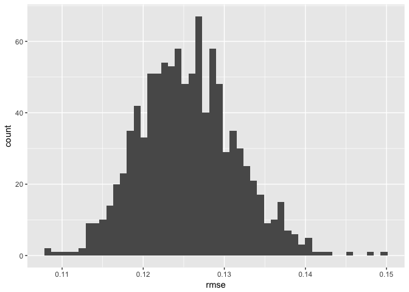

Multiple Models
================
Will Doyle

Introduction
------------

The essence of prediction is discovering the extent to which our models can predict outcomes for data that does not come from our sample. Many times this process is temporal. We fit a model to data from one time period, then take predictors from a subsequent time period to come up with a prediction in the future. For instance, we might use data on team performance to predict the likely winners and losers for upcoming soccer games.

This process does not have to be temporal. We can also have data that is out of sample because it hadn't yet been collected when our first data was collected, or we can also have data that is out of sample because we designated it as out of sample.

The data that is used to generate our predictions is known as *training* data. The idea is that this is the data used to train our model, to let it know what the relationship is between our predictors and our outcome. So far, we have worked mostly with training data.

That data that is used to validate our predictions is known as *testing* data. With testing data, we take our trained model and see how good it is at predicting outcomes using out of sample data.

One very simple approach to this would be to cut our data in half. This is what we've done so far. We could then train our model on half the data, then test it on the other half. This would tell us whether our measure of model fit (e.g. rmse, auc) is similar or different when we apply our model to out of sample data.

But this would only be a "one-shot" approach. It would be better to do this multiple times, cutting the data into two parts: training and testing, then fitting the model to the training data, and then checking its predictions against the testing data. That way, we could generate a large number of rmse's to see how well the model fits on lots of different possible out-of-sample predictions.

This process is called *cross-fold validation*, and it involves two important decisions: first, how will the data be cut, and how many times will the validation run.

We start by getting a new package `modelr` which has nice facilities for creating cross fold validation-ready datasets.

``` r
library(tidyverse)
```

    ## Loading tidyverse: ggplot2
    ## Loading tidyverse: tibble
    ## Loading tidyverse: tidyr
    ## Loading tidyverse: readr
    ## Loading tidyverse: purrr
    ## Loading tidyverse: dplyr

    ## Conflicts with tidy packages ----------------------------------------------

    ## filter(): dplyr, stats
    ## lag():    dplyr, stats

``` r
library(modelr)
```

Next we load the quickfacts data, which contains county-by-county information. We're going to create a simple model that predicts median home values in the county as a function of education, home ownership and income.

``` r
load("quickfacts.Rdata")
qf<-qf%>%
  select(median_home_val,median_hh_inc,coll_grad_pc,homeown_rate)%>%
       mutate_each(funs(as.numeric))%>%tbl_df()
```

    ## `mutate_each()` is deprecated.
    ## Use `mutate_all()`, `mutate_at()` or `mutate_if()` instead.
    ## To map `funs` over all variables, use `mutate_all()`

A quick look at this outcome lets us know it needs to be logged.

``` r
gg<-ggplot(data=qf,aes(median_home_val))
gg<-gg+geom_density()
gg
```


We can run this model on the full dataset, but we're not taking advantage of the idea of cross-validation.

``` r
basic.mod<-lm(log(median_home_val+1)~
              log(median_hh_inc+1)+
              homeown_rate+
              coll_grad_pc,
              data=qf); summary(basic.mod)
```

    ## 
    ## Call:
    ## lm(formula = log(median_home_val + 1) ~ log(median_hh_inc + 1) + 
    ##     homeown_rate + coll_grad_pc, data = qf)
    ## 
    ## Residuals:
    ##      Min       1Q   Median       3Q      Max 
    ## -12.8120  -0.1734   0.0068   0.1814   1.3031 
    ## 
    ## Coefficients:
    ##                          Estimate Std. Error t value Pr(>|t|)    
    ## (Intercept)             2.1088598  0.3825071   5.513  3.8e-08 ***
    ## log(median_hh_inc + 1)  0.8735845  0.0388893  22.463  < 2e-16 ***
    ## homeown_rate           -0.0026253  0.0009254  -2.837  0.00458 ** 
    ## coll_grad_pc            0.0204320  0.0011213  18.221  < 2e-16 ***
    ## ---
    ## Signif. codes:  0 '***' 0.001 '**' 0.01 '*' 0.05 '.' 0.1 ' ' 1
    ## 
    ## Residual standard error: 0.3713 on 3191 degrees of freedom
    ## Multiple R-squared:  0.4864, Adjusted R-squared:  0.4859 
    ## F-statistic:  1007 on 3 and 3191 DF,  p-value: < 2.2e-16

The `crossv_kfold` command creates a list of datasets from our original dataset, each of which contains a testing and training dataset. The proportion of cases held out for testing is determined by the number of folds: 10 folds would indicate 1/10 of the data to be held out.

``` r
qf_cv<-qf%>%
  crossv_kfold(10)
qf_cv
```

    ## # A tibble: 10 x 3
    ##             train           test   .id
    ##            <list>         <list> <chr>
    ##  1 <S3: resample> <S3: resample>    01
    ##  2 <S3: resample> <S3: resample>    02
    ##  3 <S3: resample> <S3: resample>    03
    ##  4 <S3: resample> <S3: resample>    04
    ##  5 <S3: resample> <S3: resample>    05
    ##  6 <S3: resample> <S3: resample>    06
    ##  7 <S3: resample> <S3: resample>    07
    ##  8 <S3: resample> <S3: resample>    08
    ##  9 <S3: resample> <S3: resample>    09
    ## 10 <S3: resample> <S3: resample>    10

The next bit of code is key. It starts by converting all of the individual training datasets to tibbles. Then the model is run on each training dataset. Then apply the predictions from the model to each testing dataset, and finally pull the rmse from each of the testing datasets.

``` r
mult_model<-qf_cv %>% 
  mutate(train = map(train, as_tibble)) %>% ## Convert to tibbles
  mutate(model = map(train, ~ lm(log(median_home_val+1)~ ## Run model
                                log(median_hh_inc+1)+
                                homeown_rate+
                                coll_grad_pc,
                                 data = .))) %>%
  mutate(rmse = map2_dbl(model, test, rmse)) %>% ## apply model, get rmse
  select(.id, rmse) ## pull just id and rmse 
```

The resulting dataset includes the id for the cross validation and the rmse. We can summarize and plot this new data frame to see what our likely range of rmse happens to be.

``` r
summary(mult_model$rmse)
```

    ##    Min. 1st Qu.  Median    Mean 3rd Qu.    Max. 
    ##  0.2733  0.2798  0.2990  0.3424  0.3020  0.7991

``` r
gg<-ggplot(mult_model,aes(rmse))
gg<-gg+geom_histogram(bins=50)
gg
```


As this shows, the rmse for the cross validations goes from a minimumo of 0.27 to a maximum of 0.8, with a median of 0.3.

The `crossv_mc`

``` r
qf_cv<-qf%>%
  crossv_mc(n=1000,test=.2)
qf_cv
```

    ## # A tibble: 1,000 x 3
    ##             train           test   .id
    ##            <list>         <list> <chr>
    ##  1 <S3: resample> <S3: resample>  0001
    ##  2 <S3: resample> <S3: resample>  0002
    ##  3 <S3: resample> <S3: resample>  0003
    ##  4 <S3: resample> <S3: resample>  0004
    ##  5 <S3: resample> <S3: resample>  0005
    ##  6 <S3: resample> <S3: resample>  0006
    ##  7 <S3: resample> <S3: resample>  0007
    ##  8 <S3: resample> <S3: resample>  0008
    ##  9 <S3: resample> <S3: resample>  0009
    ## 10 <S3: resample> <S3: resample>  0010
    ## # ... with 990 more rows

``` r
mult_model<-qf_cv %>% 
  mutate(train = map(train, as_tibble)) %>% ## Convert to tibbles
  mutate(model = map(train, ~ lm(log(median_home_val+1)~ ## Run model
                                log(median_hh_inc+1)+
                                homeown_rate+
                                coll_grad_pc,
                                 data = .)))%>%
  mutate(rmse = map2_dbl(model, test, rmse)) 

#%>% ## apply model, get rmse
#  select(.id, rmse) ## pull just id and rmse 
```

``` r
summary(mult_model$rmse)
```

    ##    Min. 1st Qu.  Median    Mean 3rd Qu.    Max. 
    ##  0.2677  0.2913  0.2981  0.3585  0.3103  0.6082

``` r
gg<-ggplot(mult_model,aes(rmse))
gg<-gg+geom_histogram(bins=50)
gg
```


Repeating this process with per capita income:

``` r
load("quickfacts.Rdata")
qf<-qf%>%
  select(per_capita_inc,pop_per_square,retail_percap,coll_grad_pc,homeown_rate,median_home_val)%>%
       mutate_each(funs(as.numeric))%>%tbl_df()
```

    ## `mutate_each()` is deprecated.
    ## Use `mutate_all()`, `mutate_at()` or `mutate_if()` instead.
    ## To map `funs` over all variables, use `mutate_all()`

``` r
qf_cv<-qf%>%
  crossv_mc(n=1000,test=.2)
qf_cv
```

    ## # A tibble: 1,000 x 3
    ##             train           test   .id
    ##            <list>         <list> <chr>
    ##  1 <S3: resample> <S3: resample>  0001
    ##  2 <S3: resample> <S3: resample>  0002
    ##  3 <S3: resample> <S3: resample>  0003
    ##  4 <S3: resample> <S3: resample>  0004
    ##  5 <S3: resample> <S3: resample>  0005
    ##  6 <S3: resample> <S3: resample>  0006
    ##  7 <S3: resample> <S3: resample>  0007
    ##  8 <S3: resample> <S3: resample>  0008
    ##  9 <S3: resample> <S3: resample>  0009
    ## 10 <S3: resample> <S3: resample>  0010
    ## # ... with 990 more rows

``` r
mult_model<-qf_cv %>% 
  mutate(train = map(train, as_tibble)) %>% ## Convert to tibbles
  mutate(model = map(train, ~ lm(log(per_capita_inc+1)~ ## Run model
                                pop_per_square+
                                retail_percap+
                                coll_grad_pc+
                                  homeown_rate+
                                  median_home_val,
                                 data = .)))%>%
  mutate(rmse = map2_dbl(model, test, rmse)) %>% ## apply model, get rmse
  select(.id, rmse) ## pull just id and rmse 
```

``` r
summary(mult_model$rmse)
```

    ##    Min. 1st Qu.  Median    Mean 3rd Qu.    Max. 
    ##  0.1084  0.1213  0.1252  0.1255  0.1292  0.1498

``` r
gg<-ggplot(mult_model,aes(rmse))
gg<-gg+geom_histogram(bins=50)
gg
```


