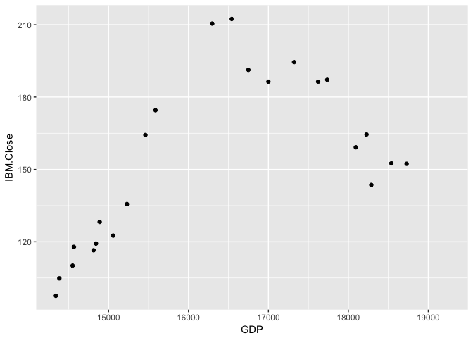

Finance APIs
================
Will Doyle
October 2, 2017

``` r
library(tidyverse)
```

    ## Loading tidyverse: ggplot2
    ## Loading tidyverse: tibble
    ## Loading tidyverse: tidyr
    ## Loading tidyverse: readr
    ## Loading tidyverse: purrr
    ## Loading tidyverse: dplyr

    ## Conflicts with tidy packages ----------------------------------------------

    ## filter(): dplyr, stats
    ## lag():    dplyr, stats

``` r
library(quantmod)
```

    ## Loading required package: xts

    ## Loading required package: zoo

    ## 
    ## Attaching package: 'zoo'

    ## The following objects are masked from 'package:base':
    ## 
    ##     as.Date, as.Date.numeric

    ## 
    ## Attaching package: 'xts'

    ## The following objects are masked from 'package:dplyr':
    ## 
    ##     first, last

    ## Loading required package: TTR

    ## Version 0.4-0 included new data defaults. See ?getSymbols.

``` r
library(tidyquant)
```

    ## Loading required package: lubridate

    ## 
    ## Attaching package: 'lubridate'

    ## The following object is masked from 'package:base':
    ## 
    ##     date

    ## Loading required package: PerformanceAnalytics

    ## 
    ## Attaching package: 'PerformanceAnalytics'

    ## The following object is masked from 'package:graphics':
    ## 
    ##     legend

    ## 
    ## Attaching package: 'tidyquant'

    ## The following object is masked from 'package:dplyr':
    ## 
    ##     as_tibble

    ## The following object is masked from 'package:tibble':
    ## 
    ##     as_tibble

``` r
library(timetk)
```

``` r
getSymbols("IBM",src="google",type="xts")
```

    ## 'getSymbols' currently uses auto.assign=TRUE by default, but will
    ## use auto.assign=FALSE in 0.5-0. You will still be able to use
    ## 'loadSymbols' to automatically load data. getOption("getSymbols.env")
    ## and getOption("getSymbols.auto.assign") will still be checked for
    ## alternate defaults.
    ## 
    ## This message is shown once per session and may be disabled by setting 
    ## options("getSymbols.warning4.0"=FALSE). See ?getSymbols for details.

    ## [1] "IBM"

``` r
getSymbols("GDP",src="FRED",type="xts")
```

    ## [1] "GDP"

``` r
df_ibm<-tk_tbl(IBM)

df_gdp<-tk_tbl(GDP)

full_data<-left_join(df_gdp,df_ibm,by="index")
full_data<-full_data%>%mutate(year=year(index))%>%filter(as.numeric(year)>2007)

gg<-ggplot(full_data,aes(x=GDP,y=IBM.Close))
gg<-gg+geom_point()
gg
```

    ## Warning: Removed 15 rows containing missing values (geom_point).


