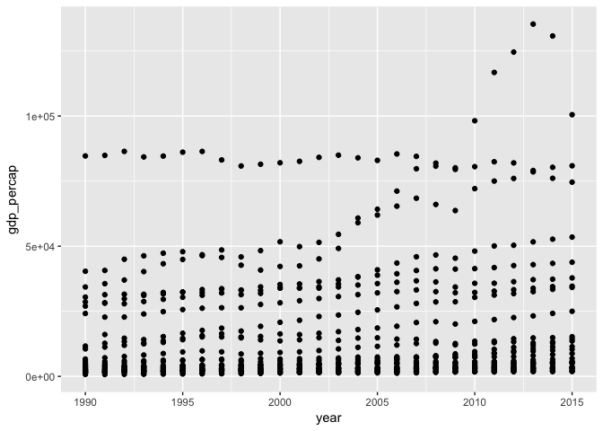
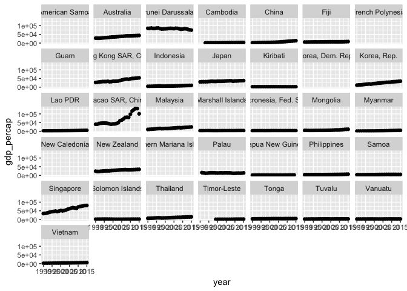

International APIs
================
Will Doyle
October 2, 2017

Data
----

Today we'll be working with data from the World Bank's [World Development Indicators](http://data.worldbank.org/data-catalog/world-development-indicators) database. The world bank has helpfully created an API, which has an R library built around it, [WDI](https://cran.r-project.org/web/packages/WDI/index.html).

``` r
#libraries: WDI interacts with API
library(WDI)
```

    ## Loading required package: RJSONIO

``` r
library(tidyverse)
```

    ## Loading tidyverse: ggplot2
    ## Loading tidyverse: tibble
    ## Loading tidyverse: tidyr
    ## Loading tidyverse: readr
    ## Loading tidyverse: purrr
    ## Loading tidyverse: dplyr

    ## Conflicts with tidy packages ----------------------------------------------

    ## filter(): dplyr, stats
    ## lag():    dplyr, stats

``` r
library(forcats)
library(ggplot2)
library(ggthemes)
library(plotly)
```

    ## 
    ## Attaching package: 'plotly'

    ## The following object is masked from 'package:ggplot2':
    ## 
    ##     last_plot

    ## The following object is masked from 'package:stats':
    ## 
    ##     filter

    ## The following object is masked from 'package:graphics':
    ## 
    ##     layout

The WDI library allows us to use the [WDI API](https://datahelpdesk.worldbank.org/knowledgebase/topics/125589) to access data from their database. We're going to start be getting basic country information, including country code, name and region from the built in `WDI_data`.

``` r
data(WDI_data)

#Pull country info
wd.desc<-data.frame(WDI_data$country)

# Do a quick search for indicators related to tourism

WDIsearch("tourism")
```

    ##       indicator                 
    ##  [1,] "DT.ODA.DACD.PROD.TRSM.CD"
    ##  [2,] "ST.INT.ARVL"             
    ##  [3,] "ST.INT.DPRT"             
    ##  [4,] "ST.INT.RCPT.CD"          
    ##  [5,] "ST.INT.RCPT.XP.ZS"       
    ##  [6,] "ST.INT.TRNR.CD"          
    ##  [7,] "ST.INT.TRNX.CD"          
    ##  [8,] "ST.INT.TVLR.CD"          
    ##  [9,] "ST.INT.TVLX.CD"          
    ## [10,] "ST.INT.XPND.CD"          
    ## [11,] "ST.INT.XPND.MP.ZS"       
    ##       name                                                                             
    ##  [1,] "Gross ODA aid disbursement for tourism sector, DAC donors total (current US$)"  
    ##  [2,] "International tourism, number of arrivals"                                      
    ##  [3,] "International tourism, number of departures"                                    
    ##  [4,] "International tourism, receipts (current US$)"                                  
    ##  [5,] "International tourism, receipts (% of total exports)"                           
    ##  [6,] "International tourism, receipts for passenger transport items (current US$)"    
    ##  [7,] "International tourism, expenditures for passenger transport items (current US$)"
    ##  [8,] "International tourism, receipts for travel items (current US$)"                 
    ##  [9,] "International tourism, expenditures for travel items (current US$)"             
    ## [10,] "International tourism, expenditures (current US$)"                              
    ## [11,] "International tourism, expenditures (% of total imports)"

Next, we need a list of indicators to work with. The full list of indicators is [here](http://databank.worldbank.org/data/reports.aspx?source=world-development-indicators)

``` r
#List of indicators to grab
wdilist <- c("NE.TRD.GNFS.ZS",     # Trade (% of GDP)
             "NY.GDP.PCAP.PP.KD",  # GDP per capita, PPP (constant 2005 intl $)
             "NY.GDP.PCAP.KD",     # GDP per capita (constant 2000 US$)
             "NY.GDP.MKTP.KD.ZG",  # GDP growth (annual %)
             "FP.CPI.TOTL.ZG",     # Inflation, consumer prices (annual %)
             "FP.CPI.TOTL",        # Consumer price index (2005 = 100) 
             "NV.AGR.TOTL.ZS",     # Agriculture, value added (% of GDP)
             "NV.IND.MANF.ZS",     # Manufacturing, value added (% of GDP)
             "NV.IND.TOTL.ZS",     # Industry, value added (% of GDP)
             "NV.SRV.TETC.ZS",     # Services, etc., value added (% of GDP)
             "GC.TAX.TOTL.GD.ZS",  # Tax revenue (% of GDP)
             "GC.DOD.TOTL.GD.ZS",  # Central government debt, total (% of GDP)
             "SP.POP.TOTL",        # Population, total
             "SP.URB.TOTL.IN.ZS",  # Urban population (% of total)
             "SP.POP.GROW",        # Population growth (annual %)
             "EN.POP.DNST",        # Population density (people per sq. km of land area)
             "SP.POP.0014.TO.ZS",  # Population ages 0-14 (% of total)
             "MS.MIL.TOTL.P1",     # Armed forces personnel, total
             "MS.MIL.TOTL.TF.ZS",  # Armed forces personnel (% of total labor force)
             "NY.ADJ.DFOR.GN.ZS",  # Adjusted savings: forest depletion (% of GNI)
             "NY.ADJ.DMIN.GN.ZS",  # Adjusted savings: mineral depletion (% of GNI)
             "NY.ADJ.DNGY.GN.ZS",  # Adjusted savings: energy depletion (% of GNI)
             "IT.CEL.SETS.P2",     # Mobile cellular subscriptions (per 100 people)             
             "IT.NET.USER.P2",     # Internet users (per 100 people)                            
             "SP.DYN.IMRT.IN",
             "SE.SEC.CUAT.LO.ZS")    # Infant mortality rate

#Extract from WDI database: http://data.worldbank.org/data-catalog/world-development-indicators
wd.full<-WDI(indicator=wdilist, country="all", start=1990, end=2015)
```

    ## Warning in WDI(indicator = wdilist, country = "all", start = 1990, end =
    ## 2015): Unable to download indicators IT.NET.USER.P2

``` r
#Merge with country info
wd<-left_join(wd.desc,wd.full)
```

    ## Joining, by = c("iso2c", "country")

    ## Warning: Column `iso2c` joining factor and character vector, coercing into
    ## character vector

    ## Warning: Column `country` joining factor and character vector, coercing
    ## into character vector

``` r
#Make sure region is a character
wd$region<-as.character(wd$region)

#Save file
save(wd,file="wd.RData")
```

``` r
wd<-wd%>%filter(region=="East Asia & Pacific (all income levels)")

#Rename variables for ease of use
wd$gdp_percap<-wd$NY.GDP.PCAP.PP.KD
wd$infant_mortality<-wd$SP.DYN.IMRT.IN
wd$country2<-as.factor(wd$country)
wd$urban<-wd$SP.URB.TOTL.IN.ZS
wd$youngpop<-wd$SP.POP.0014.TO.ZS
wd$internet<-wd$IT.NET.USER.P2
wd$educ<-wd$SE.SEC.CUAT.LO.ZS
```

Let's start with a simple scatterplot by year.

``` r
#Plot GDP per capita by year
g1<-ggplot(data=wd,aes(x=year,y=gdp_percap))
g1<-g1+geom_point()
g1 #Messy!
```

    ## Warning: Removed 145 rows containing missing values (geom_point).



There are several obvious problems. First, a few countries just have much higher GDP per capita than others, which means that for most countries we can't observe change over time. Second, the first question anyone is going to ask is: which country is which? Let's use the `facet_wrap` function to figure out which countries we're talking about.

``` r
g2<-g1+facet_wrap(~country,ncol=7)
g2
```

    ## Warning: Removed 145 rows containing missing values (geom_point).


